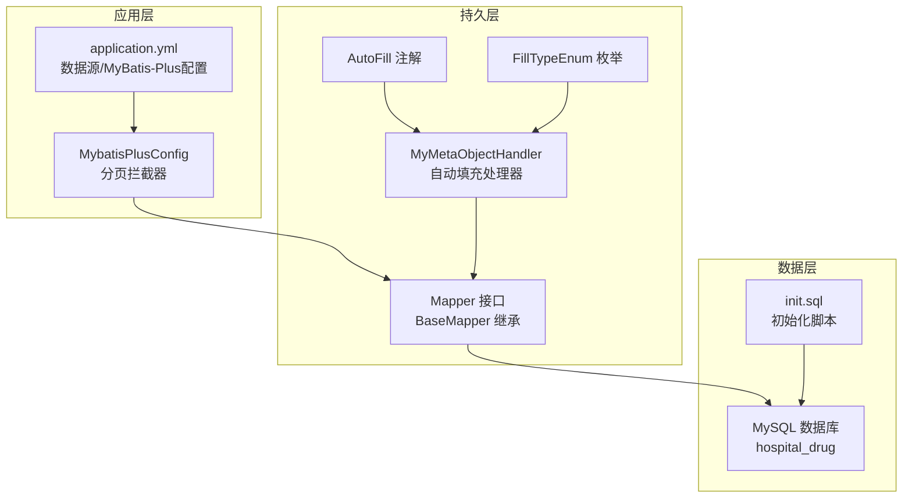
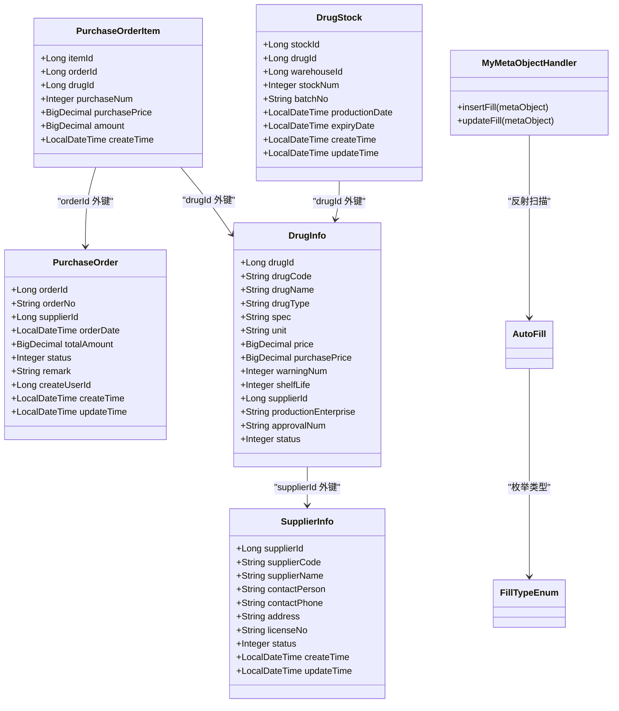
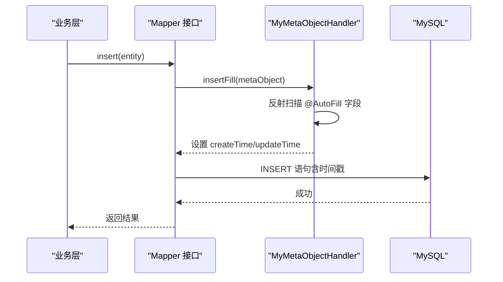
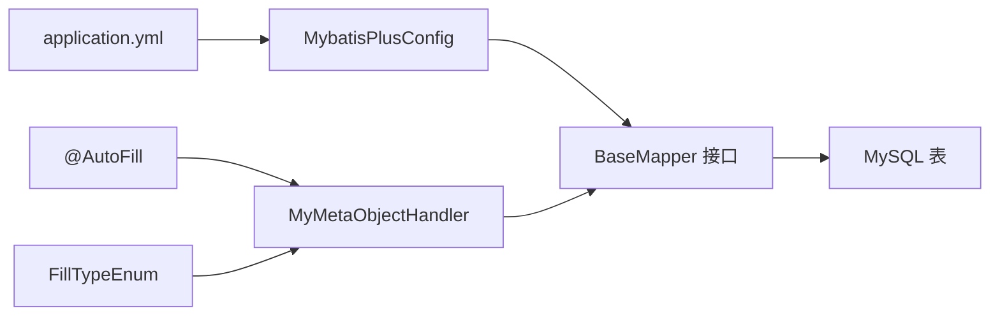
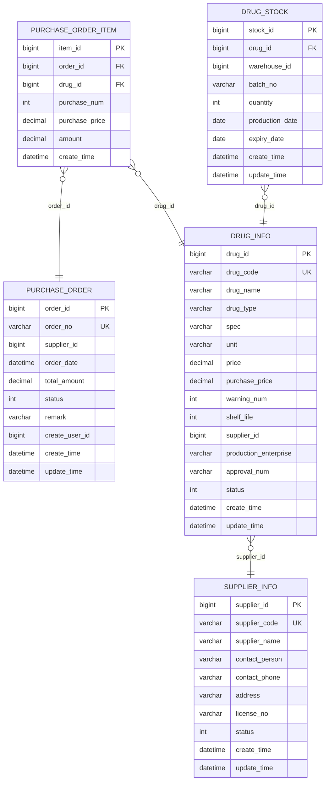

# 数据库设计

<cite>
**本文引用的文件列表**
- [init.sql](file://src/main/resources/db/init.sql)
- [hospital_drug.sql](file://hospital_drug.sql)
- [application.yml](file://src/main/resources/application.yml)
- [MybatisPlusConfig.java](file://src/main/java/com/hospital/drugmanagement/config/MybatisPlusConfig.java)
- [MyMetaObjectHandler.java](file://src/main/java/com/hospital/drugmanagement/common/handler/MyMetaObjectHandler.java)
- [AutoFill.java](file://src/main/java/com/hospital/drugmanagement/common/anno/AutoFill.java)
- [FillTypeEnum.java](file://src/main/java/com/hospital/drugmanagement/common/constant/FillTypeEnum.java)
- [DrugInfo.java](file://src/main/java/com/hospital/drugmanagement/entity/DrugInfo.java)
- [SupplierInfo.java](file://src/main/java/com/hospital/drugmanagement/entity/SupplierInfo.java)
- [PurchaseOrder.java](file://src/main/java/com/hospital/drugmanagement/entity/PurchaseOrder.java)
- [PurchaseOrderItem.java](file://src/main/java/com/hospital/drugmanagement/entity/PurchaseOrderItem.java)
- [DrugStock.java](file://src/main/java/com/hospital/drugmanagement/entity/DrugStock.java)
- [DrugInfoMapper.java](file://src/main/java/com/hospital/drugmanagement/mapper/DrugInfoMapper.java)
</cite>

## 目录
1. [简介](#简介)
2. [项目结构](#项目结构)
3. [核心组件](#核心组件)
4. [架构总览](#架构总览)
5. [详细组件分析](#详细组件分析)
6. [依赖分析](#依赖分析)
7. [性能考虑](#性能考虑)
8. [故障排查指南](#故障排查指南)
9. [结论](#结论)
10. [附录](#附录)

## 简介
本文件面向医院药品管理系统，提供完整的数据库设计文档，涵盖核心业务实体（药品信息、供应商信息、采购订单、库存信息等）的数据模型、表结构、字段设计、主外键约束、索引策略、数据完整性与一致性保障机制。同时说明实体类与数据库表的映射关系、MyBatis-Plus 注解使用方式，并给出 ER 图、表结构图、关系图等可视化设计，以及数据字典、字段说明、业务含义解释。最后讨论数据库性能优化策略、查询优化技巧与备份恢复方案。

## 项目结构
后端采用 Spring Boot + MyBatis-Plus 架构，数据库初始化脚本位于资源目录，应用通过 application.yml 指定数据源与 MyBatis-Plus 配置；实体类通过注解映射到数据库表，自动填充由自定义处理器统一处理。

图表来源
- [application.yml:1-24](file://src/main/resources/application.yml#L1-L24)
- [MybatisPlusConfig.java:1-16](file://src/main/java/com/hospital/drugmanagement/config/MybatisPlusConfig.java#L1-L16)
- [MyMetaObjectHandler.java:1-60](file://src/main/java/com/hospital/drugmanagement/common/handler/MyMetaObjectHandler.java#L1-L60)
- [AutoFill.java:1-15](file://src/main/java/com/hospital/drugmanagement/common/anno/AutoFill.java#L1-L15)
- [FillTypeEnum.java:1-9](file://src/main/java/com/hospital/drugmanagement/common/constant/FillTypeEnum.java#L1-L9)
- [init.sql:1-312](file://src/main/resources/db/init.sql#L1-L312)

章节来源
- [application.yml:1-24](file://src/main/resources/application.yml#L1-L24)
- [MybatisPlusConfig.java:1-16](file://src/main/java/com/hospital/drugmanagement/config/MybatisPlusConfig.java#L1-L16)
- [init.sql:1-312](file://src/main/resources/db/init.sql#L1-L312)

## 核心组件
本系统围绕以下核心业务实体展开：
- 药品信息（DrugInfo）：药品基础属性、价格、供应商关联、状态等
- 供应商信息（SupplierInfo）：供应商基本信息、状态、时间戳
- 采购订单（PurchaseOrder）：订单编号、供应商、金额、状态、时间戳
- 采购订单明细（PurchaseOrderItem）：订单与药品的多对一关系，单价、数量、小计
- 库存信息（DrugStock）：按药品与仓库维度的库存快照，含批号、生产/有效期

章节来源
- [DrugInfo.java:1-167](file://src/main/java/com/hospital/drugmanagement/entity/DrugInfo.java#L1-L167)
- [SupplierInfo.java:1-39](file://src/main/java/com/hospital/drugmanagement/entity/SupplierInfo.java#L1-L39)
- [PurchaseOrder.java:1-40](file://src/main/java/com/hospital/drugmanagement/entity/PurchaseOrder.java#L1-L40)
- [PurchaseOrderItem.java:1-35](file://src/main/java/com/hospital/drugmanagement/entity/PurchaseOrderItem.java#L1-L35)
- [DrugStock.java:1-39](file://src/main/java/com/hospital/drugmanagement/entity/DrugStock.java#L1-L39)

## 架构总览
系统采用“实体类 ↔ 数据库表”的映射关系，通过 MyBatis-Plus 的注解驱动 ORM，结合自动填充处理器统一维护创建/更新时间，配合分页插件提升查询性能。

图表来源
- [DrugInfo.java:1-167](file://src/main/java/com/hospital/drugmanagement/entity/DrugInfo.java#L1-L167)
- [SupplierInfo.java:1-39](file://src/main/java/com/hospital/drugmanagement/entity/SupplierInfo.java#L1-L39)
- [PurchaseOrder.java:1-40](file://src/main/java/com/hospital/drugmanagement/entity/PurchaseOrder.java#L1-L40)
- [PurchaseOrderItem.java:1-35](file://src/main/java/com/hospital/drugmanagement/entity/PurchaseOrderItem.java#L1-L35)
- [DrugStock.java:1-39](file://src/main/java/com/hospital/drugmanagement/entity/DrugStock.java#L1-L39)
- [MyMetaObjectHandler.java:1-60](file://src/main/java/com/hospital/drugmanagement/common/handler/MyMetaObjectHandler.java#L1-L60)
- [AutoFill.java:1-15](file://src/main/java/com/hospital/drugmanagement/common/anno/AutoFill.java#L1-L15)
- [FillTypeEnum.java:1-9](file://src/main/java/com/hospital/drugmanagement/common/constant/FillTypeEnum.java#L1-L9)

## 详细组件分析

### 药品信息表（DrugInfo）
- 表名与主键：drug_info，主键为 drug_id（自增）
- 字段类型选择：
  - 编码/名称/规格/单位/企业/批准文号：VARCHAR
  - 销售价/采购价：DECIMAL(10,2)
  - 预警值/保质期：INT
  - 状态：INT（0/1）
  - 时间戳：DATETIME（默认 CURRENT_TIMESTAMP，更新时自动 CURRENT_TIMESTAMP）
- 索引设计：idx_supplier_id（供应商ID）
- 业务规则：
  - drug_code 唯一，用于快速检索与去重
  - status 控制上下架
  - supplier_id 关联供应商信息
- 实体映射：@TableName("drug_info") + @TableId/@TableField 映射字段
- 自动填充：无显式 @AutoFill，但 createTime/updateTime 由默认值维护

章节来源
- [init.sql:60-80](file://src/main/resources/db/init.sql#L60-L80)
- [DrugInfo.java:1-167](file://src/main/java/com/hospital/drugmanagement/entity/DrugInfo.java#L1-L167)

### 供应商信息表（SupplierInfo）
- 表名与主键：supplier_info，主键为 supplier_id（自增）
- 字段类型：VARCHAR/INT/LocalDateTime
- 索引设计：UNIQUE supplier_code
- 业务规则：status 控制启用/停用；编码唯一
- 实体映射：@TableName("supplier_info") + Lombok @Data
- 自动填充：@AutoFill(FillTypeEnum.CREATE_TIME/UPDATE_TIME) 由 MyMetaObjectHandler 统一填充

章节来源
- [init.sql:82-95](file://src/main/resources/db/init.sql#L82-L95)
- [SupplierInfo.java:1-39](file://src/main/java/com/hospital/drugmanagement/entity/SupplierInfo.java#L1-L39)
- [MyMetaObjectHandler.java:1-60](file://src/main/java/com/hospital/drugmanagement/common/handler/MyMetaObjectHandler.java#L1-L60)

### 采购订单表（PurchaseOrder）
- 表名与主键：purchase_order，主键为 order_id（自增）
- 字段类型：VARCHAR/DECIMAL/INT/LocalDateTime
- 索引设计：idx_supplier_id
- 业务规则：status 表示订单状态（待审核/已审核/已入库/已取消），total_amount 由明细汇总
- 实体映射：@TableName("purchase_order") + @Data
- 自动填充：@AutoFill(FillTypeEnum.CREATE_TIME/UPDATE_TIME)

章节来源
- [init.sql:127-141](file://src/main/resources/db/init.sql#L127-L141)
- [PurchaseOrder.java:1-40](file://src/main/java/com/hospital/drugmanagement/entity/PurchaseOrder.java#L1-L40)

### 采购订单明细表（PurchaseOrderItem）
- 表名与主键：purchase_order_item，主键为 item_id（自增）
- 字段类型：INT/DECIMAL/LocalDateTime
- 索引设计：idx_order_id、idx_drug_id
- 业务规则：purchase_num × purchase_price = amount；与 PurchaseOrder 一对多
- 实体映射：@TableName("purchase_order_item") + @Data
- 自动填充：@AutoFill(FillTypeEnum.CREATE_TIME)

章节来源
- [init.sql:143-155](file://src/main/resources/db/init.sql#L143-L155)
- [PurchaseOrderItem.java:1-35](file://src/main/java/com/hospital/drugmanagement/entity/PurchaseOrderItem.java#L1-L35)

### 库存信息表（DrugStock）
- 表名与主键：drug_stock，主键为 stock_id（自增）
- 字段类型：INT/DATE/LocalDateTime
- 索引设计：idx_drug_id、idx_warehouse_id
- 业务规则：按药品+仓库+批号聚合库存；quantity 为当前可用数量
- 实体映射：@TableName("drug_stock") + @Data
- 自动填充：@AutoFill(FillTypeEnum.CREATE_TIME/UPDATE_TIME)

章节来源
- [init.sql:111-125](file://src/main/resources/db/init.sql#L111-L125)
- [DrugStock.java:1-39](file://src/main/java/com/hospital/drugmanagement/entity/DrugStock.java#L1-L39)

### 实体类与数据库映射关系
- 使用 MyBatis-Plus 注解：
  - @TableName 指定表名
  - @TableId 指定主键及类型（IdType.AUTO）
  - @TableField 指定非主键字段映射
  - Lombok @Data 简化 getter/setter
- Mapper 接口继承 BaseMapper，即可获得通用 CRUD 能力
- 示例：DrugInfoMapper 继承 BaseMapper<DrugInfo>

章节来源
- [DrugInfo.java:1-167](file://src/main/java/com/hospital/drugmanagement/entity/DrugInfo.java#L1-L167)
- [DrugInfoMapper.java:1-9](file://src/main/java/com/hospital/drugmanagement/mapper/DrugInfoMapper.java#L1-L9)

### 自动填充机制（MyMetaObjectHandler）
- 通过反射扫描实体类字段上的 @AutoFill 注解，按 FillTypeEnum 类型在插入/更新时自动填充 LocalDateTime
- 插入时填充创建时间与更新时间；更新时仅填充更新时间
- 日志输出便于调试与审计

图表来源
- [MyMetaObjectHandler.java:1-60](file://src/main/java/com/hospital/drugmanagement/common/handler/MyMetaObjectHandler.java#L1-L60)
- [AutoFill.java:1-15](file://src/main/java/com/hospital/drugmanagement/common/anno/AutoFill.java#L1-L15)
- [FillTypeEnum.java:1-9](file://src/main/java/com/hospital/drugmanagement/common/constant/FillTypeEnum.java#L1-L9)

## 依赖分析
- 数据源与 MyBatis-Plus 配置：application.yml 指定 JDBC URL、用户名/密码、MyBatis-Plus XML 位置、驼峰映射、SQL 日志输出
- 分页插件：MybatisPlusConfig 注册 PaginationInnerInterceptor，支持分页查询
- 实体类与表映射：各实体类通过注解映射到对应表，Mapper 继承 BaseMapper 获取通用能力
- 自动填充：MyMetaObjectHandler 统一处理 @AutoFill 字段

图表来源
- [application.yml:1-24](file://src/main/resources/application.yml#L1-L24)
- [MybatisPlusConfig.java:1-16](file://src/main/java/com/hospital/drugmanagement/config/MybatisPlusConfig.java#L1-L16)
- [MyMetaObjectHandler.java:1-60](file://src/main/java/com/hospital/drugmanagement/common/handler/MyMetaObjectHandler.java#L1-L60)
- [AutoFill.java:1-15](file://src/main/java/com/hospital/drugmanagement/common/anno/AutoFill.java#L1-L15)
- [FillTypeEnum.java:1-9](file://src/main/java/com/hospital/drugmanagement/common/constant/FillTypeEnum.java#L1-L9)

章节来源
- [application.yml:1-24](file://src/main/resources/application.yml#L1-L24)
- [MybatisPlusConfig.java:1-16](file://src/main/java/com/hospital/drugmanagement/config/MybatisPlusConfig.java#L1-L16)
- [MyMetaObjectHandler.java:1-60](file://src/main/java/com/hospital/drugmanagement/common/handler/MyMetaObjectHandler.java#L1-L60)

## 性能考虑
- 索引策略
  - 药品信息：idx_supplier_id，加速按供应商过滤
  - 采购订单：idx_supplier_id，加速按供应商统计
  - 采购订单明细：idx_order_id、idx_drug_id，加速订单明细查询与药品聚合
  - 入库/出库/库存盘点：分别对 drug_id、warehouse_id 建立索引，满足按药品与仓库的高频查询
- 查询优化
  - 使用分页插件（PaginationInnerInterceptor）限制返回条数
  - 开启下划线转驼峰映射（map-underscore-to-camel-case），减少字段映射成本
  - 使用唯一索引（如 drug_code、order_no、supplier_code）避免重复扫描
- 存储引擎与字符集
  - 使用 InnoDB 引擎，支持事务与外键；utf8mb4 字符集，兼容表情符号
- 自动填充与时间戳
  - 通过默认 CURRENT_TIMESTAMP/ON UPDATE CURRENT_TIMESTAMP 与 MyMetaObjectHandler 统一维护时间戳，降低业务层负担
- 备份与恢复
  - 建议定期导出 SQL（init.sql/hospital_drug.sql）作为离线备份
  - 使用 MySQL 逻辑备份（mysqldump）或物理备份（xtrabackup）进行增量/全量备份
  - 在高并发场景下建议使用只读副本与主从复制，实现读写分离与灾备

[本节为通用性能指导，无需特定文件引用]

## 故障排查指南
- 自动填充未生效
  - 检查实体类字段是否标注 @AutoFill 且类型匹配 FillTypeEnum
  - 确认 MyMetaObjectHandler 已注册为 Spring 组件
  - 查看 SQL 日志确认是否调用 insert/update
- 字段映射异常
  - 确认 @TableId/@TableField 与数据库列名一致
  - 检查 application.yml 中 map-underscore-to-camel-case 是否开启
- 索引未命中
  - 使用 EXPLAIN 分析慢查询，确认 WHERE 条件是否使用了合适索引
  - 对高频过滤字段（drug_id、warehouse_id、supplier_id）确保存在索引
- 数据库连接问题
  - 检查 application.yml 中 JDBC URL、用户名/密码是否正确
  - 确认 MySQL 服务运行正常，防火墙放行端口

章节来源
- [application.yml:1-24](file://src/main/resources/application.yml#L1-L24)
- [MyMetaObjectHandler.java:1-60](file://src/main/java/com/hospital/drugmanagement/common/handler/MyMetaObjectHandler.java#L1-L60)
- [init.sql:1-312](file://src/main/resources/db/init.sql#L1-L312)

## 结论
本数据库设计以 MyBatis-Plus 注解驱动 ORM，结合自动填充与分页插件，实现了药品管理核心业务的高效建模与稳定运行。通过合理的索引策略、时间戳维护与备份方案，系统在保证数据一致性的同时兼顾了查询性能与可维护性。建议在生产环境中进一步完善外键约束、审计日志与监控告警体系，持续优化热点查询与批量导入流程。

[本节为总结性内容，无需特定文件引用]

## 附录

### 数据字典与字段说明
- 药品信息（drug_info）
  - drug_id：主键，自增
  - drug_code：唯一编码
  - drug_name：药品名称
  - drug_type：类型（西药/中药/中成药/耗材）
  - spec：规格
  - unit：单位
  - price：销售单价
  - purchase_price：采购单价
  - warning_num：库存预警值
  - shelf_life：保质期（月）
  - supplier_id：供应商ID
  - production_enterprise：生产企业
  - approval_num：批准文号
  - status：状态（0/1）
  - create_time/update_time：时间戳

- 供应商信息（supplier_info）
  - supplier_id：主键，自增
  - supplier_code：唯一编码
  - supplier_name：供应商名称
  - contact_person：联系人
  - contact_phone：联系电话
  - address：地址
  - license_no：营业执照号
  - status：状态（0/1）
  - create_time/update_time：时间戳

- 采购订单（purchase_order）
  - order_id：主键，自增
  - order_no：唯一订单号
  - supplier_id：供应商ID
  - order_date：订单日期
  - total_amount：订单总金额
  - status：状态（0/1/2/3）
  - remark：备注
  - create_user_id：创建人ID
  - create_time/update_time：时间戳

- 采购订单明细（purchase_order_item）
  - item_id：主键，自增
  - order_id：订单ID
  - drug_id：药品ID
  - purchase_num：采购数量
  - purchase_price：采购单价
  - amount：小计金额
  - create_time：创建时间

- 库存信息（drug_stock）
  - stock_id：主键，自增
  - drug_id：药品ID
  - warehouse_id：仓库ID
  - batch_no：批号
  - quantity：库存数量
  - production_date：生产日期
  - expiry_date：有效期
  - create_time/update_time：时间戳

章节来源
- [init.sql:60-312](file://src/main/resources/db/init.sql#L60-L312)

### ER 图与关系图

图表来源
- [init.sql:60-312](file://src/main/resources/db/init.sql#L60-L312)

### 表结构图（字段级）

```mermaid
flowchart TD
Start(["开始"]) --> DInfo["药品信息表<br/>drug_info"]
Start --> SInfo["供应商信息表<br/>supplier_info"]
Start --> POrder["采购订单表<br/>purchase_order"]
Start --> PItem["采购订单明细表<br/>purchase_order_item"]
Start --> Stock["库存信息表<br/>drug_stock"]
DInfo --> DIdx["索引：idx_supplier_id"]
SInfo --> SUni["唯一：supplier_code"]
POrder --> PIdx["索引：idx_supplier_id"]
PItem --> PIdxO["索引：idx_order_id"]
PItem --> PIdxD["索引：idx_drug_id"]
Stock --> SIdxD["索引：idx_drug_id"]
Stock --> SIdxW["索引：idx_warehouse_id"]
DInfo --> DTypes["字段类型：VARCHAR/DECIMAL/INT/DATETIME"]
SInfo --> STypes["字段类型：VARCHAR/INT/DATETIME"]
POrder --> PTypes["字段类型：VARCHAR/DECIMAL/INT/DATETIME"]
PItem --> PTypesI["字段类型：INT/DECIMAL/DATETIME"]
Stock --> STypes["字段类型：INT/DATE/DATETIME"]
DInfo --> DStatus["状态：0/1"]
SInfo --> SStatus["状态：0/1"]
POrder --> PStatus["状态：0/1/2/3"]
Stock --> SBatch["批号/有效期/生产日期"]
End(["结束"])
DInfo --> End
SInfo --> End
POrder --> End
PItem --> End
Stock --> End
```

图表来源
- [init.sql:60-312](file://src/main/resources/db/init.sql#L60-L312)