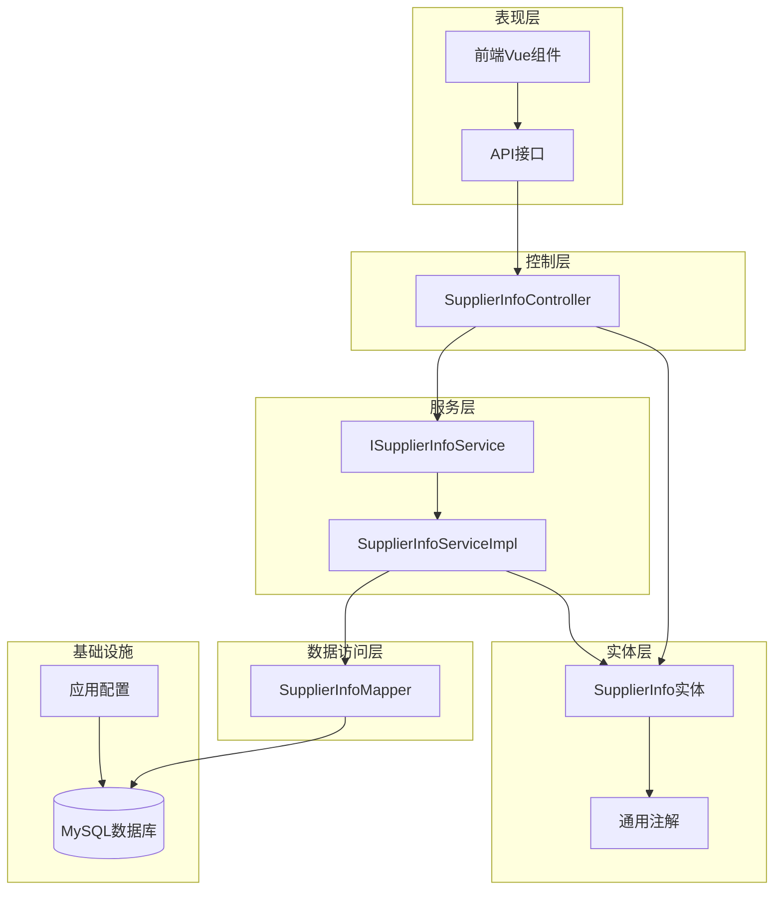
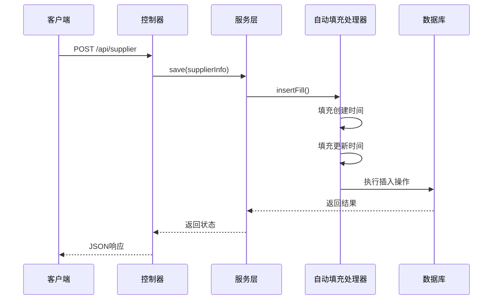
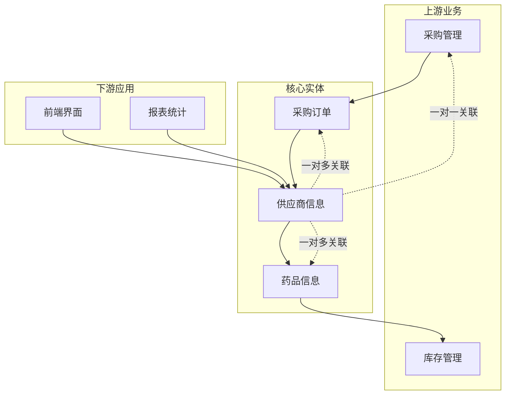
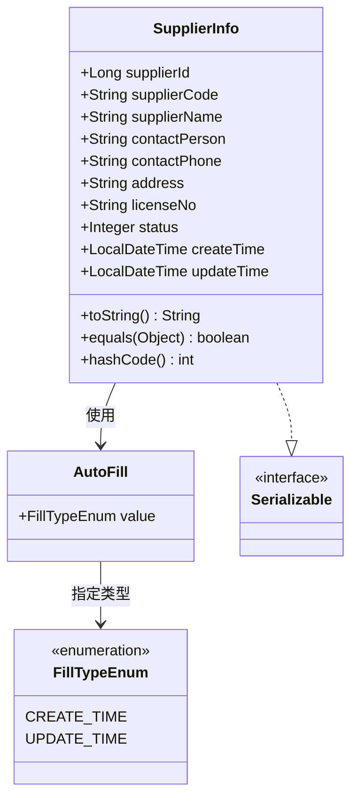
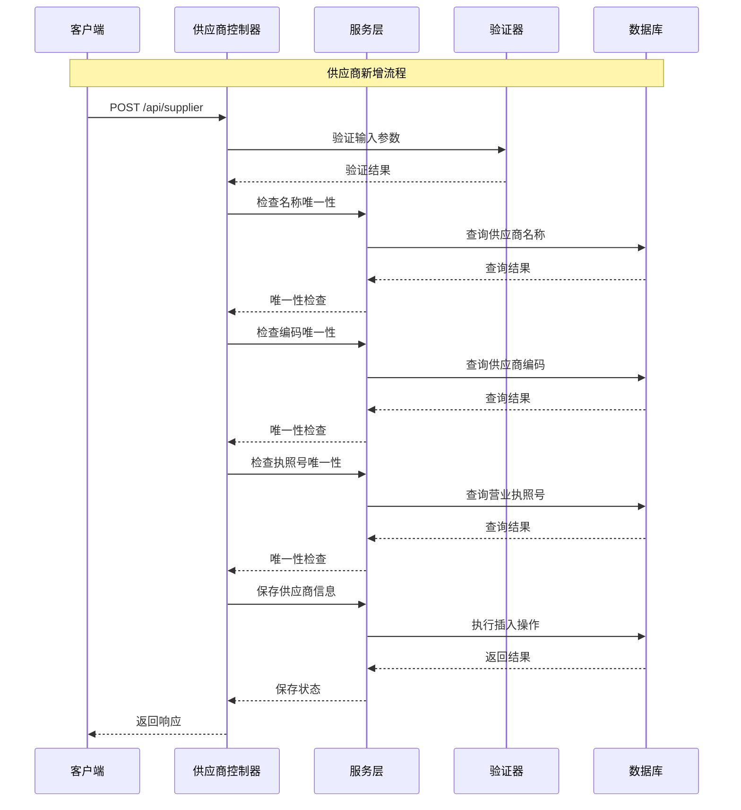
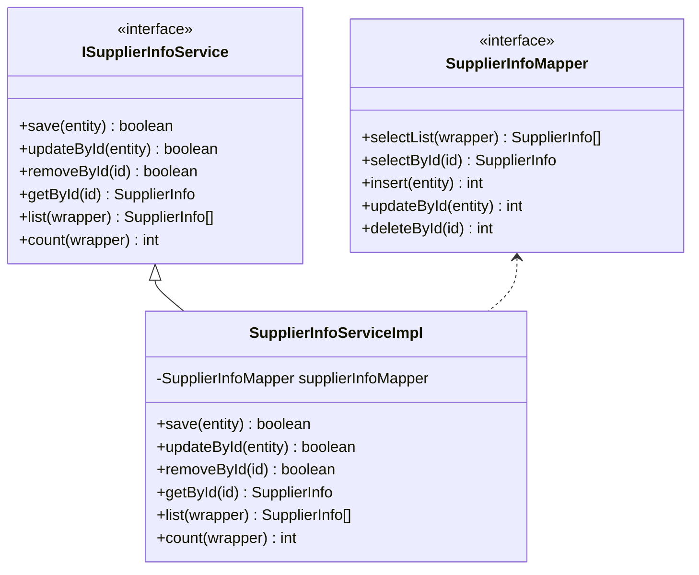
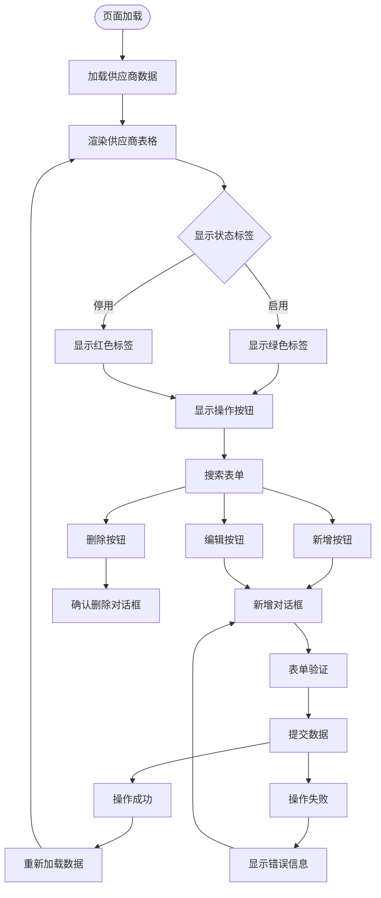
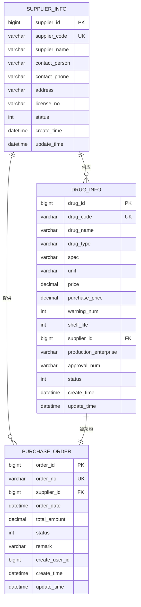
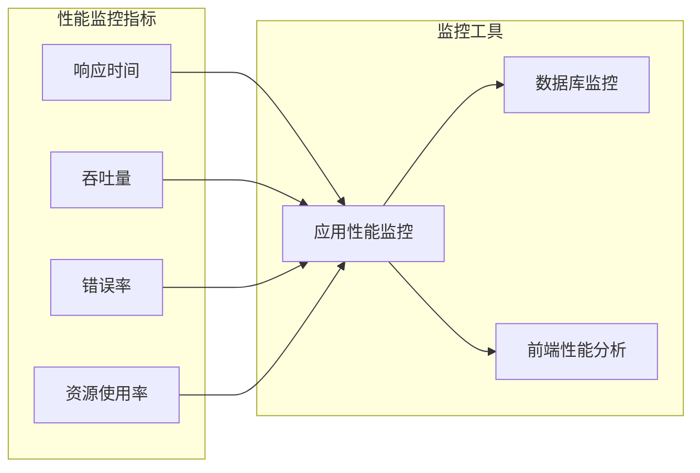
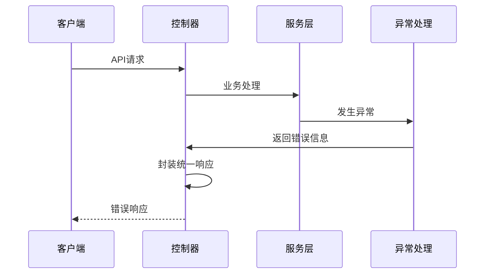

# 供应商信息实体

<cite>
**本文档引用的文件**
- [SupplierInfo.java](file://src/main/java/com/hospital/drugmanagement/entity/SupplierInfo.java)
- [SupplierInfoMapper.java](file://src/main/java/com/hospital/drugmanagement/mapper/SupplierInfoMapper.java)
- [ISupplierInfoService.java](file://src/main/java/com/hospital/drugmanagement/service/ISupplierInfoService.java)
- [SupplierInfoServiceImpl.java](file://src/main/java/com/hospital/drugmanagement/service/impl/SupplierInfoServiceImpl.java)
- [SupplierInfoController.java](file://src/main/java/com/hospital/drugmanagement/controller/SupplierInfoController.java)
- [init.sql](file://src/main/resources/db/init.sql)
- [hospital_drug.sql](file://hospital_drug.sql)
- [AutoFill.java](file://src/main/java/com/hospital/drugmanagement/common/anno/AutoFill.java)
- [FillTypeEnum.java](file://src/main/java/com/hospital/drugmanagement/common/constant/FillTypeEnum.java)
- [MyMetaObjectHandler.java](file://src/main/java/com/hospital/drugmanagement/common/handler/MyMetaObjectHandler.java)
- [Result.java](file://src/main/java/com/hospital/drugmanagement/dto/Result.java)
- [SupplierList.vue](file://drug-front/src/views/supplier/SupplierList.vue)
- [supplier.js](file://drug-front/src/api/supplier.js)
- [PurchaseOrder.java](file://src/main/java/com/hospital/drugmanagement/entity/PurchaseOrder.java)
- [application.yml](file://src/main/resources/application.yml)
</cite>

## 目录
1. [简介](#简介)
2. [项目结构](#项目结构)
3. [核心组件](#核心组件)
4. [架构概览](#架构概览)
5. [详细组件分析](#详细组件分析)
6. [依赖关系分析](#依赖关系分析)
7. [性能考虑](#性能考虑)
8. [故障排除指南](#故障排除指南)
9. [结论](#结论)
10. [附录](#附录)

## 简介

供应商信息实体是医院药品管理系统中的核心业务实体之一，负责管理供应商的基本信息和业务状态。该实体采用Spring Boot + MyBatis-Plus框架实现，具备完整的CRUD功能、数据验证机制和状态管理模式。

本系统围绕供应商信息构建了完整的供应链管理体系，包括供应商管理、药品采购、库存管理和出入库操作等核心业务流程。供应商信息作为整个供应链的基础数据，直接影响药品采购流程的准确性和效率。

## 项目结构

基于分层架构设计，供应商信息模块遵循经典的MVC模式：

**图表来源**
- [SupplierInfoController.java:1-176](file://src/main/java/com/hospital/drugmanagement/controller/SupplierInfoController.java#L1-L176)
- [SupplierInfoServiceImpl.java:1-11](file://src/main/java/com/hospital/drugmanagement/service/impl/SupplierInfoServiceImpl.java#L1-L11)
- [SupplierInfoMapper.java:1-7](file://src/main/java/com/hospital/drugmanagement/mapper/SupplierInfoMapper.java#L1-L7)

**章节来源**
- [application.yml:1-24](file://src/main/resources/application.yml#L1-L24)
- [init.sql:82-95](file://src/main/resources/db/init.sql#L82-L95)

## 核心组件

### 实体类设计

供应商信息实体采用标准的JPA注解配置，实现了完整的数据持久化功能：

| 字段属性 | 数据类型 | 约束条件 | 业务含义 |
|---------|---------|---------|----------|
| supplierId | Long | 主键, 自增 | 供应商唯一标识符 |
| supplierCode | String | 非空, 唯一 | 供应商编码 |
| supplierName | String | 非空 | 供应商名称 |
| contactPerson | String | 可空 | 联系人姓名 |
| contactPhone | String | 可空 | 联系电话 |
| address | String | 可空 | 详细地址 |
| licenseNo | String | 可空 | 营业执照号码 |
| status | Integer | 默认1 | 状态（0停用/1启用） |
| createTime | LocalDateTime | 自动填充 | 创建时间 |
| updateTime | LocalDateTime | 自动填充 | 更新时间 |

### 自动填充机制

系统通过自定义注解实现字段的自动填充功能：

**图表来源**
- [MyMetaObjectHandler.java:21-32](file://src/main/java/com/hospital/drugmanagement/common/handler/MyMetaObjectHandler.java#L21-L32)
- [SupplierInfoController.java:66-110](file://src/main/java/com/hospital/drugmanagement/controller/SupplierInfoController.java#L66-L110)

**章节来源**
- [SupplierInfo.java:17-38](file://src/main/java/com/hospital/drugmanagement/entity/SupplierInfo.java#L17-L38)
- [AutoFill.java:1-15](file://src/main/java/com/hospital/drugmanagement/common/anno/AutoFill.java#L1-L15)
- [FillTypeEnum.java:1-9](file://src/main/java/com/hospital/drugmanagement/common/constant/FillTypeEnum.java#L1-L9)

## 架构概览

供应商信息模块在整个系统架构中扮演着关键角色，连接着多个业务领域：

**图表来源**
- [init.sql:60-95](file://src/main/resources/db/init.sql#L60-L95)
- [PurchaseOrder.java:23](file://src/main/java/com/hospital/drugmanagement/entity/PurchaseOrder.java#L23)

### 数据完整性约束

系统通过多种机制确保数据的完整性和一致性：

1. **数据库层面约束**
   - 主键约束：supplier_id 自增主键
   - 唯一约束：supplier_code 唯一索引
   - 非空约束：supplier_name 必填字段
   - 默认值：status 默认启用状态

2. **业务层面约束**
   - 供应商名称唯一性检查
   - 供应商编码唯一性检查
   - 营业执照号唯一性检查
   - 状态字段的有效性验证

**章节来源**
- [init.sql:82-95](file://src/main/resources/db/init.sql#L82-L95)
- [SupplierInfoController.java:70-98](file://src/main/java/com/hospital/drugmanagement/controller/SupplierInfoController.java#L70-L98)

## 详细组件分析

### 实体类结构分析

**图表来源**
- [SupplierInfo.java:14-39](file://src/main/java/com/hospital/drugmanagement/entity/SupplierInfo.java#L14-L39)
- [AutoFill.java:12-15](file://src/main/java/com/hospital/drugmanagement/common/anno/AutoFill.java#L12-L15)
- [FillTypeEnum.java:6-9](file://src/main/java/com/hospital/drugmanagement/common/constant/FillTypeEnum.java#L6-L9)

### 控制器层处理流程

供应商信息控制器实现了完整的RESTful API接口：

**图表来源**
- [SupplierInfoController.java:66-110](file://src/main/java/com/hospital/drugmanagement/controller/SupplierInfoController.java#L66-L110)

### 服务层实现模式

服务层采用MyBatis-Plus的ServiceImpl模式，提供了丰富的CRUD操作能力：

**图表来源**
- [ISupplierInfoService.java:1-7](file://src/main/java/com/hospital/drugmanagement/service/ISupplierInfoService.java#L1-L7)
- [SupplierInfoServiceImpl.java:10](file://src/main/java/com/hospital/drugmanagement/service/impl/SupplierInfoServiceImpl.java#L10)
- [SupplierInfoMapper.java:1-7](file://src/main/java/com/hospital/drugmanagement/mapper/SupplierInfoMapper.java#L1-L7)

**章节来源**
- [SupplierInfoServiceImpl.java:1-11](file://src/main/java/com/hospital/drugmanagement/service/impl/SupplierInfoServiceImpl.java#L1-L11)
- [ISupplierInfoService.java:1-7](file://src/main/java/com/hospital/drugmanagement/service/ISupplierInfoService.java#L1-L7)

### 前端集成与展示

前端采用Element Plus组件库实现供应商信息的可视化管理：

**图表来源**
- [SupplierList.vue:175-290](file://drug-front/src/views/supplier/SupplierList.vue#L175-L290)

**章节来源**
- [SupplierList.vue:1-302](file://drug-front/src/views/supplier/SupplierList.vue#L1-L302)
- [supplier.js:1-45](file://drug-front/src/api/supplier.js#L1-L45)

## 依赖关系分析

### 数据模型依赖图

**图表来源**
- [init.sql:60-95](file://src/main/resources/db/init.sql#L60-L95)
- [init.sql:127-141](file://src/main/resources/db/init.sql#L127-L141)

### 业务关联关系

供应商信息与核心业务实体建立了紧密的关联关系：

1. **与药品信息的一对多关系**
   - 一个供应商可以供应多种药品
   - 药品记录中包含供应商ID外键
   - 支持按供应商筛选药品信息

2. **与采购订单的一对多关系**
   - 一个供应商可以产生多笔采购订单
   - 采购订单直接关联到供应商
   - 支持供应商维度的采购统计

3. **与药品库存的间接关联**
   - 通过药品信息间接关联到库存管理
   - 影响库存的来源和批次管理

**章节来源**
- [init.sql:73](file://src/main/resources/db/init.sql#L73)
- [init.sql:132](file://src/main/resources/db/init.sql#L132)

## 性能考虑

### 数据库优化策略

1. **索引设计**
   - 供应商编码建立唯一索引，确保查询效率
   - 药品信息按供应商ID建立索引，支持快速关联查询
   - 采购订单按供应商ID建立索引，优化采购统计

2. **查询优化**
   - 使用条件查询时优先使用索引字段
   - 支持模糊查询但需注意性能影响
   - 分页查询避免一次性加载大量数据

3. **缓存策略**
   - 常用供应商信息可考虑缓存
   - 避免频繁的重复查询相同供应商数据

### 系统性能监控

## 故障排除指南

### 常见问题及解决方案

1. **供应商名称重复错误**
   - 现象：保存时提示供应商名称已存在
   - 原因：数据库唯一约束冲突
   - 解决：修改供应商名称或使用不同的供应商

2. **供应商编码重复错误**
   - 现象：保存时提示供应商编码已存在
   - 原因：编码重复违反唯一性约束
   - 解决：使用唯一的供应商编码

3. **营业执照号重复错误**
   - 现象：保存时提示营业执照号已存在
   - 原因：同一执照号被多个供应商使用
   - 解决：确保每个供应商有独立的营业执照号

4. **数据同步问题**
   - 现象：前端显示的数据与数据库不一致
   - 原因：浏览器缓存或网络延迟
   - 解决：刷新页面或检查网络连接

### 错误处理机制

系统实现了完善的错误处理和响应机制：

**图表来源**
- [SupplierInfoController.java:41-47](file://src/main/java/com/hospital/drugmanagement/controller/SupplierInfoController.java#L41-L47)

**章节来源**
- [SupplierInfoController.java:41-175](file://src/main/java/com/hospital/drugmanagement/controller/SupplierInfoController.java#L41-L175)

## 结论

供应商信息实体作为医院药品管理系统的核心基础数据，具有以下特点：

1. **设计合理**：采用标准的实体设计模式，字段定义清晰，约束完整
2. **功能完善**：提供完整的CRUD操作，支持复杂的查询和验证
3. **扩展性强**：基于Spring Boot和MyBatis-Plus框架，易于功能扩展
4. **用户体验好**：前后端分离架构，提供直观的管理界面
5. **数据安全**：多重验证机制确保数据的完整性和一致性

该实体为整个供应链管理提供了坚实的基础，支持从供应商管理到药品采购的完整业务流程，是系统稳定运行的重要保障。

## 附录

### API接口规范

| 接口 | 方法 | 路径 | 功能描述 |
|------|------|------|----------|
| 供应商列表 | GET | /api/supplier/list | 获取供应商列表 |
| 供应商详情 | GET | /api/supplier/{id} | 获取指定供应商详情 |
| 新增供应商 | POST | /api/supplier | 创建新的供应商 |
| 更新供应商 | PUT | /api/supplier | 更新供应商信息 |
| 删除供应商 | DELETE | /api/supplier/{id} | 删除供应商记录 |

### 数据验证规则

1. **必填字段验证**
   - 供应商名称：非空验证
   - 供应商编码：非空验证
   - 联系人：非空验证
   - 联系电话：非空验证
   - 地址：非空验证
   - 营业执照号：非空验证

2. **唯一性验证**
   - 供应商名称唯一性检查
   - 供应商编码唯一性检查
   - 营业执照号唯一性检查

3. **格式验证**
   - 电话号码格式验证
   - 状态值范围验证（0/1）

### 状态管理机制

供应商状态采用简单的二进制状态管理：
- 0：停用状态，不可进行业务操作
- 1：启用状态，正常业务操作

状态变更通过专门的更新接口实现，支持管理员对供应商状态的灵活控制。