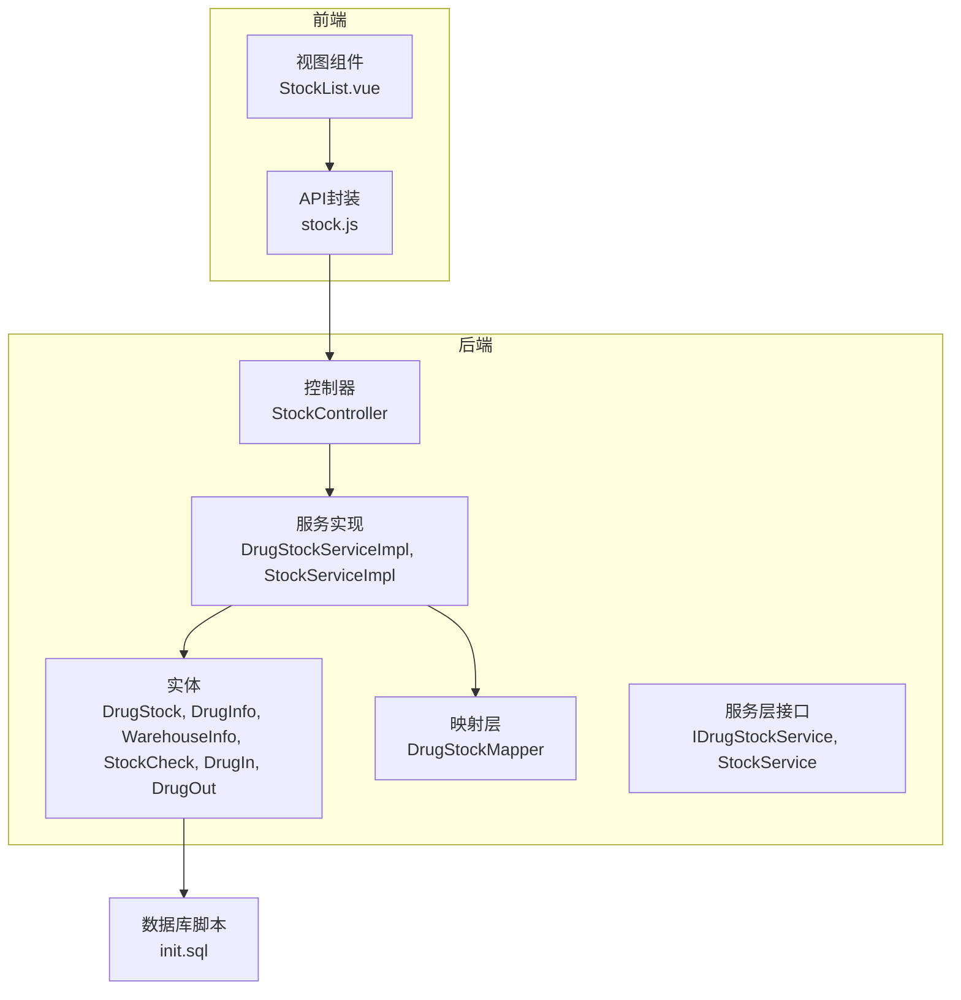
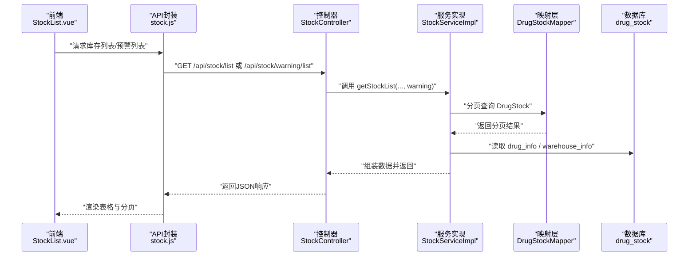
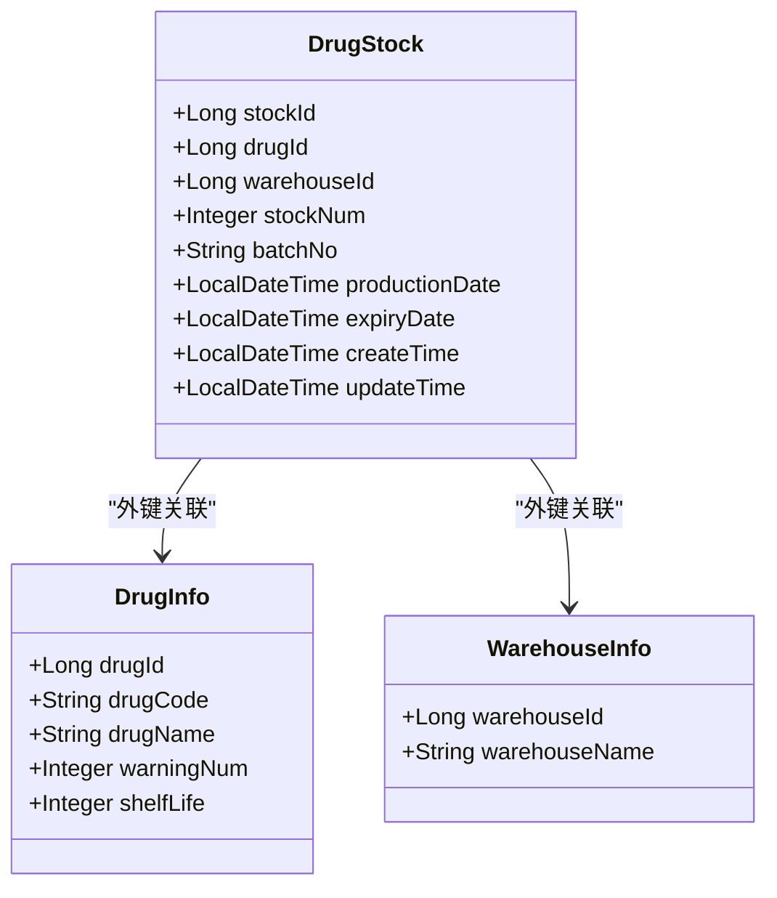
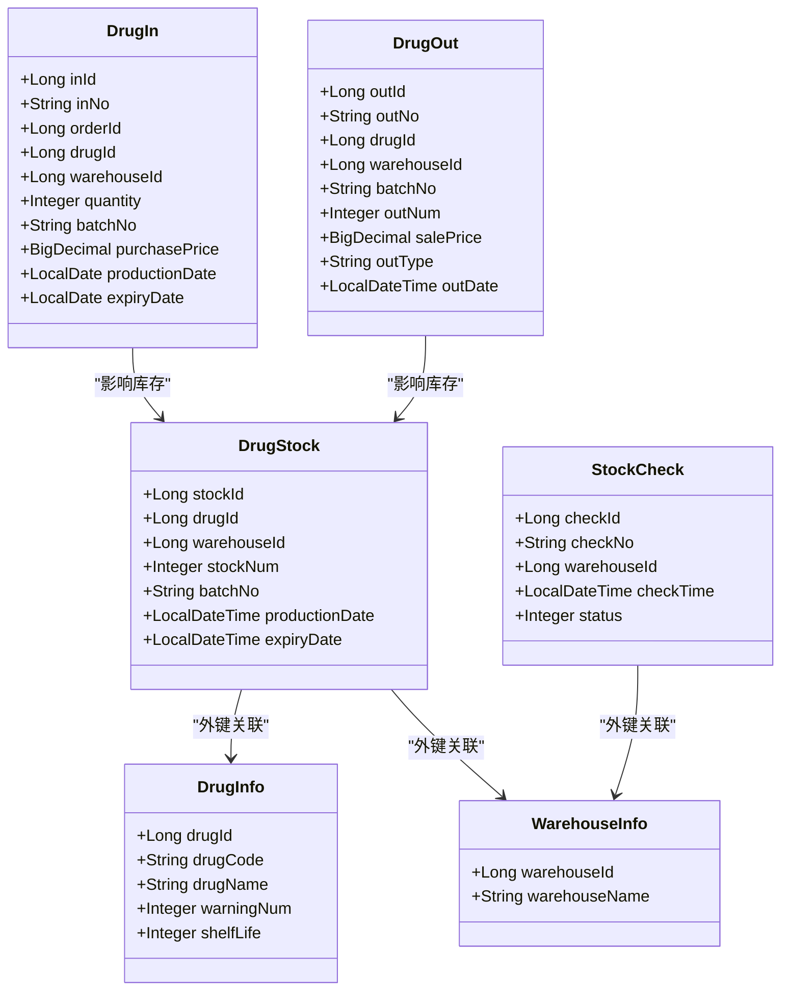
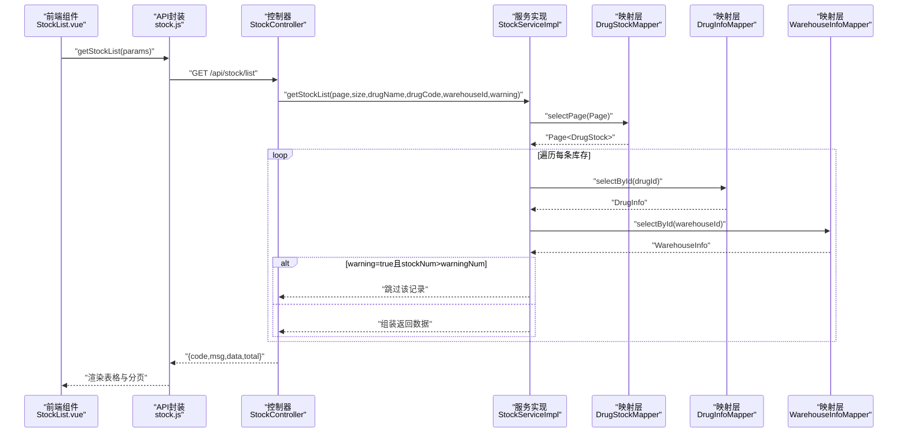
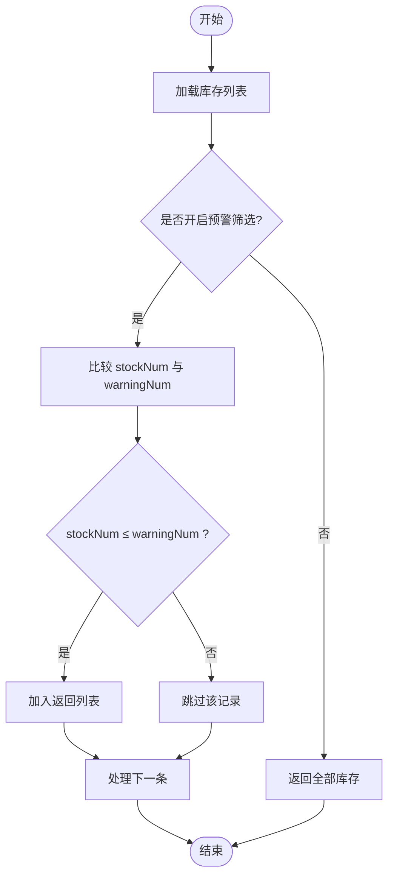
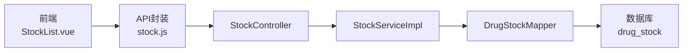

# 库存信息实体

<cite>
**本文引用的文件**
- [DrugStock.java](file://src/main/java/com/hospital/drugmanagement/entity/DrugStock.java)
- [DrugStockMapper.java](file://src/main/java/com/hospital/drugmanagement/mapper/DrugStockMapper.java)
- [DrugStockServiceImpl.java](file://src/main/java/com/hospital/drugmanagement/service/impl/DrugStockServiceImpl.java)
- [IDrugStockService.java](file://src/main/java/com/hospital/drugmanagement/service/IDrugStockService.java)
- [StockService.java](file://src/main/java/com/hospital/drugmanagement/service/StockService.java)
- [StockServiceImpl.java](file://src/main/java/com/hospital/drugmanagement/service/impl/StockServiceImpl.java)
- [StockController.java](file://src/main/java/com/hospital/drugmanagement/controller/StockController.java)
- [DrugInfo.java](file://src/main/java/com/hospital/drugmanagement/entity/DrugInfo.java)
- [WarehouseInfo.java](file://src/main/java/com/hospital/drugmanagement/entity/WarehouseInfo.java)
- [StockCheck.java](file://src/main/java/com/hospital/drugmanagement/entity/StockCheck.java)
- [DrugIn.java](file://src/main/java/com/hospital/drugmanagement/entity/DrugIn.java)
- [DrugOut.java](file://src/main/java/com/hospital/drugmanagement/entity/DrugOut.java)
- [init.sql](file://src/main/resources/db/init.sql)
- [stock.js](file://drug-front/src/api/stock.js)
- [StockList.vue](file://drug-front/src/views/stock/StockList.vue)
</cite>

## 目录
1. [简介](#简介)
2. [项目结构](#项目结构)
3. [核心组件](#核心组件)
4. [架构概览](#架构概览)
5. [详细组件分析](#详细组件分析)
6. [依赖分析](#依赖分析)
7. [性能考虑](#性能考虑)
8. [故障排查指南](#故障排查指南)
9. [结论](#结论)
10. [附录](#附录)

## 简介
本文围绕库存信息实体(DrugStock)进行系统化文档化，覆盖以下主题：
- 实体字段设计与业务含义：stock_id主键、drug_id药品关联、warehouse_id仓库关联、quantity当前库存数量、batch_no批号、production_date生产日期、expiry_date有效期、createTime/updateTime时间戳。
- 库存管理关键概念：可用数量与锁定数量的区分、批次管理机制、保质期控制策略、库存预警计算方式。
- 实体间关系：与DrugInfo、WarehouseInfo的关联；与入库单(DrugIn)、出库单(DrugOut)、盘点单(StockCheck)的业务联动。
- 库存变动业务逻辑：入库增加库存、出库减少库存、盘点生成盘点单、预警筛选与展示。
- 最佳实践与常见问题解决方案。

## 项目结构
后端采用Spring Boot + MyBatis-Plus分层架构，前端基于Vue 3 + Element Plus。库存模块涉及实体、Mapper、Service、Controller及前端页面与API调用。

图表来源
- [StockController.java:1-114](file://src/main/java/com/hospital/drugmanagement/controller/StockController.java#L1-L114)
- [StockServiceImpl.java:1-241](file://src/main/java/com/hospital/drugmanagement/service/impl/StockServiceImpl.java#L1-L241)
- [DrugStock.java:1-39](file://src/main/java/com/hospital/drugmanagement/entity/DrugStock.java#L1-L39)
- [init.sql:111-125](file://src/main/resources/db/init.sql#L111-L125)

章节来源
- [StockController.java:1-114](file://src/main/java/com/hospital/drugmanagement/controller/StockController.java#L1-L114)
- [StockServiceImpl.java:1-241](file://src/main/java/com/hospital/drugmanagement/service/impl/StockServiceImpl.java#L1-L241)
- [init.sql:111-125](file://src/main/resources/db/init.sql#L111-L125)

## 核心组件
- 实体层：DrugStock承载库存数据，包含主键stock_id、药品关联drug_id、仓库关联warehouse_id、当前库存quantity、批号batch_no、生产日期production_date、有效期expiry_date及时间戳字段。
- 映射层：DrugStockMapper继承MyBatis-Plus基础接口，提供通用CRUD能力。
- 服务层：IDrugStockService定义库存服务契约；StockService定义库存列表、盘点、报表等业务；StockServiceImpl实现具体逻辑。
- 控制器：StockController提供库存列表、预警列表、库存盘点等REST接口。
- 前端：stock.js封装API调用；StockList.vue负责搜索、分页、预警展示与盘点操作。

章节来源
- [DrugStock.java:1-39](file://src/main/java/com/hospital/drugmanagement/entity/DrugStock.java#L1-L39)
- [DrugStockMapper.java:1-8](file://src/main/java/com/hospital/drugmanagement/mapper/DrugStockMapper.java#L1-L8)
- [IDrugStockService.java:1-7](file://src/main/java/com/hospital/drugmanagement/service/IDrugStockService.java#L1-L7)
- [StockService.java:1-59](file://src/main/java/com/hospital/drugmanagement/service/StockService.java#L1-L59)
- [StockServiceImpl.java:1-241](file://src/main/java/com/hospital/drugmanagement/service/impl/StockServiceImpl.java#L1-L241)
- [StockController.java:1-114](file://src/main/java/com/hospital/drugmanagement/controller/StockController.java#L1-L114)
- [stock.js:1-37](file://drug-front/src/api/stock.js#L1-L37)
- [StockList.vue:1-262](file://drug-front/src/views/stock/StockList.vue#L1-L262)

## 架构概览
库存模块遵循“控制器-服务-映射-实体”的分层设计，前端通过API与后端交互，后端通过Mapper访问数据库。

图表来源
- [StockController.java:18-90](file://src/main/java/com/hospital/drugmanagement/controller/StockController.java#L18-L90)
- [StockServiceImpl.java:40-87](file://src/main/java/com/hospital/drugmanagement/service/impl/StockServiceImpl.java#L40-L87)
- [DrugStockMapper.java:1-8](file://src/main/java/com/hospital/drugmanagement/mapper/DrugStockMapper.java#L1-L8)
- [init.sql:111-125](file://src/main/resources/db/init.sql#L111-L125)

## 详细组件分析

### 实体：DrugStock 字段与业务定义
- stock_id：库存记录主键，自增。
- drug_id：关联药品信息表(drug_info)，标识该库存对应的药品。
- warehouse_id：关联仓库信息表(warehouse_info)，标识该库存所在仓库。
- quantity：当前库存数量，数据库默认0。
- batch_no：批号，用于批次追踪。
- production_date：生产日期，配合shelf_life计算保质期。
- expiry_date：有效期，用于保质期控制。
- createTime/updateTime：自动填充创建与更新时间。

图表来源
- [DrugStock.java:18-38](file://src/main/java/com/hospital/drugmanagement/entity/DrugStock.java#L18-L38)
- [DrugInfo.java:11-51](file://src/main/java/com/hospital/drugmanagement/entity/DrugInfo.java#L11-L51)
- [WarehouseInfo.java:17-36](file://src/main/java/com/hospital/drugmanagement/entity/WarehouseInfo.java#L17-L36)
- [init.sql:113-125](file://src/main/resources/db/init.sql#L113-L125)

章节来源
- [DrugStock.java:18-38](file://src/main/java/com/hospital/drugmanagement/entity/DrugStock.java#L18-L38)
- [init.sql:113-125](file://src/main/resources/db/init.sql#L113-L125)

### 关键概念与业务逻辑

#### 可用数量与锁定数量
- 可用数量：在界面展示中，可用库存=stockNum - lockNum，默认lockNum为0。
- 锁定数量：用于表示被占用但尚未出库的数量，例如已下单未出库或正在盘点中的数量。
- 前端展示：StockList.vue中通过计算列显示可用库存，并根据stockNum与warningNum动态标记状态。

章节来源
- [StockList.vue:62-66](file://drug-front/src/views/stock/StockList.vue#L62-L66)
- [StockList.vue:178-183](file://drug-front/src/views/stock/StockList.vue#L178-L183)

#### 批次管理机制
- 批号(batch_no)与生产日期(production_date)/有效期(expiry_date)共同构成批次维度，支持按批次追踪与保质期管理。
- 入库单(DrugIn)与出库单(DrugOut)均包含batch_no、production_date、expiry_date，确保出入库与库存保持一致的批次信息。

章节来源
- [DrugStock.java:28-32](file://src/main/java/com/hospital/drugmanagement/entity/DrugStock.java#L28-L32)
- [DrugIn.java:33-39](file://src/main/java/com/hospital/drugmanagement/entity/DrugIn.java#L33-L39)
- [DrugOut.java:28-31](file://src/main/java/com/hospital/drugmanagement/entity/DrugOut.java#L28-L31)

#### 保质期控制策略
- 保质期(shelf_life)来自药品信息表，单位为月。
- 有效期(expiry_date)由生产日期+保质期推导，数据库层面可直接存储expiry_date，便于快速判断临近过期与过期状态。
- 建议：在业务层提供“临近过期”与“过期”预警规则，结合expiry_date与当前日期进行筛选。

章节来源
- [DrugInfo.java:38-39](file://src/main/java/com/hospital/drugmanagement/entity/DrugInfo.java#L38-L39)
- [init.sql:72](file://src/main/resources/db/init.sql#L72)
- [DrugStock.java:30-32](file://src/main/java/com/hospital/drugmanagement/entity/DrugStock.java#L30-L32)

#### 库存预警计算方式
- 预警值(warningNum)来自药品信息表。
- 列表过滤：当参数warning=true时，仅显示stockNum ≤ warningNum的记录。
- 前端状态：当stockNum ≤ warningNum时，行样式标记为“库存不足”。

章节来源
- [DrugInfo.java:35-36](file://src/main/java/com/hospital/drugmanagement/entity/DrugInfo.java#L35-L36)
- [StockServiceImpl.java:64-67](file://src/main/java/com/hospital/drugmanagement/service/impl/StockServiceImpl.java#L64-L67)
- [StockList.vue:68-74](file://drug-front/src/views/stock/StockList.vue#L68-L74)

#### 库存实体与药品实体的关联关系
- 一对一：每个库存记录对应一个药品(drug_id)。
- 一对多：一个药品可分布在多个仓库，形成多条库存记录。
- 数据一致性：服务层通过drug_infoMapper读取药品信息，补充到库存列表返回给前端。

章节来源
- [StockServiceImpl.java:56-58](file://src/main/java/com/hospital/drugmanagement/service/impl/StockServiceImpl.java#L56-L58)
- [init.sql:115-116](file://src/main/resources/db/init.sql#L115-L116)

#### 库存变动的业务逻辑
- 入库：新增DrugIn记录，系统根据batch_no、warehouse_id、drug_id更新或新增DrugStock(quantity累加)。
- 出库：新增DrugOut记录，系统根据batch_no、warehouse_id、drug_id从DrugStock(quantity扣减)。
- 盘点：创建StockCheck单据，生成盘点单号，后续可生成盘点明细项(当前实现为占位，待完善)。

章节来源
- [DrugIn.java:20-41](file://src/main/java/com/hospital/drugmanagement/entity/DrugIn.java#L20-L41)
- [DrugOut.java:19-37](file://src/main/java/com/hospital/drugmanagement/entity/DrugOut.java#L19-L37)
- [StockServiceImpl.java:90-113](file://src/main/java/com/hospital/drugmanagement/service/impl/StockServiceImpl.java#L90-L113)

#### 库存盘点、出入库操作对库存数据的影响
- 盘点：StockController提供POST /api/stock/check，调用StockServiceImpl.checkStock创建盘点单；后续可扩展生成盘点明细。
- 出入库：前端DrugInList.vue与DrugOutList.vue展示入库/出库明细，体现批次、数量、单价、有效期等信息。

章节来源
- [StockController.java:95-112](file://src/main/java/com/hospital/drugmanagement/controller/StockController.java#L95-L112)
- [StockServiceImpl.java:90-113](file://src/main/java/com/hospital/drugmanagement/service/impl/StockServiceImpl.java#L90-L113)
- [DrugIn.java:40-62](file://src/main/java/com/hospital/drugmanagement/entity/DrugIn.java#L40-L62)
- [DrugOut.java:35-58](file://src/main/java/com/hospital/drugmanagement/entity/DrugOut.java#L35-L58)

### 类图：库存相关实体关系

图表来源
- [DrugStock.java:18-38](file://src/main/java/com/hospital/drugmanagement/entity/DrugStock.java#L18-L38)
- [DrugInfo.java:11-51](file://src/main/java/com/hospital/drugmanagement/entity/DrugInfo.java#L11-L51)
- [WarehouseInfo.java:17-36](file://src/main/java/com/hospital/drugmanagement/entity/WarehouseInfo.java#L17-L36)
- [StockCheck.java:18-39](file://src/main/java/com/hospital/drugmanagement/entity/StockCheck.java#L18-L39)
- [DrugIn.java:20-62](file://src/main/java/com/hospital/drugmanagement/entity/DrugIn.java#L20-L62)
- [DrugOut.java:19-58](file://src/main/java/com/hospital/drugmanagement/entity/DrugOut.java#L19-L58)

### 序列图：库存列表查询流程

图表来源
- [StockList.vue:186-202](file://drug-front/src/views/stock/StockList.vue#L186-L202)
- [stock.js:4-10](file://drug-front/src/api/stock.js#L4-L10)
- [StockController.java:21-44](file://src/main/java/com/hospital/drugmanagement/controller/StockController.java#L21-L44)
- [StockServiceImpl.java:40-87](file://src/main/java/com/hospital/drugmanagement/service/impl/StockServiceImpl.java#L40-L87)

### 流程图：库存预警筛选逻辑

图表来源
- [StockServiceImpl.java:64-67](file://src/main/java/com/hospital/drugmanagement/service/impl/StockServiceImpl.java#L64-L67)
- [StockList.vue:193-196](file://drug-front/src/views/stock/StockList.vue#L193-L196)

## 依赖分析
- 控制器依赖服务层；服务层依赖映射层与实体；映射层访问数据库。
- 前端通过API封装调用控制器，控制器返回标准化响应。
- 数据库层面，drug_stock表包含索引(idx_drug_id, idx_warehouse_id)以优化查询。

图表来源
- [StockController.java:1-114](file://src/main/java/com/hospital/drugmanagement/controller/StockController.java#L1-L114)
- [StockServiceImpl.java:1-241](file://src/main/java/com/hospital/drugmanagement/service/impl/StockServiceImpl.java#L1-L241)
- [DrugStockMapper.java:1-8](file://src/main/java/com/hospital/drugmanagement/mapper/DrugStockMapper.java#L1-L8)
- [init.sql:123-124](file://src/main/resources/db/init.sql#L123-L124)

章节来源
- [init.sql:123-124](file://src/main/resources/db/init.sql#L123-L124)

## 性能考虑
- 查询优化：为drug_id与warehouse_id建立索引，提升库存列表与按仓库筛选性能。
- 分页：服务层使用MyBatis-Plus分页插件，避免全表扫描。
- 关联查询：库存列表需读取drug_info与warehouse_info，建议在服务层合并查询或使用批量查询以减少N+1问题。
- 批次与保质期：在高频查询场景下，可考虑缓存常用药品的warningNum与shelfLife，降低重复查询开销。

## 故障排查指南
- 库存数量异常
  - 检查入库单与出库单是否正确写入batch_no、quantity、drug_id、warehouse_id。
  - 核对DrugStock.quantity与DrugIn/DrugOut的累计是否一致。
- 预警不生效
  - 确认DrugInfo.warningNum是否设置，StockServiceImpl中warning筛选逻辑是否启用。
  - 前端状态渲染依赖stockNum与warningNum比较，检查数据返回字段是否正确。
- 盘点功能
  - 当前实现仅创建盘点单，未生成明细；如需明细，请完善StockServiceImpl.checkStock逻辑。
- 时间字段
  - 使用AutoFill注解自动填充createTime/updateTime，若出现时区问题，需统一后端时区配置。

章节来源
- [StockServiceImpl.java:64-67](file://src/main/java/com/hospital/drugmanagement/service/impl/StockServiceImpl.java#L64-L67)
- [StockController.java:95-112](file://src/main/java/com/hospital/drugmanagement/controller/StockController.java#L95-L112)

## 结论
本文系统梳理了库存信息实体(DrugStock)的字段设计、与药品与仓库的关联关系、批次与保质期管理、库存预警与可用/锁定数量的计算，并结合前后端实现阐述了库存列表、预警筛选与盘点流程。建议在后续版本中完善出入库与库存的事务一致性、批次先进先出策略以及盘点明细生成功能，以进一步提升系统的可靠性与可维护性。

## 附录
- 数据库初始化脚本包含drug_stock、drug_info、warehouse_info、drug_in、drug_out、stock_check等表结构与示例数据，可作为部署与测试参考。
- 前端StockList.vue提供搜索、分页、预警开关与盘点弹窗，与后端API协同工作。

章节来源
- [init.sql:111-125](file://src/main/resources/db/init.sql#L111-L125)
- [StockList.vue:1-262](file://drug-front/src/views/stock/StockList.vue#L1-L262)