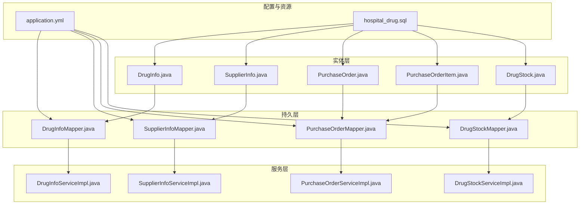
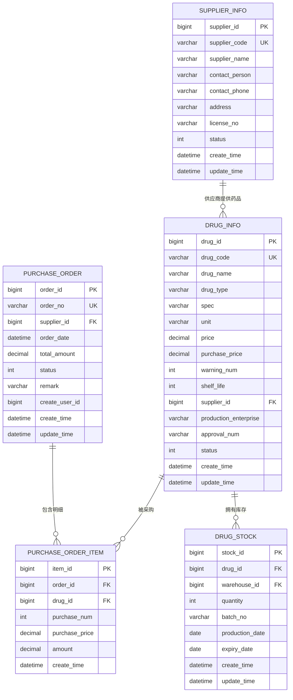
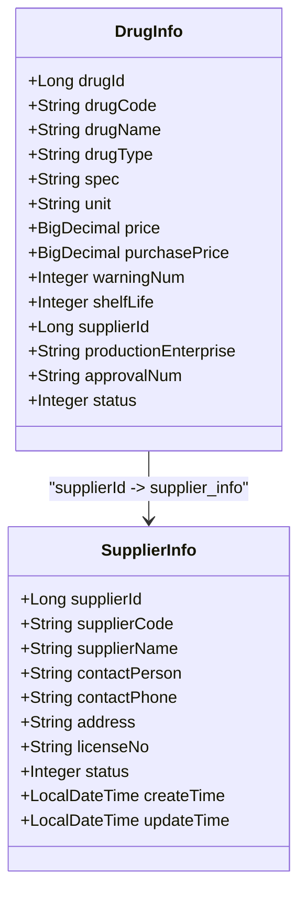
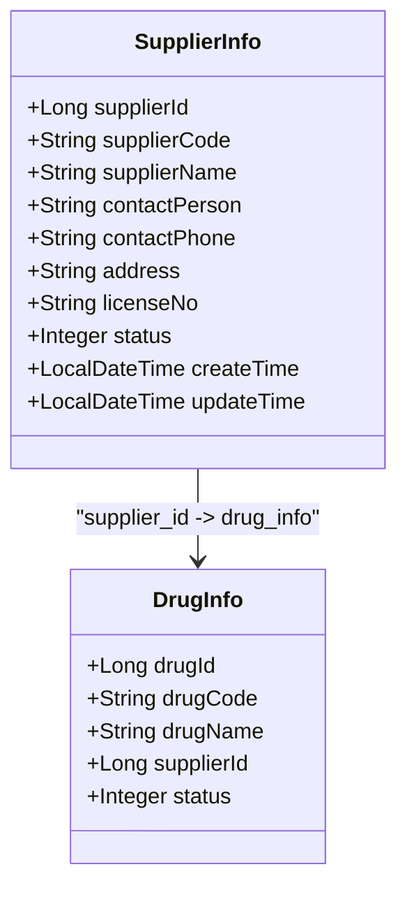
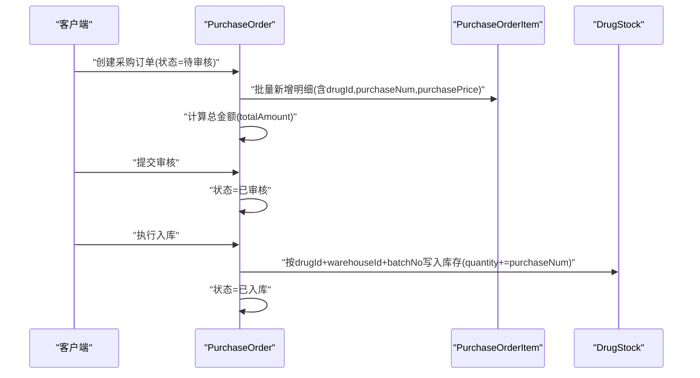
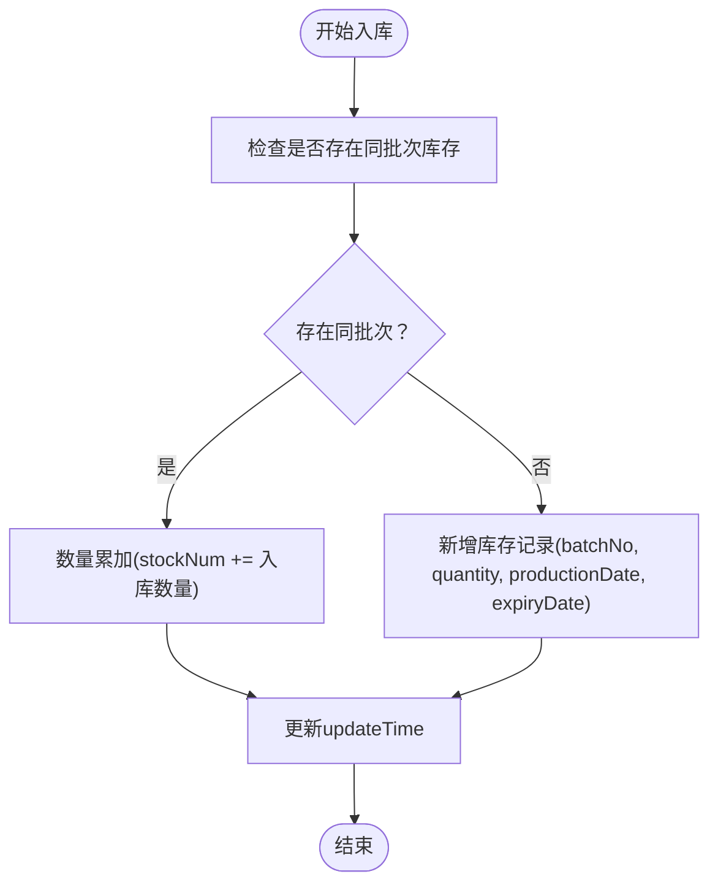
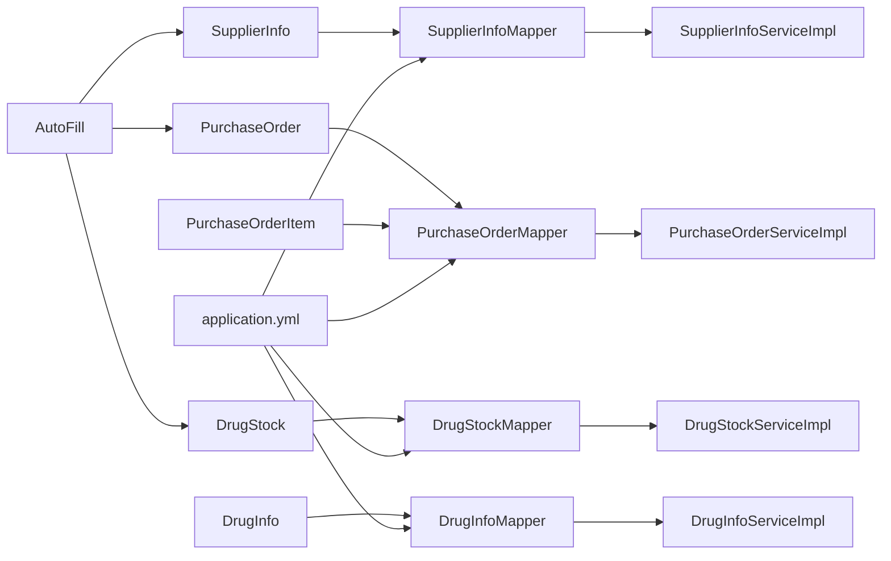

# 核心业务实体

<cite>
**本文引用的文件**
- [DrugInfo.java](file://src/main/java/com/hospital/drugmanagement/entity/DrugInfo.java)
- [SupplierInfo.java](file://src/main/java/com/hospital/drugmanagement/entity/SupplierInfo.java)
- [PurchaseOrder.java](file://src/main/java/com/hospital/drugmanagement/entity/PurchaseOrder.java)
- [DrugStock.java](file://src/main/java/com/hospital/drugmanagement/entity/DrugStock.java)
- [PurchaseOrderItem.java](file://src/main/java/com/hospital/drugmanagement/entity/PurchaseOrderItem.java)
- [DrugInfoMapper.java](file://src/main/java/com/hospital/drugmanagement/mapper/DrugInfoMapper.java)
- [SupplierInfoMapper.java](file://src/main/java/com/hospital/drugmanagement/mapper/SupplierInfoMapper.java)
- [PurchaseOrderMapper.java](file://src/main/java/com/hospital/drugmanagement/mapper/PurchaseOrderMapper.java)
- [DrugStockMapper.java](file://src/main/java/com/hospital/drugmanagement/mapper/DrugStockMapper.java)
- [hospital_drug.sql](file://hospital_drug.sql)
- [application.yml](file://src/main/resources/application.yml)
- [AutoFill.java](file://src/main/java/com/hospital/drugmanagement/common/anno/AutoFill.java)
- [FillTypeEnum.java](file://src/main/java/com/hospital/drugmanagement/common/constant/FillTypeEnum.java)
- [DrugInfoServiceImpl.java](file://src/main/java/com/hospital/drugmanagement/service/impl/DrugInfoServiceImpl.java)
- [SupplierInfoServiceImpl.java](file://src/main/java/com/hospital/drugmanagement/service/impl/SupplierInfoServiceImpl.java)
- [PurchaseOrderServiceImpl.java](file://src/main/java/com/hospital/drugmanagement/service/impl/PurchaseOrderServiceImpl.java)
- [DrugStockServiceImpl.java](file://src/main/java/com/hospital/drugmanagement/service/impl/DrugStockServiceImpl.java)
</cite>

## 目录
1. [简介](#简介)
2. [项目结构](#项目结构)
3. [核心组件](#核心组件)
4. [架构总览](#架构总览)
5. [详细组件分析](#详细组件分析)
6. [依赖分析](#依赖分析)
7. [性能考虑](#性能考虑)
8. [故障排查指南](#故障排查指南)
9. [结论](#结论)
10. [附录](#附录)

## 简介
本文件聚焦于药品管理系统的四大核心业务实体：药品信息(DrugInfo)、供应商信息(SupplierInfo)、采购订单(PurchaseOrder)、库存信息(DrugStock)，以及其明细实体(PurchaseOrderItem)。文档从实体设计理念、字段设计与业务规则、与数据库表的映射关系、MyBatis-Plus注解使用方式、实体关系图、字段说明、业务约束与数据验证规则等方面进行系统化阐述，并结合数据库初始化脚本与配置文件，给出可落地的实现依据与最佳实践。

## 项目结构
围绕核心业务实体，系统采用分层架构：实体层(entity)、持久层(mapper)、服务层(service)、控制层(controller)、资源与配置(resources/application.yml)。实体类通过MyBatis-Plus注解映射到数据库表，服务层基于MyBatis-Plus的ServiceImpl复用通用CRUD能力，配置文件开启下划线到驼峰映射与SQL日志输出，便于开发调试与一致性维护。

图表来源
- [application.yml:18-24](file://src/main/resources/application.yml#L18-L24)
- [hospital_drug.sql:62-164](file://hospital_drug.sql#L62-L164)

章节来源
- [application.yml:1-24](file://src/main/resources/application.yml#L1-L24)
- [hospital_drug.sql:1-307](file://hospital_drug.sql#L1-L307)

## 核心组件
本节对四大核心实体进行概览式说明，包括职责边界、关键字段与业务含义、与数据库表的映射关系、MyBatis-Plus注解使用方式，以及与之配套的Mapper与ServiceImpl。

- 药品信息(DrugInfo)
  - 职责：承载药品基本信息、价格、预警阈值、保质期、供应商关联、状态等。
  - 关键字段：drugId、drugCode、drugName、drugType、spec、unit、price、purchasePrice、warningNum、shelfLife、supplierId、productionEnterprise、approvalNum、status。
  - 表映射：drug_info，主键为drug_id，唯一索引drug_code，外键supplier_id关联供应商。
  - 注解：@TableName("drug_info")、@TableId(value="drug_id", type=IdType.AUTO)、@TableField用于非默认列名映射。
  - Mapper/Service：DrugInfoMapper、DrugInfoServiceImpl。

- 供应商信息(SupplierInfo)
  - 职责：维护供应商编码、名称、联系人、电话、地址、执照号、状态及时间戳。
  - 关键字段：supplierId、supplierCode、supplierName、contactPerson、contactPhone、address、licenseNo、status、createTime、updateTime。
  - 表映射：supplier_info，主键supplier_id，唯一索引supplier_code，状态0停用/1启用。
  - 注解：@TableName("supplier_info")、@TableId(type=IdType.AUTO)、@AutoFill(FillTypeEnum.CREATE_TIME/UPDATE_TIME)。
  - Mapper/Service：SupplierInfoMapper、SupplierInfoServiceImpl。

- 采购订单(PurchaseOrder)
  - 职责：记录采购单号、供应商、下单日期、总金额、状态、备注、创建人及时间戳。
  - 关键字段：orderId、orderNo、supplierId、orderDate、totalAmount、status、remark、createUserId、createTime、updateTime。
  - 表映射：purchase_order，主键order_id，唯一索引order_no，状态0待审核/1已审核/2已入库/3已取消/4审核不通过。
  - 注解：@TableName("purchase_order")、@TableId(type=IdType.AUTO)、@AutoFill(FillTypeEnum.CREATE_TIME/UPDATE_TIME)。
  - Mapper/Service：PurchaseOrderMapper、PurchaseOrderServiceImpl。
  - 明细：PurchaseOrderItem，记录每种药品的采购数量、单价与小计金额。

- 库存信息(DrugStock)
  - 职责：按药品+仓库+批号聚合库存，记录当前数量、生产日期、有效期及时间戳。
  - 关键字段：stockId、drugId、warehouseId、stockNum、batchNo、productionDate、expiryDate、createTime、updateTime。
  - 表映射：drug_stock，主键stock_id，索引drug_id、warehouse_id，数量默认0。
  - 注解：@TableName("drug_stock")、@TableId(type=IdType.AUTO)、@TableField("quantity")、@AutoFill(FillTypeEnum.CREATE_TIME/UPDATE_TIME)。
  - Mapper/Service：DrugStockMapper、DrugStockServiceImpl。

章节来源
- [DrugInfo.java:9-167](file://src/main/java/com/hospital/drugmanagement/entity/DrugInfo.java#L9-L167)
- [SupplierInfo.java:12-39](file://src/main/java/com/hospital/drugmanagement/entity/SupplierInfo.java#L12-L39)
- [PurchaseOrder.java:13-40](file://src/main/java/com/hospital/drugmanagement/entity/PurchaseOrder.java#L13-L40)
- [DrugStock.java:13-39](file://src/main/java/com/hospital/drugmanagement/entity/DrugStock.java#L13-L39)
- [PurchaseOrderItem.java:14-35](file://src/main/java/com/hospital/drugmanagement/entity/PurchaseOrderItem.java#L14-L35)
- [DrugInfoMapper.java:1-9](file://src/main/java/com/hospital/drugmanagement/mapper/DrugInfoMapper.java#L1-L9)
- [SupplierInfoMapper.java:1-7](file://src/main/java/com/hospital/drugmanagement/mapper/SupplierInfoMapper.java#L1-L7)
- [PurchaseOrderMapper.java:1-7](file://src/main/java/com/hospital/drugmanagement/mapper/PurchaseOrderMapper.java#L1-L7)
- [DrugStockMapper.java:1-8](file://src/main/java/com/hospital/drugmanagement/mapper/DrugStockMapper.java#L1-L8)
- [DrugInfoServiceImpl.java:13-18](file://src/main/java/com/hospital/drugmanagement/service/impl/DrugInfoServiceImpl.java#L13-L18)
- [SupplierInfoServiceImpl.java:9-11](file://src/main/java/com/hospital/drugmanagement/service/impl/SupplierInfoServiceImpl.java#L9-L11)
- [PurchaseOrderServiceImpl.java:9-11](file://src/main/java/com/hospital/drugmanagement/service/impl/PurchaseOrderServiceImpl.java#L9-L11)
- [DrugStockServiceImpl.java:9-11](file://src/main/java/com/hospital/drugmanagement/service/impl/DrugStockServiceImpl.java#L9-L11)

## 架构总览
下图展示核心实体与数据库表之间的映射关系、关键字段与索引约束，以及实体间的一对多/一对一关系。

图表来源
- [hospital_drug.sql:62-164](file://hospital_drug.sql#L62-L164)

## 详细组件分析

### 药品信息实体(DrugInfo)
- 设计理念
  - 以“药品”为中心，统一管理药品编码、名称、规格、单位、价格、预警阈值、保质期、供应商、批准文号与状态。
  - 通过supplierId与供应商建立一对多关系，支持按供应商维度检索与统计。
- 字段设计与业务规则
  - 编码唯一：drug_code唯一索引，确保全局唯一性。
  - 状态管理：status=1上架/0下架，用于控制是否参与销售与采购流程。
  - 价格体系：price销售价、purchasePrice采购价，支持进销差价分析。
  - 库存预警：warningNum阈值，结合库存表触发预警。
  - 保质期：shelfLife以月为单位，配合库存的productionDate/expireDate进行效期管理。
- 数据库映射
  - 表名：drug_info；主键drug_id；索引idx_supplier_id；唯一索引drug_code。
- MyBatis-Plus注解
  - @TableName("drug_info")、@TableId(value="drug_id", type=IdType.AUTO)、@TableField用于spec、unit、price、purchasePrice、warningNum、shelfLife、supplierId、productionEnterprise、approvalNum等非默认列名映射。
- 业务约束与验证
  - 必填项：drugCode、drugName、unit、supplierId。
  - 数值范围：warningNum≥0；shelfLife≥0；price/purchasePrice≥0。
  - 状态取值：status∈{0,1}。
- 与供应商的关联
  - supplierId外键关联supplier_info(supplier_id)，支持跨表查询与级联策略设计。

图表来源
- [DrugInfo.java:9-167](file://src/main/java/com/hospital/drugmanagement/entity/DrugInfo.java#L9-L167)
- [SupplierInfo.java:12-39](file://src/main/java/com/hospital/drugmanagement/entity/SupplierInfo.java#L12-L39)
- [hospital_drug.sql:62-85](file://hospital_drug.sql#L62-L85)

章节来源
- [DrugInfo.java:9-167](file://src/main/java/com/hospital/drugmanagement/entity/DrugInfo.java#L9-L167)
- [hospital_drug.sql:62-85](file://hospital_drug.sql#L62-L85)

### 供应商信息实体(SupplierInfo)
- 设计理念
  - 供应商作为药品供应链的上游，需具备唯一编码、规范名称、联系信息与状态管理。
- 字段设计与业务规则
  - 唯一性：supplierCode唯一索引，保证供应商识别唯一。
  - 状态管理：status=1启用/0停用，影响采购流程可用性。
  - 时间戳：通过@AutoFill自动填充创建与更新时间，确保审计可追溯。
- 数据库映射
  - 表名：supplier_info；主键supplier_id；唯一索引supplier_code；状态默认1。
- MyBatis-Plus注解
  - @TableName("supplier_info")、@TableId(type=IdType.AUTO)、@AutoFill(FillTypeEnum.CREATE_TIME/UPDATE_TIME)。
- 业务约束与验证
  - 必填项：supplierCode、supplierName。
  - 状态取值：status∈{0,1}。
- 关联关系
  - 一对多：SupplierInfo与DrugInfo通过supplierId关联。

图表来源
- [SupplierInfo.java:12-39](file://src/main/java/com/hospital/drugmanagement/entity/SupplierInfo.java#L12-L39)
- [DrugInfo.java:9-167](file://src/main/java/com/hospital/drugmanagement/entity/DrugInfo.java#L9-L167)
- [hospital_drug.sql:204-220](file://hospital_drug.sql#L204-L220)

章节来源
- [SupplierInfo.java:12-39](file://src/main/java/com/hospital/drugmanagement/entity/SupplierInfo.java#L12-L39)
- [hospital_drug.sql:204-220](file://hospital_drug.sql#L204-L220)

### 采购订单实体(PurchaseOrder)与明细(PurchaseOrderItem)
- 设计理念
  - 采购订单作为供应链的核心枢纽，连接供应商与药品，承载采购数量、单价、金额与状态流转。
  - 明细实体用于拆分订单中的多种药品，支持逐项计算与汇总。
- 字段设计与业务规则
  - 订单唯一：orderNo唯一索引，便于外部系统对接与去重。
  - 状态机：0待审核/1已审核/2已入库/3已取消/4审核不通过，驱动业务流程推进。
  - 金额汇总：totalAmount由明细金额累加，保持一致性校验。
  - 时间戳：@AutoFill自动填充创建与更新时间。
- 数据库映射
  - 表名：purchase_order/purchase_order_item；主键order_id/item_id；索引order_id、drug_id等。
- MyBatis-Plus注解
  - @TableName("purchase_order"/"purchase_order_item")、@TableId(type=IdType.AUTO)、@TableField("purchase_num")、@AutoFill(FillTypeEnum.CREATE_TIME)。
- 业务约束与验证
  - 必填项：orderNo、supplierId、orderDate、createUserId。
  - 数值范围：purchaseNum≥0；purchasePrice≥0；amount≥0；totalAmount≥0。
  - 状态取值：status∈{0,1,2,3,4}。
- 生命周期与状态流转
  - 待审核 → 已审核 → 已入库/审核不通过（可取消）
  - 入库后生成入库单，库存增加，订单状态更新为“已入库”。

图表来源
- [PurchaseOrder.java:13-40](file://src/main/java/com/hospital/drugmanagement/entity/PurchaseOrder.java#L13-L40)
- [PurchaseOrderItem.java:14-35](file://src/main/java/com/hospital/drugmanagement/entity/PurchaseOrderItem.java#L14-L35)
- [DrugStock.java:13-39](file://src/main/java/com/hospital/drugmanagement/entity/DrugStock.java#L13-L39)
- [hospital_drug.sql:130-164](file://hospital_drug.sql#L130-L164)

章节来源
- [PurchaseOrder.java:13-40](file://src/main/java/com/hospital/drugmanagement/entity/PurchaseOrder.java#L13-L40)
- [PurchaseOrderItem.java:14-35](file://src/main/java/com/hospital/drugmanagement/entity/PurchaseOrderItem.java#L14-L35)
- [hospital_drug.sql:130-164](file://hospital_drug.sql#L130-L164)

### 库存信息实体(DrugStock)与批次管理
- 设计理念
  - 以“药品+仓库+批号”为核心聚合维度，记录实时库存数量、生产日期与有效期，支撑先进先出与效期预警。
- 字段设计与业务规则
  - 批次唯一：同一drugId+warehouseId+batchNo在库存表内唯一，便于追踪与盘点。
  - 数量控制：stockNum≥0，入库增加、出库减少。
  - 效期管理：productionDate与expiryDate配合shelfLife进行效期校验与预警。
- 数据库映射
  - 表名：drug_stock；主键stock_id；索引drug_id、warehouse_id；quantity默认0。
- MyBatis-Plus注解
  - @TableName("drug_stock")、@TableId(type=IdType.AUTO)、@TableField("quantity")、@AutoFill(FillTypeEnum.CREATE_TIME/UPDATE_TIME)。
- 业务约束与验证
  - 必填项：drugId、warehouseId、batchNo。
  - 数值范围：stockNum≥0。
  - 日期关系：expiryDate≥productionDate。
- 与采购入库的关系
  - 采购入库时按批次写入或累加库存，同时更新库存表的时间戳。

图表来源
- [DrugStock.java:13-39](file://src/main/java/com/hospital/drugmanagement/entity/DrugStock.java#L13-L39)
- [hospital_drug.sql:110-127](file://hospital_drug.sql#L110-L127)

章节来源
- [DrugStock.java:13-39](file://src/main/java/com/hospital/drugmanagement/entity/DrugStock.java#L13-L39)
- [hospital_drug.sql:110-127](file://hospital_drug.sql#L110-L127)

## 依赖分析
- 实体与Mapper
  - 各实体均通过@TableName与对应Mapper接口(BaseMapper)绑定，实现CRUD能力复用。
- 实体与Service
  - 服务层继承MyBatis-Plus的ServiceImpl，直接获得基础CRUD与分页能力，减少样板代码。
- 实体与配置
  - application.yml开启下划线转驼峰映射(map-underscore-to-camel-case)，确保数据库字段与实体属性一致。
- 实体与注解
  - @AutoFill配合FillTypeEnum在创建/更新时自动填充时间戳，提升数据一致性与审计能力。

图表来源
- [application.yml:18-24](file://src/main/resources/application.yml#L18-L24)
- [AutoFill.java:12-15](file://src/main/java/com/hospital/drugmanagement/common/anno/AutoFill.java#L12-L15)
- [FillTypeEnum.java:6-9](file://src/main/java/com/hospital/drugmanagement/common/constant/FillTypeEnum.java#L6-L9)

章节来源
- [application.yml:18-24](file://src/main/resources/application.yml#L18-L24)
- [AutoFill.java:1-15](file://src/main/java/com/hospital/drugmanagement/common/anno/AutoFill.java#L1-L15)
- [FillTypeEnum.java:1-9](file://src/main/java/com/hospital/drugmanagement/common/constant/FillTypeEnum.java#L1-L9)

## 性能考虑
- 索引设计
  - 药品表：drug_code唯一索引、idx_supplier_id；供应商表：supplier_code唯一索引；订单表：order_no唯一索引、idx_supplier_id；库存表：idx_drug_id、idx_warehouse_id。
- 查询优化
  - 使用唯一索引快速定位记录，避免全表扫描。
  - 分页查询与条件过滤结合，减少不必要的数据传输。
- 写入优化
  - 批量插入/更新时注意事务边界，避免长事务锁表。
  - 对高频更新字段（如update_time）使用数据库默认值或自动填充，降低应用侧开销。
- 缓存策略
  - 基于唯一键（drug_code、supplier_code、order_no）的只读数据可引入Redis缓存，降低数据库压力。

## 故障排查指南
- 字段映射异常
  - 症状：数据库字段与实体属性不一致导致空值或类型转换错误。
  - 排查：确认@TableName与@TableField注解是否正确映射；检查application.yml中map-underscore-to-camel-case是否开启。
- 唯一约束冲突
  - 症状：插入失败，提示唯一键冲突。
  - 排查：核对drug_code、supplier_code、order_no是否重复；在业务层做幂等校验。
- 状态流转异常
  - 症状：订单状态不可达或更新失败。
  - 排查：核对状态机定义与业务规则；检查并发更新时的乐观锁或悲观锁策略。
- 时间戳缺失
  - 症状：create_time/update_time为空。
  - 排查：确认@AutoFill注解与FillTypeEnum配置；检查数据库默认值与触发器设置。

章节来源
- [application.yml:18-24](file://src/main/resources/application.yml#L18-L24)
- [hospital_drug.sql:62-164](file://hospital_drug.sql#L62-L164)

## 结论
四大核心实体围绕药品、供应商、采购与库存构建了完整的供应链闭环。通过明确的字段设计、严格的业务规则、完善的数据库索引与MyBatis-Plus注解映射，系统实现了高内聚、低耦合的数据模型与清晰的状态流转。建议在后续扩展中持续完善状态机、效期预警、批次追踪与审计日志，以满足更复杂的业务场景。

## 附录
- 数据库初始化脚本要点
  - 药品表：唯一索引drug_code，状态默认1，外键supplier_id。
  - 供应商表：唯一索引supplier_code，状态默认1。
  - 采购订单表：唯一索引order_no，状态默认0。
  - 采购订单明细表：索引order_id、drug_id。
  - 库存表：索引drug_id、warehouse_id，quantity默认0。
- 配置要点
  - 开启下划线转驼峰映射，确保字段命名一致性。
  - 打印SQL日志，便于开发调试与性能分析。

章节来源
- [hospital_drug.sql:62-164](file://hospital_drug.sql#L62-L164)
- [application.yml:18-24](file://src/main/resources/application.yml#L18-L24)