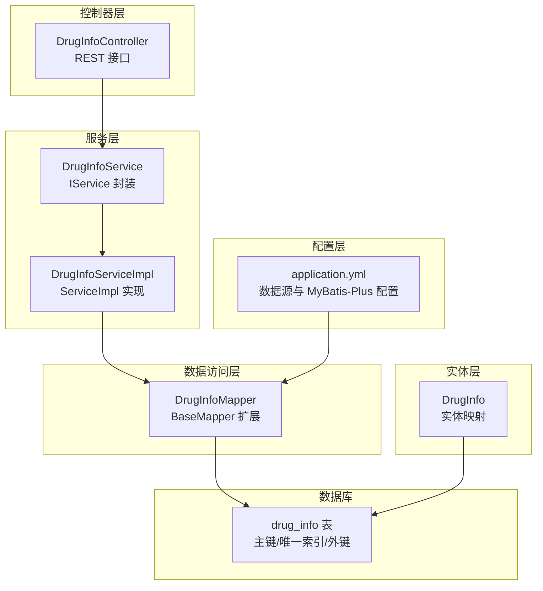
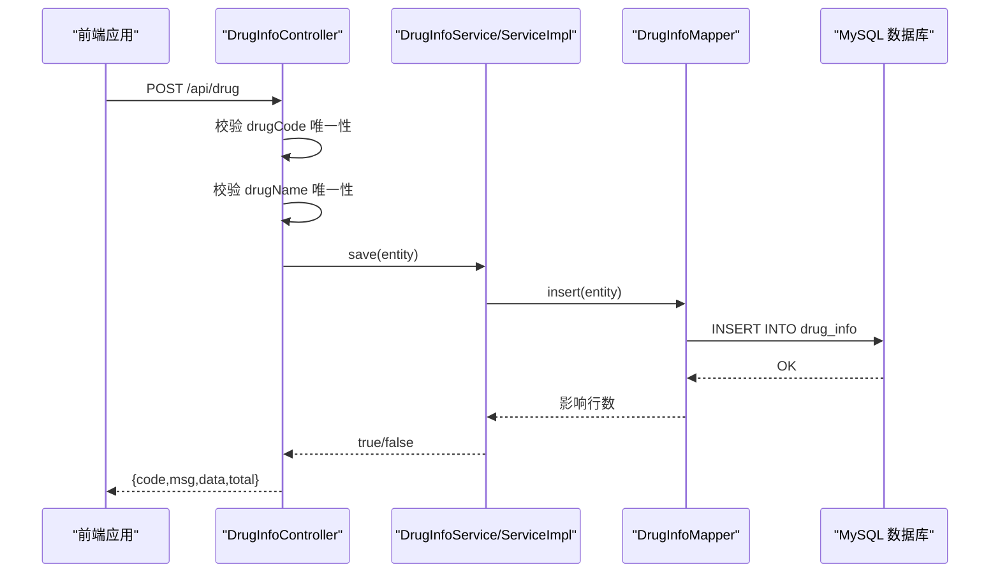
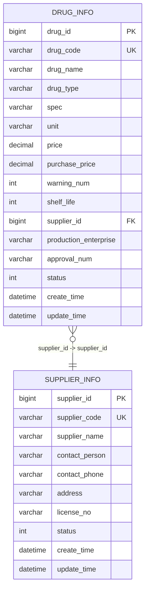
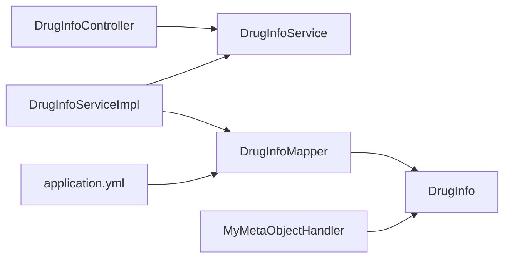

# 药品信息实体

<cite>
**本文引用的文件**
- [DrugInfo.java](file://src/main/java/com/hospital/drugmanagement/entity/DrugInfo.java)
- [DrugInfoMapper.java](file://src/main/java/com/hospital/drugmanagement/mapper/DrugInfoMapper.java)
- [DrugInfoService.java](file://src/main/java/com/hospital/drugmanagement/service/DrugInfoService.java)
- [DrugInfoServiceImpl.java](file://src/main/java/com/hospital/drugmanagement/service/impl/DrugInfoServiceImpl.java)
- [DrugInfoController.java](file://src/main/java/com/hospital/drugmanagement/controller/DrugInfoController.java)
- [application.yml](file://src/main/resources/application.yml)
- [hospital_drug.sql](file://hospital_drug.sql)
- [drug.js](file://drug-front/src/api/drug.js)
- [MyMetaObjectHandler.java](file://src/main/java/com/hospital/drugmanagement/common/handler/MyMetaObjectHandler.java)
- [AutoFill.java](file://src/main/java/com/hospital/drugmanagement/common/anno/AutoFill.java)
</cite>

## 目录
1. [简介](#简介)
2. [项目结构](#项目结构)
3. [核心组件](#核心组件)
4. [架构概览](#架构概览)
5. [详细组件分析](#详细组件分析)
6. [依赖分析](#依赖分析)
7. [性能考虑](#性能考虑)
8. [故障排查指南](#故障排查指南)
9. [结论](#结论)
10. [附录](#附录)

## 简介
本文件围绕药品信息实体（DrugInfo）进行系统化技术文档编写，覆盖实体字段设计、MyBatis-Plus 注解使用、业务约束与验证规则、与供应商实体的关联关系，以及完整的增删改查操作流程与最佳实践。文档同时提供面向开发与非技术读者的渐进式理解路径，并辅以可视化图示帮助快速把握系统架构与数据流。

## 项目结构
后端采用 Spring Boot + MyBatis-Plus 标准分层架构：
- 控制器层：处理 HTTP 请求，组装响应
- 服务层：封装业务逻辑，提供 CRUD 能力
- 数据访问层：基于 MyBatis-Plus Mapper 接口
- 实体层：映射数据库表结构
- 配置层：数据源、MyBatis-Plus、日志等配置

图表来源
- [DrugInfoController.java:1-169](file://src/main/java/com/hospital/drugmanagement/controller/DrugInfoController.java#L1-L169)
- [DrugInfoService.java:1-13](file://src/main/java/com/hospital/drugmanagement/service/DrugInfoService.java#L1-L13)
- [DrugInfoServiceImpl.java:1-18](file://src/main/java/com/hospital/drugmanagement/service/impl/DrugInfoServiceImpl.java#L1-L18)
- [DrugInfoMapper.java:1-9](file://src/main/java/com/hospital/drugmanagement/mapper/DrugInfoMapper.java#L1-L9)
- [application.yml:1-24](file://src/main/resources/application.yml#L1-L24)
- [hospital_drug.sql:62-85](file://hospital_drug.sql#L62-L85)

章节来源
- [application.yml:1-24](file://src/main/resources/application.yml#L1-L24)
- [hospital_drug.sql:62-85](file://hospital_drug.sql#L62-L85)

## 核心组件
- 实体类：DrugInfo 映射 drug_info 表，包含主键、唯一编码、名称、类型、规格、单位、价格、采购价格、库存预警、保质期、供应商关联、生产企业、批准文号、状态等字段。
- Mapper 接口：DrugInfoMapper 继承 MyBatis-Plus BaseMapper，自动获得 CRUD 能力。
- Service 接口与实现：DrugInfoService 继承 IService；ServiceImpl 复用 MyBatis-Plus 提供的基础能力。
- 控制器：DrugInfoController 提供分页查询、按条件过滤、新增、修改、删除等接口，并在新增/修改时执行唯一性校验。

章节来源
- [DrugInfo.java:1-167](file://src/main/java/com/hospital/drugmanagement/entity/DrugInfo.java#L1-L167)
- [DrugInfoMapper.java:1-9](file://src/main/java/com/hospital/drugmanagement/mapper/DrugInfoMapper.java#L1-L9)
- [DrugInfoService.java:1-13](file://src/main/java/com/hospital/drugmanagement/service/DrugInfoService.java#L1-L13)
- [DrugInfoServiceImpl.java:1-18](file://src/main/java/com/hospital/drugmanagement/service/impl/DrugInfoServiceImpl.java#L1-L18)
- [DrugInfoController.java:1-169](file://src/main/java/com/hospital/drugmanagement/controller/DrugInfoController.java#L1-L169)

## 架构概览
以下序列图展示“新增药品”请求从前端到数据库的完整调用链路，包括唯一性校验与异常处理。

图表来源
- [DrugInfoController.java:76-113](file://src/main/java/com/hospital/drugmanagement/controller/DrugInfoController.java#L76-L113)
- [DrugInfoService.java:10](file://src/main/java/com/hospital/drugmanagement/service/DrugInfoService.java#L10)
- [DrugInfoServiceImpl.java:14](file://src/main/java/com/hospital/drugmanagement/service/impl/DrugInfoServiceImpl.java#L14)
- [DrugInfoMapper.java:8](file://src/main/java/com/hospital/drugmanagement/mapper/DrugInfoMapper.java#L8)
- [hospital_drug.sql:62-85](file://hospital_drug.sql#L62-L85)

## 详细组件分析

### 实体类字段设计与业务语义
- 主键与标识
  - drug_id：自增主键，唯一标识每条药品记录。
- 编码与名称
  - drug_code：唯一编码，用于外部系统识别与集成，数据库建立唯一索引。
  - drug_name：药品通用名称，用于展示与检索。
- 类型与规格
  - drug_type：药品分类（如西药、中药、中成药、耗材），便于统计与管理。
  - spec：规格描述，如“100mg*10片/盒”。
  - unit：单位，如“盒”、“瓶”、“片”。
- 价格体系
  - price：销售单价，decimal(10,2)。
  - purchase_price：采购单价，decimal(10,2)。
- 库存与保质期
  - warning_num：库存预警阈值，默认值为 10。
  - shelf_life：保质期（月），用于库存到期提醒。
- 供应商与企业
  - supplier_id：供应商关联，作为外键指向供应商表。
  - production_enterprise：生产企业名称。
- 批准文号与状态
  - approval_num：批准文号，如“国药准字”编号。
  - status：状态（0 下架/1 上架），控制是否参与销售与出入库。
- 时间戳
  - create_time、update_time：由 MyBatis-Plus 元对象处理器自动填充。

章节来源
- [DrugInfo.java:9-51](file://src/main/java/com/hospital/drugmanagement/entity/DrugInfo.java#L9-L51)
- [hospital_drug.sql:65-84](file://hospital_drug.sql#L65-L84)
- [MyMetaObjectHandler.java:21-32](file://src/main/java/com/hospital/drugmanagement/common/handler/MyMetaObjectHandler.java#L21-L32)

### MyBatis-Plus 注解使用
- @TableName("drug_info")：指定实体映射的数据库表名。
- @TableId(value = "drug_id", type = IdType.AUTO)：主键映射与自增策略。
- @TableField("字段名")：非默认映射字段的显式映射。
- @Mapper：Mapper 接口启用 MyBatis 扫描。
- @Service：Service 实现类交由 Spring 管理。

章节来源
- [DrugInfo.java:9-51](file://src/main/java/com/hospital/drugmanagement/entity/DrugInfo.java#L9-L51)
- [DrugInfoMapper.java:7-8](file://src/main/java/com/hospital/drugmanagement/mapper/DrugInfoMapper.java#L7-L8)
- [DrugInfoServiceImpl.java:13-14](file://src/main/java/com/hospital/drugmanagement/service/impl/DrugInfoServiceImpl.java#L13-L14)

### 字段验证规则与业务约束
- 唯一性约束
  - drug_code：数据库唯一索引，控制器在新增/修改时均进行唯一性检查。
  - drug_name：数据库未声明唯一索引，但控制器在新增/修改时进行唯一性检查，避免重复名称。
- 数值范围与精度
  - price/purchase_price：decimal(10,2)，支持两位小数。
  - warning_num：整型，建议非负。
  - shelf_life：整型，建议非负。
- 状态枚举
  - status：0/1，0 表示下架，1 表示上架。
- 供应商关联
  - supplier_id：外键，需与供应商表存在对应记录。
- 时间戳
  - create_time、update_time：由元对象处理器自动填充，无需手动设置。

章节来源
- [hospital_drug.sql:82-84](file://hospital_drug.sql#L82-L84)
- [DrugInfoController.java:83-101](file://src/main/java/com/hospital/drugmanagement/controller/DrugInfoController.java#L83-L101)
- [DrugInfoController.java:119-139](file://src/main/java/com/hospital/drugmanagement/controller/DrugInfoController.java#L119-L139)
- [MyMetaObjectHandler.java:16-59](file://src/main/java/com/hospital/drugmanagement/common/handler/MyMetaObjectHandler.java#L16-L59)

### 与供应商实体的外键关联
- 关系说明
  - drug_info.supplier_id 引用 supplier_info.supplier_id。
  - 数据库建立了索引 idx_supplier_id，提升关联查询效率。
- 使用建议
  - 在新增/修改药品时，确保 supplier_id 存在于供应商表。
  - 可在业务层增加供应商存在性校验，避免脏数据。

章节来源
- [hospital_drug.sql:76-84](file://hospital_drug.sql#L76-L84)

### 增删改查操作示例与最佳实践
- 查询
  - 列表分页与多条件过滤：支持按药品名称、编码、类型过滤，分页返回。
  - 单条查询：根据主键获取详情。
- 新增
  - 清空 drug_id，让数据库自增生成主键。
  - 校验 drug_code 与 drug_name 唯一性，避免重复。
- 修改
  - 排除当前记录进行唯一性校验，避免自引用冲突。
  - 仅更新变更字段，保持幂等性。
- 删除
  - 根据主键删除，注意外键约束可能影响关联表数据。
- 最佳实践
  - 使用 IService/ServiceImpl 的内置方法，减少重复代码。
  - 对敏感字段（如价格）进行边界检查与格式化。
  - 在事务场景下批量操作时，合理拆分任务，避免长事务锁表。

章节来源
- [DrugInfoController.java:22-58](file://src/main/java/com/hospital/drugmanagement/controller/DrugInfoController.java#L22-L58)
- [DrugInfoController.java:60-74](file://src/main/java/com/hospital/drugmanagement/controller/DrugInfoController.java#L60-L74)
- [DrugInfoController.java:76-113](file://src/main/java/com/hospital/drugmanagement/controller/DrugInfoController.java#L76-L113)
- [DrugInfoController.java:115-151](file://src/main/java/com/hospital/drugmanagement/controller/DrugInfoController.java#L115-L151)
- [DrugInfoController.java:153-167](file://src/main/java/com/hospital/drugmanagement/controller/DrugInfoController.java#L153-L167)

### 数据模型与关系图

图表来源
- [hospital_drug.sql:62-85](file://hospital_drug.sql#L62-L85)
- [hospital_drug.sql:204-220](file://hospital_drug.sql#L204-L220)

## 依赖分析
- 控制器依赖服务接口，服务接口依赖 Mapper 接口，Mapper 接口依赖 MyBatis-Plus 基类。
- 实体类通过注解映射数据库表，配置文件启用 MyBatis-Plus 并开启下划线转驼峰。
- 元对象处理器为实体自动填充时间戳字段。

图表来源
- [DrugInfoController.java:19-20](file://src/main/java/com/hospital/drugmanagement/controller/DrugInfoController.java#L19-L20)
- [DrugInfoService.java:10](file://src/main/java/com/hospital/drugmanagement/service/DrugInfoService.java#L10)
- [DrugInfoServiceImpl.java:14](file://src/main/java/com/hospital/drugmanagement/service/impl/DrugInfoServiceImpl.java#L14)
- [DrugInfoMapper.java:8](file://src/main/java/com/hospital/drugmanagement/mapper/DrugInfoMapper.java#L8)
- [application.yml:18-24](file://src/main/resources/application.yml#L18-L24)
- [MyMetaObjectHandler.java:16-59](file://src/main/java/com/hospital/drugmanagement/common/handler/MyMetaObjectHandler.java#L16-L59)

章节来源
- [application.yml:18-24](file://src/main/resources/application.yml#L18-L24)
- [MyMetaObjectHandler.java:16-59](file://src/main/java/com/hospital/drugmanagement/common/handler/MyMetaObjectHandler.java#L16-L59)

## 性能考虑
- 查询优化
  - 使用分页 Page 对象限制结果集大小。
  - 对常用过滤字段（drug_name、drug_code、drug_type、supplier_id）建立索引，提升查询效率。
- 写入优化
  - 批量新增/修改时，尽量合并为一次事务提交，减少往返次数。
  - 避免在循环中逐条校验唯一性，可改为一次性批量校验。
- 缓存策略
  - 对只读且热点的数据（如供应商列表）可引入缓存，降低数据库压力。
- 日志与监控
  - 开启 SQL 日志有助于定位慢查询，结合数据库 EXPLAIN 分析执行计划。

## 故障排查指南
- 唯一性冲突
  - 现象：新增/修改返回“编码已存在”或“名称已存在”。
  - 处理：确认输入值是否与现有记录重复；必要时允许模糊匹配或提示重复项。
- 外键约束错误
  - 现象：删除/修改供应商导致外键约束失败。
  - 处理：先清理或迁移关联药品，再执行变更。
- 时间戳未填充
  - 现象：create_time/update_time 为空或未更新。
  - 处理：确认元对象处理器已注册，且实体类字段标注了自动填充注解。
- 分页参数异常
  - 现象：分页查询结果异常或越界。
  - 处理：校验 page、size 参数范围，确保默认值合理。

章节来源
- [DrugInfoController.java:83-101](file://src/main/java/com/hospital/drugmanagement/controller/DrugInfoController.java#L83-L101)
- [DrugInfoController.java:119-139](file://src/main/java/com/hospital/drugmanagement/controller/DrugInfoController.java#L119-L139)
- [MyMetaObjectHandler.java:16-59](file://src/main/java/com/hospital/drugmanagement/common/handler/MyMetaObjectHandler.java#L16-L59)

## 结论
DrugInfo 实体通过清晰的字段设计与严格的业务约束，配合 MyBatis-Plus 的自动化能力，实现了高效、可靠的药品信息管理。结合本文提供的增删改查示例与最佳实践，可在保证数据一致性的前提下，快速扩展更多业务场景。

## 附录
- 前端 API 调用参考
  - 获取列表：GET /api/drug/list
  - 获取详情：GET /api/drug/{id}
  - 新增：POST /api/drug
  - 修改：PUT /api/drug
  - 删除：DELETE /api/drug/{id}

章节来源
- [drug.js:4-44](file://drug-front/src/api/drug.js#L4-L44)