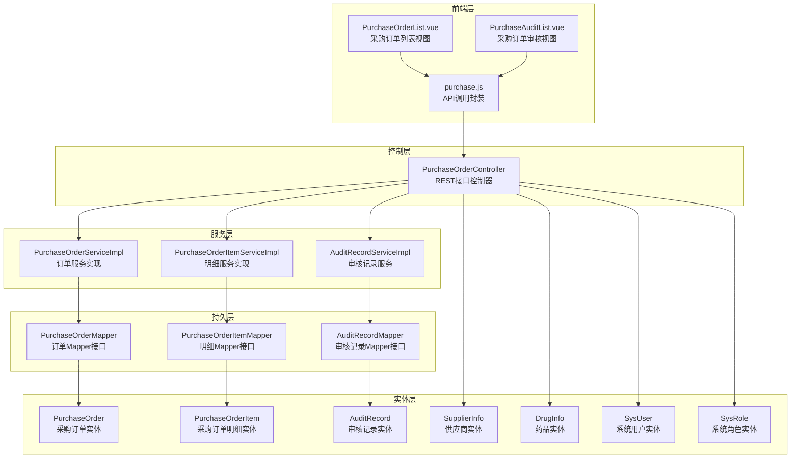
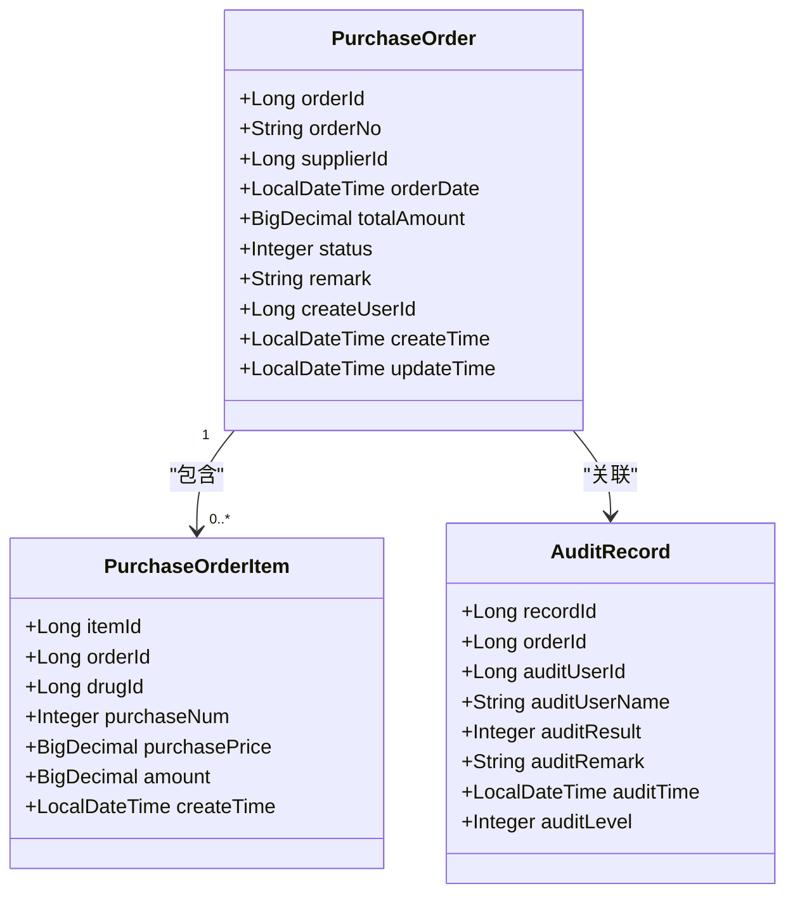
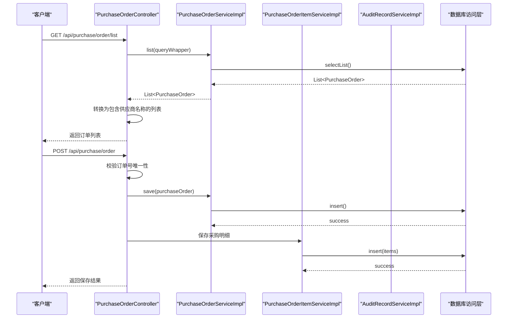
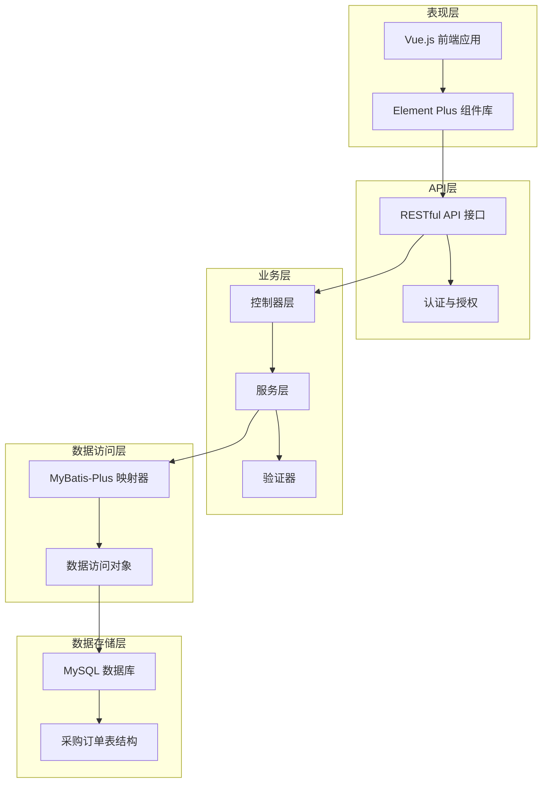
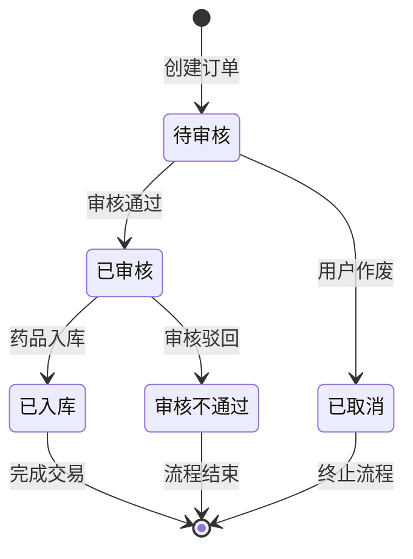
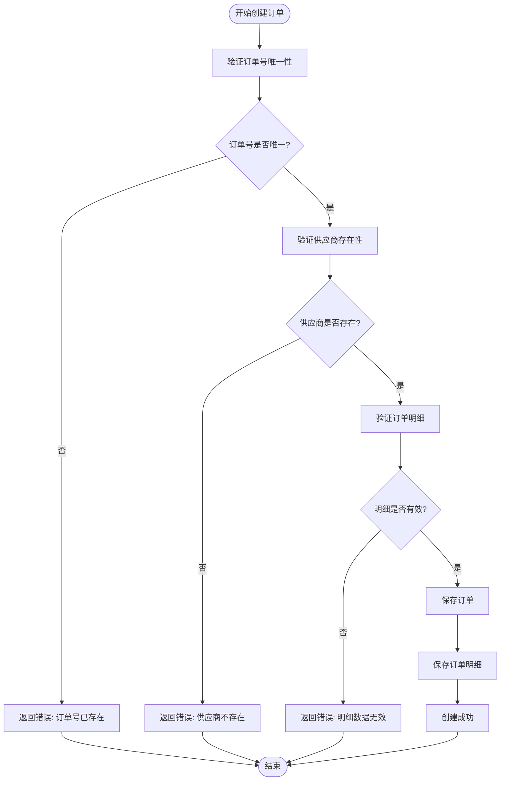
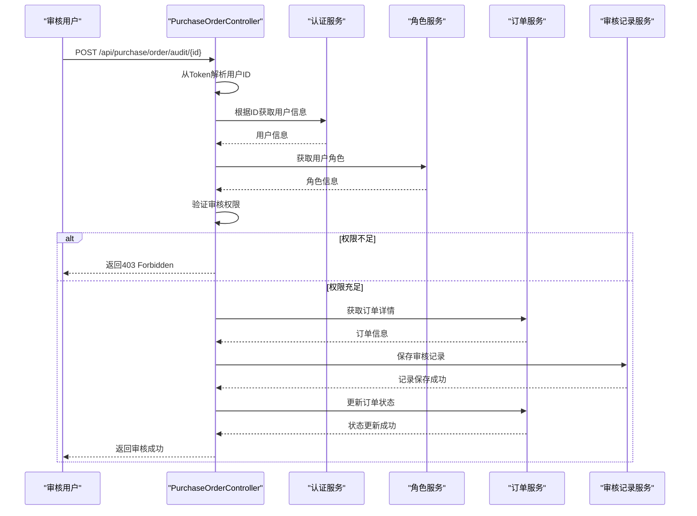
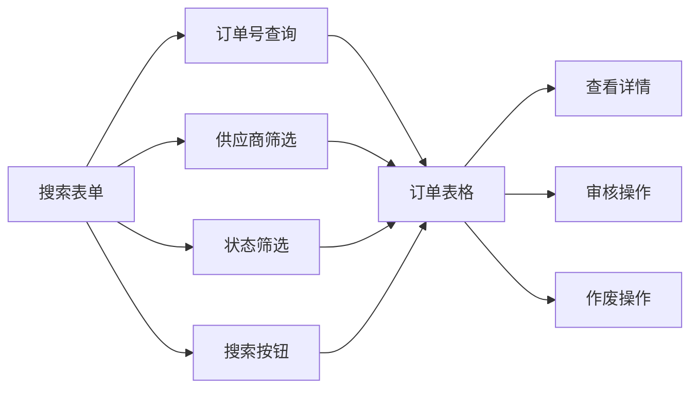
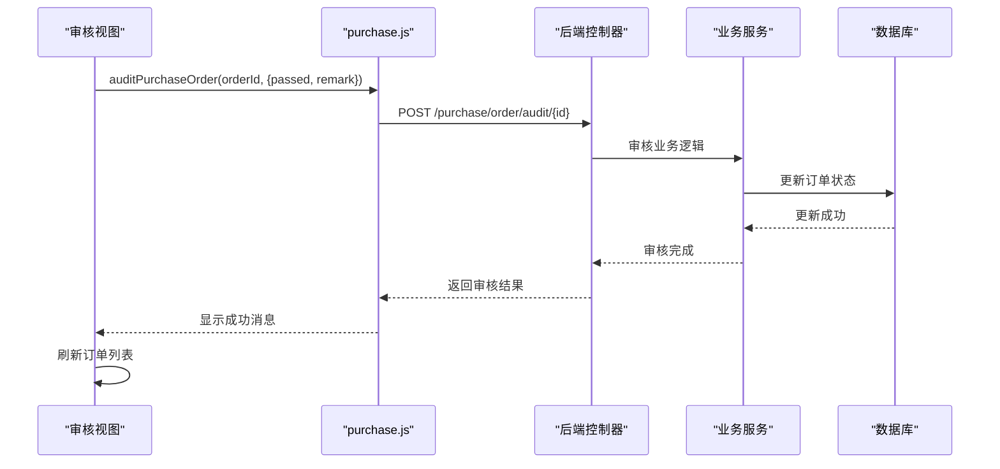
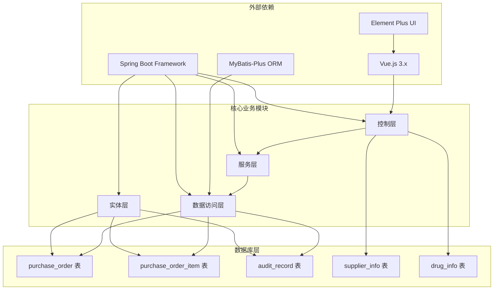

# 采购订单实体

<cite>
**本文档引用的文件**
- [PurchaseOrder.java](file://src/main/java/com/hospital/drugmanagement/entity/PurchaseOrder.java)
- [PurchaseOrderItem.java](file://src/main/java/com/hospital/drugmanagement/entity/PurchaseOrderItem.java)
- [PurchaseOrderController.java](file://src/main/java/com/hospital/drugmanagement/controller/PurchaseOrderController.java)
- [PurchaseOrderMapper.java](file://src/main/java/com/hospital/drugmanagement/mapper/PurchaseOrderMapper.java)
- [PurchaseOrderItemMapper.java](file://src/main/java/com/hospital/drugmanagement/mapper/PurchaseOrderItemMapper.java)
- [PurchaseOrderServiceImpl.java](file://src/main/java/com/hospital/drugmanagement/service/impl/PurchaseOrderServiceImpl.java)
- [PurchaseOrderItemServiceImpl.java](file://src/main/java/com/hospital/drugmanagement/service/impl/PurchaseOrderItemServiceImpl.java)
- [IPurchaseOrderService.java](file://src/main/java/com/hospital/drugmanagement/service/IPurchaseOrderService.java)
- [IPurchaseOrderItemService.java](file://src/main/java/com/hospital/drugmanagement/service/IPurchaseOrderItemService.java)
- [AuditRecord.java](file://src/main/java/com/hospital/drugmanagement/entity/AuditRecord.java)
- [SysUser.java](file://src/main/java/com/hospital/drugmanagement/entity/SysUser.java)
- [SysRole.java](file://src/main/java/com/hospital/drugmanagement/entity/SysRole.java)
- [init.sql](file://src/main/resources/db/init.sql)
- [PurchaseOrderList.vue](file://drug-front/src/views/purchase/PurchaseOrderList.vue)
- [PurchaseAuditList.vue](file://drug-front/src/views/purchase/PurchaseAuditList.vue)
- [purchase.js](file://drug-front/src/api/purchase.js)
</cite>

## 目录
1. [简介](#简介)
2. [项目结构](#项目结构)
3. [核心组件](#核心组件)
4. [架构概览](#架构概览)
5. [详细组件分析](#详细组件分析)
6. [依赖关系分析](#依赖关系分析)
7. [性能考虑](#性能考虑)
8. [故障排除指南](#故障排除指南)
9. [结论](#结论)

## 箱体](#简介)
本文件深入分析采购订单实体的设计与实现，涵盖采购订单(PurchaseOrder)与采购订单明细(PurchaseOrderItem)两个核心实体。文档详细解释关键字段的业务含义、实体间的关系、订单生命周期管理、状态流转机制、与供应商及药品实体的关联关系，以及订单审核流程的业务逻辑。

## 项目结构
采购订单相关代码采用典型的分层架构设计，包括实体层、控制层、服务层、持久层以及前端展示层：

**图表来源**
- [PurchaseOrderController.java:1-396](file://src/main/java/com/hospital/drugmanagement/controller/PurchaseOrderController.java#L1-L396)
- [PurchaseOrderServiceImpl.java:1-11](file://src/main/java/com/hospital/drugmanagement/service/impl/PurchaseOrderServiceImpl.java#L1-L11)
- [PurchaseOrderItemServiceImpl.java:1-11](file://src/main/java/com/hospital/drugmanagement/service/impl/PurchaseOrderItemServiceImpl.java#L1-L11)

**章节来源**
- [PurchaseOrderController.java:1-396](file://src/main/java/com/hospital/drugmanagement/controller/PurchaseOrderController.java#L1-L396)
- [PurchaseOrder.java:1-40](file://src/main/java/com/hospital/drugmanagement/entity/PurchaseOrder.java#L1-L40)
- [PurchaseOrderItem.java:1-35](file://src/main/java/com/hospital/drugmanagement/entity/PurchaseOrderItem.java#L1-L35)

## 核心组件
本节详细分析采购订单相关的核心组件及其职责分工。

### 实体层组件
实体层采用MyBatis-Plus注解进行ORM映射，提供标准的JPA风格的实体定义：

**图表来源**
- [PurchaseOrder.java:15-40](file://src/main/java/com/hospital/drugmanagement/entity/PurchaseOrder.java#L15-L40)
- [PurchaseOrderItem.java:16-35](file://src/main/java/com/hospital/drugmanagement/entity/PurchaseOrderItem.java#L16-L35)
- [AuditRecord.java:14-35](file://src/main/java/com/hospital/drugmanagement/entity/AuditRecord.java#L14-L35)

### 控制层组件
控制层提供RESTful API接口，处理采购订单的完整生命周期管理：

**图表来源**
- [PurchaseOrderController.java:52-109](file://src/main/java/com/hospital/drugmanagement/controller/PurchaseOrderController.java#L52-L109)
- [PurchaseOrderController.java:181-233](file://src/main/java/com/hospital/drugmanagement/controller/PurchaseOrderController.java#L181-L233)

**章节来源**
- [PurchaseOrderController.java:1-396](file://src/main/java/com/hospital/drugmanagement/controller/PurchaseOrderController.java#L1-L396)

## 架构概览
采购订单系统采用分层架构，确保关注点分离和可维护性：

**图表来源**
- [PurchaseOrderList.vue:1-650](file://drug-front/src/views/purchase/PurchaseOrderList.vue#L1-L650)
- [PurchaseAuditList.vue:1-341](file://drug-front/src/views/purchase/PurchaseAuditList.vue#L1-L341)
- [purchase.js:1-63](file://drug-front/src/api/purchase.js#L1-L63)

## 详细组件分析

### 采购订单实体分析
采购订单实体是整个采购管理的核心，承载着订单的基本信息和状态管理。

#### 关键字段业务含义
| 字段名 | 类型 | 业务含义 | 数据库约束 | 默认值 |
|--------|------|----------|------------|--------|
| orderId | Long | 采购单ID（主键） | PRIMARY KEY AUTO_INCREMENT | 系统自增 |
| orderNo | String | 采购单号（唯一） | UNIQUE NOT NULL | 用户输入 |
| supplierId | Long | 关联供应商ID | FOREIGN KEY | 外键关联 |
| orderDate | LocalDateTime | 订单日期 | DATETIME | 订单创建时间 |
| totalAmount | BigDecimal | 订单总金额 | DECIMAL(12,2) | 计算得出 |
| status | Integer | 订单状态 | INT DEFAULT 0 | 0:待审核 |
| remark | String | 备注信息 | VARCHAR(500) | 空字符串 |
| createUserId | Long | 创建人ID | BIGINT | 系统用户ID |
| createTime | LocalDateTime | 创建时间 | DATETIME DEFAULT CURRENT_TIMESTAMP | 系统时间 |
| updateTime | LocalDateTime | 更新时间 | DATETIME DEFAULT CURRENT_TIMESTAMP ON UPDATE CURRENT_TIMESTAMP | 系统时间 |

#### 状态流转机制
采购订单的状态流转遵循严格的业务规则：

**图表来源**
- [PurchaseOrder.java:29](file://src/main/java/com/hospital/drugmanagement/entity/PurchaseOrder.java#L29)
- [PurchaseOrderController.java:327-358](file://src/main/java/com/hospital/drugmanagement/controller/PurchaseOrderController.java#L327-L358)

#### 业务规则验证
系统在创建和更新订单时执行严格的数据验证：

**图表来源**
- [PurchaseOrderController.java:185-233](file://src/main/java/com/hospital/drugmanagement/controller/PurchaseOrderController.java#L185-L233)

**章节来源**
- [PurchaseOrder.java:18-40](file://src/main/java/com/hospital/drugmanagement/entity/PurchaseOrder.java#L18-L40)
- [init.sql:127-141](file://src/main/resources/db/init.sql#L127-L141)

### 采购订单明细实体分析
采购订单明细实体负责存储订单中的具体商品信息。

#### 明细字段设计
| 字段名 | 类型 | 业务含义 | 数据库约束 | 默认值 |
|--------|------|----------|------------|--------|
| itemId | Long | 明细ID（主键） | PRIMARY KEY AUTO_INCREMENT | 系统自增 |
| orderId | Long | 关联采购单ID | NOT NULL | 外键关联 |
| drugId | Long | 关联药品ID | NOT NULL | 外键关联 |
| purchaseNum | Integer | 采购数量 | INT NOT NULL | 用户输入 |
| purchasePrice | BigDecimal | 采购单价 | DECIMAL(10,2) NOT NULL | 药品采购价 |
| amount | BigDecimal | 小计金额 | DECIMAL(12,2) NOT NULL | 数量×单价 |
| createTime | LocalDateTime | 创建时间 | DATETIME DEFAULT CURRENT_TIMESTAMP | 系统时间 |

#### 计算逻辑
明细金额的计算遵循精确的数学运算规则：
- 小计金额 = 采购数量 × 采购单价
- 订单总金额 = 所有明细小计金额之和
- 使用BigDecimal确保财务计算精度

**章节来源**
- [PurchaseOrderItem.java:19-35](file://src/main/java/com/hospital/drugmanagement/entity/PurchaseOrderItem.java#L19-L35)
- [init.sql:143-155](file://src/main/resources/db/init.sql#L143-L155)

### 审核流程业务逻辑
系统实现了完善的订单审核机制，确保采购流程的合规性。

#### 审核权限控制

**图表来源**
- [PurchaseOrderController.java:278-364](file://src/main/java/com/hospital/drugmanagement/controller/PurchaseOrderController.java#L278-L364)

#### 审核记录管理
审核记录实体记录了每次审核的详细信息：

| 字段名 | 类型 | 业务含义 | 数据库约束 |
|--------|------|----------|------------|
| recordId | Long | 审核记录ID | PRIMARY KEY AUTO_INCREMENT |
| orderId | Long | 关联采购单ID | NOT NULL |
| auditUserId | Long | 审核人ID | BIGINT |
| auditUserName | String | 审核人姓名 | VARCHAR(50) |
| auditResult | Integer | 审核结果 | INT (1:通过/2:驳回) |
| auditRemark | String | 审核意见 | VARCHAR(500) |
| auditTime | LocalDateTime | 审核时间 | DATETIME DEFAULT CURRENT_TIMESTAMP |
| auditLevel | Integer | 审核级别 | INT (1:一级/2:二级/3:三级) |

**章节来源**
- [AuditRecord.java:17-34](file://src/main/java/com/hospital/drugmanagement/entity/AuditRecord.java#L17-L34)
- [PurchaseOrderController.java:325-358](file://src/main/java/com/hospital/drugmanagement/controller/PurchaseOrderController.java#L325-L358)

### 前端集成与用户体验
前端采用Vue.js + Element Plus构建，提供了完整的采购订单管理界面。

#### 列表页面功能
列表页面支持多维度查询和状态筛选：

**图表来源**
- [PurchaseOrderList.vue:4-38](file://drug-front/src/views/purchase/PurchaseOrderList.vue#L4-L38)
- [PurchaseOrderList.vue:48-94](file://drug-front/src/views/purchase/PurchaseOrderList.vue#L48-L94)

#### 审核流程前端实现
前端通过API封装简化了后端交互：

**图表来源**
- [purchase.js:46-53](file://drug-front/src/api/purchase.js#L46-L53)
- [PurchaseAuditList.vue:297-315](file://drug-front/src/views/purchase/PurchaseAuditList.vue#L297-L315)

**章节来源**
- [PurchaseOrderList.vue:1-650](file://drug-front/src/views/purchase/PurchaseOrderList.vue#L1-L650)
- [PurchaseAuditList.vue:1-341](file://drug-front/src/views/purchase/PurchaseAuditList.vue#L1-L341)
- [purchase.js:1-63](file://drug-front/src/api/purchase.js#L1-L63)

## 依赖关系分析
系统采用清晰的依赖层次结构，确保模块间的松耦合和高内聚。

**图表来源**
- [PurchaseOrderController.java:17-50](file://src/main/java/com/hospital/drugmanagement/controller/PurchaseOrderController.java#L17-L50)
- [PurchaseOrderServiceImpl.java:3-10](file://src/main/java/com/hospital/drugmanagement/service/impl/PurchaseOrderServiceImpl.java#L3-L10)
- [PurchaseOrderItemServiceImpl.java:3-10](file://src/main/java/com/hospital/drugmanagement/service/impl/PurchaseOrderItemServiceImpl.java#L3-L10)

**章节来源**
- [PurchaseOrderController.java:1-396](file://src/main/java/com/hospital/drugmanagement/controller/PurchaseOrderController.java#L1-L396)
- [PurchaseOrderServiceImpl.java:1-11](file://src/main/java/com/hospital/drugmanagement/service/impl/PurchaseOrderServiceImpl.java#L1-L11)
- [PurchaseOrderItemServiceImpl.java:1-11](file://src/main/java/com/hospital/drugmanagement/service/impl/PurchaseOrderItemServiceImpl.java#L1-L11)

## 性能考虑
系统在设计时充分考虑了性能优化和扩展性需求：

### 数据库优化策略
1. **索引设计**：为常用查询字段建立索引，包括供应商ID、订单号、药品ID等
2. **查询优化**：使用LambdaQueryWrapper进行条件查询，避免N+1查询问题
3. **批量操作**：支持批量插入和更新操作，减少数据库往返次数

### 缓存策略
1. **静态数据缓存**：供应商信息、药品信息等静态数据可缓存到内存中
2. **会话缓存**：用户权限信息可在会话层面缓存
3. **查询结果缓存**：对于频繁查询但不经常变动的数据可考虑缓存

### 并发控制
1. **乐观锁**：在更新操作中使用版本号控制并发修改
2. **事务管理**：确保订单创建和明细保存的原子性
3. **线程安全**：服务层方法设计为无状态，避免线程安全问题

## 故障排除指南
常见问题及解决方案：

### 订单创建失败
**问题症状**：创建订单时返回"订单号已存在"
**可能原因**：
1. 订单号重复
2. 数据库唯一约束冲突
3. 并发创建导致的竞争条件

**解决步骤**：
1. 检查订单号是否唯一
2. 清理数据库重复数据
3. 实现幂等性设计

### 审核权限错误
**问题症状**：审核接口返回"没有审核权限"
**可能原因**：
1. 用户角色不是ADMIN或AUDITOR
2. Token解析失败
3. 用户信息获取异常

**解决步骤**：
1. 验证用户角色配置
2. 检查Token格式和有效性
3. 确认用户状态正常

### 数据一致性问题
**问题症状**：订单状态与实际业务不符
**可能原因**：
1. 并发更新导致的状态冲突
2. 事务边界设置不当
3. 异步操作未正确同步

**解决步骤**：
1. 检查事务配置
2. 实现状态检查和重试机制
3. 添加审计日志追踪

**章节来源**
- [PurchaseOrderController.java:185-194](file://src/main/java/com/hospital/drugmanagement/controller/PurchaseOrderController.java#L185-L194)
- [PurchaseOrderController.java:307-323](file://src/main/java/com/hospital/drugmanagement/controller/PurchaseOrderController.java#L307-L323)
- [PurchaseOrderController.java:366-394](file://src/main/java/com/hospital/drugmanagement/controller/PurchaseOrderController.java#L366-L394)

## 结论
采购订单实体系统设计合理，实现了完整的采购管理生命周期。通过清晰的分层架构、严格的业务规则验证、完善的审核机制和友好的用户界面，系统能够满足医院药品采购管理的实际需求。

系统的主要优势包括：
1. **业务完整性**：覆盖从创建到完成的完整业务流程
2. **数据一致性**：通过事务管理和状态控制确保数据准确
3. **权限控制**：基于角色的访问控制确保系统安全
4. **用户体验**：直观的界面设计和流畅的操作体验
5. **扩展性**：模块化设计便于功能扩展和维护

建议后续改进方向：
1. 增强异常处理和错误恢复机制
2. 添加更多的业务监控和审计功能
3. 优化大数据量下的查询性能
4. 实现更灵活的审批流程配置