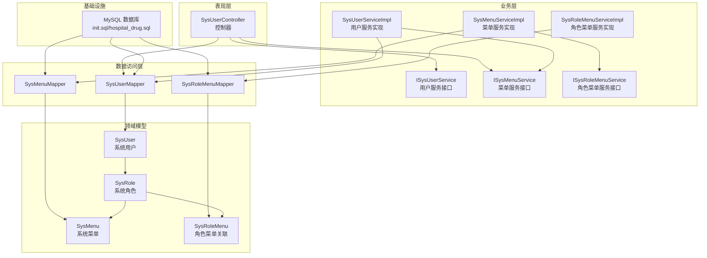
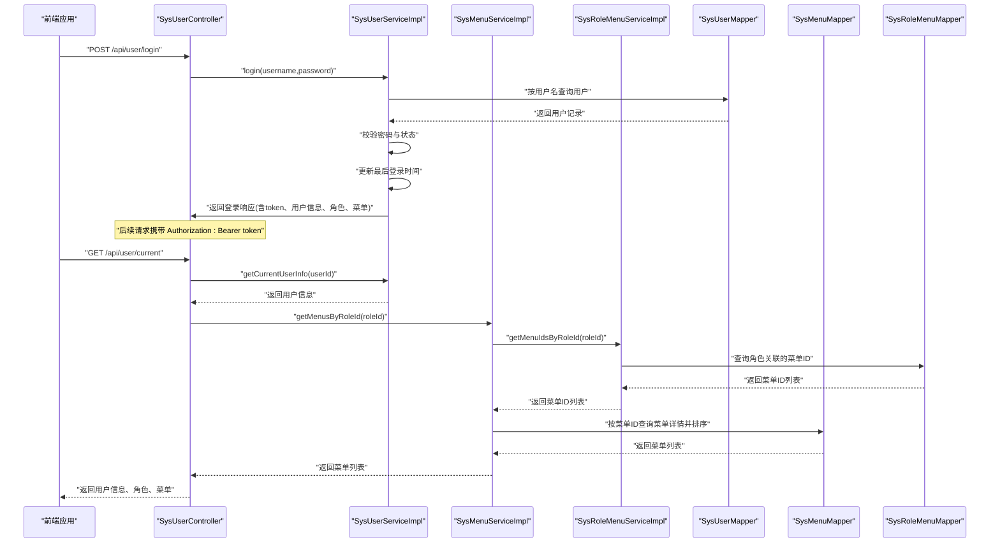
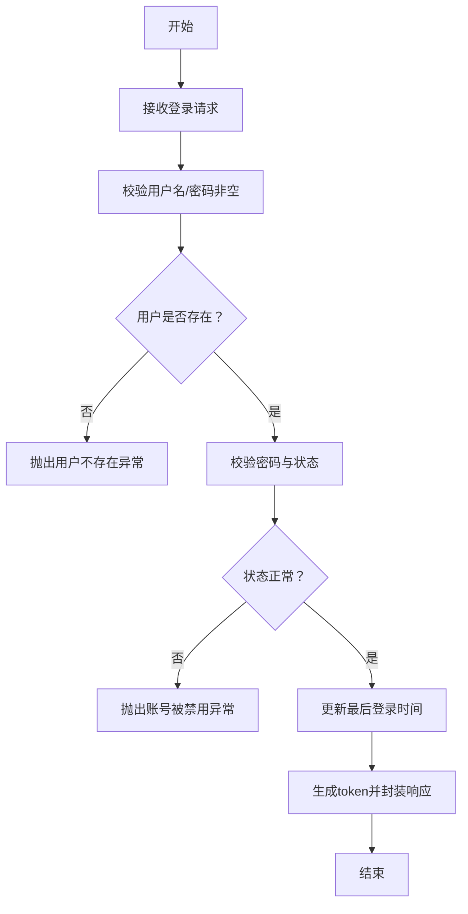
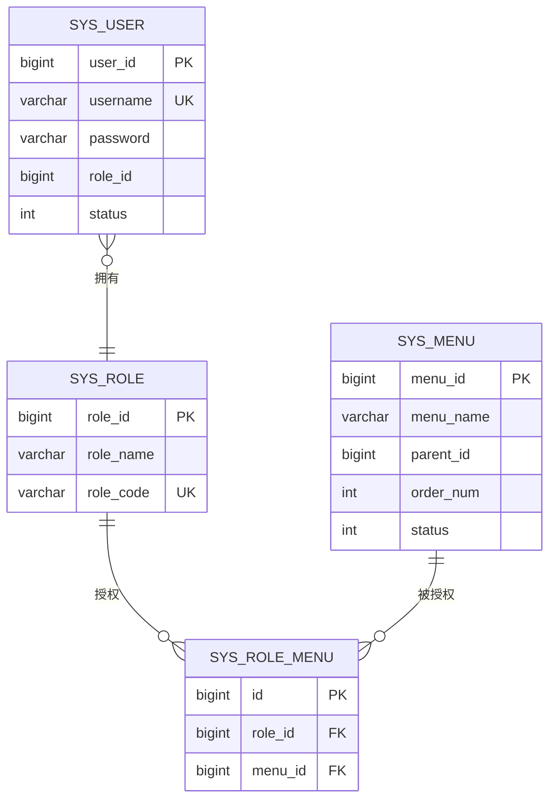
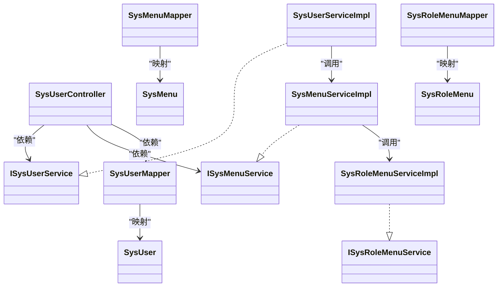

# 系统安全实体

<cite>
**本文引用的文件**
- [SysUser.java](file://src/main/java/com/hospital/drugmanagement/entity/SysUser.java)
- [SysRole.java](file://src/main/java/com/hospital/drugmanagement/entity/SysRole.java)
- [SysMenu.java](file://src/main/java/com/hospital/drugmanagement/entity/SysMenu.java)
- [SysRoleMenu.java](file://src/main/java/com/hospital/drugmanagement/entity/SysRoleMenu.java)
- [SysUserMapper.java](file://src/main/java/com/hospital/drugmanagement/mapper/SysUserMapper.java)
- [SysRoleMapper.java](file://src/main/java/com/hospital/drugmanagement/mapper/SysRoleMapper.java)
- [SysMenuMapper.java](file://src/main/java/com/hospital/drugmanagement/mapper/SysMenuMapper.java)
- [SysRoleMenuMapper.java](file://src/main/java/com/hospital/drugmanagement/mapper/SysRoleMenuMapper.java)
- [ISysUserService.java](file://src/main/java/com/hospital/drugmanagement/service/ISysUserService.java)
- [ISysRoleService.java](file://src/main/java/com/hospital/drugmanagement/service/ISysRoleService.java)
- [ISysMenuService.java](file://src/main/java/com/hospital/drugmanagement/service/ISysMenuService.java)
- [ISysRoleMenuService.java](file://src/main/java/com/hospital/drugmanagement/service/ISysRoleMenuService.java)
- [SysUserServiceImpl.java](file://src/main/java/com/hospital/drugmanagement/service/impl/SysUserServiceImpl.java)
- [SysRoleServiceImpl.java](file://src/main/java/com/hospital/drugmanagement/service/impl/SysRoleServiceImpl.java)
- [SysMenuServiceImpl.java](file://src/main/java/com/hospital/drugmanagement/service/impl/SysMenuServiceImpl.java)
- [SysRoleMenuServiceImpl.java](file://src/main/java/com/hospital/drugmanagement/service/impl/SysRoleMenuServiceImpl.java)
- [SysUserController.java](file://src/main/java/com/hospital/drugmanagement/controller/SysUserController.java)
- [LoginRequest.java](file://src/main/java/com/hospital/drugmanagement/dto/LoginRequest.java)
- [init.sql](file://src/main/resources/db/init.sql)
- [hospital_drug.sql](file://hospital_drug.sql)
</cite>

## 目录
1. [简介](#简介)
2. [项目结构](#项目结构)
3. [核心组件](#核心组件)
4. [架构总览](#架构总览)
5. [详细组件分析](#详细组件分析)
6. [依赖分析](#依赖分析)
7. [性能考虑](#性能考虑)
8. [故障排查指南](#故障排查指南)
9. [结论](#结论)
10. [附录](#附录)

## 简介
本设计文档围绕药物管理系统中的系统安全实体展开，重点阐述基于 RBAC（基于角色的访问控制）模型的权限体系，包括：
- 用户权限管理的数据模型设计与职责边界
- 用户认证机制与权限验证流程
- 权限树结构与角色权限矩阵
- 安全配置与审计要点

目标是帮助开发者与运维人员快速理解并正确扩展权限体系。

## 项目结构
本项目采用典型的分层架构：实体层（Entity）、映射层（Mapper）、服务层（Service）、控制器层（Controller），配合数据库初始化脚本完成基础数据与权限初始配置。

图表来源
- [SysUserController.java:1-421](file://src/main/java/com/hospital/drugmanagement/controller/SysUserController.java#L1-L421)
- [SysUserServiceImpl.java:1-127](file://src/main/java/com/hospital/drugmanagement/service/impl/SysUserServiceImpl.java#L1-L127)
- [SysMenuServiceImpl.java:1-59](file://src/main/java/com/hospital/drugmanagement/service/impl/SysMenuServiceImpl.java#L1-L59)
- [SysRoleMenuServiceImpl.java:1-52](file://src/main/java/com/hospital/drugmanagement/service/impl/SysRoleMenuServiceImpl.java#L1-L52)
- [SysUserMapper.java:1-7](file://src/main/java/com/hospital/drugmanagement/mapper/SysUserMapper.java#L1-L7)
- [SysMenuMapper.java:1-10](file://src/main/java/com/hospital/drugmanagement/mapper/SysMenuMapper.java#L1-L10)
- [SysRoleMenuMapper.java:1-10](file://src/main/java/com/hospital/drugmanagement/mapper/SysRoleMenuMapper.java#L1-L10)
- [SysUser.java:1-130](file://src/main/java/com/hospital/drugmanagement/entity/SysUser.java#L1-L130)
- [SysRole.java:1-80](file://src/main/java/com/hospital/drugmanagement/entity/SysRole.java#L1-L80)
- [SysMenu.java:1-95](file://src/main/java/com/hospital/drugmanagement/entity/SysMenu.java#L1-L95)
- [SysRoleMenu.java:1-45](file://src/main/java/com/hospital/drugmanagement/entity/SysRoleMenu.java#L1-L45)
- [init.sql:1-312](file://src/main/resources/db/init.sql#L1-L312)

章节来源
- [SysUserController.java:1-421](file://src/main/java/com/hospital/drugmanagement/controller/SysUserController.java#L1-L421)
- [SysUserServiceImpl.java:1-127](file://src/main/java/com/hospital/drugmanagement/service/impl/SysUserServiceImpl.java#L1-L127)
- [SysMenuServiceImpl.java:1-59](file://src/main/java/com/hospital/drugmanagement/service/impl/SysMenuServiceImpl.java#L1-L59)
- [SysRoleMenuServiceImpl.java:1-52](file://src/main/java/com/hospital/drugmanagement/service/impl/SysRoleMenuServiceImpl.java#L1-L52)
- [init.sql:1-312](file://src/main/resources/db/init.sql#L1-L312)

## 核心组件
本节聚焦四大核心实体及其职责：
- 系统用户（SysUser）：承载用户身份、密码、状态、角色关联等信息，负责认证入口与会话上下文构建
- 系统角色（SysRole）：定义角色名称、编码与描述，作为权限集合的抽象载体
- 系统菜单（SysMenu）：定义菜单结构（父子关系、路由、组件、图标、排序、状态），作为权限控制的最小单元
- 角色菜单关联（SysRoleMenu）：建立角色与菜单的多对多关系，形成可动态配置的权限矩阵

章节来源
- [SysUser.java:1-130](file://src/main/java/com/hospital/drugmanagement/entity/SysUser.java#L1-L130)
- [SysRole.java:1-80](file://src/main/java/com/hospital/drugmanagement/entity/SysRole.java#L1-L80)
- [SysMenu.java:1-95](file://src/main/java/com/hospital/drugmanagement/entity/SysMenu.java#L1-L95)
- [SysRoleMenu.java:1-45](file://src/main/java/com/hospital/drugmanagement/entity/SysRoleMenu.java#L1-L45)

## 架构总览
下图展示从用户登录到权限验证的关键交互流程，体现 RBAC 的“用户-角色-权限”链路与“角色-菜单”的授权矩阵。

图表来源
- [SysUserController.java:43-147](file://src/main/java/com/hospital/drugmanagement/controller/SysUserController.java#L43-L147)
- [SysUserServiceImpl.java:42-102](file://src/main/java/com/hospital/drugmanagement/service/impl/SysUserServiceImpl.java#L42-L102)
- [SysMenuServiceImpl.java:40-58](file://src/main/java/com/hospital/drugmanagement/service/impl/SysMenuServiceImpl.java#L40-L58)
- [SysRoleMenuServiceImpl.java:19-51](file://src/main/java/com/hospital/drugmanagement/service/impl/SysRoleMenuServiceImpl.java#L19-L51)
- [SysUserMapper.java:1-7](file://src/main/java/com/hospital/drugmanagement/mapper/SysUserMapper.java#L1-L7)
- [SysMenuMapper.java:1-10](file://src/main/java/com/hospital/drugmanagement/mapper/SysMenuMapper.java#L1-L10)
- [SysRoleMenuMapper.java:1-10](file://src/main/java/com/hospital/drugmanagement/mapper/SysRoleMenuMapper.java#L1-L10)

## 详细组件分析

### 系统用户（SysUser）实体
- 身份字段：用户ID、登录账号、真实姓名、手机号、邮箱
- 安全字段：密码、状态（启用/禁用）、最后登录时间
- 关联字段：角色ID（单角色关联）
- 元数据：创建/更新时间，自动填充

设计要点
- 单角色约束简化了权限计算复杂度，适合中小型系统
- 密码字段支持明文与加密两种形态（兼容历史数据），但建议统一走加密策略
- 状态字段用于快速禁用用户，保障安全

章节来源
- [SysUser.java:14-41](file://src/main/java/com/hospital/drugmanagement/entity/SysUser.java#L14-L41)
- [SysUser.java:17-22](file://src/main/java/com/hospital/drugmanagement/entity/SysUser.java#L17-L22)
- [SysUser.java:36-40](file://src/main/java/com/hospital/drugmanagement/entity/SysUser.java#L36-L40)

### 系统角色（SysRole）实体
- 角色标识：角色ID、角色名称、角色编码（唯一性约束）
- 描述与元数据：描述、创建/更新时间

设计要点
- 角色编码唯一，便于程序化识别与权限判定
- 角色描述用于界面展示与审计追踪

章节来源
- [SysRole.java:17-31](file://src/main/java/com/hospital/drugmanagement/entity/SysRole.java#L17-L31)
- [SysRole.java:49-55](file://src/main/java/com/hospital/drugmanagement/entity/SysRole.java#L49-L55)

### 系统菜单（SysMenu）实体
- 结构字段：菜单ID、菜单名称、父菜单ID、排序字段（优先使用 order_num，降级至 sort）
- 行为字段：路由路径、组件路径、图标、状态（启用/禁用）

设计要点
- 支持父子层级的菜单树结构
- 排序字段具备容错逻辑，兼容不同版本数据库结构差异
- 菜单状态用于快速启用/禁用某项功能

章节来源
- [SysMenu.java:14-31](file://src/main/java/com/hospital/drugmanagement/entity/SysMenu.java#L14-L31)
- [SysMenu.java:72-86](file://src/main/java/com/hospital/drugmanagement/entity/SysMenu.java#L72-L86)
- [SysMenuServiceImpl.java:27-36](file://src/main/java/com/hospital/drugmanagement/service/impl/SysMenuServiceImpl.java#L27-L36)

### 角色菜单关联（SysRoleMenu）实体
- 关联字段：角色ID、菜单ID
- 唯一键：角色ID与菜单ID的组合唯一，防止重复授权

设计要点
- 多对多关系的最小表达，支撑灵活的权限矩阵
- 唯一索引保证授权一致性

章节来源
- [SysRoleMenu.java:14-20](file://src/main/java/com/hospital/drugmanagement/entity/SysRoleMenu.java#L14-L20)
- [SysRoleMenu.java:50-58](file://src/main/java/com/hospital/drugmanagement/entity/SysRoleMenu.java#L50-L58)
- [init.sql:57](file://src/main/resources/db/init.sql#L57)

### 用户认证与权限验证流程
- 登录流程
  - 控制器接收用户名与密码，调用用户服务进行认证
  - 服务层校验参数、查询用户、验证密码与状态、更新最后登录时间
  - 返回包含 token、用户信息、角色列表与菜单列表的响应
- 当前用户信息
  - 从 Authorization 头解析 token 提取用户ID
  - 查询用户信息、角色与菜单列表
- 权限验证
  - 前端根据菜单列表渲染导航与页面
  - 后端在业务接口处结合菜单与业务规则进行二次校验（建议在拦截器或切面中实现）

图表来源
- [SysUserController.java:43-68](file://src/main/java/com/hospital/drugmanagement/controller/SysUserController.java#L43-L68)
- [SysUserServiceImpl.java:42-102](file://src/main/java/com/hospital/drugmanagement/service/impl/SysUserServiceImpl.java#L42-L102)

章节来源
- [SysUserController.java:43-147](file://src/main/java/com/hospital/drugmanagement/controller/SysUserController.java#L43-L147)
- [SysUserServiceImpl.java:42-102](file://src/main/java/com/hospital/drugmanagement/service/impl/SysUserServiceImpl.java#L42-L102)

### 权限树结构与角色权限矩阵
- 权限树结构
  - 菜单通过 parent_id 形成层级树，支持多级导航
  - 排序字段优先使用 order_num，若不存在则回退到 sort
- 角色权限矩阵
  - 通过 SysRoleMenu 将角色与菜单建立多对多关系
  - 分配菜单时先清理旧关联，再批量写入新关联，确保一致性

图表来源
- [SysUser.java:17-22](file://src/main/java/com/hospital/drugmanagement/entity/SysUser.java#L17-L22)
- [SysRole.java:17-22](file://src/main/java/com/hospital/drugmanagement/entity/SysRole.java#L17-L22)
- [SysMenu.java:14-29](file://src/main/java/com/hospital/drugmanagement/entity/SysMenu.java#L14-L29)
- [SysRoleMenu.java:14-19](file://src/main/java/com/hospital/drugmanagement/entity/SysRoleMenu.java#L14-L19)
- [init.sql:8-58](file://src/main/resources/db/init.sql#L8-L58)

章节来源
- [SysMenuServiceImpl.java:24-58](file://src/main/java/com/hospital/drugmanagement/service/impl/SysMenuServiceImpl.java#L24-L58)
- [SysRoleMenuServiceImpl.java:28-51](file://src/main/java/com/hospital/drugmanagement/service/impl/SysRoleMenuServiceImpl.java#L28-L51)
- [init.sql:240-286](file://src/main/resources/db/init.sql#L240-L286)

### 安全配置说明
- 密码安全
  - 登录与新增/修改用户时均使用固定盐值进行 MD5 加密
  - 建议在生产环境改为更安全的密码哈希算法（如 bcrypt、scrypt）并引入随机盐
- Token 安全
  - 当前 token 为简单拼接字符串，建议替换为 JWT 并设置签名与过期时间
- 访问控制
  - 建议在网关或过滤器中实现基于菜单的鉴权拦截，结合业务方法级注解细化权限
- 审计设计
  - 可复用现有审计记录表结构，扩展登录、菜单访问、敏感操作的审计字段

章节来源
- [SysUserServiceImpl.java:38-76](file://src/main/java/com/hospital/drugmanagement/service/impl/SysUserServiceImpl.java#L38-L76)
- [SysUserController.java:78-93](file://src/main/java/com/hospital/drugmanagement/controller/SysUserController.java#L78-L93)
- [hospital_drug.sql:223-238](file://hospital_drug.sql#L223-L238)

## 依赖分析
- 组件耦合
  - 控制器依赖服务接口，服务实现依赖 Mapper，Mapper 映射到实体
  - 用户服务依赖菜单服务与角色 Mapper，菜单服务依赖角色菜单服务
- 外部依赖
  - MyBatis-Plus 提供通用 Mapper 与分页能力
  - Spring Security 未在此模块直接使用，权限控制通过业务层与控制器实现

图表来源
- [SysUserController.java:13-39](file://src/main/java/com/hospital/drugmanagement/controller/SysUserController.java#L13-L39)
- [SysUserServiceImpl.java:28-34](file://src/main/java/com/hospital/drugmanagement/service/impl/SysUserServiceImpl.java#L28-L34)
- [SysMenuServiceImpl.java:18-22](file://src/main/java/com/hospital/drugmanagement/service/impl/SysMenuServiceImpl.java#L18-L22)
- [SysRoleMenuServiceImpl.java:16-17](file://src/main/java/com/hospital/drugmanagement/service/impl/SysRoleMenuServiceImpl.java#L16-L17)
- [SysUserMapper.java:1-7](file://src/main/java/com/hospital/drugmanagement/mapper/SysUserMapper.java#L1-L7)
- [SysMenuMapper.java:1-10](file://src/main/java/com/hospital/drugmanagement/mapper/SysMenuMapper.java#L1-L10)
- [SysRoleMenuMapper.java:1-10](file://src/main/java/com/hospital/drugmanagement/mapper/SysRoleMenuMapper.java#L1-L10)

章节来源
- [SysUserController.java:1-421](file://src/main/java/com/hospital/drugmanagement/controller/SysUserController.java#L1-L421)
- [SysUserServiceImpl.java:1-127](file://src/main/java/com/hospital/drugmanagement/service/impl/SysUserServiceImpl.java#L1-L127)
- [SysMenuServiceImpl.java:1-59](file://src/main/java/com/hospital/drugmanagement/service/impl/SysMenuServiceImpl.java#L1-L59)
- [SysRoleMenuServiceImpl.java:1-52](file://src/main/java/com/hospital/drugmanagement/service/impl/SysRoleMenuServiceImpl.java#L1-L52)

## 性能考虑
- 查询优化
  - 菜单查询支持 order_num 优先排序，若缺失则回退 sort，减少排序异常风险
  - 角色菜单关联查询返回菜单ID列表，再按ID批量查询菜单详情，降低多次往返
- 写入优化
  - 角色授权时先清空旧关联，再批量插入，避免重复与冗余
- 缓存建议
  - 将常用菜单树与角色-菜单映射缓存于内存，降低数据库压力
- 分页与索引
  - 用户列表查询支持分页参数；数据库层面已为关键字段建立索引

章节来源
- [SysMenuServiceImpl.java:24-58](file://src/main/java/com/hospital/drugmanagement/service/impl/SysMenuServiceImpl.java#L24-L58)
- [SysRoleMenuServiceImpl.java:28-51](file://src/main/java/com/hospital/drugmanagement/service/impl/SysRoleMenuServiceImpl.java#L28-L51)
- [init.sql:12, 38, 50, 57:12-58](file://src/main/resources/db/init.sql#L12-L58)

## 故障排查指南
- 登录失败
  - 参数为空：检查请求体字段与 DTO 映射
  - 用户不存在或密码错误：确认用户名大小写与密码加密策略
  - 账号被禁用：检查用户状态字段
- Token 解析失败
  - Authorization 头格式不正确或 token 不符合约定格式
- 菜单为空
  - 角色未分配菜单或菜单状态被禁用
- 授权异常
  - 角色菜单关联重复或缺失，检查唯一索引与授权流程

章节来源
- [SysUserController.java:43-68](file://src/main/java/com/hospital/drugmanagement/controller/SysUserController.java#L43-L68)
- [SysUserServiceImpl.java:42-102](file://src/main/java/com/hospital/drugmanagement/service/impl/SysUserServiceImpl.java#L42-L102)
- [SysRoleMenuServiceImpl.java:28-51](file://src/main/java/com/hospital/drugmanagement/service/impl/SysRoleMenuServiceImpl.java#L28-L51)

## 结论
本设计以简洁清晰的 RBAC 模型实现了用户认证与权限控制，通过“用户-角色-菜单”的三层关系与“角色-菜单”的关联表，形成了可配置、可扩展的权限矩阵。建议在生产环境中强化密码安全与 Token 安全，并在网关层完善鉴权拦截与审计日志，以进一步提升系统安全性与可观测性。

## 附录
- 数据库初始化脚本
  - 初始角色：系统管理员、采购审核员、普通用户
  - 初始菜单：首页、药品管理、供应商管理、采购管理、采购管理审核、库存管理、入库管理、出库管理、报表统计、用户管理、角色管理
  - 权限分配：超级管理员拥有全部菜单权限；采购审核员仅拥有采购审核相关菜单

章节来源
- [init.sql:242-286](file://src/main/resources/db/init.sql#L242-L286)