# 核心功能模块

<cite>
**本文引用的文件**
- [DrugManagementApplication.java](file://src/main/java/com/hospital/drugmanagement/DrugManagementApplication.java)
- [application.yml](file://src/main/resources/application.yml)
- [hospital_drug.sql](file://hospital_drug.sql)
- [SysUserController.java](file://src/main/java/com/hospital/drugmanagement/controller/SysUserController.java)
- [DrugInfoController.java](file://src/main/java/com/hospital/drugmanagement/controller/DrugInfoController.java)
- [SupplierInfoController.java](file://src/main/java/com/hospital/drugmanagement/controller/SupplierInfoController.java)
- [PurchaseOrderController.java](file://src/main/java/com/hospital/drugmanagement/controller/PurchaseOrderController.java)
- [StockController.java](file://src/main/java/com/hospital/drugmanagement/controller/StockController.java)
- [DrugInController.java](file://src/main/java/com/hospital/drugmanagement/controller/DrugInController.java)
- [DrugOutController.java](file://src/main/java/com/hospital/drugmanagement/controller/DrugOutController.java)
- [ReportController.java](file://src/main/java/com/hospital/drugmanagement/controller/ReportController.java)
- [SysUser.java](file://src/main/java/com/hospital/drugmanagement/entity/SysUser.java)
- [DrugInfo.java](file://src/main/java/com/hospital/drugmanagement/entity/DrugInfo.java)
- [SupplierInfo.java](file://src/main/java/com/hospital/drugmanagement/entity/SupplierInfo.java)
- [PurchaseOrder.java](file://src/main/java/com/hospital/drugmanagement/entity/PurchaseOrder.java)
- [DrugStock.java](file://src/main/java/com/hospital/drugmanagement/entity/DrugStock.java)
</cite>

## 目录
1. [简介](#简介)
2. [项目结构](#项目结构)
3. [核心组件](#核心组件)
4. [架构总览](#架构总览)
5. [详细组件分析](#详细组件分析)
6. [依赖分析](#依赖分析)
7. [性能考虑](#性能考虑)
8. [故障排查指南](#故障排查指南)
9. [结论](#结论)
10. [附录](#附录)

## 简介
本文件面向医院药品管理系统的核心功能模块，围绕八大业务模块进行系统化梳理与说明，包括：用户管理、药品管理、供应商管理、采购管理、库存管理、出入库管理、报表统计、系统管理。内容覆盖业务流程、功能特性、用户操作指南、系统实现细节，并提供最佳实践与常见问题解决方案，帮助不同技术背景的读者快速理解与使用系统。

## 项目结构
后端采用 Spring Boot + MyBatis-Plus 架构，按“controller-service-mapper-entity”分层组织，数据库初始化脚本包含八大核心业务表及基础字典表，前端通过 Vue3 + Vite 提供界面交互。

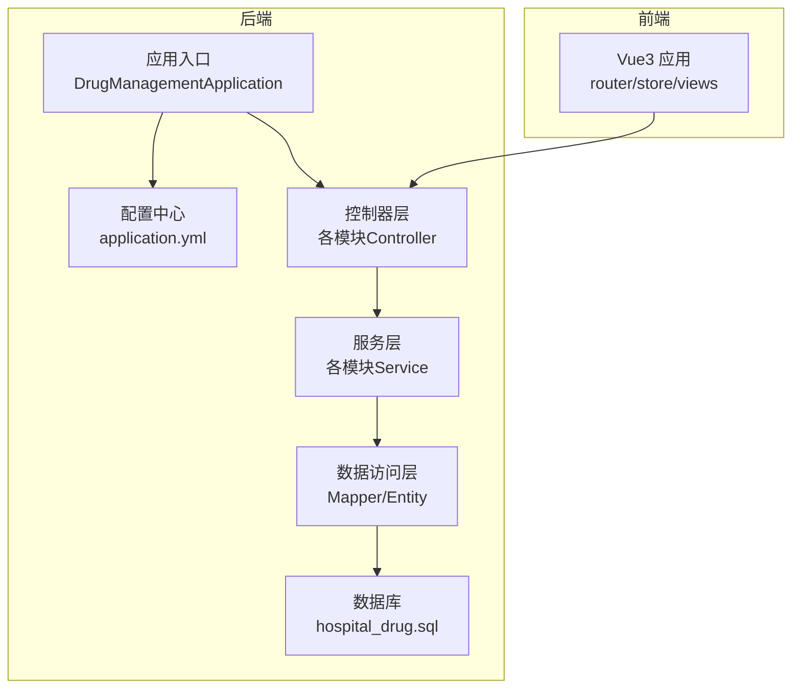

图表来源
- [DrugManagementApplication.java:1-33](file://src/main/java/com/hospital/drugmanagement/DrugManagementApplication.java#L1-L33)
- [application.yml:1-24](file://src/main/resources/application.yml#L1-L24)
- [hospital_drug.sql:1-307](file://hospital_drug.sql#L1-L307)

章节来源
- [DrugManagementApplication.java:14-33](file://src/main/java/com/hospital/drugmanagement/DrugManagementApplication.java#L14-L33)
- [application.yml:1-24](file://src/main/resources/application.yml#L1-L24)
- [hospital_drug.sql:20-307](file://hospital_drug.sql#L20-L307)

## 核心组件
- 应用入口与配置
  - 应用入口负责组件扫描与控制器导入，确保前后端交互接口可用。
  - 配置文件定义数据源、MyBatis-Plus 映射与日志输出，便于开发调试。
- 数据模型
  - 用户、药品、供应商、采购单、库存等核心实体映射到数据库表，支持基础 CRUD 与扩展业务逻辑。
- 控制器层
  - 每个模块提供标准 REST 接口，统一返回结构，便于前端集成。
- 服务与持久层
  - 服务层封装业务规则，持久层基于 MyBatis-Plus 提供通用 CRUD 与分页能力。

章节来源
- [DrugManagementApplication.java:14-33](file://src/main/java/com/hospital/drugmanagement/DrugManagementApplication.java#L14-L33)
- [application.yml:18-24](file://src/main/resources/application.yml#L18-L24)
- [SysUser.java:12-130](file://src/main/java/com/hospital/drugmanagement/entity/SysUser.java#L12-L130)
- [DrugInfo.java:9-167](file://src/main/java/com/hospital/drugmanagement/entity/DrugInfo.java#L9-L167)
- [SupplierInfo.java:12-39](file://src/main/java/com/hospital/drugmanagement/entity/SupplierInfo.java#L12-L39)
- [PurchaseOrder.java:13-40](file://src/main/java/com/hospital/drugmanagement/entity/PurchaseOrder.java#L13-L40)
- [DrugStock.java:13-39](file://src/main/java/com/hospital/drugmanagement/entity/DrugStock.java#L13-L39)

## 架构总览
系统采用前后端分离架构，后端提供 REST 接口，前端通过 axios 请求接口，实现用户认证、药品信息维护、供应商管理、采购流程、库存跟踪、出入库操作、报表统计与系统配置等功能。

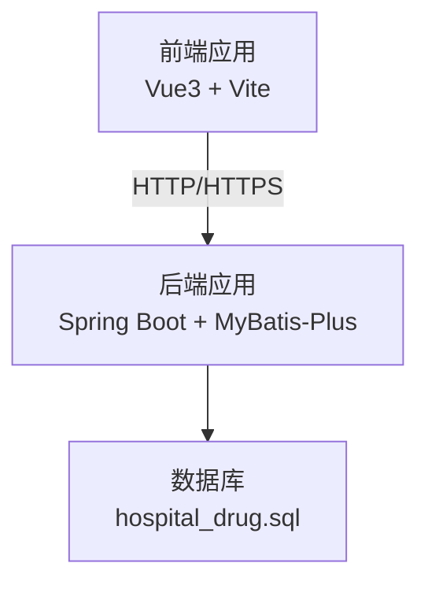

图表来源
- [DrugManagementApplication.java:24-33](file://src/main/java/com/hospital/drugmanagement/DrugManagementApplication.java#L24-L33)
- [application.yml:14-24](file://src/main/resources/application.yml#L14-L24)
- [hospital_drug.sql:20-307](file://hospital_drug.sql#L20-L307)

## 详细组件分析

### 用户管理模块
- 业务流程
  - 登录认证：接收用户名/密码，校验后返回用户信息、角色与菜单权限。
  - 权限控制：根据角色动态下发菜单树，实现细粒度权限控制。
  - 用户维护：支持分页查询、新增、修改、删除与重置密码。
- 功能特性
  - 密码加密存储（MD5+盐），保障账户安全。
  - 角色与菜单解耦，支持多角色与菜单绑定。
  - Token 简单解析示例，便于后续接入 JWT。
- 用户操作指南
  - 登录：调用登录接口，携带用户名与密码。
  - 获取当前用户：携带 Authorization 请求头调用当前用户接口。
  - 管理用户：在后台页面执行查询、新增、编辑、删除与重置密码。
- 系统实现细节
  - 控制器提供登录、当前用户、用户列表、新增、修改、删除、重置密码等接口。
  - 实体包含用户基本信息、角色关联与状态字段。
  - 配置启用下划线转驼峰，提升字段映射一致性。

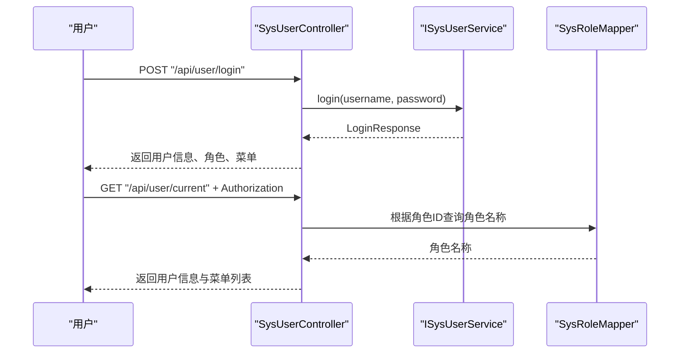

图表来源
- [SysUserController.java:43-147](file://src/main/java/com/hospital/drugmanagement/controller/SysUserController.java#L43-L147)
- [SysUser.java:12-130](file://src/main/java/com/hospital/drugmanagement/entity/SysUser.java#L12-L130)

章节来源
- [SysUserController.java:43-147](file://src/main/java/com/hospital/drugmanagement/controller/SysUserController.java#L43-L147)
- [SysUser.java:12-130](file://src/main/java/com/hospital/drugmanagement/entity/SysUser.java#L12-L130)

### 药品管理模块
- 业务流程
  - 药品信息维护：支持按名称/编码/类型筛选，分页展示。
  - 信息变更：新增时校验编码与名称唯一性；修改时排除自身重复。
  - 状态管理：上架/下架状态切换，影响前台展示与后续采购。
- 功能特性
  - 字段覆盖：编码、名称、规格、单位、价格、采购价、预警值、保质期、供应商、批准文号、状态等。
  - 价格管理：销售价与采购价分别维护，便于成本与定价策略。
- 用户操作指南
  - 列表查询：输入条件进行筛选与分页查看。
  - 新增/编辑：填写必填项，提交保存。
  - 删除：谨慎操作，建议先检查是否存在关联（如采购单或库存）。
- 系统实现细节
  - 控制器提供列表、详情、新增、修改、删除接口。
  - 实体映射数据库字段，含自动填充时间戳。

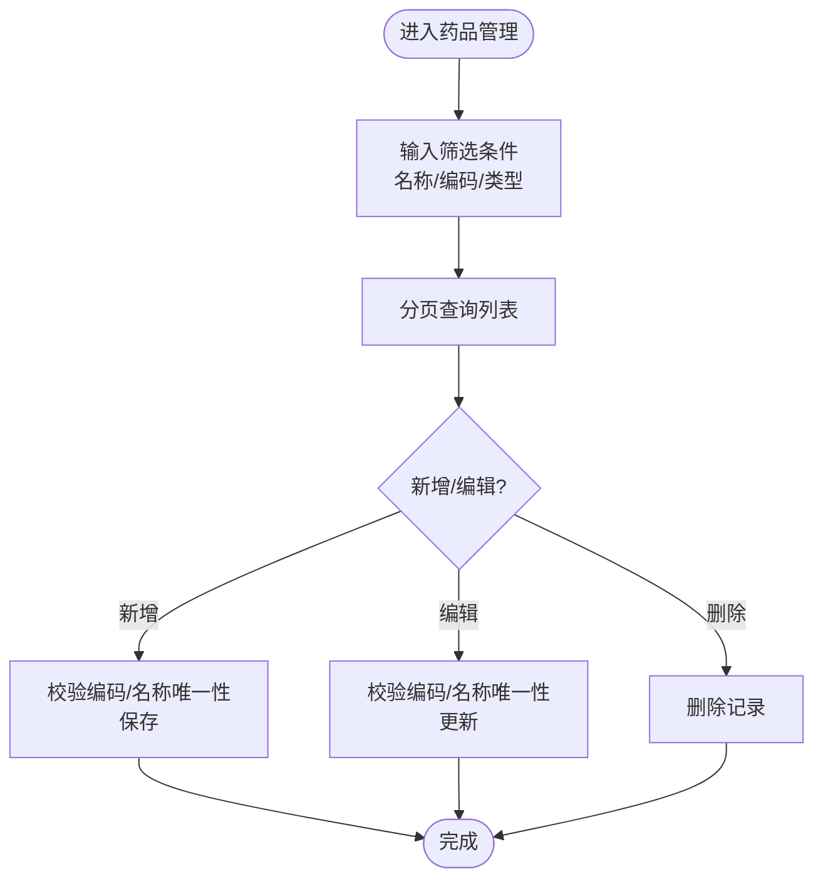

图表来源
- [DrugInfoController.java:22-167](file://src/main/java/com/hospital/drugmanagement/controller/DrugInfoController.java#L22-L167)
- [DrugInfo.java:9-167](file://src/main/java/com/hospital/drugmanagement/entity/DrugInfo.java#L9-L167)

章节来源
- [DrugInfoController.java:22-167](file://src/main/java/com/hospital/drugmanagement/controller/DrugInfoController.java#L22-L167)
- [DrugInfo.java:9-167](file://src/main/java/com/hospital/drugmanagement/entity/DrugInfo.java#L9-L167)

### 供应商管理模块
- 业务流程
  - 供应商信息维护：支持按名称/联系人筛选。
  - 供应关系：药品信息关联供应商，便于采购与溯源。
  - 状态管理：启用/停用，影响采购下单与展示。
- 功能特性
  - 唯一性约束：名称、编码、营业执照号均需唯一。
  - 基础信息：编码、名称、联系人、电话、地址、状态等。
- 用户操作指南
  - 查询：输入名称或联系人进行模糊匹配。
  - 新增：填写基础信息，提交保存。
  - 编辑/删除：更新状态或移除供应商。
- 系统实现细节
  - 控制器提供列表、详情、新增、修改、删除接口。
  - 实体包含供应商基础字段与时间戳。

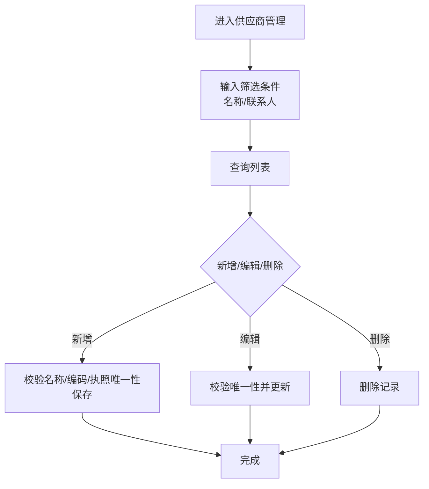

图表来源
- [SupplierInfoController.java:20-175](file://src/main/java/com/hospital/drugmanagement/controller/SupplierInfoController.java#L20-L175)
- [SupplierInfo.java:12-39](file://src/main/java/com/hospital/drugmanagement/entity/SupplierInfo.java#L12-L39)

章节来源
- [SupplierInfoController.java:20-175](file://src/main/java/com/hospital/drugmanagement/controller/SupplierInfoController.java#L20-L175)
- [SupplierInfo.java:12-39](file://src/main/java/com/hospital/drugmanagement/entity/SupplierInfo.java#L12-L39)

### 采购管理模块
- 业务流程
  - 订单创建：填写单号、供应商、日期、明细、金额与备注。
  - 审核机制：支持通过/驳回，生成审核记录并更新订单状态。
  - 状态管理：待审核、已审核、已入库、已取消、审核不通过。
  - 作废流程：仅允许特定状态下作废。
- 功能特性
  - 订单明细：按药品维度维护采购数量、单价与小计金额。
  - 审核权限：基于角色判断（管理员/审核员）。
  - 审核记录：记录审核人、结果、意见与时间。
- 用户操作指南
  - 新建：填写订单与明细，提交保存。
  - 审核：登录具备审核权限用户，选择通过/驳回并填写意见。
  - 查询：按单号、供应商、状态筛选查看。
  - 作废：在允许状态下发起作废。
- 系统实现细节
  - 控制器提供列表、详情、新增、修改、删除、审核、作废接口。
  - 实体包含订单主表与明细表，以及审核记录表。

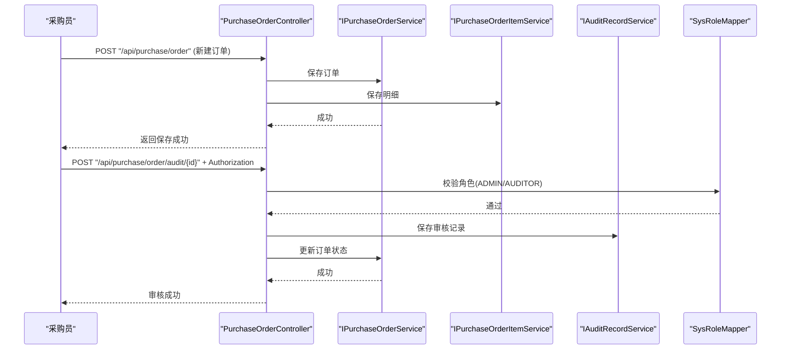

图表来源
- [PurchaseOrderController.java:181-395](file://src/main/java/com/hospital/drugmanagement/controller/PurchaseOrderController.java#L181-L395)
- [PurchaseOrder.java:13-40](file://src/main/java/com/hospital/drugmanagement/entity/PurchaseOrder.java#L13-L40)

章节来源
- [PurchaseOrderController.java:52-395](file://src/main/java/com/hospital/drugmanagement/controller/PurchaseOrderController.java#L52-L395)
- [PurchaseOrder.java:13-40](file://src/main/java/com/hospital/drugmanagement/entity/PurchaseOrder.java#L13-L40)

### 库存管理模块
- 业务流程
  - 实时跟踪：按药品、仓库、批号聚合库存数量。
  - 批次管理：记录生产日期与有效期，支持保质期预警。
  - 库存盘点：生成盘点单，支持全仓或指定范围盘点。
- 功能特性
  - 预警值：结合药品预警值与当前库存触发预警。
  - 批次与有效期：入库时登记，用于先进先出与效期管理。
- 用户操作指南
  - 查询：按药品名称/编码、仓库、是否预警筛选。
  - 预警列表：查看低于预警值的药品。
  - 创建盘点：选择仓库与范围，生成盘点单。
- 系统实现细节
  - 控制器提供库存列表、预警列表与盘点创建接口。
  - 实体包含库存数量、批号、生产/有效期等字段。

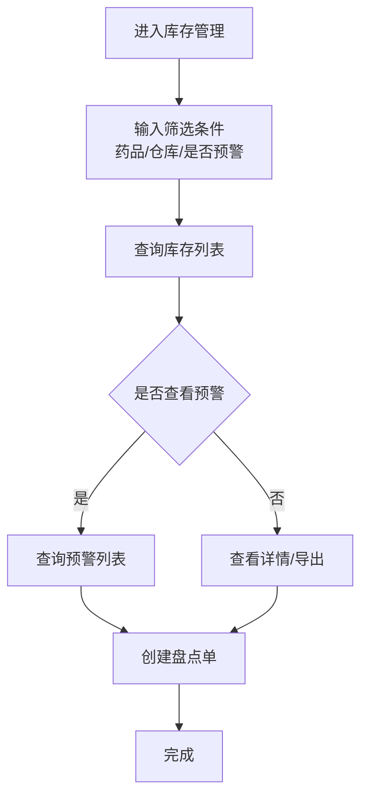

图表来源
- [StockController.java:18-113](file://src/main/java/com/hospital/drugmanagement/controller/StockController.java#L18-L113)
- [DrugStock.java:13-39](file://src/main/java/com/hospital/drugmanagement/entity/DrugStock.java#L13-L39)

章节来源
- [StockController.java:18-113](file://src/main/java/com/hospital/drugmanagement/controller/StockController.java#L18-L113)
- [DrugStock.java:13-39](file://src/main/java/com/hospital/drugmanagement/entity/DrugStock.java#L13-L39)

### 出入库管理模块
- 业务流程
  - 入库管理：根据采购订单生成入库单，登记批号、数量、单价、生产/有效期。
  - 出库管理：登记出库类型（领用/销售/报损）、数量、单价与备注。
  - 操作记录：所有出入库均有创建人与时间记录。
- 功能特性
  - 单据编号：入库单号、出库单号唯一，便于追溯。
  - 批次与效期：入库时登记，出库时可按批次出库。
- 用户操作指南
  - 入库：选择采购订单与仓库，填写批号与有效期，确认生成入库单。
  - 出库：选择药品与仓库，填写数量与类型，确认生成出库单。
  - 查询：按单号、药品、仓库/类型筛选查看。
- 系统实现细节
  - 控制器提供入库/出库列表、详情、新增、删除接口。
  - 实体包含入库/出库主表与关键字段。

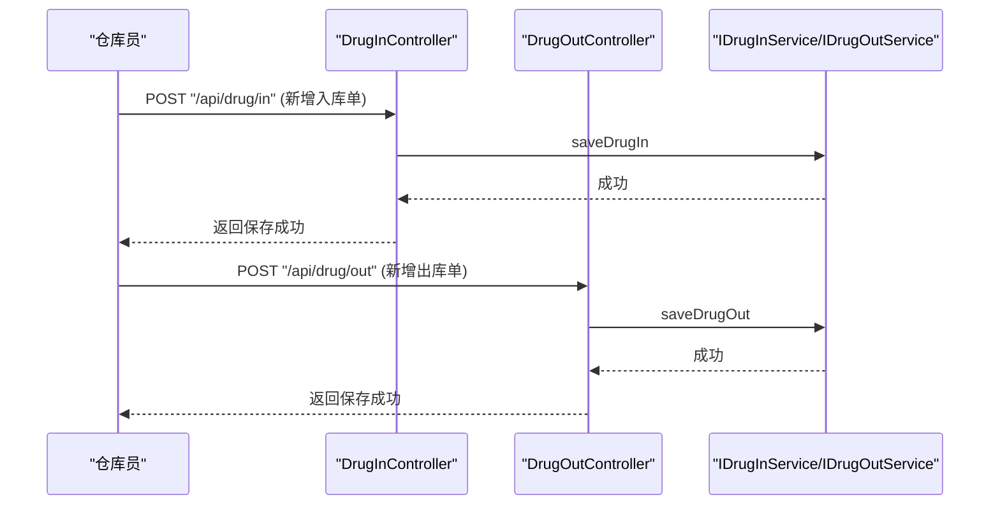

图表来源
- [DrugInController.java:66-103](file://src/main/java/com/hospital/drugmanagement/controller/DrugInController.java#L66-L103)
- [DrugOutController.java:65-101](file://src/main/java/com/hospital/drugmanagement/controller/DrugOutController.java#L65-L101)

章节来源
- [DrugInController.java:20-103](file://src/main/java/com/hospital/drugmanagement/controller/DrugInController.java#L20-L103)
- [DrugOutController.java:19-101](file://src/main/java/com/hospital/drugmanagement/controller/DrugOutController.java#L19-L101)

### 报表统计模块
- 业务流程
  - 采购统计：按月/季度等周期汇总采购金额与数量。
  - 出入库统计：按时间段统计入库/出库数量与金额。
  - 库存统计：汇总各仓库库存结构与价值。
  - 财务报表：按周期汇总收入、成本与利润。
- 功能特性
  - 多维度统计：支持时间维度与仓库/药品维度。
  - 可视化支撑：后端提供结构化数据，前端可渲染图表。
- 用户操作指南
  - 采购报表：选择统计周期，获取采购趋势。
  - 出入库报表：设置起止日期，查看出入库明细与汇总。
  - 库存报表：查看库存分布与价值。
  - 财务报表：查看收入与成本趋势。
- 系统实现细节
  - 控制器提供采购、出入库、库存、财务报表接口。
  - 统计逻辑由服务层实现，返回结构化数据。

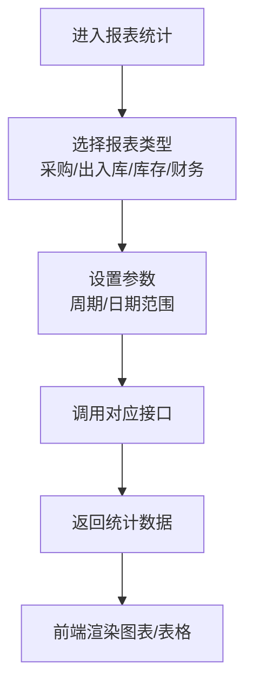

图表来源
- [ReportController.java:18-100](file://src/main/java/com/hospital/drugmanagement/controller/ReportController.java#L18-L100)

章节来源
- [ReportController.java:18-100](file://src/main/java/com/hospital/drugmanagement/controller/ReportController.java#L18-L100)

### 系统管理模块
- 业务流程
  - 用户管理：用户列表、新增、修改、删除、重置密码。
  - 角色与菜单：角色定义与菜单授权，实现 RBAC 权限体系。
  - 系统配置：端口、数据源、MyBatis-Plus 映射与日志配置。
- 功能特性
  - 统一返回结构：所有接口返回 code/msg/data 结构。
  - 下划线转驼峰：提升字段映射一致性。
- 用户操作指南
  - 用户管理：在后台页面进行用户维护与密码重置。
  - 角色与菜单：为角色分配菜单权限，控制页面可见性。
  - 系统配置：修改 application.yml 后重启生效。
- 系统实现细节
  - 控制器提供用户相关接口。
  - 配置文件集中管理数据源与 MyBatis-Plus 行为。

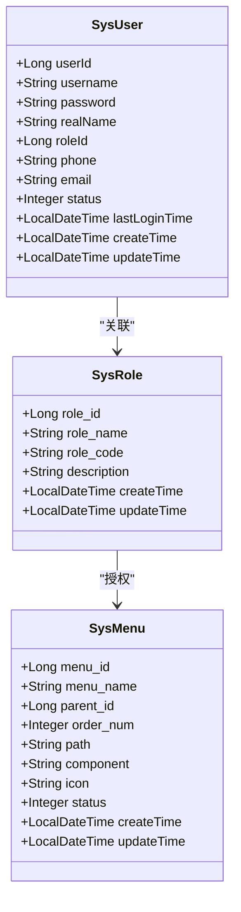

图表来源
- [SysUser.java:12-130](file://src/main/java/com/hospital/drugmanagement/entity/SysUser.java#L12-L130)
- [hospital_drug.sql:241-286](file://hospital_drug.sql#L241-L286)

章节来源
- [SysUserController.java:149-420](file://src/main/java/com/hospital/drugmanagement/controller/SysUserController.java#L149-L420)
- [application.yml:14-24](file://src/main/resources/application.yml#L14-L24)
- [hospital_drug.sql:222-286](file://hospital_drug.sql#L222-L286)

## 依赖分析
- 包扫描与组件注入
  - 应用入口通过 @ComponentScan 与 @Import 确保控制器被纳入 Spring 容器，保证接口可用。
- 数据访问与映射
  - MyBatis-Plus 配置启用下划线转驼峰，mapper 位置与实体包名配置清晰。
- 数据库表关系
  - 用户与角色、角色与菜单、药品与供应商、采购单与明细、库存与药品/仓库等形成清晰的外键关系。

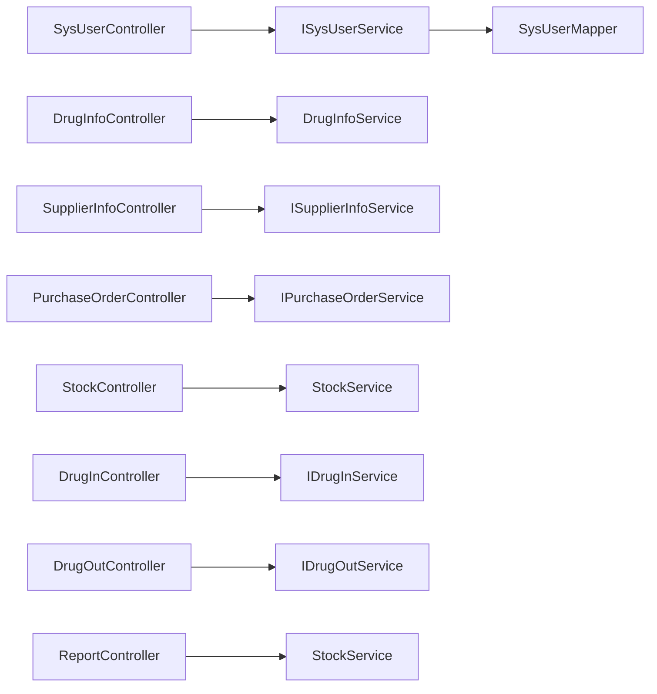

图表来源
- [DrugManagementApplication.java:18-24](file://src/main/java/com/hospital/drugmanagement/DrugManagementApplication.java#L18-L24)
- [application.yml:18-24](file://src/main/resources/application.yml#L18-L24)

章节来源
- [DrugManagementApplication.java:18-24](file://src/main/java/com/hospital/drugmanagement/DrugManagementApplication.java#L18-L24)
- [application.yml:18-24](file://src/main/resources/application.yml#L18-L24)

## 性能考虑
- 数据库层面
  - 为常用查询字段建立索引（如药品编码、供应商编码、订单号、仓库ID、药品ID等），减少全表扫描。
  - 合理使用分页查询，避免一次性加载大量数据。
- 应用层面
  - 使用 MyBatis-Plus 的分页插件与条件构造器，降低 SQL 编写复杂度。
  - 对热点数据可引入缓存（如菜单树、角色权限），减少数据库压力。
- 日志与监控
  - 开启 SQL 输出便于调试，生产环境建议关闭或降级。
  - 建议接入链路追踪与指标监控，定位慢查询与异常。

## 故障排查指南
- 登录失败
  - 检查用户名/密码是否正确，确认用户状态正常。
  - 若返回未授权或无效 token，检查 Authorization 头格式与解析逻辑。
- 新增失败（唯一性冲突）
  - 药品/供应商/用户新增时会校验唯一性，若提示已存在，请更换编码或名称。
- 审核权限不足
  - 审核接口要求 ADMIN 或 AUDITOR 角色，确认用户角色配置。
- 订单状态不可作废
  - 仅待审核或已审核状态可作废，检查当前订单状态。
- SQL 映射异常
  - 确认 application.yml 中下划线转驼峰配置已启用，字段命名与表结构一致。

章节来源
- [SysUserController.java:43-68](file://src/main/java/com/hospital/drugmanagement/controller/SysUserController.java#L43-L68)
- [DrugInfoController.java:76-113](file://src/main/java/com/hospital/drugmanagement/controller/DrugInfoController.java#L76-L113)
- [SupplierInfoController.java:66-110](file://src/main/java/com/hospital/drugmanagement/controller/SupplierInfoController.java#L66-L110)
- [PurchaseOrderController.java:278-364](file://src/main/java/com/hospital/drugmanagement/controller/PurchaseOrderController.java#L278-L364)
- [PurchaseOrderController.java:366-395](file://src/main/java/com/hospital/drugmanagement/controller/PurchaseOrderController.java#L366-L395)
- [application.yml:22-24](file://src/main/resources/application.yml#L22-L24)

## 结论
本系统以模块化设计为核心，围绕用户、药品、供应商、采购、库存、出入库、报表与系统管理八大模块构建完整闭环。通过标准化接口与清晰的数据模型，满足医院对药品全生命周期管理的需求。建议在生产环境中完善鉴权机制（如 JWT）、引入缓存与监控，并持续优化数据库索引与查询性能，以提升用户体验与系统稳定性。

## 附录
- 接口示例（路径与方法）
  - 用户登录：POST /api/user/login
  - 当前用户：GET /api/user/current
  - 用户列表：GET /api/user/list
  - 新增用户：POST /api/user
  - 修改用户：PUT /api/user
  - 删除用户：DELETE /api/user/{id}
  - 重置密码：PUT /api/user/resetPassword
  - 药品列表：GET /api/drug/list
  - 供应商列表：GET /api/supplier/list
  - 采购订单列表：GET /api/purchase/order/list
  - 审核订单：POST /api/purchase/order/audit/{id}
  - 作废订单：POST /api/purchase/order/cancel/{id}
  - 库存列表：GET /api/stock/list
  - 库存预警：GET /api/stock/warning/list
  - 创建盘点：POST /api/stock/check
  - 入库单列表：GET /api/drug/in/list
  - 出库单列表：GET /api/drug/out/list
  - 采购报表：GET /api/report/purchase
  - 出入库报表：GET /api/report/inout
  - 库存报表：GET /api/report/stock
  - 财务报表：GET /api/report/finance

章节来源
- [SysUserController.java:43-420](file://src/main/java/com/hospital/drugmanagement/controller/SysUserController.java#L43-L420)
- [DrugInfoController.java:22-167](file://src/main/java/com/hospital/drugmanagement/controller/DrugInfoController.java#L22-L167)
- [SupplierInfoController.java:20-175](file://src/main/java/com/hospital/drugmanagement/controller/SupplierInfoController.java#L20-L175)
- [PurchaseOrderController.java:52-395](file://src/main/java/com/hospital/drugmanagement/controller/PurchaseOrderController.java#L52-L395)
- [StockController.java:18-113](file://src/main/java/com/hospital/drugmanagement/controller/StockController.java#L18-L113)
- [DrugInController.java:20-103](file://src/main/java/com/hospital/drugmanagement/controller/DrugInController.java#L20-L103)
- [DrugOutController.java:19-101](file://src/main/java/com/hospital/drugmanagement/controller/DrugOutController.java#L19-L101)
- [ReportController.java:18-100](file://src/main/java/com/hospital/drugmanagement/controller/ReportController.java#L18-L100)