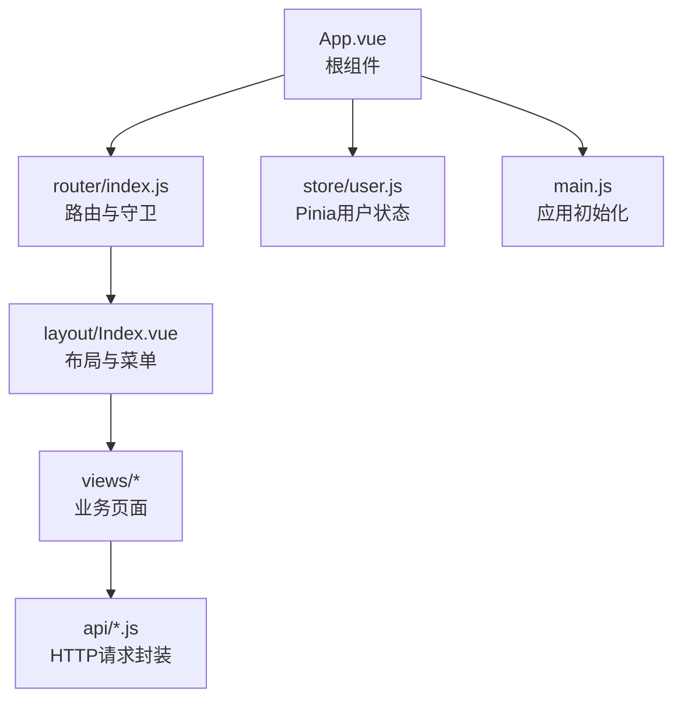
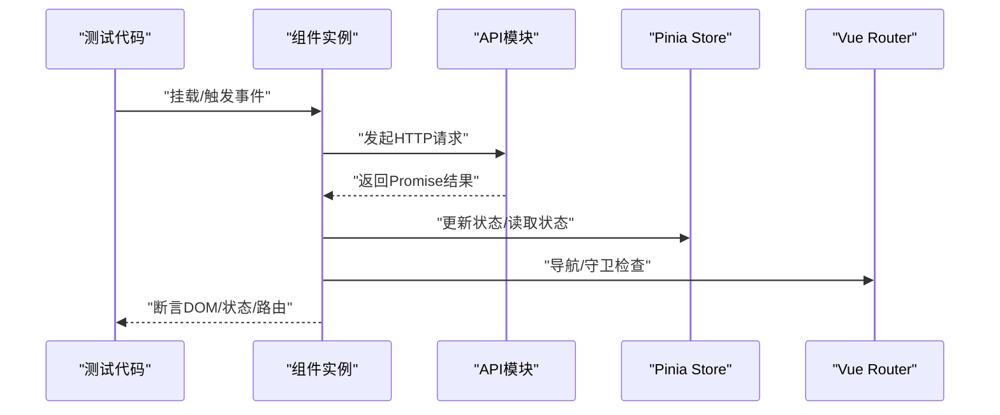
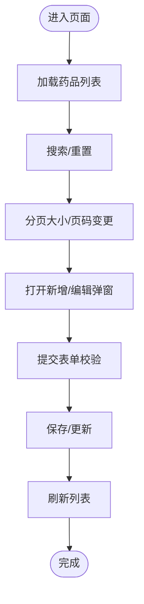
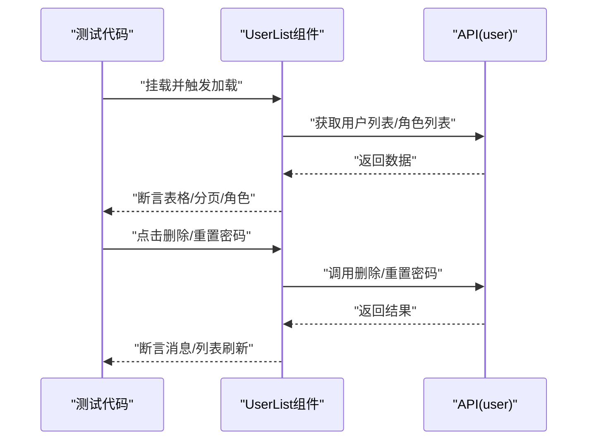
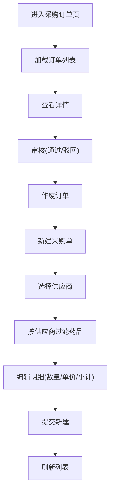
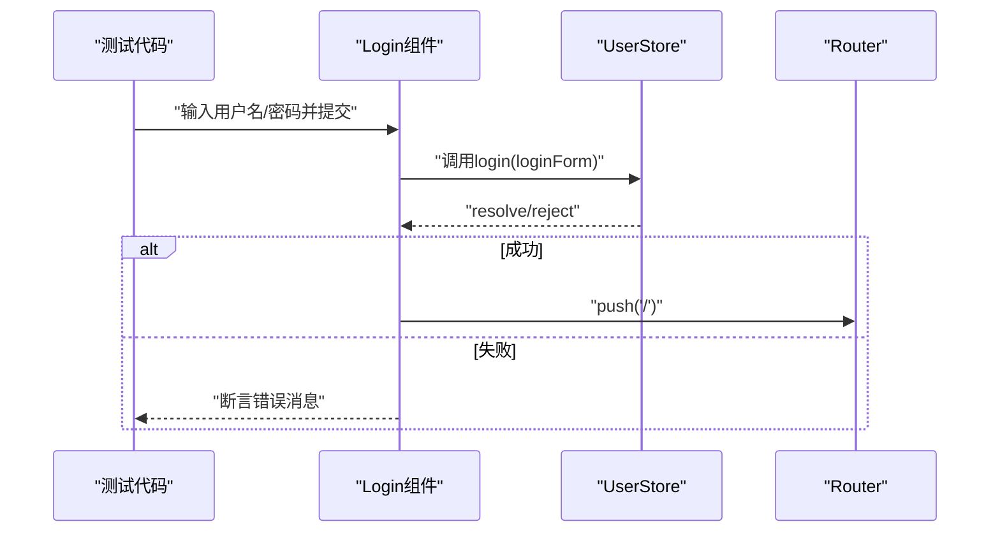
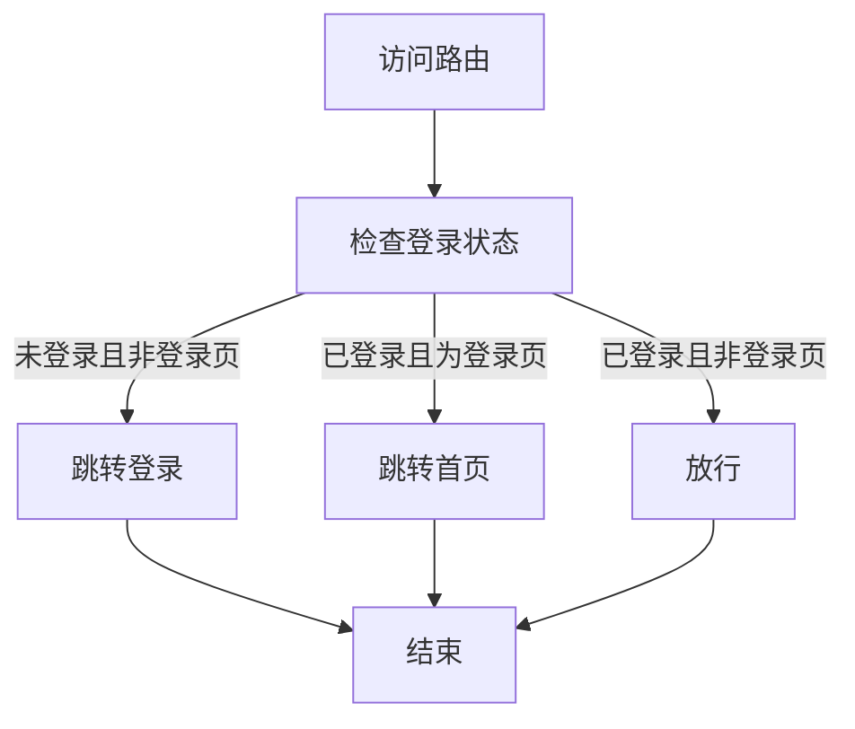
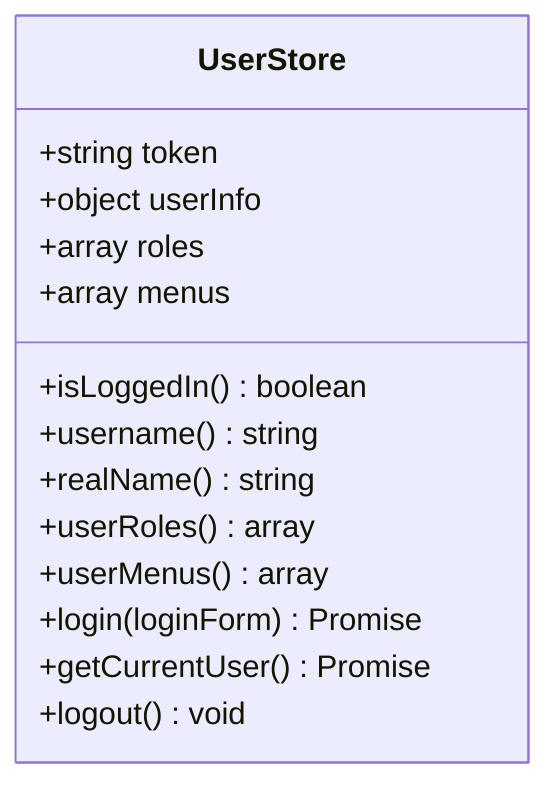
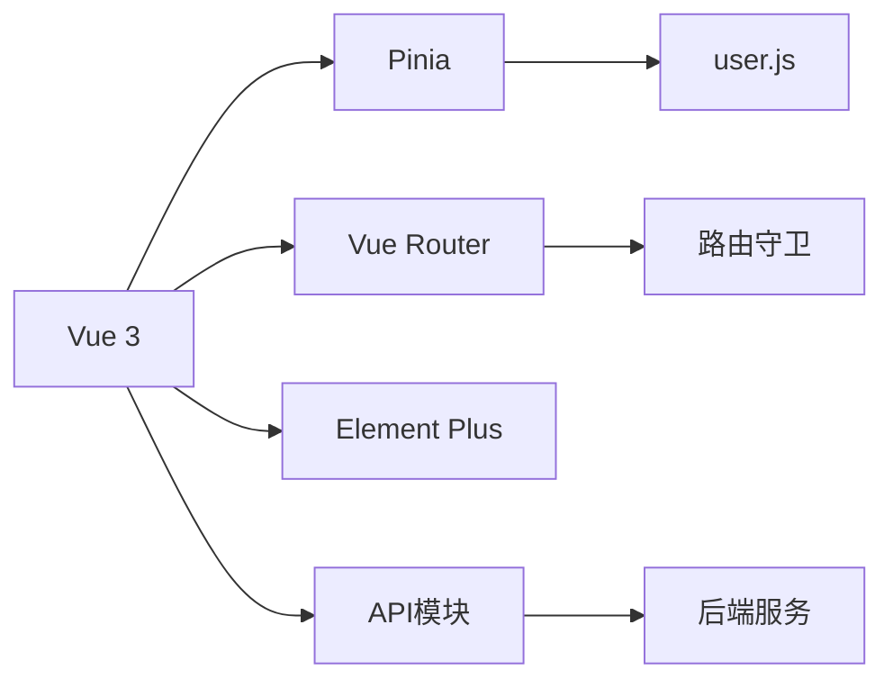

# 前端测试

<cite>
**本文引用的文件**
- [package.json](file://drug-front/package.json)
- [vite.config.js](file://drug-front/vite.config.js)
- [main.js](file://drug-front/src/main.js)
- [router/index.js](file://drug-front/src/router/index.js)
- [store/user.js](file://drug-front/src/store/user.js)
- [api/user.js](file://drug-front/src/api/user.js)
- [api/drug.js](file://drug-front/src/api/drug.js)
- [api/purchase.js](file://drug-front/src/api/purchase.js)
- [views/Login.vue](file://drug-front/src/views/Login.vue)
- [views/drug/DrugList.vue](file://drug-front/src/views/drug/DrugList.vue)
- [views/system/UserList.vue](file://drug-front/src/views/system/UserList.vue)
- [views/purchase/PurchaseOrderList.vue](file://drug-front/src/views/purchase/PurchaseOrderList.vue)
- [layout/Index.vue](file://drug-front/src/layout/Index.vue)
- [App.vue](file://drug-front/src/App.vue)
</cite>

## 目录
1. [简介](#简介)
2. [项目结构](#项目结构)
3. [核心组件](#核心组件)
4. [架构总览](#架构总览)
5. [详细组件分析](#详细组件分析)
6. [依赖分析](#依赖分析)
7. [性能考虑](#性能考虑)
8. [故障排查指南](#故障排查指南)
9. [结论](#结论)
10. [附录](#附录)

## 简介
本文件面向Vue.js前端应用的测试实现，聚焦于使用Vue Test Utils进行组件测试与集成测试，覆盖以下主题：
- 使用Vue Test Utils测试Vue组件（props、事件、插槽、计算属性、生命周期）
- 组件状态模拟与异步行为测试
- 路由测试（导航、路由守卫、动态参数）
- Pinia Store测试（状态变更、actions、getters）
- 具体业务组件测试用例思路：药品列表、用户管理、采购订单
- 测试工具配置、测试数据mock、异步与用户交互测试最佳实践

## 项目结构
前端项目采用Vite构建，基于Vue 3 + Element Plus + Pinia + Vue Router组织，核心目录与文件如下：
- 应用入口与全局注册：main.js
- 路由定义与守卫：router/index.js
- 状态管理：store/user.js
- API封装：api/*.js
- 页面视图：views/**/*.vue
- 布局：layout/Index.vue
- 根组件：App.vue

**图表来源**
- [App.vue:1-24](file://drug-front/src/App.vue#L1-L24)
- [router/index.js:1-115](file://drug-front/src/router/index.js#L1-L115)
- [layout/Index.vue:1-213](file://drug-front/src/layout/Index.vue#L1-L213)
- [store/user.js:1-68](file://drug-front/src/store/user.js#L1-L68)
- [main.js:1-26](file://drug-front/src/main.js#L1-L26)

**章节来源**
- [package.json:1-29](file://drug-front/package.json#L1-L29)
- [vite.config.js:1-22](file://drug-front/vite.config.js#L1-L22)
- [main.js:1-26](file://drug-front/src/main.js#L1-L26)

## 核心组件
- 路由与守卫：负责页面标题设置、登录状态校验、未登录跳转登录页等
- 用户状态管理：登录、登出、当前用户信息、权限相关状态
- API层：对后端接口进行统一封装，便于测试时mock
- 业务组件：药品列表、用户管理、采购订单、登录页等

**章节来源**
- [router/index.js:91-112](file://drug-front/src/router/index.js#L91-L112)
- [store/user.js:4-68](file://drug-front/src/store/user.js#L4-L68)
- [api/user.js:1-71](file://drug-front/src/api/user.js#L1-L71)
- [api/drug.js:1-45](file://drug-front/src/api/drug.js#L1-L45)
- [api/purchase.js:1-63](file://drug-front/src/api/purchase.js#L1-L63)

## 架构总览
下图展示了前端测试关注的关键交互路径：组件 -> API -> Store/Router。

**图表来源**
- [views/Login.vue:74-92](file://drug-front/src/views/Login.vue#L74-L92)
- [views/drug/DrugList.vue:281-297](file://drug-front/src/views/drug/DrugList.vue#L281-L297)
- [views/system/UserList.vue:208-224](file://drug-front/src/views/system/UserList.vue#L208-L224)
- [views/purchase/PurchaseOrderList.vue:410-426](file://drug-front/src/views/purchase/PurchaseOrderList.vue#L410-L426)
- [store/user.js:20-65](file://drug-front/src/store/user.js#L20-L65)
- [router/index.js:91-112](file://drug-front/src/router/index.js#L91-L112)

## 详细组件分析

### 药品列表组件（DrugList）测试要点
- 组件职责：分页查询、搜索过滤、新增/编辑弹窗、删除确认、加载状态、供应商联动
- 关键测试点：
  - props传入与默认值
  - 表单校验规则与错误提示
  - 弹窗打开/关闭与表单重置
  - 分页变更与数据刷新
  - 供应商选择联动设置生产厂商
  - 删除确认与成功消息
  - 生命周期onMounted触发数据加载

**图表来源**
- [views/drug/DrugList.vue:281-297](file://drug-front/src/views/drug/DrugList.vue#L281-L297)
- [views/drug/DrugList.vue:300-311](file://drug-front/src/views/drug/DrugList.vue#L300-L311)
- [views/drug/DrugList.vue:313-332](file://drug-front/src/views/drug/DrugList.vue#L313-L332)
- [views/drug/DrugList.vue:334-350](file://drug-front/src/views/drug/DrugList.vue#L334-L350)
- [views/drug/DrugList.vue:352-376](file://drug-front/src/views/drug/DrugList.vue#L352-L376)
- [views/drug/DrugList.vue:378-397](file://drug-front/src/views/drug/DrugList.vue#L378-L397)
- [views/drug/DrugList.vue:399-407](file://drug-front/src/views/drug/DrugList.vue#L399-L407)
- [views/drug/DrugList.vue:411-414](file://drug-front/src/views/drug/DrugList.vue#L411-L414)

**章节来源**
- [views/drug/DrugList.vue:1-426](file://drug-front/src/views/drug/DrugList.vue#L1-L426)

### 用户管理组件（UserList）测试要点
- 组件职责：用户列表查询、角色筛选、新增/编辑弹窗、删除与重置密码、分页
- 关键测试点：
  - 角色列表加载与渲染
  - 表单字段与校验规则
  - 删除确认与成功反馈
  - 重置密码输入与校验
  - 分页变更与数据刷新

**图表来源**
- [views/system/UserList.vue:171-179](file://drug-front/src/views/system/UserList.vue#L171-L179)
- [views/system/UserList.vue:208-224](file://drug-front/src/views/system/UserList.vue#L208-L224)
- [views/system/UserList.vue:253-269](file://drug-front/src/views/system/UserList.vue#L253-L269)
- [views/system/UserList.vue:271-290](file://drug-front/src/views/system/UserList.vue#L271-L290)
- [views/system/UserList.vue:292-316](file://drug-front/src/views/system/UserList.vue#L292-L316)
- [views/system/UserList.vue:333-341](file://drug-front/src/views/system/UserList.vue#L333-L341)

**章节来源**
- [views/system/UserList.vue:1-358](file://drug-front/src/views/system/UserList.vue#L1-L358)

### 采购订单组件（PurchaseOrderList）测试要点
- 组件职责：采购单列表、详情查看、审核、作废、新建采购单（含明细）
- 关键测试点：
  - 审核权限计算属性
  - 供应商与药品联动过滤
  - 明细项数量/单价计算
  - 新建表单校验与提交
  - 审核与作废流程

**图表来源**
- [views/purchase/PurchaseOrderList.vue:320-324](file://drug-front/src/views/purchase/PurchaseOrderList.vue#L320-L324)
- [views/purchase/PurchaseOrderList.vue:349-355](file://drug-front/src/views/purchase/PurchaseOrderList.vue#L349-L355)
- [views/purchase/PurchaseOrderList.vue:410-426](file://drug-front/src/views/purchase/PurchaseOrderList.vue#L410-L426)
- [views/purchase/PurchaseOrderList.vue:462-472](file://drug-front/src/views/purchase/PurchaseOrderList.vue#L462-L472)
- [views/purchase/PurchaseOrderList.vue:474-495](file://drug-front/src/views/purchase/PurchaseOrderList.vue#L474-L495)
- [views/purchase/PurchaseOrderList.vue:497-514](file://drug-front/src/views/purchase/PurchaseOrderList.vue#L497-L514)
- [views/purchase/PurchaseOrderList.vue:516-529](file://drug-front/src/views/purchase/PurchaseOrderList.vue#L516-L529)
- [views/purchase/PurchaseOrderList.vue:546-563](file://drug-front/src/views/purchase/PurchaseOrderList.vue#L546-L563)
- [views/purchase/PurchaseOrderList.vue:576-623](file://drug-front/src/views/purchase/PurchaseOrderList.vue#L576-L623)

**章节来源**
- [views/purchase/PurchaseOrderList.vue:1-650](file://drug-front/src/views/purchase/PurchaseOrderList.vue#L1-L650)

### 登录组件（Login）测试要点
- 组件职责：用户名/密码输入、表单校验、登录请求、成功后路由跳转
- 关键测试点：
  - 表单校验规则
  - 登录成功/失败分支
  - 路由跳转至首页

**图表来源**
- [views/Login.vue:74-92](file://drug-front/src/views/Login.vue#L74-L92)
- [store/user.js:20-38](file://drug-front/src/store/user.js#L20-L38)
- [router/index.js:98-111](file://drug-front/src/router/index.js#L98-L111)

**章节来源**
- [views/Login.vue:1-127](file://drug-front/src/views/Login.vue#L1-L127)

### 路由与守卫测试要点
- 路由守卫逻辑：设置页面标题、登录状态判断、未登录跳转登录页
- 测试建议：
  - 未登录访问受保护路由 -> 跳转登录
  - 已登录访问登录页 -> 跳转首页
  - 登录成功 -> 放行
  - 页面标题动态设置

**图表来源**
- [router/index.js:91-112](file://drug-front/src/router/index.js#L91-L112)

**章节来源**
- [router/index.js:1-115](file://drug-front/src/router/index.js#L1-L115)

### Pinia Store测试要点
- 用户Store：token、userInfo、roles、menus；登录、获取当前用户、登出
- 测试建议：
  - 初始化状态来自localStorage
  - 登录成功写入localStorage并更新状态
  - 登出清空localStorage与状态
  - getters正确返回派生状态

**图表来源**
- [store/user.js:4-68](file://drug-front/src/store/user.js#L4-L68)

**章节来源**
- [store/user.js:1-68](file://drug-front/src/store/user.js#L1-L68)

## 依赖分析
- 组件依赖API层：通过统一的request封装调用后端接口
- 组件依赖Store：读取用户状态、权限、菜单
- 组件依赖Router：导航、守卫
- 应用入口注册：Pinia、Router、Element Plus

**图表来源**
- [main.js:1-26](file://drug-front/src/main.js#L1-L26)
- [router/index.js:1-115](file://drug-front/src/router/index.js#L1-L115)
- [store/user.js:1-68](file://drug-front/src/store/user.js#L1-L68)
- [api/user.js:1-71](file://drug-front/src/api/user.js#L1-L71)

**章节来源**
- [main.js:1-26](file://drug-front/src/main.js#L1-L26)

## 性能考虑
- 组件内大量异步请求时，优先使用批量请求或缓存策略，减少重复请求
- 表格分页与搜索应结合防抖，避免频繁刷新
- 对复杂计算属性（如采购单小计）应确保在数据稳定后再计算
- 在测试中使用虚拟时钟或延迟控制，提升可重复性

## 故障排查指南
- 登录失败/路由未跳转
  - 检查登录表单校验与错误处理
  - 核对Store登录动作与localStorage写入
  - 核对路由守卫逻辑
- 列表数据不刷新
  - 确认分页变更回调触发了数据加载
  - 检查异常捕获与loading状态恢复
- 权限相关按钮不可见
  - 检查用户角色与计算属性hasAuditPermission
  - 确认菜单数据是否来自用户Store

**章节来源**
- [views/Login.vue:74-92](file://drug-front/src/views/Login.vue#L74-L92)
- [views/purchase/PurchaseOrderList.vue:320-324](file://drug-front/src/views/purchase/PurchaseOrderList.vue#L320-L324)
- [views/purchase/PurchaseOrderList.vue:410-426](file://drug-front/src/views/purchase/PurchaseOrderList.vue#L410-L426)

## 结论
本文围绕Vue Test Utils提供了组件测试、路由测试与Pinia Store测试的系统化方法论，并结合药品列表、用户管理、采购订单等核心业务组件给出了可落地的测试思路与流程图。建议在实际测试中：
- 将API层统一mock，隔离网络依赖
- 使用计算属性与getters进行状态断言
- 通过路由守卫与导航断言页面行为
- 对异步流程使用等待与超时控制

## 附录

### 测试工具与配置建议
- 构建工具：Vite（已提供配置）
- 测试运行器：推荐Jest或Vitest（与Vite生态契合）
- 组件测试：Vue Test Utils（挂载、触发事件、断言DOM）
- Mock策略：对API模块进行函数级mock，对localStorage进行沙箱隔离
- 异步测试：使用异步断言与微任务队列清理

**章节来源**
- [package.json:1-29](file://drug-front/package.json#L1-L29)
- [vite.config.js:1-22](file://drug-front/vite.config.js#L1-L22)