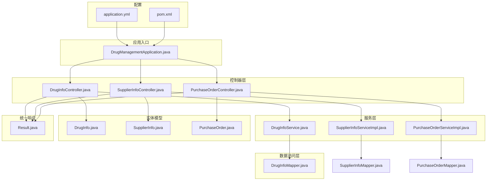
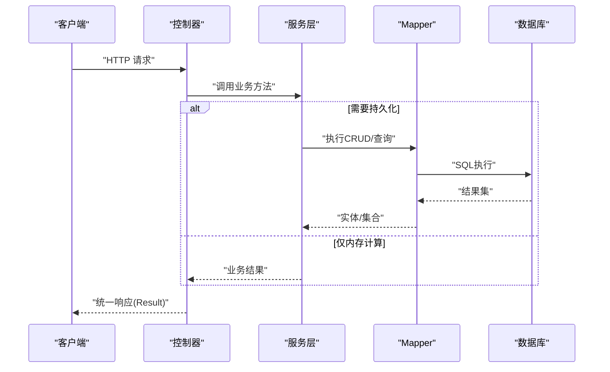
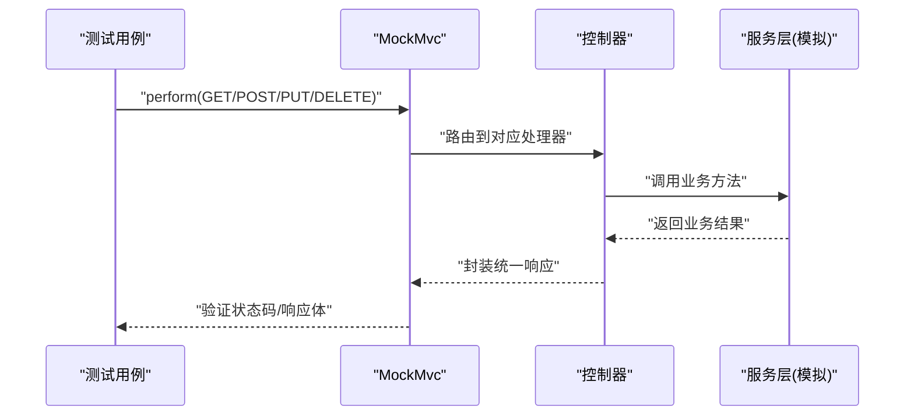
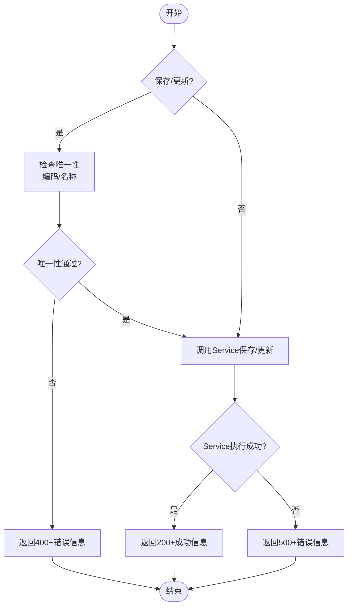
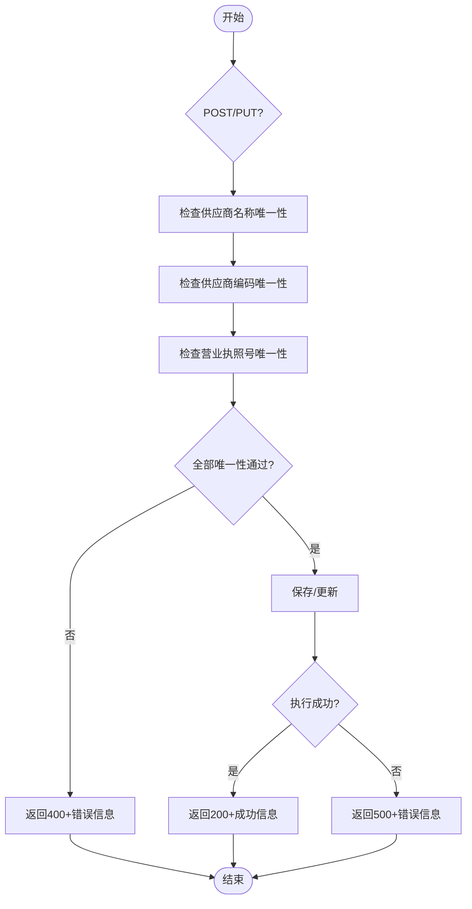
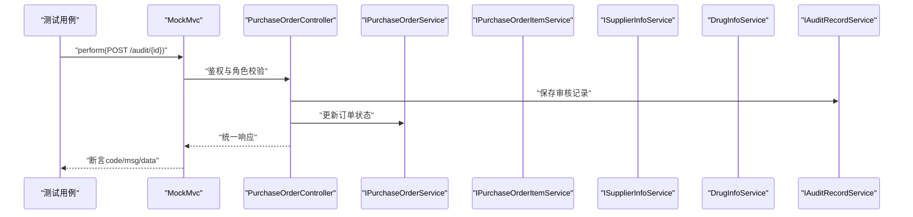
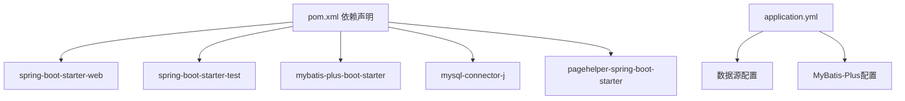

# 单元测试

<cite>
**本文引用的文件**
- [DrugManagementApplication.java](file://src/main/java/com/hospital/drugmanagement/DrugManagementApplication.java)
- [DrugManagementApplicationTests.java](file://src/test/java/com/hospital/drugmanagement/DrugManagementApplicationTests.java)
- [pom.xml](file://pom.xml)
- [application.yml](file://src/main/resources/application.yml)
- [DrugInfoController.java](file://src/main/java/com/hospital/drugmanagement/controller/DrugInfoController.java)
- [SupplierInfoController.java](file://src/main/java/com/hospital/drugmanagement/controller/SupplierInfoController.java)
- [PurchaseOrderController.java](file://src/main/java/com/hospital/drugmanagement/controller/PurchaseOrderController.java)
- [DrugInfoService.java](file://src/main/java/com/hospital/drugmanagement/service/DrugInfoService.java)
- [DrugInfoServiceImpl.java](file://src/main/java/com/hospital/drugmanagement/service/impl/DrugInfoServiceImpl.java)
- [SupplierInfoServiceImpl.java](file://src/main/java/com/hospital/drugmanagement/service/impl/SupplierInfoServiceImpl.java)
- [PurchaseOrderServiceImpl.java](file://src/main/java/com/hospital/drugmanagement/service/impl/PurchaseOrderServiceImpl.java)
- [DrugInfoMapper.java](file://src/main/java/com/hospital/drugmanagement/mapper/DrugInfoMapper.java)
- [DrugInfo.java](file://src/main/java/com/hospital/drugmanagement/entity/DrugInfo.java)
- [SupplierInfo.java](file://src/main/java/com/hospital/drugmanagement/entity/SupplierInfo.java)
- [PurchaseOrder.java](file://src/main/java/com/hospital/drugmanagement/entity/PurchaseOrder.java)
- [Result.java](file://src/main/java/com/hospital/drugmanagement/dto/Result.java)
</cite>

## 目录
1. [引言](#引言)
2. [项目结构](#项目结构)
3. [核心组件](#核心组件)
4. [架构总览](#架构总览)
5. [详细组件分析](#详细组件分析)
6. [依赖分析](#依赖分析)
7. [性能考虑](#性能考虑)
8. [故障排查指南](#故障排查指南)
9. [结论](#结论)
10. [附录](#附录)

## 引言
本文件面向Spring Boot后端的单元测试实践，聚焦于以下目标：
- 明确Spring Boot Test注解的使用场景与最佳实践，包括@SpringBootTest、@WebMvcTest等。
- 总结Service层与Controller层的单元测试策略，涵盖模拟对象、断言、异常处理与边界条件。
- 提供药品管理、供应商管理、采购管理等核心业务功能的测试思路与步骤。
- 结合现有代码结构，给出可直接落地的测试方案与图示。

## 项目结构
该项目采用标准的Spring Boot多模块结构，核心后端位于src/main/java，测试位于src/test/java。应用入口类负责组件扫描与控制器导入，资源文件提供数据源与MyBatis-Plus配置。

图表来源
- [DrugManagementApplication.java:14-24](file://src/main/java/com/hospital/drugmanagement/DrugManagementApplication.java#L14-L24)
- [DrugInfoController.java:14-169](file://src/main/java/com/hospital/drugmanagement/controller/DrugInfoController.java#L14-L169)
- [SupplierInfoController.java:12-176](file://src/main/java/com/hospital/drugmanagement/controller/SupplierInfoController.java#L12-L176)
- [PurchaseOrderController.java:26-396](file://src/main/java/com/hospital/drugmanagement/controller/PurchaseOrderController.java#L26-L396)
- [DrugInfoService.java:6-13](file://src/main/java/com/hospital/drugmanagement/service/DrugInfoService.java#L6-L13)
- [DrugInfoServiceImpl.java:9-18](file://src/main/java/com/hospital/drugmanagement/service/impl/DrugInfoServiceImpl.java#L9-L18)
- [SupplierInfoServiceImpl.java:9-11](file://src/main/java/com/hospital/drugmanagement/service/impl/SupplierInfoServiceImpl.java#L9-L11)
- [PurchaseOrderServiceImpl.java:9-11](file://src/main/java/com/hospital/drugmanagement/service/impl/PurchaseOrderServiceImpl.java#L9-L11)
- [DrugInfoMapper.java:7-9](file://src/main/java/com/hospital/drugmanagement/mapper/DrugInfoMapper.java#L7-L9)
- [DrugInfo.java:9-167](file://src/main/java/com/hospital/drugmanagement/entity/DrugInfo.java#L9-L167)
- [SupplierInfo.java:13-39](file://src/main/java/com/hospital/drugmanagement/entity/SupplierInfo.java#L13-L39)
- [PurchaseOrder.java:14-40](file://src/main/java/com/hospital/drugmanagement/entity/PurchaseOrder.java#L14-L40)
- [Result.java:8-99](file://src/main/java/com/hospital/drugmanagement/dto/Result.java#L8-L99)
- [application.yml:1-24](file://src/main/resources/application.yml#L1-L24)
- [pom.xml:32-78](file://pom.xml#L32-L78)

章节来源
- [DrugManagementApplication.java:14-33](file://src/main/java/com/hospital/drugmanagement/DrugManagementApplication.java#L14-L33)
- [pom.xml:32-78](file://pom.xml#L32-L78)
- [application.yml:1-24](file://src/main/resources/application.yml#L1-L24)

## 核心组件
- 应用入口与组件扫描：应用类通过@ComponentScan与@Import确保控制器被纳入Spring容器，便于在测试中按需加载。
- 控制器层：提供REST接口，返回统一响应结构；包含药品、供应商、采购订单等核心业务接口。
- 服务层：基于MyBatis-Plus的IService实现，提供基础CRUD能力；部分控制器在业务层执行校验与关联查询。
- 实体与映射：实体类标注表名与字段映射，Mapper接口继承BaseMapper，配合XML或注解完成SQL映射。
- 统一响应：Result工具类封装通用响应结构，便于断言与测试。

章节来源
- [DrugManagementApplication.java:18-24](file://src/main/java/com/hospital/drugmanagement/DrugManagementApplication.java#L18-L24)
- [DrugInfoController.java:14-169](file://src/main/java/com/hospital/drugmanagement/controller/DrugInfoController.java#L14-L169)
- [SupplierInfoController.java:12-176](file://src/main/java/com/hospital/drugmanagement/controller/SupplierInfoController.java#L12-L176)
- [PurchaseOrderController.java:26-396](file://src/main/java/com/hospital/drugmanagement/controller/PurchaseOrderController.java#L26-L396)
- [DrugInfoService.java:6-13](file://src/main/java/com/hospital/drugmanagement/service/DrugInfoService.java#L6-L13)
- [DrugInfoServiceImpl.java:9-18](file://src/main/java/com/hospital/drugmanagement/service/impl/DrugInfoServiceImpl.java#L9-L18)
- [SupplierInfoServiceImpl.java:9-11](file://src/main/java/com/hospital/drugmanagement/service/impl/SupplierInfoServiceImpl.java#L9-L11)
- [PurchaseOrderServiceImpl.java:9-11](file://src/main/java/com/hospital/drugmanagement/service/impl/PurchaseOrderServiceImpl.java#L9-L11)
- [DrugInfoMapper.java:7-9](file://src/main/java/com/hospital/drugmanagement/mapper/DrugInfoMapper.java#L7-L9)
- [DrugInfo.java:9-167](file://src/main/java/com/hospital/drugmanagement/entity/DrugInfo.java#L9-L167)
- [SupplierInfo.java:13-39](file://src/main/java/com/hospital/drugmanagement/entity/SupplierInfo.java#L13-L39)
- [PurchaseOrder.java:14-40](file://src/main/java/com/hospital/drugmanagement/entity/PurchaseOrder.java#L14-L40)
- [Result.java:8-99](file://src/main/java/com/hospital/drugmanagement/dto/Result.java#L8-L99)

## 架构总览
下图展示了控制器到服务层再到数据访问层的调用链路，以及统一响应的返回路径。

图表来源
- [DrugInfoController.java:14-169](file://src/main/java/com/hospital/drugmanagement/controller/DrugInfoController.java#L14-L169)
- [SupplierInfoController.java:12-176](file://src/main/java/com/hospital/drugmanagement/controller/SupplierInfoController.java#L12-L176)
- [PurchaseOrderController.java:26-396](file://src/main/java/com/hospital/drugmanagement/controller/PurchaseOrderController.java#L26-L396)
- [DrugInfoService.java:6-13](file://src/main/java/com/hospital/drugmanagement/service/DrugInfoService.java#L6-L13)
- [DrugInfoServiceImpl.java:9-18](file://src/main/java/com/hospital/drugmanagement/service/impl/DrugInfoServiceImpl.java#L9-L18)
- [SupplierInfoServiceImpl.java:9-11](file://src/main/java/com/hospital/drugmanagement/service/impl/SupplierInfoServiceImpl.java#L9-L11)
- [PurchaseOrderServiceImpl.java:9-11](file://src/main/java/com/hospital/drugmanagement/service/impl/PurchaseOrderServiceImpl.java#L9-L11)
- [DrugInfoMapper.java:7-9](file://src/main/java/com/hospital/drugmanagement/mapper/DrugInfoMapper.java#L7-L9)
- [Result.java:8-99](file://src/main/java/com/hospital/drugmanagement/dto/Result.java#L8-L99)

## 详细组件分析

### Spring Boot Test注解与使用场景
- @SpringBootTest：加载完整应用上下文，适合集成测试或端到端测试。当前仓库已有基础测试类，可作为起点扩展。
- @WebMvcTest：专注于Web层测试，自动配置DispatcherServlet与相关组件，适合Controller层单元测试。建议在Controller测试中优先使用以提升速度与隔离度。
- 其他常用注解：@ExtendWith(SpringExtension.class)、@AutoConfigureTestDatabase、@Import等，用于控制测试环境与依赖注入。

章节来源
- [DrugManagementApplicationTests.java:6-12](file://src/test/java/com/hospital/drugmanagement/DrugManagementApplicationTests.java#L6-L12)
- [pom.xml:74-78](file://pom.xml#L74-L78)

### Service层单元测试最佳实践
- 使用@MockBean替换真实依赖，确保测试隔离与可重复性。
- 针对业务规则进行断言：如唯一性校验、分页查询、条件过滤等。
- 对异常路径进行覆盖：如重复键冲突、参数非法、内部异常等。
- 推荐测试点：
  - 药品管理：编码/名称唯一性校验、分页查询、保存/更新/删除。
  - 供应商管理：名称/编码/执照号唯一性校验、列表查询。
  - 采购管理：订单号唯一性、明细保存、状态流转（审核/作废）。

章节来源
- [DrugInfoController.java:76-113](file://src/main/java/com/hospital/drugmanagement/controller/DrugInfoController.java#L76-L113)
- [SupplierInfoController.java:66-110](file://src/main/java/com/hospital/drugmanagement/controller/SupplierInfoController.java#L66-L110)
- [PurchaseOrderController.java:181-233](file://src/main/java/com/hospital/drugmanagement/controller/PurchaseOrderController.java#L181-L233)

### Controller层单元测试实现
- 使用@WebMvcTest加载控制器，结合@MockBean模拟服务层。
- 使用MockMvc发起HTTP请求，断言响应状态码、响应体结构与字段值。
- 关注统一响应结构：code、msg、data、total等字段的正确性。
- 异常处理测试：捕获控制器内try-catch分支，验证错误码与消息。

图表来源
- [DrugInfoController.java:22-58](file://src/main/java/com/hospital/drugmanagement/controller/DrugInfoController.java#L22-L58)
- [SupplierInfoController.java:20-48](file://src/main/java/com/hospital/drugmanagement/controller/SupplierInfoController.java#L20-L48)
- [PurchaseOrderController.java:52-109](file://src/main/java/com/hospital/drugmanagement/controller/PurchaseOrderController.java#L52-L109)
- [Result.java:8-99](file://src/main/java/com/hospital/drugmanagement/dto/Result.java#L8-L99)

### 药品管理单元测试（Service与Controller）
- Service侧要点：
  - 基础CRUD由MyBatis-Plus实现，重点验证业务校验（编码/名称唯一性）与分页查询条件。
- Controller侧要点：
  - GET /list：分页参数、模糊查询条件（名称/编码/类型）、异常兜底。
  - POST /：保存前唯一性检查、异常处理。
  - PUT /：更新前唯一性检查（排除自身）、异常处理。
  - DELETE /{id}：删除结果与异常处理。
- 断言建议：
  - code为200表示成功，非200表示失败。
  - msg为“success”或具体错误信息。
  - data为期望实体或空，total为分页总数。

图表来源
- [DrugInfoController.java:76-151](file://src/main/java/com/hospital/drugmanagement/controller/DrugInfoController.java#L76-L151)
- [DrugInfoService.java:6-13](file://src/main/java/com/hospital/drugmanagement/service/DrugInfoService.java#L6-L13)
- [DrugInfoServiceImpl.java:9-18](file://src/main/java/com/hospital/drugmanagement/service/impl/DrugInfoServiceImpl.java#L9-L18)
- [Result.java:8-99](file://src/main/java/com/hospital/drugmanagement/dto/Result.java#L8-L99)

章节来源
- [DrugInfoController.java:22-167](file://src/main/java/com/hospital/drugmanagement/controller/DrugInfoController.java#L22-L167)
- [DrugInfoService.java:6-13](file://src/main/java/com/hospital/drugmanagement/service/DrugInfoService.java#L6-L13)
- [DrugInfoServiceImpl.java:9-18](file://src/main/java/com/hospital/drugmanagement/service/impl/DrugInfoServiceImpl.java#L9-L18)
- [Result.java:8-99](file://src/main/java/com/hospital/drugmanagement/dto/Result.java#L8-L99)

### 供应商管理单元测试（Controller）
- Controller要点：
  - GET /list：支持名称/联系人模糊查询。
  - POST /：名称/编码/执照号唯一性检查。
  - PUT /：更新时排除当前供应商。
  - DELETE /{id}：删除结果与异常处理。
- 断言建议：
  - code、msg、data、total字段一致性。
  - 唯一性冲突时返回400与明确提示。

图表来源
- [SupplierInfoController.java:66-159](file://src/main/java/com/hospital/drugmanagement/controller/SupplierInfoController.java#L66-L159)
- [SupplierInfoServiceImpl.java:9-11](file://src/main/java/com/hospital/drugmanagement/service/impl/SupplierInfoServiceImpl.java#L9-L11)
- [Result.java:8-99](file://src/main/java/com/hospital/drugmanagement/dto/Result.java#L8-L99)

章节来源
- [SupplierInfoController.java:20-176](file://src/main/java/com/hospital/drugmanagement/controller/SupplierInfoController.java#L20-L176)
- [SupplierInfoServiceImpl.java:9-11](file://src/main/java/com/hospital/drugmanagement/service/impl/SupplierInfoServiceImpl.java#L9-L11)
- [Result.java:8-99](file://src/main/java/com/hospital/drugmanagement/dto/Result.java#L8-L99)

### 采购管理单元测试（Controller）
- Controller要点：
  - GET /list：支持单号、供应商ID、状态过滤。
  - GET /{id}：聚合供应商名称、明细与审核记录。
  - POST /：订单号唯一性检查、保存主单与明细。
  - PUT /：订单号唯一性（排除自身）。
  - POST /audit/{id}：鉴权与角色校验、保存审核记录并更新状态。
  - POST /cancel/{id}：状态校验与作废。
- 断言建议：
  - 审核流程中code、msg、data与状态变更。
  - 作废流程中状态码与提示信息。
  - 异常路径：未授权、无权限、订单不存在等。

图表来源
- [PurchaseOrderController.java:278-364](file://src/main/java/com/hospital/drugmanagement/controller/PurchaseOrderController.java#L278-L364)
- [PurchaseOrderServiceImpl.java:9-11](file://src/main/java/com/hospital/drugmanagement/service/impl/PurchaseOrderServiceImpl.java#L9-L11)
- [Result.java:8-99](file://src/main/java/com/hospital/drugmanagement/dto/Result.java#L8-L99)

章节来源
- [PurchaseOrderController.java:52-396](file://src/main/java/com/hospital/drugmanagement/controller/PurchaseOrderController.java#L52-L396)
- [PurchaseOrderServiceImpl.java:9-11](file://src/main/java/com/hospital/drugmanagement/service/impl/PurchaseOrderServiceImpl.java#L9-L11)
- [Result.java:8-99](file://src/main/java/com/hospital/drugmanagement/dto/Result.java#L8-L99)

### 统一响应与断言规范
- 响应结构：code、msg、data、total等字段。
- 成功场景：code通常为200，msg为“success”，data为业务数据或空。
- 失败场景：code为500或其他业务错误码，msg为具体错误信息。
- 建议断言：
  - JSON路径断言：$.code、$.msg、$.data、$.total。
  - 类型断言：data为数组或对象，total为数字。

章节来源
- [Result.java:8-99](file://src/main/java/com/hospital/drugmanagement/dto/Result.java#L8-L99)
- [DrugInfoController.java:30-57](file://src/main/java/com/hospital/drugmanagement/controller/DrugInfoController.java#L30-L57)
- [SupplierInfoController.java:25-47](file://src/main/java/com/hospital/drugmanagement/controller/SupplierInfoController.java#L25-L47)
- [PurchaseOrderController.java:58-108](file://src/main/java/com/hospital/drugmanagement/controller/PurchaseOrderController.java#L58-L108)

## 依赖分析
- Spring Boot Starter与MyBatis-Plus：提供Web、模板引擎、数据库驱动、ORM与分页能力。
- 测试依赖：spring-boot-starter-test，包含JUnit、Mockito、JsonPath等。
- 数据源与MyBatis-Plus配置：application.yml提供数据源URL、用户名、密码与MyBatis-Plus配置项。

图表来源
- [pom.xml:32-78](file://pom.xml#L32-L78)
- [application.yml:1-24](file://src/main/resources/application.yml#L1-L24)

章节来源
- [pom.xml:32-78](file://pom.xml#L32-L78)
- [application.yml:1-24](file://src/main/resources/application.yml#L1-L24)

## 性能考虑
- 使用@WebMvcTest替代@SpringBootTest可显著减少启动时间，适合高频单元测试。
- 在Service层使用@MockBean替换真实Mapper/Service，避免数据库IO。
- 对分页查询，建议构造合理规模的数据集，避免超大分页导致测试耗时。
- 控制日志输出级别，避免在测试中打印大量SQL与调试信息。

## 故障排查指南
- 控制器异常兜底：检查控制器try-catch分支，确保错误码与消息符合预期。
- 唯一性冲突：确认唯一性校验逻辑与返回码（如400）一致。
- 审核流程鉴权：检查Authorization头解析与角色校验逻辑。
- 作废流程状态：确认订单状态前置条件与更新逻辑。
- 数据准备：使用测试数据构建器或固定ID，确保可重复性与可预测性。

章节来源
- [DrugInfoController.java:51-57](file://src/main/java/com/hospital/drugmanagement/controller/DrugInfoController.java#L51-L57)
- [SupplierInfoController.java:41-47](file://src/main/java/com/hospital/drugmanagement/controller/SupplierInfoController.java#L41-L47)
- [PurchaseOrderController.java:278-364](file://src/main/java/com/hospital/drugmanagement/controller/PurchaseOrderController.java#L278-L364)

## 结论
通过合理选择Spring Boot Test注解、在Controller层使用@WebMvcTest与@MockBean、在Service层利用MyBatis-Plus基础能力与业务校验，可高效构建覆盖药品管理、供应商管理、采购管理等核心业务的单元测试体系。配合统一响应结构与断言规范，能够稳定地保障接口行为与异常处理的正确性。

## 附录
- 测试数据准备建议：
  - 使用固定ID与唯一字段，便于断言与重放。
  - 构造边界数据：空字符串、null、超长字符串、非法数值等。
- 常见断言库：
  - JsonPath：用于JSON响应断言。
  - Assertions：用于Java对象断言。
- 最佳实践清单：
  - 一个测试只验证一个行为或边界。
  - 使用参数化测试覆盖多种输入组合。
  - 保持测试独立，避免共享状态。