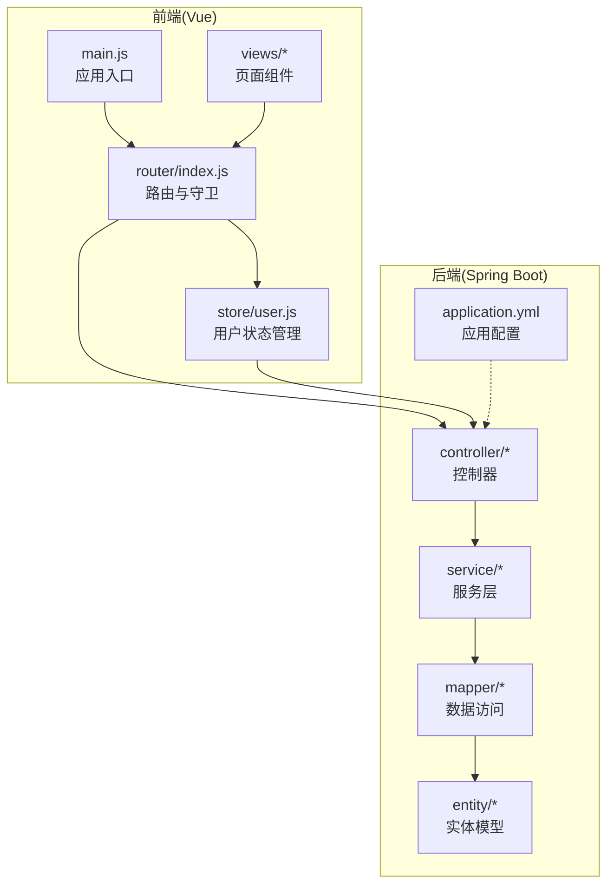
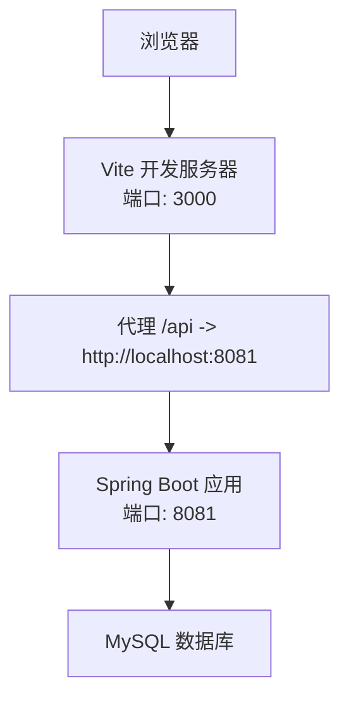
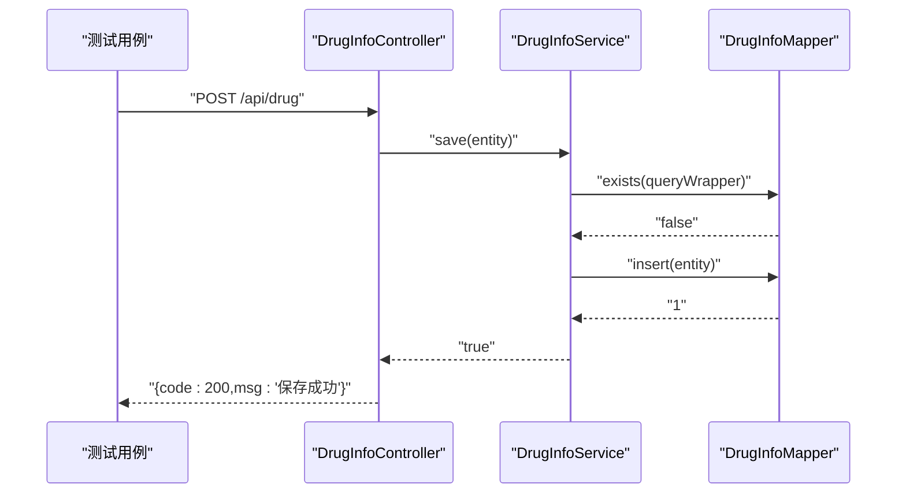
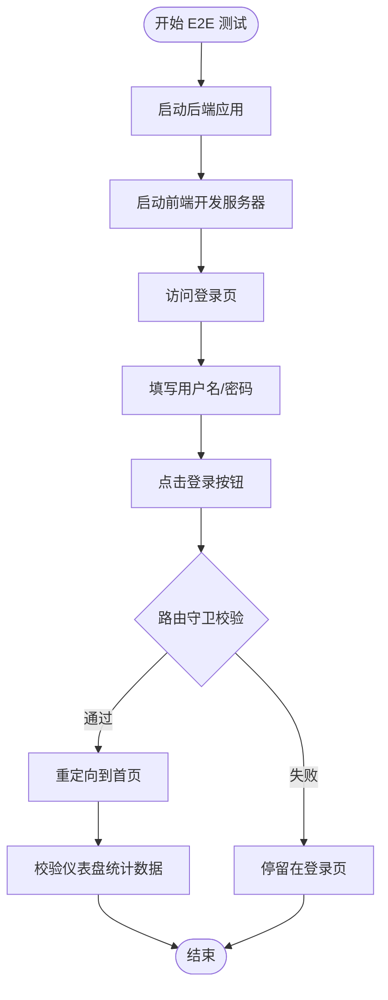
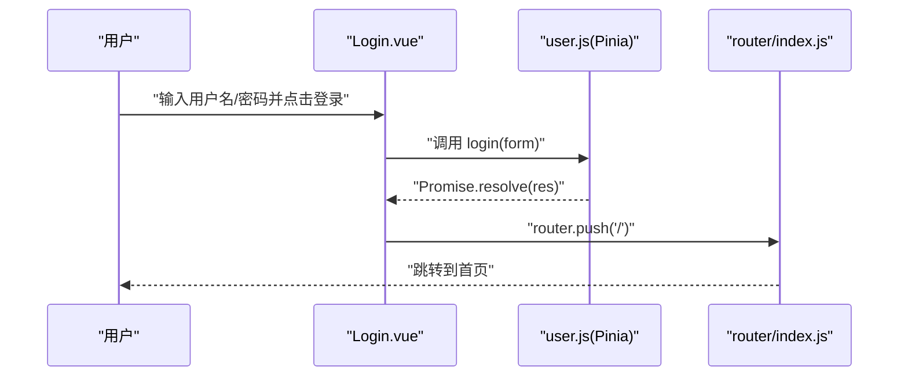
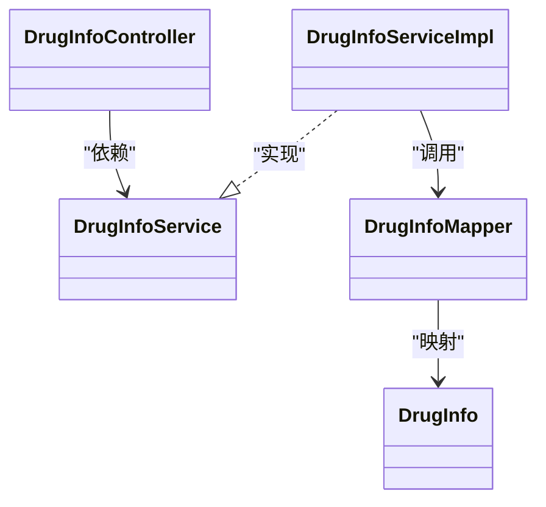

# 测试策略

<cite>
**本文引用的文件**
- [pom.xml](file://pom.xml)
- [application.yml](file://src/main/resources/application.yml)
- [DrugManagementApplicationTests.java](file://src/test/java/com/hospital/drugmanagement/DrugManagementApplicationTests.java)
- [vite.config.js](file://drug-front/vite.config.js)
- [package.json](file://drug-front/package.json)
- [main.js](file://drug-front/src/main.js)
- [router/index.js](file://drug-front/src/router/index.js)
- [store/user.js](file://drug-front/src/store/user.js)
- [DrugInfoController.java](file://src/main/java/com/hospital/drugmanagement/controller/DrugInfoController.java)
- [DrugInfoServiceImpl.java](file://src/main/java/com/hospital/drugmanagement/service/impl/DrugInfoServiceImpl.java)
- [DrugInfo.java](file://src/main/java/com/hospital/drugmanagement/entity/DrugInfo.java)
- [Login.vue](file://drug-front/src/views/Login.vue)
- [Dashboard.vue](file://drug-front/src/views/Dashboard.vue)
</cite>

## 目录
1. [引言](#引言)
2. [项目结构](#项目结构)
3. [核心组件](#核心组件)
4. [架构总览](#架构总览)
5. [详细组件分析](#详细组件分析)
6. [依赖分析](#依赖分析)
7. [性能考虑](#性能考虑)
8. [故障排查指南](#故障排查指南)
9. [结论](#结论)
10. [附录](#附录)

## 引言
本测试策略文档面向医院药品管理系统，围绕后端Spring Boot与前端Vue两大技术栈，构建覆盖单元测试、集成测试、端到端测试与前端组件测试的质量保证体系。文档涵盖测试框架与工具选型、测试数据管理、自动化测试与CI/CD集成、测试最佳实践以及测试环境搭建与执行流程，帮助团队建立可重复、可度量、可持续改进的测试工程化能力。

## 项目结构
系统采用前后端分离架构：
- 后端：Spring Boot + MyBatis-Plus + MySQL，提供REST API与业务服务。
- 前端：Vue 3 + Pinia + Vue Router + Element Plus，通过Vite开发服务器运行，代理访问后端服务。

图表来源
- [main.js:1-26](file://drug-front/src/main.js#L1-L26)
- [router/index.js:1-115](file://drug-front/src/router/index.js#L1-L115)
- [store/user.js:1-68](file://drug-front/src/store/user.js#L1-L68)
- [application.yml:1-24](file://src/main/resources/application.yml#L1-L24)
- [DrugInfoController.java:1-169](file://src/main/java/com/hospital/drugmanagement/controller/DrugInfoController.java#L1-L169)
- [DrugInfoServiceImpl.java:1-18](file://src/main/java/com/hospital/drugmanagement/service/impl/DrugInfoServiceImpl.java#L1-L18)
- [DrugInfo.java:1-167](file://src/main/java/com/hospital/drugmanagement/entity/DrugInfo.java#L1-L167)

章节来源
- [pom.xml:32-84](file://pom.xml#L32-L84)
- [application.yml:1-24](file://src/main/resources/application.yml#L1-L24)
- [vite.config.js:1-22](file://drug-front/vite.config.js#L1-L22)
- [package.json:1-29](file://drug-front/package.json#L1-L29)
- [main.js:1-26](file://drug-front/src/main.js#L1-L26)
- [router/index.js:1-115](file://drug-front/src/router/index.js#L1-L115)
- [store/user.js:1-68](file://drug-front/src/store/user.js#L1-L68)
- [DrugInfoController.java:1-169](file://src/main/java/com/hospital/drugmanagement/controller/DrugInfoController.java#L1-L169)
- [DrugInfoServiceImpl.java:1-18](file://src/main/java/com/hospital/drugmanagement/service/impl/DrugInfoServiceImpl.java#L1-L18)
- [DrugInfo.java:1-167](file://src/main/java/com/hospital/drugmanagement/entity/DrugInfo.java#L1-L167)

## 核心组件
- 后端核心模块
  - 控制器层：负责HTTP请求处理与响应封装，示例：药品信息列表、分页查询、新增、更新、删除等接口。
  - 服务层：封装业务逻辑，基于MyBatis-Plus实现基础CRUD。
  - 数据访问层：Mapper接口与XML映射，配合实体模型完成数据库操作。
  - 配置：数据源、MyBatis-Plus、Thymeleaf缓存等。
- 前端核心模块
  - 应用入口：注册Pinia、Router、Element Plus等全局依赖。
  - 路由：定义页面路径、嵌套路由与导航守卫，控制登录态与页面标题。
  - 状态管理：用户登录态、菜单权限、角色信息持久化至本地存储。
  - 页面组件：登录页、仪表盘等，承载用户交互与数据展示。

章节来源
- [DrugInfoController.java:1-169](file://src/main/java/com/hospital/drugmanagement/controller/DrugInfoController.java#L1-L169)
- [DrugInfoServiceImpl.java:1-18](file://src/main/java/com/hospital/drugmanagement/service/impl/DrugInfoServiceImpl.java#L1-L18)
- [DrugInfo.java:1-167](file://src/main/java/com/hospital/drugmanagement/entity/DrugInfo.java#L1-L167)
- [application.yml:1-24](file://src/main/resources/application.yml#L1-L24)
- [main.js:1-26](file://drug-front/src/main.js#L1-L26)
- [router/index.js:1-115](file://drug-front/src/router/index.js#L1-L115)
- [store/user.js:1-68](file://drug-front/src/store/user.js#L1-L68)

## 架构总览
系统采用前后端分离，前端通过代理访问后端API；后端以REST风格提供资源接口，服务层调用数据访问层完成数据库操作。

图表来源
- [vite.config.js:12-20](file://drug-front/vite.config.js#L12-L20)
- [application.yml:14-16](file://src/main/resources/application.yml#L14-L16)

## 详细组件分析

### 单元测试策略（后端）
- 测试框架与依赖
  - 使用Spring Boot Starter Test，支持JUnit 5、Mockito、AssertJ等生态。
  - Maven编译与注解处理器配置确保Lombok可用。
- Mock对象与Service层测试
  - 使用@MockBean或Mockito创建Service层依赖的Mock对象，隔离外部依赖。
  - 针对控制器层的输入参数校验、异常分支、返回码与消息体进行断言。
- Controller层测试要点
  - 药品信息接口：分页查询、模糊匹配、唯一性校验（编码/名称）、新增/更新/删除成功与失败场景。
  - 统一响应结构：code/msg/data/total字段校验。
- 示例测试场景
  - GET /api/drug/list：传入空参、带过滤条件、非法参数，验证分页与查询结果。
  - POST /api/drug：重复编码/名称、正常保存、异常捕获。
  - PUT /api/drug：更新时排除自身、重复校验、成功/失败。
  - DELETE /api/drug/{id}：存在/不存在、关联约束导致的删除失败。

图表来源
- [DrugInfoController.java:76-113](file://src/main/java/com/hospital/drugmanagement/controller/DrugInfoController.java#L76-L113)
- [DrugInfoServiceImpl.java:1-18](file://src/main/java/com/hospital/drugmanagement/service/impl/DrugInfoServiceImpl.java#L1-L18)

章节来源
- [pom.xml:73-78](file://pom.xml#L73-L78)
- [DrugInfoController.java:1-169](file://src/main/java/com/hospital/drugmanagement/controller/DrugInfoController.java#L1-L169)
- [DrugInfoServiceImpl.java:1-18](file://src/main/java/com/hospital/drugmanagement/service/impl/DrugInfoServiceImpl.java#L1-L18)

### 集成测试策略
- 数据库测试
  - 使用内存数据库（如H2）或测试专用数据库实例，初始化SQL脚本，确保测试隔离与可重复性。
  - 在事务中执行测试，结束后回滚，避免污染真实数据。
- API接口测试
  - 使用REST Assured或Spring Boot Test的TestRestTemplate/ WebClient发起HTTP请求。
  - 覆盖典型业务流：药品信息的增删改查、分页与排序、错误码与异常消息。
- 端到端测试（E2E）
  - 使用Cypress或Playwright启动前后端服务，模拟真实用户操作（登录、跳转、查询、提交）。
  - 关键路径：登录页表单校验、登录成功后重定向、仪表盘统计数据展示、路由守卫生效。
- 第三方服务集成测试
  - 对接外部系统（如供应链、财务）时，使用Fake Service或Mock服务，确保测试稳定可控。

图表来源
- [router/index.js:91-112](file://drug-front/src/router/index.js#L91-L112)
- [Login.vue:74-92](file://drug-front/src/views/Login.vue#L74-L92)
- [Dashboard.vue:106-127](file://drug-front/src/views/Dashboard.vue#L106-L127)

章节来源
- [router/index.js:1-115](file://drug-front/src/router/index.js#L1-L115)
- [Login.vue:1-127](file://drug-front/src/views/Login.vue#L1-L127)
- [Dashboard.vue:1-226](file://drug-front/src/views/Dashboard.vue#L1-L226)

### 前端测试策略
- Vue组件测试
  - 使用@vue/test-utils与Jest或Vitest，对组件渲染、事件触发、props与slots进行断言。
  - 登录组件：表单校验规则、加载态、错误提示、成功回调与路由跳转。
- 路由测试
  - 断言路由守卫：未登录访问受保护路由自动跳转登录；已登录访问登录页自动跳转首页。
- 状态管理测试
  - 对Pinia Store的actions与getters进行单元测试：登录成功写入token与用户信息、登出清理本地存储。
- 用户交互测试
  - 使用Cypress或Playwright录制交互流程，验证登录、导航、数据展示与操作反馈。

图表来源
- [Login.vue:74-92](file://drug-front/src/views/Login.vue#L74-L92)
- [store/user.js:20-38](file://drug-front/src/store/user.js#L20-L38)
- [router/index.js:91-112](file://drug-front/src/router/index.js#L91-L112)

章节来源
- [Login.vue:1-127](file://drug-front/src/views/Login.vue#L1-L127)
- [store/user.js:1-68](file://drug-front/src/store/user.js#L1-L68)
- [router/index.js:1-115](file://drug-front/src/router/index.js#L1-L115)

### 测试数据管理
- 测试数据准备
  - 初始化SQL脚本或使用Fixtures，按需插入最小化测试集。
  - 使用Builder模式构造实体对象，确保字段完整性与一致性。
- 数据清理
  - 测试后清理：Truncate/DELETE或回滚事务，避免跨测试污染。
- 测试环境隔离
  - 不同环境使用独立数据库实例或Schema，避免并发测试互相影响。
  - 前端代理指向不同后端地址，确保测试互不干扰。

章节来源
- [application.yml:1-24](file://src/main/resources/application.yml#L1-L24)
- [vite.config.js:12-20](file://drug-front/vite.config.js#L12-L20)

### 自动化测试与CI/CD
- CI/CD集成
  - Maven构建与测试：在CI流水线中执行mvn test，收集测试报告。
  - 前端测试：在CI中安装依赖、执行npm run test（如配置）并生成报告。
- 测试报告与覆盖率
  - 后端：使用Surefire/Failsafe插件输出JUnit XML，结合JaCoCo生成覆盖率报告。
  - 前端：使用Vitest/Jest的覆盖率与报告插件，上传至CI覆盖率平台。
- 测试执行流程
  - 本地：mvn test（后端）、npm run test（前端）。
  - CI：拉取代码 → 安装依赖 → 启动MySQL/H2 → 运行测试 → 生成报告与覆盖率 → 发送通知。

章节来源
- [pom.xml:86-116](file://pom.xml#L86-L116)
- [package.json:8-12](file://drug-front/package.json#L8-L12)

### 测试最佳实践
- 测试用例设计
  - 面向边界值与异常路径：空值、超长字符串、负数、非法枚举。
  - 数据驱动：同一场景多组输入组合，提升覆盖率。
- 测试驱动开发（TDD）
  - 先编写失败的测试，再实现最小功能，持续重构。
- 行为驱动开发（BDD）
  - 使用Cucumber或Gherkin描述用户故事，统一前后端对齐。
- 可维护性
  - 测试命名清晰、断言明确、避免过度Mock真实依赖。
  - 将公共测试工具抽取为辅助类，减少重复。

## 依赖分析
后端依赖关系：控制器依赖服务层，服务层依赖Mapper与实体模型；配置文件提供数据源与MyBatis-Plus设置。

图表来源
- [DrugInfoController.java:1-169](file://src/main/java/com/hospital/drugmanagement/controller/DrugInfoController.java#L1-L169)
- [DrugInfoServiceImpl.java:1-18](file://src/main/java/com/hospital/drugmanagement/service/impl/DrugInfoServiceImpl.java#L1-L18)
- [DrugInfo.java:1-167](file://src/main/java/com/hospital/drugmanagement/entity/DrugInfo.java#L1-L167)

章节来源
- [DrugInfoController.java:1-169](file://src/main/java/com/hospital/drugmanagement/controller/DrugInfoController.java#L1-L169)
- [DrugInfoServiceImpl.java:1-18](file://src/main/java/com/hospital/drugmanagement/service/impl/DrugInfoServiceImpl.java#L1-L18)
- [DrugInfo.java:1-167](file://src/main/java/com/hospital/drugmanagement/entity/DrugInfo.java#L1-L167)

## 性能考虑
- 单元测试
  - 使用Mock隔离IO，优先测试业务逻辑分支，避免慢依赖。
- 集成测试
  - 使用内存数据库或轻量级容器，缩短启动时间；合理拆分测试套件。
- 前端测试
  - 使用虚拟DOM与快照测试，减少真实渲染开销；对异步逻辑使用fake timers。
- 报告与覆盖率
  - 分模块生成报告，定位热点问题；关注低覆盖率文件的回归风险。

## 故障排查指南
- 后端常见问题
  - 数据库连接失败：检查application.yml中的数据源配置与网络连通性。
  - SQL日志未输出：确认MyBatis-Plus配置与日志实现。
  - 控制器异常未被捕获：统一异常处理或完善try/catch与返回码。
- 前端常见问题
  - 登录页无法跳转：检查路由守卫逻辑与用户状态store。
  - 接口404：确认Vite代理配置与后端实际端口一致。
  - 本地存储未更新：核对store actions中localStorage写入逻辑。

章节来源
- [application.yml:1-24](file://src/main/resources/application.yml#L1-L24)
- [router/index.js:91-112](file://drug-front/src/router/index.js#L91-L112)
- [store/user.js:20-65](file://drug-front/src/store/user.js#L20-L65)
- [vite.config.js:12-20](file://drug-front/vite.config.js#L12-L20)

## 结论
通过构建以单元测试为基础、集成测试与E2E测试协同、前后端测试互补的质量保证体系，结合测试数据管理与自动化测试流程，能够有效提升系统稳定性与交付效率。建议持续完善测试覆盖率与报告分析，推动测试左移与DevOps融合，形成闭环的质量保障机制。

## 附录
- 测试环境搭建清单
  - 后端：JDK 17、MySQL/H2、Maven、IDE（可选）。
  - 前端：Node.js、npm、Vite开发服务器。
- 测试工具配置建议
  - 后端：Spring Boot Test + Mockito + JUnit 5 + JaCoCo。
  - 前端：Vitest/Jest + @vue/test-utils + Cypress/Playwright。
- 测试执行流程
  - 本地：先启动后端，再启动前端，分别执行各自测试命令。
  - CI：流水线中顺序执行安装依赖、启动数据库、运行测试与生成报告。