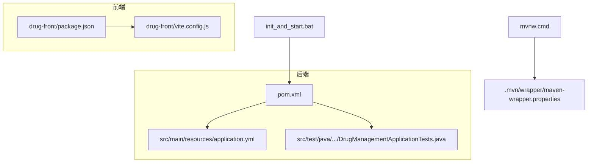
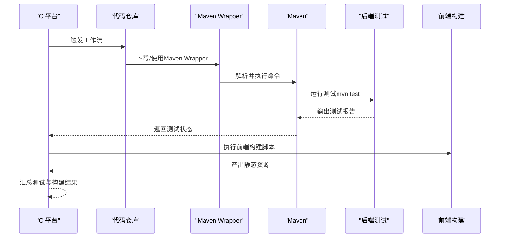
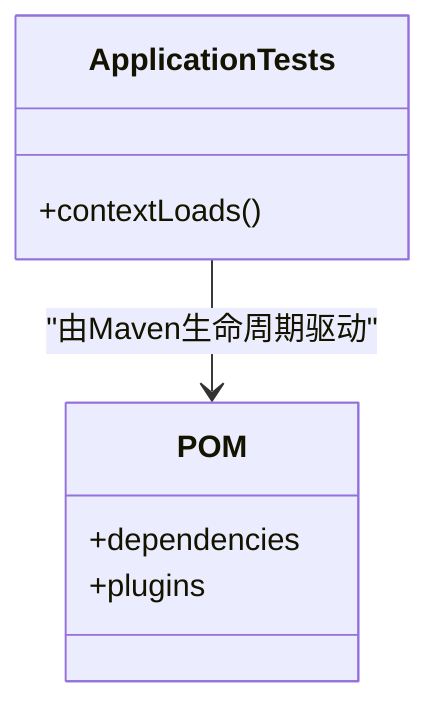
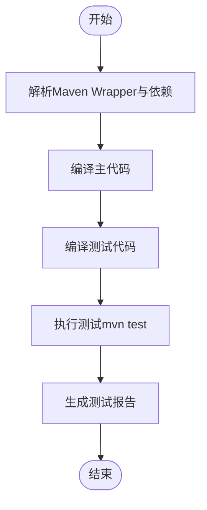
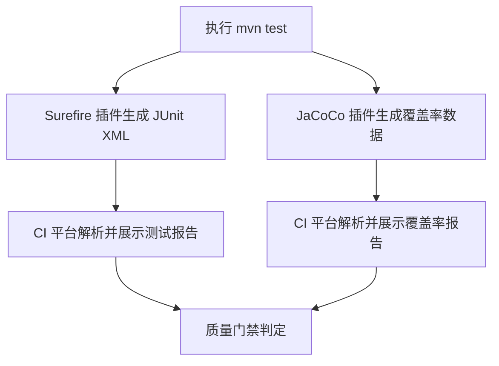
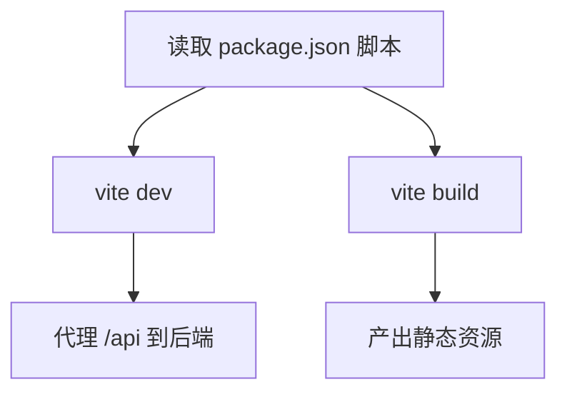
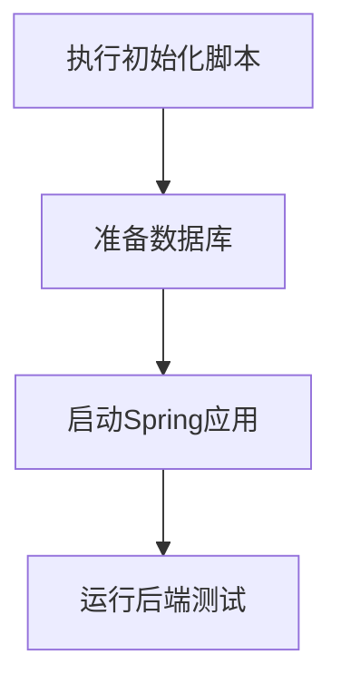
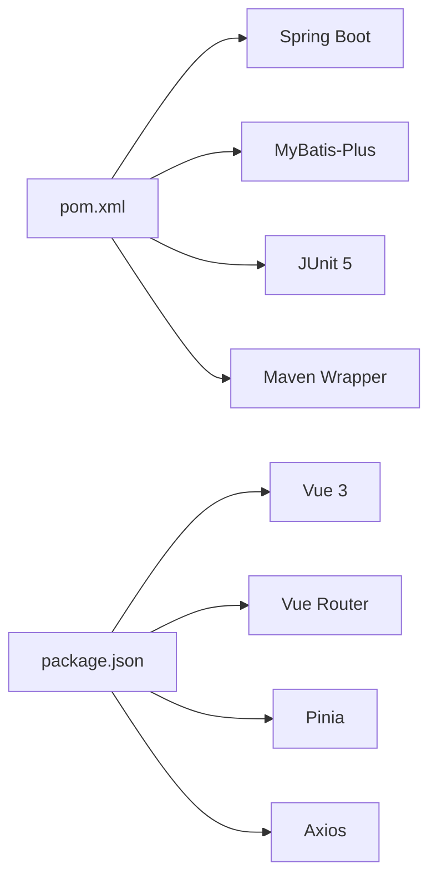

# 自动化测试

<cite>
**本文引用的文件**
- [pom.xml](file://pom.xml)
- [application.yml](file://src/main/resources/application.yml)
- [DrugManagementApplicationTests.java](file://src/test/java/com/hospital/drugmanagement/DrugManagementApplicationTests.java)
- [init_and_start.bat](file://init_and_start.bat)
- [mvnw.cmd](file://mvnw.cmd)
- [maven-wrapper.properties](file://.mvn/wrapper/maven-wrapper.properties)
- [package.json](file://drug-front/package.json)
- [vite.config.js](file://drug-front/vite.config.js)
</cite>

## 目录
1. [简介](#简介)
2. [项目结构](#项目结构)
3. [核心组件](#核心组件)
4. [架构总览](#架构总览)
5. [详细组件分析](#详细组件分析)
6. [依赖分析](#依赖分析)
7. [性能考虑](#性能考虑)
8. [故障排查指南](#故障排查指南)
9. [结论](#结论)
10. [附录](#附录)

## 简介
本文件面向持续集成与持续测试场景，系统性梳理本项目的测试自动化现状与可扩展方案。当前后端仓库仅包含基础的Spring Boot测试骨架，未集成覆盖率与报告插件；前端为Vue生态，具备构建与开发服务器能力。本文将从以下维度展开：
- Maven测试命令与测试生命周期
- 测试报告与覆盖率工具（如JaCoCo）的集成建议
- 在CI平台（如GitHub Actions）中配置自动化测试流程
- 测试失败处理机制与通知策略
- 前后端测试环境管理与数据准备
- 可视化图示与实操路径指引

## 项目结构
项目采用前后端分离架构：
- 后端：Spring Boot应用，位于根目录，使用Maven管理依赖与构建
- 前端：Vue 3 + Vite，位于 drug-front 子目录
- 共享资源：数据库初始化脚本与Spring配置文件

**图表来源**
- [pom.xml:1-119](file://pom.xml#L1-L119)
- [application.yml:1-24](file://src/main/resources/application.yml#L1-L24)
- [DrugManagementApplicationTests.java:1-14](file://src/test/java/com/hospital/drugmanagement/DrugManagementApplicationTests.java#L1-L14)
- [init_and_start.bat:1-11](file://init_and_start.bat#L1-L11)
- [mvnw.cmd:1-189](file://mvnw.cmd#L1-L189)
- [.mvn/wrapper/maven-wrapper.properties:1-4](file://.mvn/wrapper/maven-wrapper.properties#L1-L4)
- [package.json:1-29](file://drug-front/package.json#L1-L29)
- [vite.config.js:1-22](file://drug-front/vite.config.js#L1-L22)

**章节来源**
- [pom.xml:1-119](file://pom.xml#L1-L119)
- [application.yml:1-24](file://src/main/resources/application.yml#L1-L24)
- [DrugManagementApplicationTests.java:1-14](file://src/test/java/com/hospital/drugmanagement/DrugManagementApplicationTests.java#L1-L14)
- [init_and_start.bat:1-11](file://init_and_start.bat#L1-L11)
- [mvnw.cmd:1-189](file://mvnw.cmd#L1-L189)
- [.mvn/wrapper/maven-wrapper.properties:1-4](file://.mvn/wrapper/maven-wrapper.properties#L1-L4)
- [package.json:1-29](file://drug-front/package.json#L1-L29)
- [vite.config.js:1-22](file://drug-front/vite.config.js#L1-L22)

## 核心组件
- 后端测试骨架
  - 使用Spring Boot Test注解与JUnit 5，当前仅包含上下文加载测试方法
  - 适合后续扩展为单元测试、集成测试与端到端测试
- Maven构建与测试
  - 通过Maven插件体系管理编译、打包与测试生命周期
  - 提供Maven Wrapper以确保跨平台一致性
- 前端构建与开发
  - Vue 3 + Vite，提供开发服务器与构建产物
  - 代理配置指向后端服务端口，便于联调

**章节来源**
- [DrugManagementApplicationTests.java:1-14](file://src/test/java/com/hospital/drugmanagement/DrugManagementApplicationTests.java#L1-L14)
- [pom.xml:86-116](file://pom.xml#L86-L116)
- [mvnw.cmd:1-189](file://mvnw.cmd#L1-L189)
- [package.json:1-29](file://drug-front/package.json#L1-L29)
- [vite.config.js:1-22](file://drug-front/vite.config.js#L1-L22)

## 架构总览
下图展示了从CI触发到测试执行与结果产出的关键路径，涵盖后端测试与前端构建。

**图表来源**
- [mvnw.cmd:1-189](file://mvnw.cmd#L1-L189)
- [pom.xml:86-116](file://pom.xml#L86-L116)
- [package.json:8-12](file://drug-front/package.json#L8-L12)

## 详细组件分析

### 后端测试组件
- 测试骨架
  - 当前测试类用于验证Spring上下文是否能正确加载
  - 建议在此基础上扩展：
    - 单元测试：对Service层进行Mock与断言
    - 集成测试：使用Testcontainers或嵌入式数据库进行真实DB交互
    - 端到端测试：结合REST接口与数据库状态校验
- Maven测试插件
  - 默认由spring-boot-starter-test引入，支持JUnit 5与Mock框架
  - 可通过Maven Surefire/Failsafe插件配置报告格式与测试分类

**图表来源**
- [DrugManagementApplicationTests.java:1-14](file://src/test/java/com/hospital/drugmanagement/DrugManagementApplicationTests.java#L1-L14)
- [pom.xml:73-78](file://pom.xml#L73-L78)

**章节来源**
- [DrugManagementApplicationTests.java:1-14](file://src/test/java/com/hospital/drugmanagement/DrugManagementApplicationTests.java#L1-L14)
- [pom.xml:73-78](file://pom.xml#L73-L78)

### Maven测试命令与生命周期
- 基础命令
  - 使用Maven Wrapper统一执行测试：[mvnw.cmd:1-189](file://mvnw.cmd#L1-L189)
  - 标准命令：mvn test（或使用mvnw.cmd）
- 生命周期阶段
  - compile → test-compile → test（默认执行测试）
  - 可通过插件绑定自定义阶段以生成报告或覆盖率

**图表来源**
- [mvnw.cmd:1-189](file://mvnw.cmd#L1-L189)
- [pom.xml:86-116](file://pom.xml#L86-L116)

**章节来源**
- [mvnw.cmd:1-189](file://mvnw.cmd#L1-L189)
- [pom.xml:86-116](file://pom.xml#L86-L116)

### 测试报告与覆盖率（JaCoCo）
- 报告生成
  - 在Maven中添加Surefire插件以输出JUnit XML报告
  - 在CI平台中配置“发布测试报告”步骤以可视化失败用例
- 覆盖率统计（JaCoCo）
  - 在POM中添加JaCoCo插件，绑定到verify阶段
  - 生成覆盖率报告（HTML/XML），在CI中上传Artifacts或发布到覆盖率平台
- 建议配置要点
  - 将覆盖率阈值纳入质量门禁（例如语句覆盖率不低于某百分比）
  - 对关键模块（Service/DAO）单独统计并对比趋势

**图表来源**
- [pom.xml:86-116](file://pom.xml#L86-L116)

**章节来源**
- [pom.xml:86-116](file://pom.xml#L86-L116)

### 前端测试与构建
- 构建与开发
  - 使用Vite进行开发与生产构建，脚本定义于package.json
  - 开发服务器代理后端接口，便于联调
- 测试建议
  - 引入Vitest或Jest进行单元测试
  - 结合Cypress或Playwright进行端到端测试
  - 在CI中分阶段执行：安装依赖 → 构建 → 测试 → 产物归档

**图表来源**
- [package.json:8-12](file://drug-front/package.json#L8-L12)
- [vite.config.js:12-20](file://drug-front/vite.config.js#L12-L20)

**章节来源**
- [package.json:1-29](file://drug-front/package.json#L1-L29)
- [vite.config.js:1-22](file://drug-front/vite.config.js#L1-L22)

### 测试环境管理与数据准备
- 后端
  - 使用Spring配置文件中的数据源连接信息
  - 初始化脚本用于重建数据库结构与基础数据
- 前端
  - 通过Vite代理访问后端服务，无需额外前端测试数据库

**图表来源**
- [application.yml:3-7](file://src/main/resources/application.yml#L3-L7)
- [init_and_start.bat:4-9](file://init_and_start.bat#L4-L9)

**章节来源**
- [application.yml:1-24](file://src/main/resources/application.yml#L1-L24)
- [init_and_start.bat:1-11](file://init_and_start.bat#L1-L11)

### CI/CD流水线配置（概念性说明）
- GitHub Actions（示例思路）
  - 作业阶段
    - 设置Java与Maven版本
    - 恢复Maven缓存
    - 安装依赖（后端与前端）
    - 初始化数据库（可选容器）
    - 运行后端测试与覆盖率收集
    - 运行前端构建与测试
    - 发布Artifacts与测试报告
  - 失败处理
    - 失败时发送通知（邮件/聊天工具）
    - 可选重试策略（网络波动导致的临时失败）
- GitLab CI（示例思路）
  - 使用Docker镜像作为Runner环境
  - 通过变量注入数据库连接信息
  - 将测试报告与覆盖率上传至制品库

[本节为通用CI实践说明，不直接分析具体文件，故不附“章节来源”]

## 依赖分析
- 后端依赖
  - Spring Boot Starter Web、Thymeleaf、MyBatis-Plus、MySQL驱动、测试Starter
- 前端依赖
  - Vue 3、Vue Router、Pinia、Element Plus、Axios等
- 构建与包装
  - Maven Wrapper确保一致的Maven版本与下载行为

**图表来源**
- [pom.xml:32-84](file://pom.xml#L32-L84)
- [package.json:13-27](file://drug-front/package.json#L13-L27)
- [maven-wrapper.properties:1-4](file://.mvn/wrapper/maven-wrapper.properties#L1-L4)

**章节来源**
- [pom.xml:32-84](file://pom.xml#L32-L84)
- [package.json:1-29](file://drug-front/package.json#L1-L29)
- [.mvn/wrapper/maven-wrapper.properties:1-4](file://.mvn/wrapper/maven-wrapper.properties#L1-L4)

## 性能考虑
- 测试执行时间优化
  - 并行测试（JUnit Platform配置）
  - 使用嵌入式数据库或内存数据库减少IO
  - 缓存Maven依赖与Node模块
- 报告与覆盖率生成
  - 控制报告粒度，避免过大的XML/HTML文件
  - 仅在PR与主分支上启用覆盖率统计，减少CI负载

[本节提供通用指导，不直接分析具体文件，故不附“章节来源”]

## 故障排查指南
- Maven Wrapper问题
  - 现象：无法找到MAVEN_HOME或下载失败
  - 排查：确认distributionUrl与网络代理；检查wrapperVersion与distributionType
- 数据库连接失败
  - 现象：测试或启动时连接被拒绝
  - 排查：确认本地MySQL服务状态、账号密码、端口与字符集配置
- 前端代理无效
  - 现象：开发时接口404或跨域
  - 排查：确认Vite代理目标地址与后端端口一致

**章节来源**
- [mvnw.cmd:72-100](file://mvnw.cmd#L72-L100)
- [maven-wrapper.properties:1-4](file://.mvn/wrapper/maven-wrapper.properties#L1-L4)
- [application.yml:3-7](file://src/main/resources/application.yml#L3-L7)
- [vite.config.js:14-19](file://drug-front/vite.config.js#L14-L19)

## 结论
当前项目已具备基础的后端测试骨架与Maven构建能力，建议在现有基础上：
- 引入JaCoCo与Surefire插件完善测试报告与覆盖率
- 在CI平台中串联后端测试、前端构建与测试
- 建立失败通知与可选重试机制
- 逐步扩展单元测试与端到端测试覆盖面

[本节为总结性内容，不直接分析具体文件，故不附“章节来源”]

## 附录
- 关键文件路径与用途
  - pom.xml：后端依赖与插件配置
  - application.yml：数据库与MyBatis-Plus配置
  - DrugManagementApplicationTests.java：测试入口
  - mvnw.cmd 与 .mvn/wrapper/maven-wrapper.properties：Maven包装器
  - init_and_start.bat：数据库初始化与后端启动
  - package.json 与 vite.config.js：前端构建与开发代理

**章节来源**
- [pom.xml:1-119](file://pom.xml#L1-L119)
- [application.yml:1-24](file://src/main/resources/application.yml#L1-L24)
- [DrugManagementApplicationTests.java:1-14](file://src/test/java/com/hospital/drugmanagement/DrugManagementApplicationTests.java#L1-L14)
- [mvnw.cmd:1-189](file://mvnw.cmd#L1-L189)
- [.mvn/wrapper/maven-wrapper.properties:1-4](file://.mvn/wrapper/maven-wrapper.properties#L1-L4)
- [init_and_start.bat:1-11](file://init_and_start.bat#L1-L11)
- [package.json:1-29](file://drug-front/package.json#L1-L29)
- [vite.config.js:1-22](file://drug-front/vite.config.js#L1-L22)