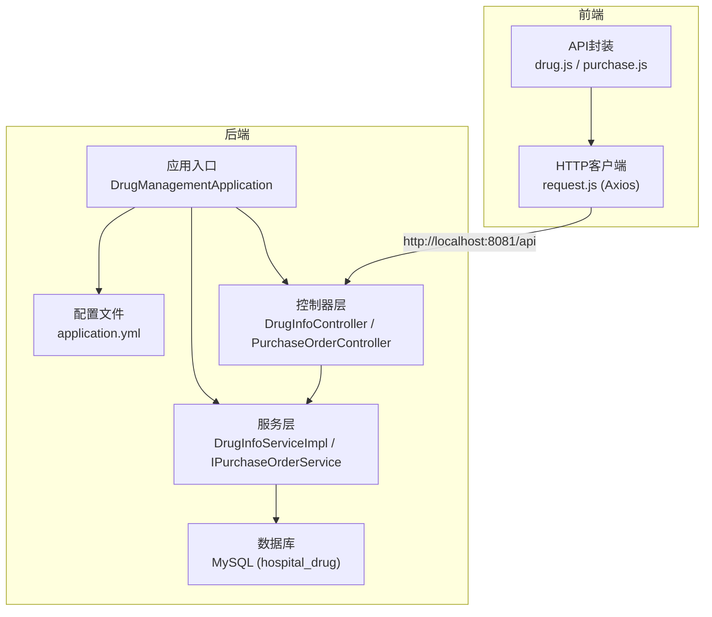
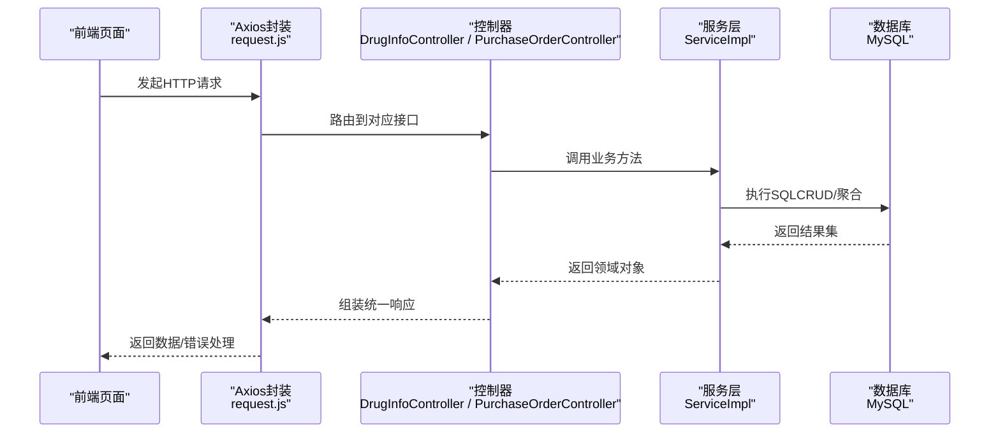
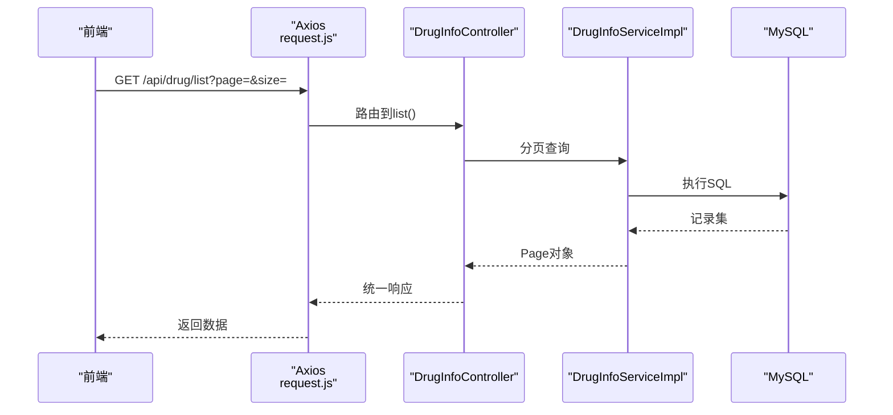
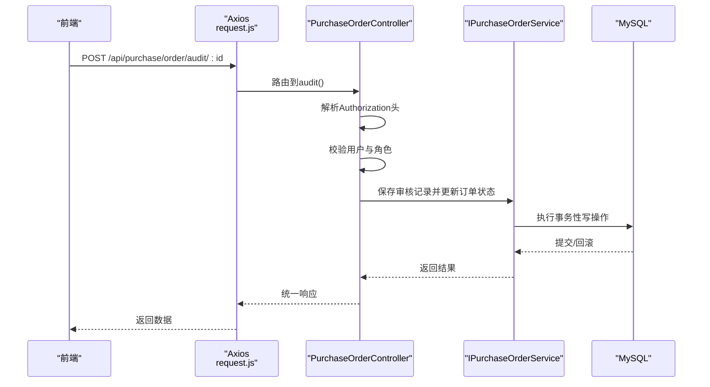
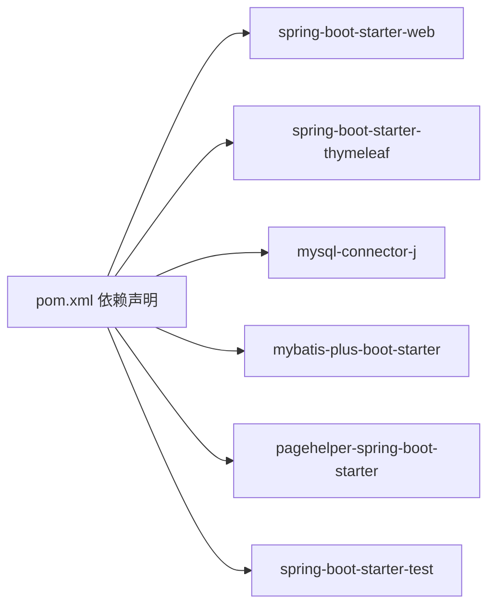

# 集成测试

<cite>
**本文引用的文件**
- [DrugManagementApplication.java](file://src/main/java/com/hospital/drugmanagement/DrugManagementApplication.java)
- [application.yml](file://src/main/resources/application.yml)
- [init.sql](file://src/main/resources/db/init.sql)
- [pom.xml](file://pom.xml)
- [DrugManagementApplicationTests.java](file://src/test/java/com/hospital/drugmanagement/DrugManagementApplicationTests.java)
- [DrugInfoController.java](file://src/main/java/com/hospital/drugmanagement/controller/DrugInfoController.java)
- [PurchaseOrderController.java](file://src/main/java/com/hospital/drugmanagement/controller/PurchaseOrderController.java)
- [DrugInfoServiceImpl.java](file://src/main/java/com/hospital/drugmanagement/service/impl/DrugInfoServiceImpl.java)
- [IPurchaseOrderService.java](file://src/main/java/com/hospital/drugmanagement/service/IPurchaseOrderService.java)
- [drug.js](file://drug-front/src/api/drug.js)
- [purchase.js](file://drug-front/src/api/purchase.js)
- [request.js](file://drug-front/src/utils/request.js)
</cite>

## 目录
1. [简介](#简介)
2. [项目结构](#项目结构)
3. [核心组件](#核心组件)
4. [架构概览](#架构概览)
5. [详细组件分析](#详细组件分析)
6. [依赖分析](#依赖分析)
7. [性能考虑](#性能考虑)
8. [故障排查指南](#故障排查指南)
9. [结论](#结论)
10. [附录](#附录)

## 简介
本文件面向药品管理系统后端服务的集成测试，覆盖与数据库、外部服务（前端）的端到端测试方法。重点包括：
- 测试环境数据库连接配置（MySQL与初始化脚本）
- 使用Spring Boot Test进行API集成测试
- 验证请求-响应流程与数据库事务性
- 设计端到端测试场景（用户认证、药品采购、库存管理）
- 提供可直接参考的测试实现路径与最佳实践

## 项目结构
后端采用Spring Boot + MyBatis-Plus架构，数据库连接在应用配置中集中管理；前端通过Axios向后端发起REST请求。

图表来源
- [DrugManagementApplication.java:14-24](file://src/main/java/com/hospital/drugmanagement/DrugManagementApplication.java#L14-L24)
- [application.yml:1-24](file://src/main/resources/application.yml#L1-L24)
- [DrugInfoController.java:14-169](file://src/main/java/com/hospital/drugmanagement/controller/DrugInfoController.java#L14-L169)
- [PurchaseOrderController.java:26-396](file://src/main/java/com/hospital/drugmanagement/controller/PurchaseOrderController.java#L26-L396)
- [DrugInfoServiceImpl.java:13-18](file://src/main/java/com/hospital/drugmanagement/service/impl/DrugInfoServiceImpl.java#L13-L18)
- [IPurchaseOrderService.java:1-7](file://src/main/java/com/hospital/drugmanagement/service/IPurchaseOrderService.java#L1-L7)

章节来源
- [DrugManagementApplication.java:14-33](file://src/main/java/com/hospital/drugmanagement/DrugManagementApplication.java#L14-L33)
- [application.yml:1-24](file://src/main/resources/application.yml#L1-L24)

## 核心组件
- 应用入口与组件扫描：确保控制器、服务、配置被正确加载，便于测试时启动完整上下文。
- 数据源配置：MySQL驱动、URL、用户名、密码及MyBatis-Plus配置。
- 控制器API：提供药品与采购订单的CRUD与业务操作接口。
- 服务层：基于MyBatis-Plus的IService实现，提供基础CRUD能力。
- 前端Axios封装：统一设置基础URL、超时、拦截器处理。

章节来源
- [DrugManagementApplication.java:14-33](file://src/main/java/com/hospital/drugmanagement/DrugManagementApplication.java#L14-L33)
- [application.yml:1-24](file://src/main/resources/application.yml#L1-L24)
- [DrugInfoController.java:14-169](file://src/main/java/com/hospital/drugmanagement/controller/DrugInfoController.java#L14-L169)
- [PurchaseOrderController.java:26-396](file://src/main/java/com/hospital/drugmanagement/controller/PurchaseOrderController.java#L26-L396)
- [DrugInfoServiceImpl.java:13-18](file://src/main/java/com/hospital/drugmanagement/service/impl/DrugInfoServiceImpl.java#L13-L18)
- [IPurchaseOrderService.java:1-7](file://src/main/java/com/hospital/drugmanagement/service/IPurchaseOrderService.java#L1-L7)
- [drug.js:1-45](file://drug-front/src/api/drug.js#L1-L45)
- [purchase.js:1-63](file://drug-front/src/api/purchase.js#L1-L63)
- [request.js:1-56](file://drug-front/src/utils/request.js#L1-L56)

## 架构概览
后端通过Spring MVC暴露REST接口，前端通过Axios调用，数据库由MySQL承载，初始化脚本用于构建基础表结构与演示数据。

图表来源
- [request.js:5-56](file://drug-front/src/utils/request.js#L5-L56)
- [DrugInfoController.java:22-169](file://src/main/java/com/hospital/drugmanagement/controller/DrugInfoController.java#L22-L169)
- [PurchaseOrderController.java:52-396](file://src/main/java/com/hospital/drugmanagement/controller/PurchaseOrderController.java#L52-L396)
- [DrugInfoServiceImpl.java:13-18](file://src/main/java/com/hospital/drugmanagement/service/impl/DrugInfoServiceImpl.java#L13-L18)
- [IPurchaseOrderService.java:1-7](file://src/main/java/com/hospital/drugmanagement/service/IPurchaseOrderService.java#L1-L7)

## 详细组件分析

### 测试环境配置与数据库初始化
- 数据库连接：在应用配置中指定MySQL驱动、URL、用户名、密码与MyBatis-Plus参数。
- 初始化脚本：包含数据库创建、表结构定义与演示数据插入，便于快速搭建测试环境。
- 测试策略建议：
  - 单元测试：针对服务层方法进行隔离测试。
  - 集成测试：使用Spring Boot Test启动完整上下文，结合内存数据库或测试专用数据库实例。
  - 端到端测试：从前端发起HTTP请求，验证端到端流程。

章节来源
- [application.yml:1-24](file://src/main/resources/application.yml#L1-L24)
- [init.sql:1-312](file://src/main/resources/db/init.sql#L1-L312)
- [pom.xml:32-84](file://pom.xml#L32-L84)

### API集成测试：药品管理
- 接口范围：分页查询、详情、新增、修改、删除。
- 测试要点：
  - 正向场景：构造合法参数，断言响应码与数据字段。
  - 异常场景：重复编码/名称、非法参数、异常抛出。
  - 事务性：在事务作用域内执行写操作，验证提交/回滚一致性。
- 参考实现路径：
  - 控制器方法：[DrugInfoController.java:22-169](file://src/main/java/com/hospital/drugmanagement/controller/DrugInfoController.java#L22-L169)
  - 服务实现：[DrugInfoServiceImpl.java:13-18](file://src/main/java/com/hospital/drugmanagement/service/impl/DrugInfoServiceImpl.java#L13-L18)

图表来源
- [drug.js:3-10](file://drug-front/src/api/drug.js#L3-L10)
- [request.js:5-56](file://drug-front/src/utils/request.js#L5-L56)
- [DrugInfoController.java:22-58](file://src/main/java/com/hospital/drugmanagement/controller/DrugInfoController.java#L22-L58)
- [DrugInfoServiceImpl.java:13-18](file://src/main/java/com/hospital/drugmanagement/service/impl/DrugInfoServiceImpl.java#L13-L18)

章节来源
- [DrugInfoController.java:22-169](file://src/main/java/com/hospital/drugmanagement/controller/DrugInfoController.java#L22-L169)
- [DrugInfoServiceImpl.java:13-18](file://src/main/java/com/hospital/drugmanagement/service/impl/DrugInfoServiceImpl.java#L13-L18)
- [drug.js:1-45](file://drug-front/src/api/drug.js#L1-L45)
- [request.js:1-56](file://drug-front/src/utils/request.js#L1-L56)

### API集成测试：采购订单与审核
- 接口范围：列表查询、详情、新增、修改、删除、审核、作废。
- 关键业务点：
  - 审核权限校验：基于角色判断（管理员/审核员）。
  - 审核记录：保存审核历史与状态变更。
  - 作废流程：根据订单状态进行合法性检查。
- 参考实现路径：
  - 控制器方法：[PurchaseOrderController.java:52-396](file://src/main/java/com/hospital/drugmanagement/controller/PurchaseOrderController.java#L52-L396)
  - 服务接口：[IPurchaseOrderService.java:1-7](file://src/main/java/com/hospital/drugmanagement/service/IPurchaseOrderService.java#L1-L7)

图表来源
- [purchase.js:46-53](file://drug-front/src/api/purchase.js#L46-L53)
- [request.js:5-56](file://drug-front/src/utils/request.js#L5-L56)
- [PurchaseOrderController.java:278-364](file://src/main/java/com/hospital/drugmanagement/controller/PurchaseOrderController.java#L278-L364)
- [IPurchaseOrderService.java:1-7](file://src/main/java/com/hospital/drugmanagement/service/IPurchaseOrderService.java#L1-L7)

章节来源
- [PurchaseOrderController.java:52-396](file://src/main/java/com/hospital/drugmanagement/controller/PurchaseOrderController.java#L52-L396)
- [purchase.js:1-63](file://drug-front/src/api/purchase.js#L1-L63)
- [request.js:1-56](file://drug-front/src/utils/request.js#L1-L56)

### 端到端测试设计思路
- 用户认证流程：
  - 前端通过Axios发送登录请求，携带Authorization头。
  - 控制器解析Token并校验角色，返回授权结果。
  - 测试要点：Token格式、角色权限、未授权重定向。
- 药品采购流程：
  - 新增采购单 → 审核 → 作废（按状态机）。
  - 测试要点：状态流转、审核记录、异常分支。
- 库存管理流程：
  - 入库/出库与库存表联动，校验数量与批次。
  - 测试要点：事务一致性、索引约束、边界值。

章节来源
- [request.js:11-25](file://drug-front/src/utils/request.js#L11-L25)
- [PurchaseOrderController.java:278-396](file://src/main/java/com/hospital/drugmanagement/controller/PurchaseOrderController.java#L278-L396)
- [init.sql:240-312](file://src/main/resources/db/init.sql#L240-L312)

## 依赖分析
- Spring Boot Starter Web：提供Web容器与MVC支持。
- MyBatis-Plus：简化DAO与分页查询。
- MySQL Connector/J：数据库驱动。
- PageHelper：分页插件。
- Lombok：减少样板代码。

图表来源
- [pom.xml:32-84](file://pom.xml#L32-L84)

章节来源
- [pom.xml:32-84](file://pom.xml#L32-L84)

## 性能考虑
- SQL日志：开启MyBatis-Plus SQL输出，便于定位慢查询与重复查询。
- 分页优化：合理使用Page对象，避免一次性加载大结果集。
- 连接池：在测试环境中可使用HikariCP默认配置，关注最大连接数与空闲超时。
- 缓存：对只读数据（如字典、枚举）可引入Redis缓存，减少数据库压力。

章节来源
- [application.yml:18-24](file://src/main/resources/application.yml#L18-L24)

## 故障排查指南
- 启动失败：确认数据库连接参数与MySQL服务状态。
- SQL异常：检查初始化脚本是否执行，索引与外键约束是否满足。
- 前端401：检查Authorization头是否正确传递，Token是否过期。
- 审核失败：确认用户角色与订单状态是否符合业务规则。

章节来源
- [application.yml:1-24](file://src/main/resources/application.yml#L1-L24)
- [request.js:27-53](file://drug-front/src/utils/request.js#L27-L53)
- [PurchaseOrderController.java:278-364](file://src/main/java/com/hospital/drugmanagement/controller/PurchaseOrderController.java#L278-L364)

## 结论
通过Spring Boot Test与Axios的组合，可有效覆盖后端服务与数据库、前端的集成测试。建议以“单元测试打地基、集成测试测流程、端到端测试验闭环”的分层策略推进测试工作，配合初始化脚本与清晰的业务接口，确保测试稳定可靠。

## 附录
- 测试环境准备步骤（概述）
  - 准备MySQL实例，执行初始化脚本创建数据库与表。
  - 启动后端应用，确认端口与数据源配置。
  - 前端设置Axios基础URL指向后端服务。
- 测试数据管理建议
  - 使用独立测试数据库或Schema，避免与生产数据冲突。
  - 在测试套件开始前清理/重建必要表，结束时回滚或清空。
- 测试结果验证清单
  - 响应码：200/4xx/5xx是否符合预期。
  - 响应体：字段完整性、类型与取值范围。
  - 数据库：事务性、幂等性、并发安全。
  - 前端：错误提示、路由跳转、UI状态同步。