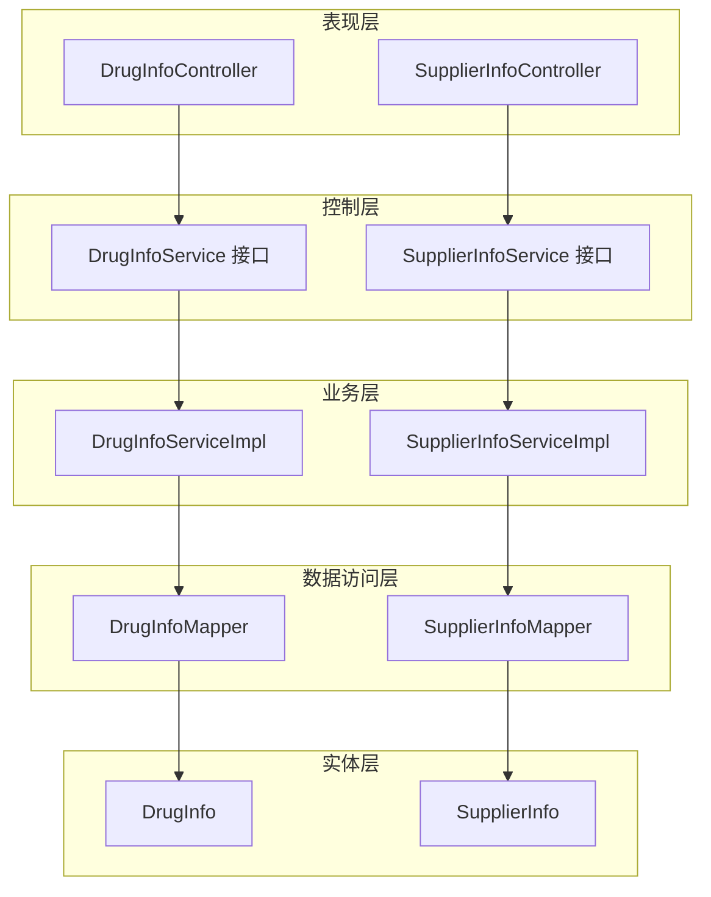
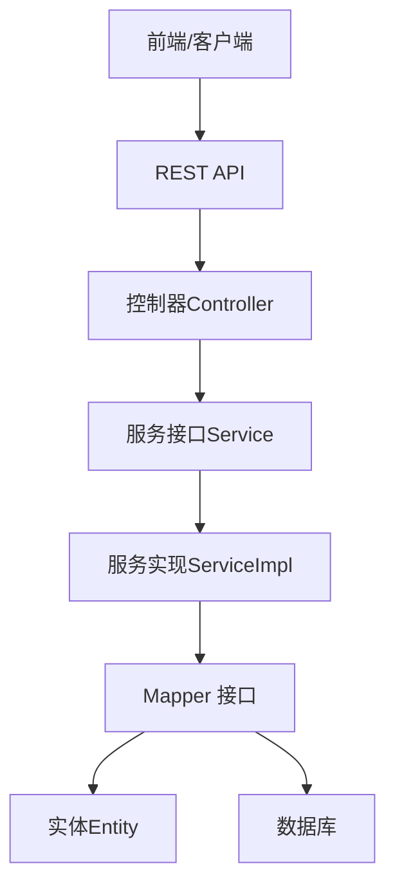
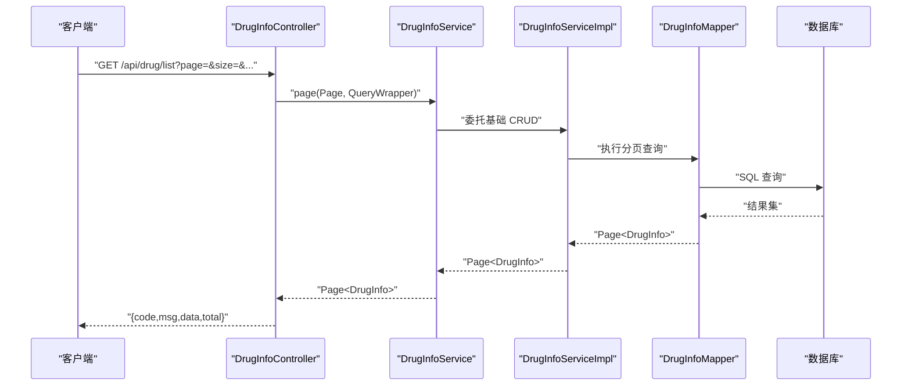
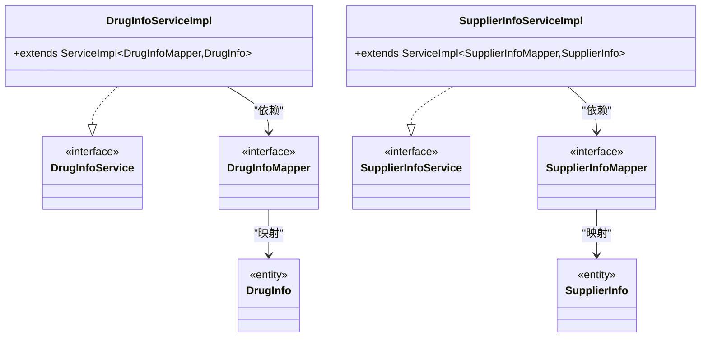
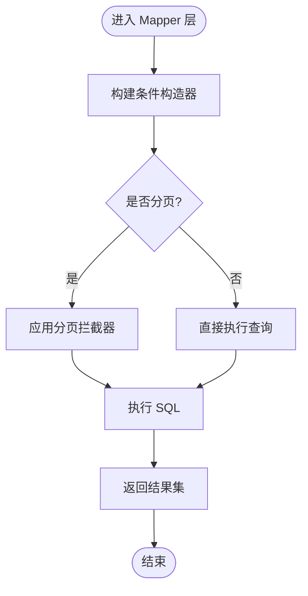
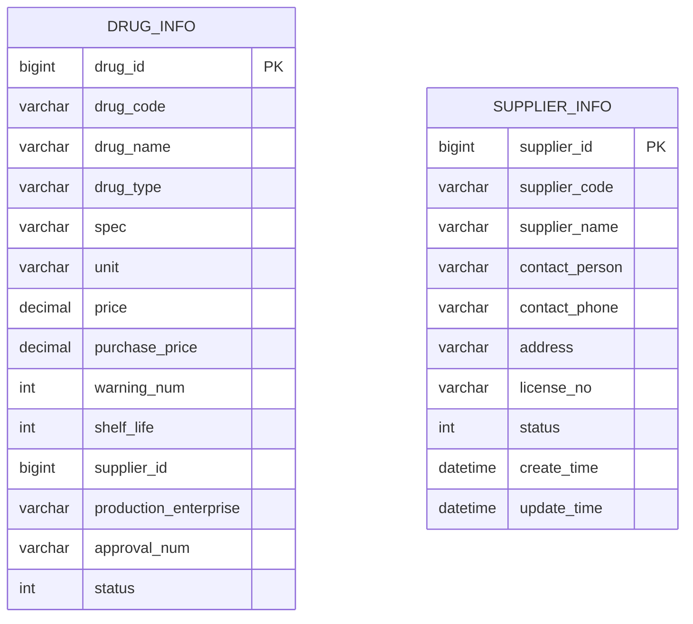
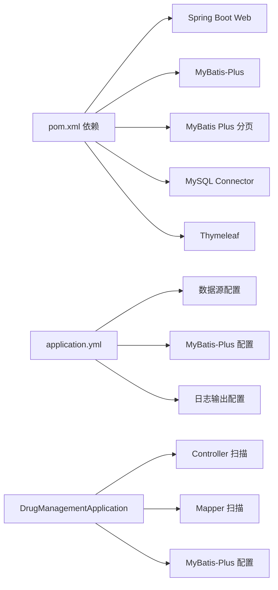

# 分层架构设计

<cite>
**本文引用的文件**
- [DrugManagementApplication.java](file://src/main/java/com/hospital/drugmanagement/DrugManagementApplication.java)
- [DrugInfoController.java](file://src/main/java/com/hospital/drugmanagement/controller/DrugInfoController.java)
- [SupplierInfoController.java](file://src/main/java/com/hospital/drugmanagement/controller/SupplierInfoController.java)
- [DrugInfoServiceImpl.java](file://src/main/java/com/hospital/drugmanagement/service/impl/DrugInfoServiceImpl.java)
- [SupplierInfoServiceImpl.java](file://src/main/java/com/hospital/drugmanagement/service/impl/SupplierInfoServiceImpl.java)
- [DrugInfoMapper.java](file://src/main/java/com/hospital/drugmanagement/mapper/DrugInfoMapper.java)
- [SupplierInfoMapper.java](file://src/main/java/com/hospital/drugmanagement/mapper/SupplierInfoMapper.java)
- [DrugInfo.java](file://src/main/java/com/hospital/drugmanagement/entity/DrugInfo.java)
- [SupplierInfo.java](file://src/main/java/com/hospital/drugmanagement/entity/SupplierInfo.java)
- [Result.java](file://src/main/java/com/hospital/drugmanagement/dto/Result.java)
- [MybatisPlusConfig.java](file://src/main/java/com/hospital/drugmanagement/config/MybatisPlusConfig.java)
- [MyMetaObjectHandler.java](file://src/main/java/com/hospital/drugmanagement/common/handler/MyMetaObjectHandler.java)
- [application.yml](file://src/main/resources/application.yml)
- [pom.xml](file://pom.xml)
</cite>

## 目录
1. [引言](#引言)
2. [项目结构](#项目结构)
3. [核心组件](#核心组件)
4. [架构总览](#架构总览)
5. [详细组件分析](#详细组件分析)
6. [依赖分析](#依赖分析)
7. [性能考虑](#性能考虑)
8. [故障排查指南](#故障排查指南)
9. [结论](#结论)
10. [附录](#附录)

## 引言
本文件面向医院药品管理系统，系统采用经典的四层架构设计：表现层（Controller）、控制层（Service）、业务层（Service 实现与业务编排）、数据访问层（Mapper）。本文从职责边界、接口定义、依赖关系与交互模式出发，结合具体代码路径，系统化阐述各层在实际项目中的落地方式，并通过多种架构图直观展示层间关系与调用流程。

## 项目结构
系统采用基于 Maven 的标准 Java 工程布局，核心代码位于 src/main/java 下，按领域与层次划分包结构：
- 表现层：controller 包，负责接收 HTTP 请求、参数校验、组织响应
- 控制层：service 接口与实现包，负责业务编排、事务与规则
- 数据访问层：mapper 包，提供 MyBatis-Plus 基础 CRUD 与扩展
- 实体层：entity 包，承载数据模型与 ORM 映射
- 配置与公共组件：config、common 等包
- 资源与配置：application.yml、mapper XML 等

**图表来源**
- [DrugInfoController.java:1-169](file://src/main/java/com/hospital/drugmanagement/controller/DrugInfoController.java#L1-L169)
- [SupplierInfoController.java:1-176](file://src/main/java/com/hospital/drugmanagement/controller/SupplierInfoController.java#L1-L176)
- [DrugInfoServiceImpl.java:1-18](file://src/main/java/com/hospital/drugmanagement/service/impl/DrugInfoServiceImpl.java#L1-L18)
- [SupplierInfoServiceImpl.java:1-11](file://src/main/java/com/hospital/drugmanagement/service/impl/SupplierInfoServiceImpl.java#L1-L11)
- [DrugInfoMapper.java:1-9](file://src/main/java/com/hospital/drugmanagement/mapper/DrugInfoMapper.java#L1-L9)
- [SupplierInfoMapper.java:1-7](file://src/main/java/com/hospital/drugmanagement/mapper/SupplierInfoMapper.java#L1-L7)
- [DrugInfo.java:1-167](file://src/main/java/com/hospital/drugmanagement/entity/DrugInfo.java#L1-L167)
- [SupplierInfo.java:1-39](file://src/main/java/com/hospital/drugmanagement/entity/SupplierInfo.java#L1-L39)

**章节来源**
- [DrugManagementApplication.java:1-33](file://src/main/java/com/hospital/drugmanagement/DrugManagementApplication.java#L1-L33)
- [application.yml:1-24](file://src/main/resources/application.yml#L1-L24)
- [pom.xml:1-119](file://pom.xml#L1-L119)

## 核心组件
- 应用入口与扫描配置：应用启动类负责包扫描与 Mapper 扫描，并通过 Import 将特定 Controller 注册到 Spring 容器，确保接口可被访问。
- 控制器（Controller）：以 RESTful 方式暴露接口，负责参数解析、简单参数校验、调用服务层并统一响应包装。
- 服务接口与实现（Service）：基于 MyBatis-Plus 的 IService/ServiceImpl，复用基础 CRUD；复杂业务逻辑可在实现类中扩展。
- 数据访问层（Mapper）：继承 BaseMapper，提供基础查询能力；配合 MyBatis-Plus 插件实现分页与自动填充。
- 实体层（Entity）：使用注解完成表与字段映射，部分实体集成自动填充注解以实现审计字段自动赋值。
- 统一响应 DTO：Result 类提供统一的响应结构与静态工厂方法，便于控制器快速构造响应。

**章节来源**
- [DrugManagementApplication.java:14-24](file://src/main/java/com/hospital/drugmanagement/DrugManagementApplication.java#L14-L24)
- [Result.java:1-99](file://src/main/java/com/hospital/drugmanagement/dto/Result.java#L1-L99)
- [MybatisPlusConfig.java:1-16](file://src/main/java/com/hospital/drugmanagement/config/MybatisPlusConfig.java#L1-L16)
- [MyMetaObjectHandler.java:1-60](file://src/main/java/com/hospital/drugmanagement/common/handler/MyMetaObjectHandler.java#L1-L60)

## 架构总览
系统遵循“表现层-控制层-业务层-数据访问层”的分层原则，控制器仅负责请求接入与响应封装，业务层负责编排与规则，数据访问层专注持久化。MyBatis-Plus 提供 ORM、分页与自动填充能力，Spring Boot 负责装配与运行。

**图表来源**
- [DrugInfoController.java:14-169](file://src/main/java/com/hospital/drugmanagement/controller/DrugInfoController.java#L14-L169)
- [SupplierInfoController.java:12-176](file://src/main/java/com/hospital/drugmanagement/controller/SupplierInfoController.java#L12-L176)
- [DrugInfoServiceImpl.java:13-18](file://src/main/java/com/hospital/drugmanagement/service/impl/DrugInfoServiceImpl.java#L13-L18)
- [SupplierInfoServiceImpl.java:9-11](file://src/main/java/com/hospital/drugmanagement/service/impl/SupplierInfoServiceImpl.java#L9-L11)
- [DrugInfoMapper.java:7-9](file://src/main/java/com/hospital/drugmanagement/mapper/DrugInfoMapper.java#L7-L9)
- [SupplierInfoMapper.java:6-7](file://src/main/java/com/hospital/drugmanagement/mapper/SupplierInfoMapper.java#L6-L7)
- [DrugInfo.java:9-10](file://src/main/java/com/hospital/drugmanagement/entity/DrugInfo.java#L9-L10)
- [SupplierInfo.java:12-14](file://src/main/java/com/hospital/drugmanagement/entity/SupplierInfo.java#L12-L14)

## 详细组件分析

### 表现层（Controller）
- 职责边界：接收 HTTP 请求、参数解析、简单参数校验、调用服务层、统一响应封装。
- 接口定义：基于 Spring MVC 注解，提供 GET/POST/PUT/DELETE 等常用端点。
- 交互模式：控制器直接注入服务接口，调用其方法后组装 Map 或 Result 对象返回。
- 典型流程：控制器接收请求 -> 构造查询条件或校验参数 -> 调用服务层 -> 捕获异常并返回错误响应 -> 返回统一结构。

**图表来源**
- [DrugInfoController.java:22-58](file://src/main/java/com/hospital/drugmanagement/controller/DrugInfoController.java#L22-L58)
- [DrugInfoServiceImpl.java:14-18](file://src/main/java/com/hospital/drugmanagement/service/impl/DrugInfoServiceImpl.java#L14-L18)
- [DrugInfoMapper.java:7-9](file://src/main/java/com/hospital/drugmanagement/mapper/DrugInfoMapper.java#L7-L9)
- [MybatisPlusConfig.java:10-15](file://src/main/java/com/hospital/drugmanagement/config/MybatisPlusConfig.java#L10-L15)

**章节来源**
- [DrugInfoController.java:14-169](file://src/main/java/com/hospital/drugmanagement/controller/DrugInfoController.java#L14-L169)
- [SupplierInfoController.java:12-176](file://src/main/java/com/hospital/drugmanagement/controller/SupplierInfoController.java#L12-L176)

### 控制层（Service 接口与实现）
- 职责边界：定义业务契约，提供抽象方法；实现类基于 MyBatis-Plus 复用基础 CRUD，必要时扩展复杂逻辑。
- 依赖关系：实现类依赖对应的 Mapper，通过泛型指定实体类型；服务接口继承 IService，获得分页、条件构造等能力。
- 交互模式：控制器调用服务接口，实现类通过 Mapper 访问数据库；复杂场景可在实现类中进行多表关联、事务控制与规则校验。

**图表来源**
- [DrugInfoServiceImpl.java:13-18](file://src/main/java/com/hospital/drugmanagement/service/impl/DrugInfoServiceImpl.java#L13-L18)
- [SupplierInfoServiceImpl.java:9-11](file://src/main/java/com/hospital/drugmanagement/service/impl/SupplierInfoServiceImpl.java#L9-L11)
- [DrugInfoMapper.java:7-9](file://src/main/java/com/hospital/drugmanagement/mapper/DrugInfoMapper.java#L7-L9)
- [SupplierInfoMapper.java:6-7](file://src/main/java/com/hospital/drugmanagement/mapper/SupplierInfoMapper.java#L6-L7)
- [DrugInfo.java:9-10](file://src/main/java/com/hospital/drugmanagement/entity/DrugInfo.java#L9-L10)
- [SupplierInfo.java:12-14](file://src/main/java/com/hospital/drugmanagement/entity/SupplierInfo.java#L12-L14)

**章节来源**
- [DrugInfoServiceImpl.java:1-18](file://src/main/java/com/hospital/drugmanagement/service/impl/DrugInfoServiceImpl.java#L1-L18)
- [SupplierInfoServiceImpl.java:1-11](file://src/main/java/com/hospital/drugmanagement/service/impl/SupplierInfoServiceImpl.java#L1-L11)

### 业务层（Service 实现与业务编排）
- 事务管理：系统未显式声明事务注解，表明当前实现以 MyBatis-Plus 默认行为为主；若需跨多个 Mapper 的一致性操作，应在实现类上添加事务注解。
- 业务规则：控制器内已体现部分规则（如唯一性校验），复杂规则建议迁移至服务实现类，保持控制器薄化。
- 服务编排：通过组合多个 Mapper 或服务接口实现复杂业务流程；当前示例以单表 CRUD 为主，可在此基础上扩展。

**章节来源**
- [DrugInfoController.java:76-151](file://src/main/java/com/hospital/drugmanagement/controller/DrugInfoController.java#L76-L151)
- [SupplierInfoController.java:66-159](file://src/main/java/com/hospital/drugmanagement/controller/SupplierInfoController.java#L66-L159)

### 数据访问层（Mapper）
- CRUD 操作：Mapper 继承 BaseMapper，天然具备基础 CRUD 能力；分页由 MyBatis-Plus 插件提供。
- ORM 映射：实体类通过注解映射表与字段；MyBatis-Plus 配置开启下划线转驼峰，简化映射。
- SQL 优化策略：优先使用条件构造器与分页插件；避免 N+1 查询；合理建立索引；必要时编写原生 SQL 并通过 XML 管理。

**图表来源**
- [MybatisPlusConfig.java:10-15](file://src/main/java/com/hospital/drugmanagement/config/MybatisPlusConfig.java#L10-L15)
- [application.yml:18-24](file://src/main/resources/application.yml#L18-L24)

**章节来源**
- [DrugInfoMapper.java:1-9](file://src/main/java/com/hospital/drugmanagement/mapper/DrugInfoMapper.java#L1-L9)
- [SupplierInfoMapper.java:1-7](file://src/main/java/com/hospital/drugmanagement/mapper/SupplierInfoMapper.java#L1-L7)
- [application.yml:18-24](file://src/main/resources/application.yml#L18-L24)

### 实体层（Entity）
- 数据模型设计：实体类通过注解标注表名与主键策略；字段映射到数据库列，支持 BigDecimal、枚举风格的整型状态等。
- 业务属性定义：部分实体包含审计字段（如创建/更新时间），结合自动填充处理器实现自动赋值。
- 字段映射与命名：配置开启下划线转驼峰，降低命名差异带来的映射成本。

**图表来源**
- [DrugInfo.java:9-51](file://src/main/java/com/hospital/drugmanagement/entity/DrugInfo.java#L9-L51)
- [SupplierInfo.java:13-39](file://src/main/java/com/hospital/drugmanagement/entity/SupplierInfo.java#L13-L39)

**章节来源**
- [DrugInfo.java:1-167](file://src/main/java/com/hospital/drugmanagement/entity/DrugInfo.java#L1-L167)
- [SupplierInfo.java:1-39](file://src/main/java/com/hospital/drugmanagement/entity/SupplierInfo.java#L1-L39)

## 依赖分析
- 组件耦合与内聚：控制器依赖服务接口，实现类依赖 Mapper，实体作为数据载体被 Mapper 映射；整体呈现清晰的单向依赖。
- 外部依赖：Spring Boot、MyBatis-Plus、MySQL 驱动、分页插件等；Maven 构建统一管理版本。
- 配置依赖：application.yml 中的数据库连接、MyBatis-Plus 配置与日志输出，直接影响运行期行为。

**图表来源**
- [pom.xml:32-84](file://pom.xml#L32-L84)
- [application.yml:1-24](file://src/main/resources/application.yml#L1-L24)
- [DrugManagementApplication.java:14-24](file://src/main/java/com/hospital/drugmanagement/DrugManagementApplication.java#L14-L24)

**章节来源**
- [pom.xml:1-119](file://pom.xml#L1-L119)
- [application.yml:1-24](file://src/main/resources/application.yml#L1-L24)

## 性能考虑
- 分页与查询：使用 MyBatis-Plus 分页插件，避免一次性加载大量数据；条件构造器生成 SQL，减少手写 SQL 的维护成本。
- 自动填充与审计：通过自动填充处理器统一设置创建/更新时间，避免重复逻辑与遗漏。
- 日志与可观测性：开启 SQL 输出便于调试；生产环境建议调整日志级别与脱敏敏感信息。
- 索引与查询：为高频查询字段（如药品编码、名称、供应商名称等）建立索引；避免全表扫描。

[本节为通用指导，不涉及具体文件分析]

## 故障排查指南
- 控制器异常处理：控制器内部捕获异常并返回统一格式的错误响应，便于前端识别与提示。
- 服务层异常：服务实现类抛出的异常通常由控制器捕获并转换为统一响应。
- 数据库连接：检查 application.yml 中的数据库连接配置与驱动版本。
- 自动填充问题：确认实体类字段是否正确标注自动填充注解，以及处理器是否被 Spring 扫描。

**章节来源**
- [DrugInfoController.java:51-56](file://src/main/java/com/hospital/drugmanagement/controller/DrugInfoController.java#L51-L56)
- [SupplierInfoController.java:41-46](file://src/main/java/com/hospital/drugmanagement/controller/SupplierInfoController.java#L41-L46)
- [application.yml:3-7](file://src/main/resources/application.yml#L3-L7)
- [MyMetaObjectHandler.java:16-60](file://src/main/java/com/hospital/drugmanagement/common/handler/MyMetaObjectHandler.java#L16-L60)

## 结论
本系统以 MyBatis-Plus 为核心的数据访问框架，结合 Spring Boot 的自动装配与分层架构，实现了清晰的职责划分与良好的扩展性。控制器专注于请求接入与响应封装，服务层承担业务编排与规则，数据访问层提供稳定的基础 CRUD 与分页能力。建议在后续迭代中逐步将控制器内的业务规则迁移到服务层，并在需要时引入事务注解与更完善的异常处理机制，以进一步提升系统的稳定性与可维护性。

## 附录
- 启动与访问：应用启动后可通过接口地址访问 API，例如药品列表接口。
- 配置说明：application.yml 中包含数据源、端口与 MyBatis-Plus 的关键配置项。

**章节来源**
- [DrugManagementApplication.java:26-32](file://src/main/java/com/hospital/drugmanagement/DrugManagementApplication.java#L26-L32)
- [application.yml:14-24](file://src/main/resources/application.yml#L14-L24)