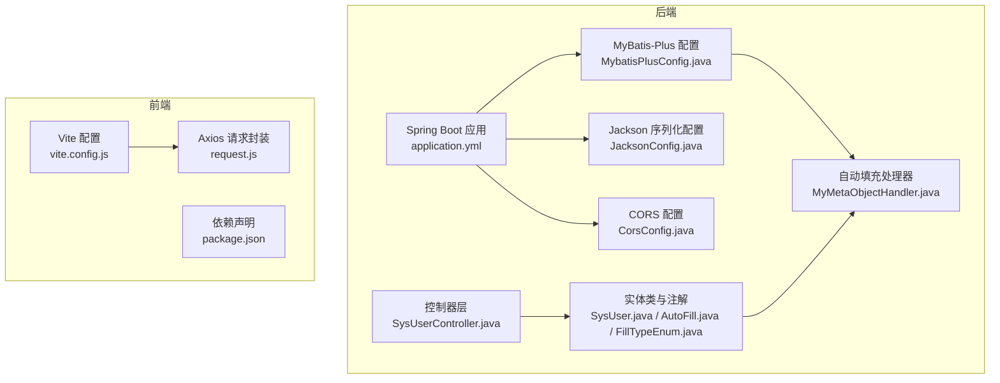
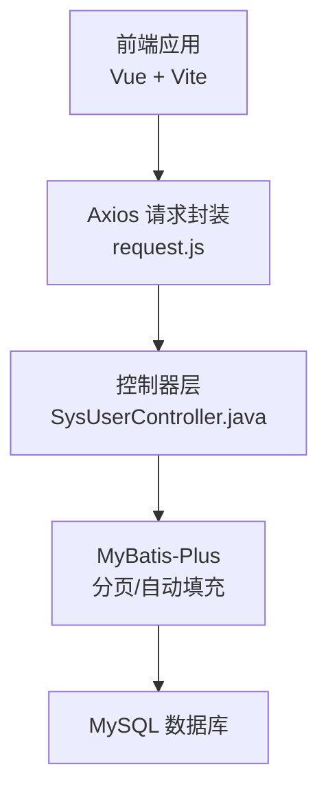
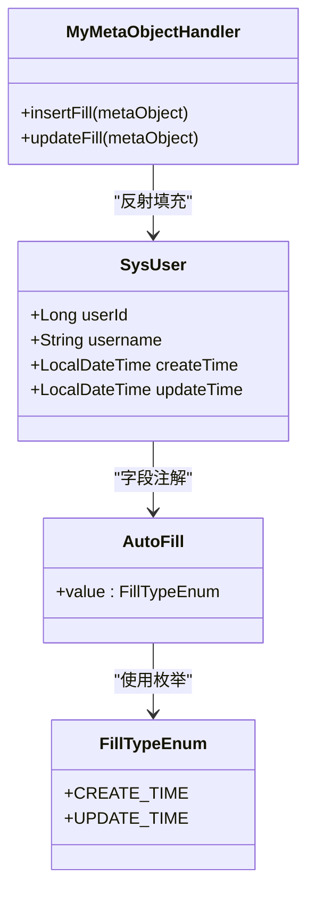
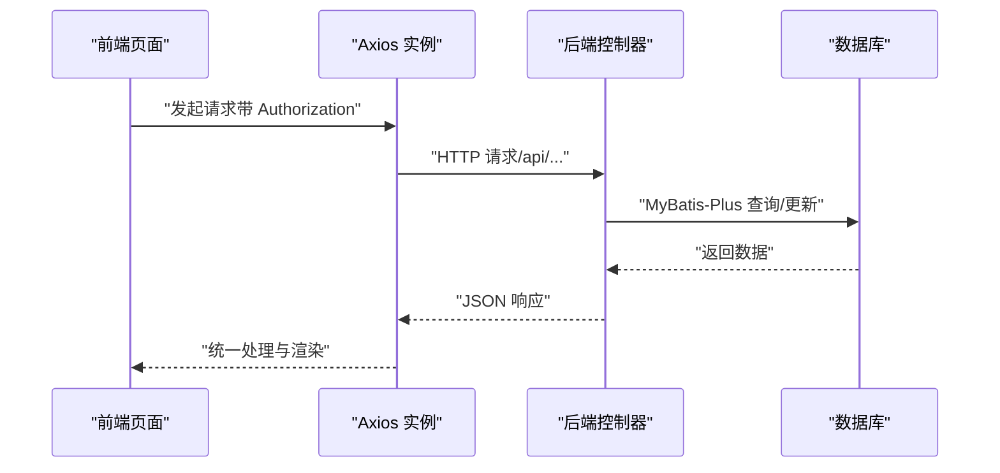
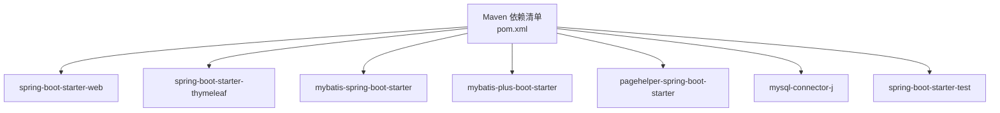

# 技术实现细节

<cite>
**本文引用的文件**
- [application.yml](file://src/main/resources/application.yml)
- [MybatisPlusConfig.java](file://src/main/java/com/hospital/drugmanagement/config/MybatisPlusConfig.java)
- [MyMetaObjectHandler.java](file://src/main/java/com/hospital/drugmanagement/common/handler/MyMetaObjectHandler.java)
- [AutoFill.java](file://src/main/java/com/hospital/drugmanagement/common/anno/AutoFill.java)
- [FillTypeEnum.java](file://src/main/java/com/hospital/drugmanagement/common/constant/FillTypeEnum.java)
- [JacksonConfig.java](file://src/main/java/com/hospital/drugmanagement/config/JacksonConfig.java)
- [CorsConfig.java](file://src/main/java/com/hospital/drugmanagement/config/CorsConfig.java)
- [SysUser.java](file://src/main/java/com/hospital/drugmanagement/entity/SysUser.java)
- [SysUserController.java](file://src/main/java/com/hospital/drugmanagement/controller/SysUserController.java)
- [pom.xml](file://pom.xml)
- [vite.config.js](file://drug-front/vite.config.js)
- [request.js](file://drug-front/src/utils/request.js)
- [package.json](file://drug-front/package.json)
- [init.sql](file://src/main/resources/db/init.sql)
</cite>

## 目录
1. [简介](#简介)
2. [项目结构](#项目结构)
3. [核心组件](#核心组件)
4. [架构总览](#架构总览)
5. [详细组件分析](#详细组件分析)
6. [依赖分析](#依赖分析)
7. [性能考虑](#性能考虑)
8. [故障排查指南](#故障排查指南)
9. [结论](#结论)
10. [附录](#附录)

## 简介
本文件面向技术实现层面，系统性梳理药品管理系统的关键技术与配置策略，覆盖以下主题：
- MyBatis-Plus 高级特性：分页插件、自动填充、乐观锁、逻辑删除等的启用与使用
- Spring Boot 自动配置机制：组件扫描、条件注解、配置类加载等原理
- CORS 跨域配置：实现方式、安全策略、预检请求处理
- Jackson 序列化配置：日期格式、空值处理、命名策略等定制化设置
- Vue.js 前端构建配置：Vite 打包优化、开发服务器配置、代理转发设置
- 提供具体配置示例、代码片段路径与最佳实践建议

## 项目结构
后端采用 Spring Boot + MyBatis-Plus 架构，前端采用 Vue 3 + Vite。核心目录与职责如下：
- 后端资源与配置：application.yml、MyBatis-Plus 配置类、Jackson 配置类、CORS 配置类
- 业务实体与自动填充：实体类标注自动填充注解，MetaObjectHandler 统一处理
- 控制器层：REST 接口、参数校验与异常处理
- 前端工程：Vite 开发服务器、代理转发、Axios 请求封装

**图表来源**
- [application.yml:1-24](file://src/main/resources/application.yml#L1-L24)
- [MybatisPlusConfig.java:1-16](file://src/main/java/com/hospital/drugmanagement/config/MybatisPlusConfig.java#L1-L16)
- [MyMetaObjectHandler.java:1-60](file://src/main/java/com/hospital/drugmanagement/common/handler/MyMetaObjectHandler.java#L1-L60)
- [AutoFill.java:1-15](file://src/main/java/com/hospital/drugmanagement/common/anno/AutoFill.java#L1-L15)
- [FillTypeEnum.java:1-9](file://src/main/java/com/hospital/drugmanagement/common/constant/FillTypeEnum.java#L1-L9)
- [JacksonConfig.java:1-34](file://src/main/java/com/hospital/drugmanagement/config/JacksonConfig.java#L1-L34)
- [CorsConfig.java:1-19](file://src/main/java/com/hospital/drugmanagement/config/CorsConfig.java#L1-L19)
- [SysUser.java:1-130](file://src/main/java/com/hospital/drugmanagement/entity/SysUser.java#L1-L130)
- [SysUserController.java:1-421](file://src/main/java/com/hospital/drugmanagement/controller/SysUserController.java#L1-L421)
- [vite.config.js:1-22](file://drug-front/vite.config.js#L1-L22)
- [request.js:1-56](file://drug-front/src/utils/request.js#L1-L56)
- [package.json:1-29](file://drug-front/package.json#L1-L29)

**章节来源**
- [application.yml:1-24](file://src/main/resources/application.yml#L1-L24)
- [pom.xml:1-119](file://pom.xml#L1-L119)

## 核心组件
本节聚焦后端关键配置与组件，说明其职责与集成方式。

- MyBatis-Plus 分页插件
  - 在配置类中注册拦截器，添加分页内核，实现物理分页能力
  - 参考：[MybatisPlusConfig.java:1-16](file://src/main/java/com/hospital/drugmanagement/config/MybatisPlusConfig.java#L1-L16)

- 自动填充（含创建/更新时间）
  - 使用注解标记实体字段，MetaObjectHandler 在插入/更新时按需填充
  - 参考：[AutoFill.java:1-15](file://src/main/java/com/hospital/drugmanagement/common/anno/AutoFill.java#L1-L15)、[FillTypeEnum.java:1-9](file://src/main/java/com/hospital/drugmanagement/common/constant/FillTypeEnum.java#L1-L9)、[MyMetaObjectHandler.java:1-60](file://src/main/java/com/hospital/drugmanagement/common/handler/MyMetaObjectHandler.java#L1-L60)、[SysUser.java:1-130](file://src/main/java/com/hospital/drugmanagement/entity/SysUser.java#L1-L130)

- Jackson 序列化配置
  - 将 Long 类型序列化为字符串，避免前端精度丢失
  - 参考：[JacksonConfig.java:1-34](file://src/main/java/com/hospital/drugmanagement/config/JacksonConfig.java#L1-L34)

- CORS 跨域配置
  - 全局开放跨域访问，允许方法与头，关闭凭据传递
  - 参考：[CorsConfig.java:1-19](file://src/main/java/com/hospital/drugmanagement/config/CorsConfig.java#L1-L19)

- Spring Boot 自动配置与依赖
  - 通过 Maven 依赖引入 Web、Thymeleaf、MyBatis-Plus、PageHelper 等
  - 参考：[pom.xml:1-119](file://pom.xml#L1-L119)

**章节来源**
- [MybatisPlusConfig.java:1-16](file://src/main/java/com/hospital/drugmanagement/config/MybatisPlusConfig.java#L1-L16)
- [MyMetaObjectHandler.java:1-60](file://src/main/java/com/hospital/drugmanagement/common/handler/MyMetaObjectHandler.java#L1-L60)
- [AutoFill.java:1-15](file://src/main/java/com/hospital/drugmanagement/common/anno/AutoFill.java#L1-L15)
- [FillTypeEnum.java:1-9](file://src/main/java/com/hospital/drugmanagement/common/constant/FillTypeEnum.java#L1-L9)
- [SysUser.java:1-130](file://src/main/java/com/hospital/drugmanagement/entity/SysUser.java#L1-L130)
- [JacksonConfig.java:1-34](file://src/main/java/com/hospital/drugmanagement/config/JacksonConfig.java#L1-L34)
- [CorsConfig.java:1-19](file://src/main/java/com/hospital/drugmanagement/config/CorsConfig.java#L1-L19)
- [pom.xml:1-119](file://pom.xml#L1-L119)

## 架构总览
系统前后端分离，前端通过 Axios 发起请求，后端提供 REST 接口；开发阶段通过 Vite 代理转发至后端服务。

**图表来源**
- [SysUserController.java:1-421](file://src/main/java/com/hospital/drugmanagement/controller/SysUserController.java#L1-L421)
- [MybatisPlusConfig.java:1-16](file://src/main/java/com/hospital/drugmanagement/config/MybatisPlusConfig.java#L1-L16)
- [request.js:1-56](file://drug-front/src/utils/request.js#L1-L56)

## 详细组件分析

### MyBatis-Plus 配置与高级特性
- 分页插件
  - 在配置类中注册拦截器并添加分页内核，即可在查询时使用分页功能
  - 参考：[MybatisPlusConfig.java:1-16](file://src/main/java/com/hospital/drugmanagement/config/MybatisPlusConfig.java#L1-L16)
  - 应用级配置项包括 Mapper XML 位置、实体包名、SQL 日志输出、下划线转驼峰映射
  - 参考：[application.yml:18-24](file://src/main/resources/application.yml#L18-L24)

- 自动填充
  - 注解定义：字段级注解标记填充类型（创建/更新时间）
  - 处理器实现：遍历实体字段，匹配注解并按需填充当前时间
  - 实体示例：实体类中使用注解标识需要自动填充的时间字段
  - 参考：
    - [AutoFill.java:1-15](file://src/main/java/com/hospital/drugmanagement/common/anno/AutoFill.java#L1-L15)
    - [FillTypeEnum.java:1-9](file://src/main/java/com/hospital/drugmanagement/common/constant/FillTypeEnum.java#L1-L9)
    - [MyMetaObjectHandler.java:1-60](file://src/main/java/com/hospital/drugmanagement/common/handler/MyMetaObjectHandler.java#L1-L60)
    - [SysUser.java:1-130](file://src/main/java/com/hospital/drugmanagement/entity/SysUser.java#L1-L130)

- 乐观锁与逻辑删除
  - 项目中未发现显式配置乐观锁与逻辑删除的配置类或实体注解
  - 如需启用，可在实体类上添加相应注解，并在配置类中注册对应拦截器
  - 参考：[application.yml:18-24](file://src/main/resources/application.yml#L18-L24)

**图表来源**
- [SysUser.java:1-130](file://src/main/java/com/hospital/drugmanagement/entity/SysUser.java#L1-L130)
- [AutoFill.java:1-15](file://src/main/java/com/hospital/drugmanagement/common/anno/AutoFill.java#L1-L15)
- [FillTypeEnum.java:1-9](file://src/main/java/com/hospital/drugmanagement/common/constant/FillTypeEnum.java#L1-L9)
- [MyMetaObjectHandler.java:1-60](file://src/main/java/com/hospital/drugmanagement/common/handler/MyMetaObjectHandler.java#L1-L60)

**章节来源**
- [MybatisPlusConfig.java:1-16](file://src/main/java/com/hospital/drugmanagement/config/MybatisPlusConfig.java#L1-L16)
- [application.yml:18-24](file://src/main/resources/application.yml#L18-L24)
- [MyMetaObjectHandler.java:1-60](file://src/main/java/com/hospital/drugmanagement/common/handler/MyMetaObjectHandler.java#L1-L60)
- [AutoFill.java:1-15](file://src/main/java/com/hospital/drugmanagement/common/anno/AutoFill.java#L1-L15)
- [FillTypeEnum.java:1-9](file://src/main/java/com/hospital/drugmanagement/common/constant/FillTypeEnum.java#L1-L9)
- [SysUser.java:1-130](file://src/main/java/com/hospital/drugmanagement/entity/SysUser.java#L1-L130)

### Spring Boot 自动配置机制
- 组件扫描与配置类加载
  - 通过注解驱动的配置类（如 MyBatis-Plus、Jackson、CORS）被 Spring 容器加载
  - 参考：
    - [MybatisPlusConfig.java:1-16](file://src/main/java/com/hospital/drugmanagement/config/MybatisPlusConfig.java#L1-L16)
    - [JacksonConfig.java:1-34](file://src/main/java/com/hospital/drugmanagement/config/JacksonConfig.java#L1-L34)
    - [CorsConfig.java:1-19](file://src/main/java/com/hospital/drugmanagement/config/CorsConfig.java#L1-L19)

- 条件注解与依赖装配
  - 通过 Starter 依赖引入自动配置，Maven 依赖清单见 [pom.xml:1-119](file://pom.xml#L1-L119)
  - 示例：Web、Thymeleaf、MyBatis-Plus、PageHelper 等

- 应用启动与环境配置
  - 服务端口、数据源、MyBatis-Plus 基础配置位于 [application.yml:1-24](file://src/main/resources/application.yml#L1-L24)

**章节来源**
- [MybatisPlusConfig.java:1-16](file://src/main/java/com/hospital/drugmanagement/config/MybatisPlusConfig.java#L1-L16)
- [JacksonConfig.java:1-34](file://src/main/java/com/hospital/drugmanagement/config/JacksonConfig.java#L1-L34)
- [CorsConfig.java:1-19](file://src/main/java/com/hospital/drugmanagement/config/CorsConfig.java#L1-L19)
- [pom.xml:1-119](file://pom.xml#L1-L119)
- [application.yml:1-24](file://src/main/resources/application.yml#L1-L24)

### CORS 跨域配置与安全策略
- 全局跨域规则
  - 映射路径、允许来源模式、允许方法、允许头、最大预检年龄等
  - 参考：[CorsConfig.java:1-19](file://src/main/java/com/hospital/drugmanagement/config/CorsConfig.java#L1-L19)

- 预检请求处理
  - 浏览器在复杂请求前发送 OPTIONS 预检，由 Spring MVC 处理
  - 参考：[CorsConfig.java:1-19](file://src/main/java/com/hospital/drugmanagement/config/CorsConfig.java#L1-L19)

- 安全策略建议
  - 生产环境建议限制来源模式与凭据开关，避免通配符风险
  - 参考：[CorsConfig.java:1-19](file://src/main/java/com/hospital/drugmanagement/config/CorsConfig.java#L1-L19)

**章节来源**
- [CorsConfig.java:1-19](file://src/main/java/com/hospital/drugmanagement/config/CorsConfig.java#L1-L19)

### Jackson 序列化配置
- 目标与策略
  - 将 Long 类型序列化为字符串，避免前端大整数精度丢失
  - 参考：[JacksonConfig.java:1-34](file://src/main/java/com/hospital/drugmanagement/config/JacksonConfig.java#L1-L34)

- 集成方式
  - 通过自定义 ObjectMapper Bean 注册序列化模块
  - 参考：[application.yml:1-24](file://src/main/resources/application.yml#L1-L24)

**章节来源**
- [JacksonConfig.java:1-34](file://src/main/java/com/hospital/drugmanagement/config/JacksonConfig.java#L1-L34)
- [application.yml:1-24](file://src/main/resources/application.yml#L1-L24)

### Vue.js 项目构建配置
- Vite 开发服务器与代理
  - 开发端口、路径别名、代理转发至后端服务
  - 参考：[vite.config.js:1-22](file://drug-front/vite.config.js#L1-L22)

- Axios 请求封装
  - 基础路径、超时、请求/响应拦截器、错误处理与路由跳转
  - 参考：[request.js:1-56](file://drug-front/src/utils/request.js#L1-L56)

- 依赖与脚本
  - 依赖声明与构建脚本
  - 参考：[package.json:1-29](file://drug-front/package.json#L1-L29)

**图表来源**
- [request.js:1-56](file://drug-front/src/utils/request.js#L1-L56)
- [SysUserController.java:1-421](file://src/main/java/com/hospital/drugmanagement/controller/SysUserController.java#L1-L421)

**章节来源**
- [vite.config.js:1-22](file://drug-front/vite.config.js#L1-L22)
- [request.js:1-56](file://drug-front/src/utils/request.js#L1-L56)
- [package.json:1-29](file://drug-front/package.json#L1-L29)

## 依赖分析
后端依赖以 Spring Boot Starter 为核心，结合 MyBatis-Plus 与 PageHelper 实现 ORM 与分页能力。

**图表来源**
- [pom.xml:1-119](file://pom.xml#L1-L119)

**章节来源**
- [pom.xml:1-119](file://pom.xml#L1-L119)

## 性能考虑
- MyBatis-Plus 分页
  - 合理设置分页大小，避免一次性加载大量数据
  - 参考：[MybatisPlusConfig.java:1-16](file://src/main/java/com/hospital/drugmanagement/config/MybatisPlusConfig.java#L1-L16)

- Jackson 序列化
  - 对于大对象，可按需裁剪字段，减少传输体积
  - 参考：[JacksonConfig.java:1-34](file://src/main/java/com/hospital/drugmanagement/config/JacksonConfig.java#L1-L34)

- 前端代理与缓存
  - 开发阶段合理利用浏览器缓存与静态资源缓存
  - 参考：[vite.config.js:1-22](file://drug-front/vite.config.js#L1-L22)

- 数据库与索引
  - 表结构与索引设计参考初始化脚本，确保查询效率
  - 参考：[init.sql:1-312](file://src/main/resources/db/init.sql#L1-L312)

## 故障排查指南
- 自动填充未生效
  - 检查实体字段是否正确标注注解，处理器是否被容器识别
  - 参考：
    - [SysUser.java:1-130](file://src/main/java/com/hospital/drugmanagement/entity/SysUser.java#L1-L130)
    - [MyMetaObjectHandler.java:1-60](file://src/main/java/com/hospital/drugmanagement/common/handler/MyMetaObjectHandler.java#L1-L60)

- 分页查询异常
  - 确认分页拦截器已注册，查询参数是否规范
  - 参考：[MybatisPlusConfig.java:1-16](file://src/main/java/com/hospital/drugmanagement/config/MybatisPlusConfig.java#L1-L16)

- CORS 访问被拒绝
  - 校验允许来源、方法与头，确认预检请求是否通过
  - 参考：[CorsConfig.java:1-19](file://src/main/java/com/hospital/drugmanagement/config/CorsConfig.java#L1-L19)

- 前端请求 401
  - 检查本地存储 token 是否存在与格式是否正确
  - 参考：[request.js:1-56](file://drug-front/src/utils/request.js#L1-L56)

**章节来源**
- [MyMetaObjectHandler.java:1-60](file://src/main/java/com/hospital/drugmanagement/common/handler/MyMetaObjectHandler.java#L1-L60)
- [SysUser.java:1-130](file://src/main/java/com/hospital/drugmanagement/entity/SysUser.java#L1-L130)
- [MybatisPlusConfig.java:1-16](file://src/main/java/com/hospital/drugmanagement/config/MybatisPlusConfig.java#L1-L16)
- [CorsConfig.java:1-19](file://src/main/java/com/hospital/drugmanagement/config/CorsConfig.java#L1-L19)
- [request.js:1-56](file://drug-front/src/utils/request.js#L1-L56)

## 结论
本项目在后端通过 Spring Boot 与 MyBatis-Plus 的组合实现了高效的持久化与分页能力，并借助自定义自动填充处理器提升了数据一致性；前端通过 Vite 与 Axios 构建了清晰的开发与请求流程。建议在生产环境中进一步完善安全策略（如 CORS 来源限制）、启用逻辑删除与乐观锁，并对序列化与分页进行更细粒度的性能调优。

## 附录
- 数据库初始化脚本与表结构参考：[init.sql:1-312](file://src/main/resources/db/init.sql#L1-L312)
- 应用基础配置参考：[application.yml:1-24](file://src/main/resources/application.yml#L1-L24)
- 依赖清单参考：[pom.xml:1-119](file://pom.xml#L1-L119)