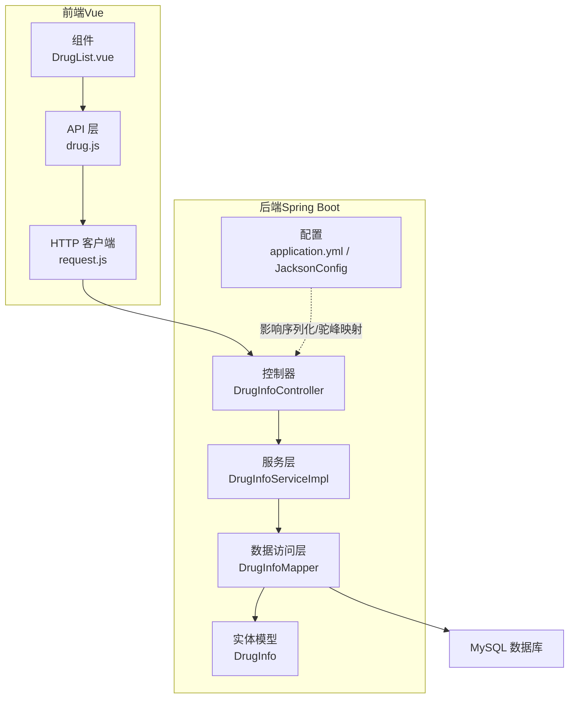
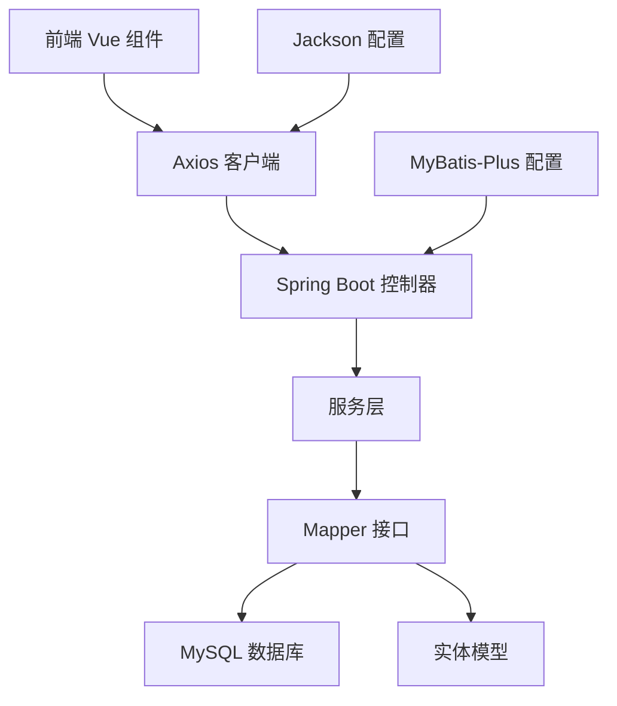
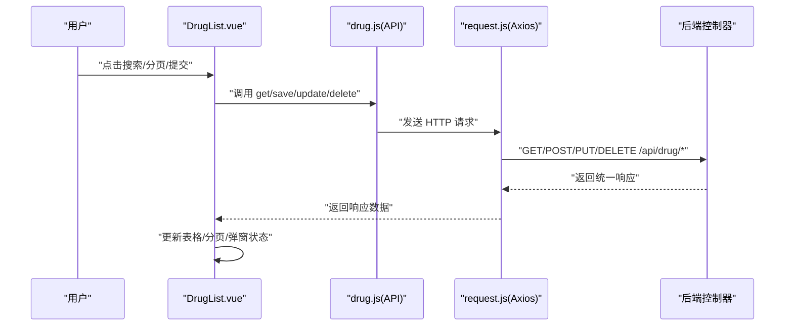
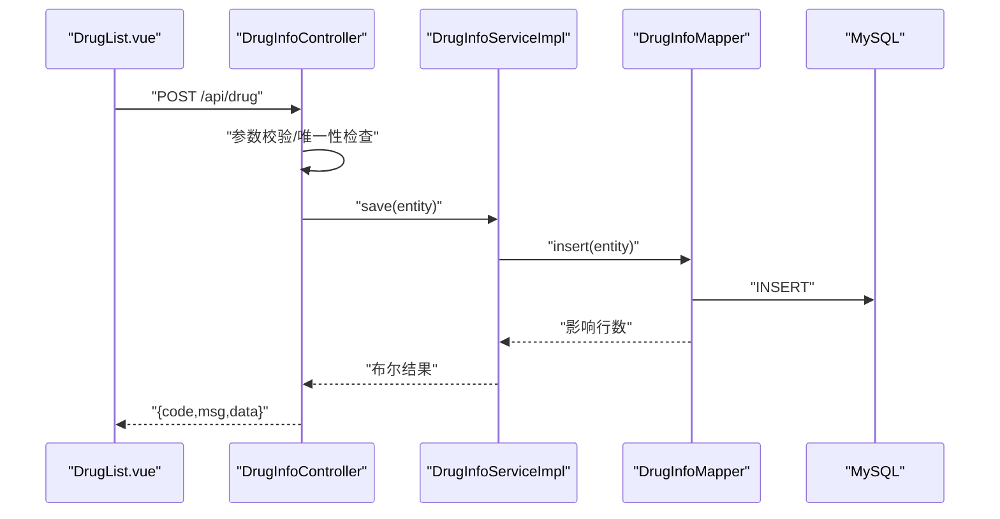
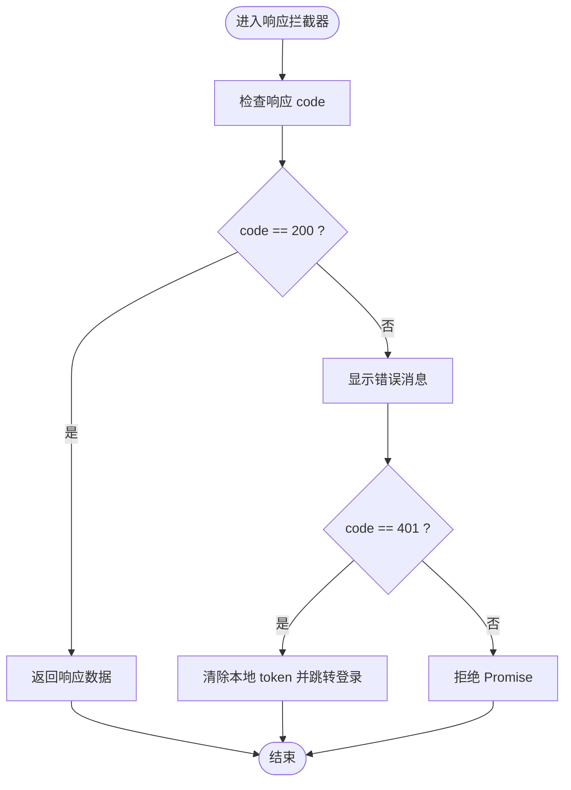
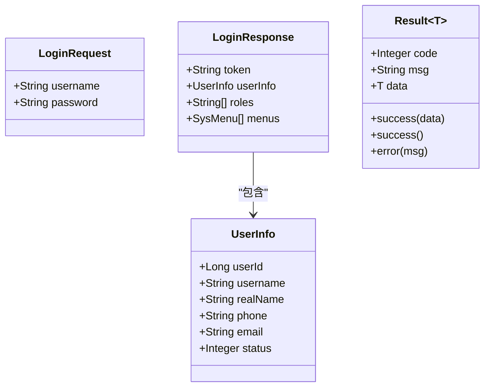
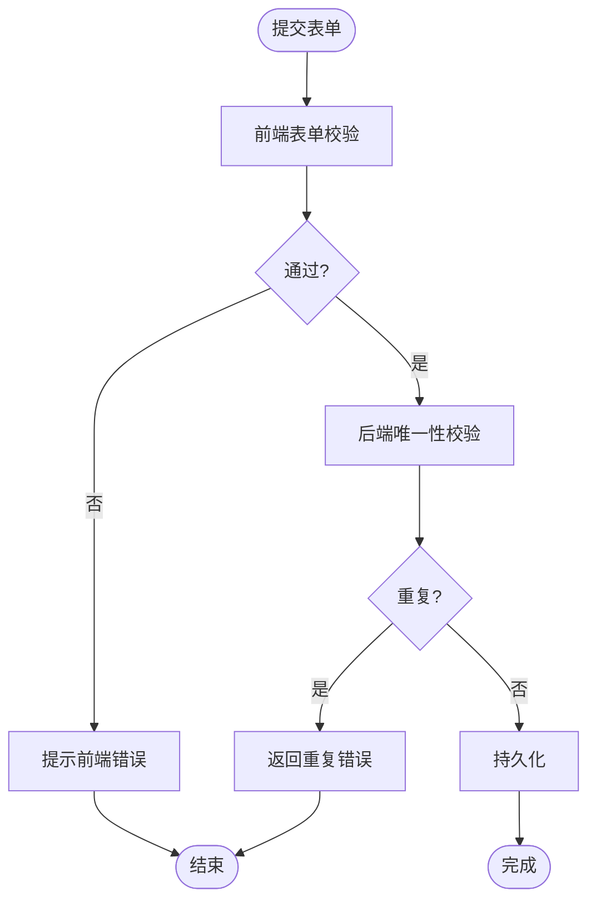
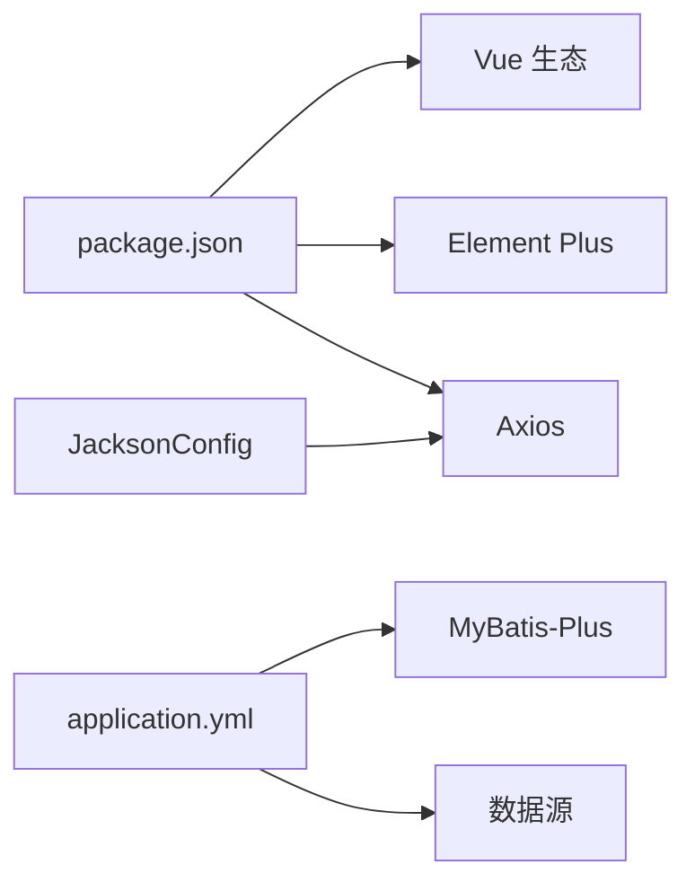

# 数据流设计

<cite>
**本文引用的文件**
- [application.yml](file://src/main/resources/application.yml)
- [JacksonConfig.java](file://src/main/java/com/hospital/drugmanagement/config/JacksonConfig.java)
- [Result.java](file://src/main/java/com/hospital/drugmanagement/dto/Result.java)
- [LoginRequest.java](file://src/main/java/com/hospital/drugmanagement/dto/LoginRequest.java)
- [LoginResponse.java](file://src/main/java/com/hospital/drugmanagement/dto/LoginResponse.java)
- [DrugInfoController.java](file://src/main/java/com/hospital/drugmanagement/controller/DrugInfoController.java)
- [DrugInfoServiceImpl.java](file://src/main/java/com/hospital/drugmanagement/service/impl/DrugInfoServiceImpl.java)
- [DrugInfoMapper.java](file://src/main/java/com/hospital/drugmanagement/mapper/DrugInfoMapper.java)
- [DrugInfo.java](file://src/main/java/com/hospital/drugmanagement/entity/DrugInfo.java)
- [MyMetaObjectHandler.java](file://src/main/java/com/hospital/drugmanagement/common/handler/MyMetaObjectHandler.java)
- [drug.js](file://drug-front/src/api/drug.js)
- [request.js](file://drug-front/src/utils/request.js)
- [DrugList.vue](file://drug-front/src/views/drug/DrugList.vue)
- [package.json](file://drug-front/package.json)
</cite>

## 目录
1. [简介](#简介)
2. [项目结构](#项目结构)
3. [核心组件](#核心组件)
4. [架构总览](#架构总览)
5. [详细组件分析](#详细组件分析)
6. [依赖分析](#依赖分析)
7. [性能考虑](#性能考虑)
8. [故障排查指南](#故障排查指南)
9. [结论](#结论)
10. [附录](#附录)

## 简介
本文件面向医院药品管理系统，系统采用前后端分离架构：前端基于 Vue 3 + Element Plus，后端基于 Spring Boot + MyBatis-Plus。本文围绕“数据流设计”目标，系统性梳理从用户操作到数据库持久化的完整数据通路，涵盖以下主题：
- 前端组件状态与交互、API 请求发送
- 后端控制器、服务层、数据访问层处理链路
- 统一响应封装与错误处理
- DTO 对象设计、JSON 序列化与字段映射
- 参数校验与业务约束
- 缓存策略（前端状态缓存、后端查询缓存、分布式缓存建议）
- 可视化图表：数据流图、时序图、状态转换图

## 项目结构
系统分为两部分：
- 前端（drug-front）：Vue 单页应用，通过 Axios 发送 HTTP 请求至后端 API。
- 后端（src/main/java）：Spring Boot 应用，提供 REST 接口，使用 MyBatis-Plus 访问 MySQL。

图表来源
- [DrugList.vue:208-415](file://drug-front/src/views/drug/DrugList.vue#L208-L415)
- [drug.js:1-45](file://drug-front/src/api/drug.js#L1-L45)
- [request.js:1-56](file://drug-front/src/utils/request.js#L1-L56)
- [DrugInfoController.java:1-169](file://src/main/java/com/hospital/drugmanagement/controller/DrugInfoController.java#L1-L169)
- [DrugInfoServiceImpl.java:1-18](file://src/main/java/com/hospital/drugmanagement/service/impl/DrugInfoServiceImpl.java#L1-L18)
- [DrugInfoMapper.java:1-9](file://src/main/java/com/hospital/drugmanagement/mapper/DrugInfoMapper.java#L1-L9)
- [DrugInfo.java:1-167](file://src/main/java/com/hospital/drugmanagement/entity/DrugInfo.java#L1-L167)
- [application.yml:1-24](file://src/main/resources/application.yml#L1-L24)
- [JacksonConfig.java:1-34](file://src/main/java/com/hospital/drugmanagement/config/JacksonConfig.java#L1-L34)

章节来源
- [application.yml:1-24](file://src/main/resources/application.yml#L1-L24)
- [package.json:1-29](file://drug-front/package.json#L1-L29)

## 核心组件
- 前端组件与交互
  - 药品列表组件负责搜索、分页、新增/编辑弹窗、删除确认等交互；通过 API 层调用后端接口。
- 前端 HTTP 客户端
  - Axios 实例封装基础 URL、超时、请求/响应拦截器，统一处理鉴权头、错误提示与路由跳转。
- 后端控制器
  - 提供 REST 接口，接收分页、过滤参数，执行业务校验，返回统一响应结构。
- 服务层
  - 基于 MyBatis-Plus 的 ServiceImpl，复用通用 CRUD 能力。
- 数据访问层
  - Mapper 接口继承 BaseMapper，配合 XML 或注解完成 SQL 映射。
- 实体模型
  - 与数据库表 drug_info 字段映射，支持下划线到驼峰的自动转换。
- 配置
  - Jackson 序列化配置：Long 类型序列化为字符串，避免前端精度丢失。
  - MyBatis-Plus 配置：驼峰映射、SQL 日志打印、XML 位置等。

章节来源
- [DrugList.vue:208-415](file://drug-front/src/views/drug/DrugList.vue#L208-L415)
- [request.js:1-56](file://drug-front/src/utils/request.js#L1-L56)
- [DrugInfoController.java:1-169](file://src/main/java/com/hospital/drugmanagement/controller/DrugInfoController.java#L1-L169)
- [DrugInfoServiceImpl.java:1-18](file://src/main/java/com/hospital/drugmanagement/service/impl/DrugInfoServiceImpl.java#L1-L18)
- [DrugInfoMapper.java:1-9](file://src/main/java/com/hospital/drugmanagement/mapper/DrugInfoMapper.java#L1-L9)
- [DrugInfo.java:1-167](file://src/main/java/com/hospital/drugmanagement/entity/DrugInfo.java#L1-L167)
- [application.yml:1-24](file://src/main/resources/application.yml#L1-L24)
- [JacksonConfig.java:1-34](file://src/main/java/com/hospital/drugmanagement/config/JacksonConfig.java#L1-L34)

## 架构总览
系统遵循经典的 MVC 分层与 DDD 领域模型结合：
- 控制器层：接收请求、参数绑定、简单校验、调用服务层、组装统一响应。
- 服务层：封装业务规则与事务边界，必要时进行复杂查询或聚合。
- 数据访问层：基于 MyBatis-Plus 的通用 Mapper，减少重复 SQL。
- 持久层：MySQL，通过 application.yml 配置连接参数与 MyBatis-Plus 行为。
- 前端：Vue 组件驱动用户交互，Axios 统一发起请求，Element Plus 提供 UI 与表单校验。

图表来源
- [request.js:1-56](file://drug-front/src/utils/request.js#L1-L56)
- [DrugInfoController.java:1-169](file://src/main/java/com/hospital/drugmanagement/controller/DrugInfoController.java#L1-L169)
- [DrugInfoServiceImpl.java:1-18](file://src/main/java/com/hospital/drugmanagement/service/impl/DrugInfoServiceImpl.java#L1-L18)
- [DrugInfoMapper.java:1-9](file://src/main/java/com/hospital/drugmanagement/mapper/DrugInfoMapper.java#L1-L9)
- [DrugInfo.java:1-167](file://src/main/java/com/hospital/drugmanagement/entity/DrugInfo.java#L1-L167)
- [application.yml:1-24](file://src/main/resources/application.yml#L1-L24)
- [JacksonConfig.java:1-34](file://src/main/java/com/hospital/drugmanagement/config/JacksonConfig.java#L1-L34)

## 详细组件分析

### 前端数据流：从用户操作到后端 API
- 用户在药品列表页面进行搜索、分页、新增/编辑、删除等操作。
- 组件通过 API 层函数发起 HTTP 请求，Axios 在响应拦截器中统一处理非 200 状态码与错误提示。
- 组件根据返回数据更新表格、分页与弹窗状态。

图表来源
- [DrugList.vue:282-376](file://drug-front/src/views/drug/DrugList.vue#L282-L376)
- [drug.js:1-45](file://drug-front/src/api/drug.js#L1-L45)
- [request.js:1-56](file://drug-front/src/utils/request.js#L1-L56)
- [DrugInfoController.java:22-167](file://src/main/java/com/hospital/drugmanagement/controller/DrugInfoController.java#L22-L167)

章节来源
- [DrugList.vue:208-415](file://drug-front/src/views/drug/DrugList.vue#L208-L415)
- [drug.js:1-45](file://drug-front/src/api/drug.js#L1-L45)
- [request.js:1-56](file://drug-front/src/utils/request.js#L1-L56)

### 后端数据流：控制器到持久化
- 控制器接收分页与过滤参数，构造查询条件，调用服务层执行分页查询或单条记录查询。
- 保存/更新前进行唯一性校验，确保药品编码与名称不重复。
- 服务层基于 MyBatis-Plus 的通用 CRUD 能力执行持久化。
- 返回统一响应结构，前端据此更新界面。

图表来源
- [DrugInfoController.java:76-113](file://src/main/java/com/hospital/drugmanagement/controller/DrugInfoController.java#L76-L113)
- [DrugInfoServiceImpl.java:1-18](file://src/main/java/com/hospital/drugmanagement/service/impl/DrugInfoServiceImpl.java#L1-L18)
- [DrugInfoMapper.java:1-9](file://src/main/java/com/hospital/drugmanagement/mapper/DrugInfoMapper.java#L1-L9)
- [DrugInfo.java:1-167](file://src/main/java/com/hospital/drugmanagement/entity/DrugInfo.java#L1-L167)

章节来源
- [DrugInfoController.java:1-169](file://src/main/java/com/hospital/drugmanagement/controller/DrugInfoController.java#L1-L169)
- [DrugInfoServiceImpl.java:1-18](file://src/main/java/com/hospital/drugmanagement/service/impl/DrugInfoServiceImpl.java#L1-L18)
- [DrugInfoMapper.java:1-9](file://src/main/java/com/hospital/drugmanagement/mapper/DrugInfoMapper.java#L1-L9)
- [DrugInfo.java:1-167](file://src/main/java/com/hospital/drugmanagement/entity/DrugInfo.java#L1-L167)

### 统一响应与错误处理
- 统一响应封装：后端控制器直接返回 Map 结构，前端 Axios 响应拦截器按 code 判断错误并提示。
- 登录相关 DTO：LoginRequest、LoginResponse 用于认证场景的数据传输对象设计。
- Jackson 配置：Long 类型序列化为字符串，避免前端精度丢失。

图表来源
- [request.js:27-53](file://drug-front/src/utils/request.js#L27-L53)
- [Result.java:1-99](file://src/main/java/com/hospital/drugmanagement/dto/Result.java#L1-L99)
- [LoginRequest.java:1-37](file://src/main/java/com/hospital/drugmanagement/dto/LoginRequest.java#L1-L37)
- [LoginResponse.java:1-128](file://src/main/java/com/hospital/drugmanagement/dto/LoginResponse.java#L1-L128)
- [JacksonConfig.java:1-34](file://src/main/java/com/hospital/drugmanagement/config/JacksonConfig.java#L1-L34)

章节来源
- [request.js:1-56](file://drug-front/src/utils/request.js#L1-L56)
- [Result.java:1-99](file://src/main/java/com/hospital/drugmanagement/dto/Result.java#L1-L99)
- [LoginRequest.java:1-37](file://src/main/java/com/hospital/drugmanagement/dto/LoginRequest.java#L1-L37)
- [LoginResponse.java:1-128](file://src/main/java/com/hospital/drugmanagement/dto/LoginResponse.java#L1-L128)
- [JacksonConfig.java:1-34](file://src/main/java/com/hospital/drugmanagement/config/JacksonConfig.java#L1-L34)

### DTO 对象设计与 JSON 序列化
- DTO 设计：LoginRequest、LoginResponse、Result 提供标准化的数据传输结构。
- JSON 序列化：Jackson 配置将 Long 类型序列化为字符串，避免前端解析精度问题。
- 字段映射：application.yml 开启下划线到驼峰映射，保证数据库字段与实体属性一致。

图表来源
- [LoginRequest.java:1-37](file://src/main/java/com/hospital/drugmanagement/dto/LoginRequest.java#L1-L37)
- [LoginResponse.java:1-128](file://src/main/java/com/hospital/drugmanagement/dto/LoginResponse.java#L1-L128)
- [Result.java:1-99](file://src/main/java/com/hospital/drugmanagement/dto/Result.java#L1-L99)

章节来源
- [LoginRequest.java:1-37](file://src/main/java/com/hospital/drugmanagement/dto/LoginRequest.java#L1-L37)
- [LoginResponse.java:1-128](file://src/main/java/com/hospital/drugmanagement/dto/LoginResponse.java#L1-L128)
- [Result.java:1-99](file://src/main/java/com/hospital/drugmanagement/dto/Result.java#L1-L99)
- [JacksonConfig.java:1-34](file://src/main/java/com/hospital/drugmanagement/config/JacksonConfig.java#L1-L34)
- [application.yml:18-24](file://src/main/resources/application.yml#L18-L24)

### 参数校验与业务约束
- 前端：Element Plus 表单规则对必填项进行即时校验。
- 后端：控制器在保存/更新前进行唯一性校验（编码、名称），防止重复。
- 自动填充：MyMetaObjectHandler 在插入/更新时自动填充时间字段，减少业务层样板代码。

图表来源
- [DrugList.vue:259-269](file://drug-front/src/views/drug/DrugList.vue#L259-L269)
- [DrugInfoController.java:83-101](file://src/main/java/com/hospital/drugmanagement/controller/DrugInfoController.java#L83-L101)
- [MyMetaObjectHandler.java:1-60](file://src/main/java/com/hospital/drugmanagement/common/handler/MyMetaObjectHandler.java#L1-L60)

章节来源
- [DrugList.vue:259-269](file://drug-front/src/views/drug/DrugList.vue#L259-L269)
- [DrugInfoController.java:76-151](file://src/main/java/com/hospital/drugmanagement/controller/DrugInfoController.java#L76-L151)
- [MyMetaObjectHandler.java:1-60](file://src/main/java/com/hospital/drugmanagement/common/handler/MyMetaObjectHandler.java#L1-L60)

### 缓存策略
- 前端状态缓存：组件内使用响应式状态（如表格数据、分页参数、弹窗可见性）维持 UI 一致性，减少重复请求。
- 后端查询缓存：可利用 Spring Cache 或 MyBatis 查询缓存（需额外配置）提升热点查询性能。
- 分布式缓存：Redis 可用于会话、权限菜单、高频读取的字典数据缓存，降低数据库压力。
- 建议：对分页列表、枚举类型（药品类型、单位）、供应商列表等进行缓存；注意缓存失效策略与数据一致性。

[本节为通用实践建议，不涉及具体文件分析]

## 依赖分析
- 前端依赖：Vue 3、Element Plus、Axios、路由与状态管理等。
- 后端依赖：Spring Boot、MyBatis-Plus、MySQL 驱动、Jackson 配置等。
- 组件耦合：前端组件通过 API 层与后端控制器解耦；后端控制器与服务层、Mapper 层职责清晰。

图表来源
- [package.json:1-29](file://drug-front/package.json#L1-L29)
- [application.yml:1-24](file://src/main/resources/application.yml#L1-L24)
- [JacksonConfig.java:1-34](file://src/main/java/com/hospital/drugmanagement/config/JacksonConfig.java#L1-L34)

章节来源
- [package.json:1-29](file://drug-front/package.json#L1-L29)
- [application.yml:1-24](file://src/main/resources/application.yml#L1-L24)
- [JacksonConfig.java:1-34](file://src/main/java/com/hospital/drugmanagement/config/JacksonConfig.java#L1-L34)

## 性能考虑
- 前端：合理使用分页与懒加载，避免一次性渲染大量数据；对高频请求进行防抖与去重。
- 后端：开启 MyBatis-Plus SQL 日志便于定位慢查询；对热点数据引入查询缓存；批量操作使用批处理。
- 序列化：Long 类型字符串化避免精度问题，同时减少前端解析成本。
- 网络：设置合理的超时与重试策略，避免阻塞 UI。

[本节提供通用指导，不涉及具体文件分析]

## 故障排查指南
- 前端常见问题
  - 401 未授权：响应拦截器会清除本地 token 并跳转登录页，检查后端签发与前端存储。
  - 网络错误：检查 Axios 基础 URL、跨域配置与后端端口。
- 后端常见问题
  - 数据库连接失败：核对 application.yml 中的连接参数。
  - 字段映射异常：确认数据库字段与实体属性的驼峰映射配置。
  - 精度丢失：确认 Jackson 配置已生效，Long 字段序列化为字符串。
- 业务问题
  - 重复编码/名称：控制器已做唯一性校验，检查入参与数据库索引。
  - 自动填充未生效：确认 MyMetaObjectHandler 已被 Spring 扫描并启用。

章节来源
- [request.js:1-56](file://drug-front/src/utils/request.js#L1-L56)
- [application.yml:1-24](file://src/main/resources/application.yml#L1-L24)
- [JacksonConfig.java:1-34](file://src/main/java/com/hospital/drugmanagement/config/JacksonConfig.java#L1-L34)
- [DrugInfoController.java:83-101](file://src/main/java/com/hospital/drugmanagement/controller/DrugInfoController.java#L83-L101)
- [MyMetaObjectHandler.java:1-60](file://src/main/java/com/hospital/drugmanagement/common/handler/MyMetaObjectHandler.java#L1-L60)

## 结论
本系统通过清晰的前后端分层与统一的数据传输格式，实现了从用户操作到数据库持久化的稳定数据流。前端以组件状态驱动交互，后端以控制器-服务-数据访问三层处理业务，配合统一响应与序列化配置，提升了开发效率与用户体验。建议在现有基础上引入查询缓存与分布式缓存，进一步优化性能与扩展性。

## 附录
- 关键文件速览
  - 前端：[drug.js:1-45](file://drug-front/src/api/drug.js#L1-L45)、[request.js:1-56](file://drug-front/src/utils/request.js#L1-L56)、[DrugList.vue:208-415](file://drug-front/src/views/drug/DrugList.vue#L208-L415)
  - 后端：[DrugInfoController.java:1-169](file://src/main/java/com/hospital/drugmanagement/controller/DrugInfoController.java#L1-L169)、[DrugInfoServiceImpl.java:1-18](file://src/main/java/com/hospital/drugmanagement/service/impl/DrugInfoServiceImpl.java#L1-L18)、[DrugInfoMapper.java:1-9](file://src/main/java/com/hospital/drugmanagement/mapper/DrugInfoMapper.java#L1-L9)、[DrugInfo.java:1-167](file://src/main/java/com/hospital/drugmanagement/entity/DrugInfo.java#L1-L167)、[application.yml:1-24](file://src/main/resources/application.yml#L1-L24)、[JacksonConfig.java:1-34](file://src/main/java/com/hospital/drugmanagement/config/JacksonConfig.java#L1-L34)