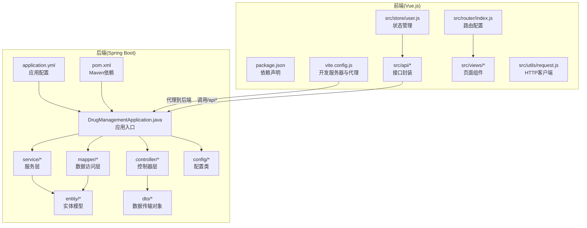
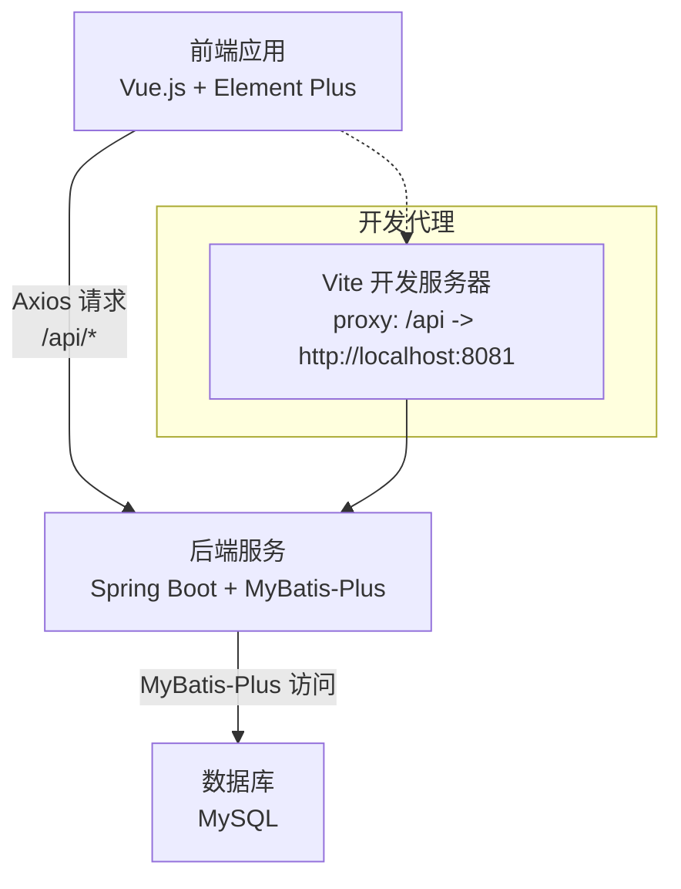
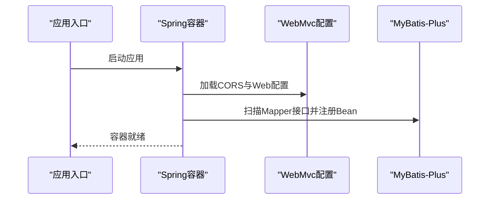
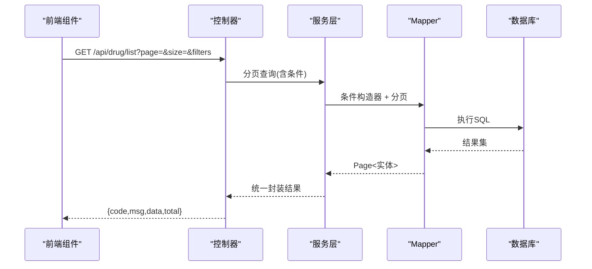
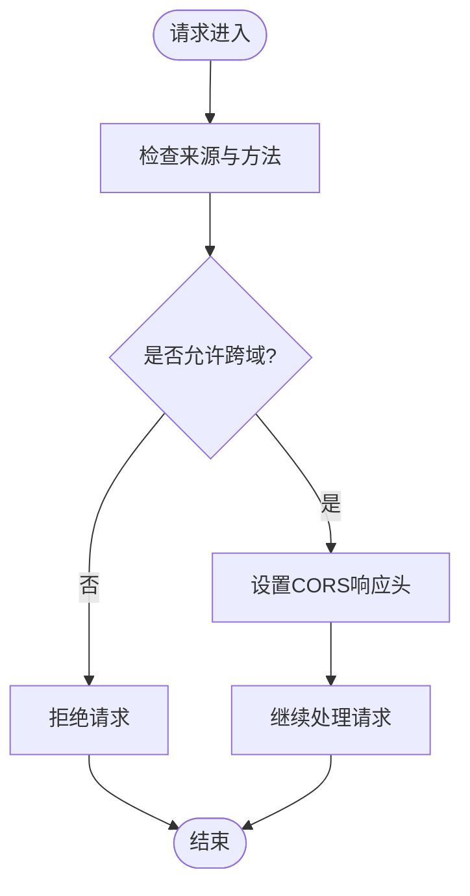
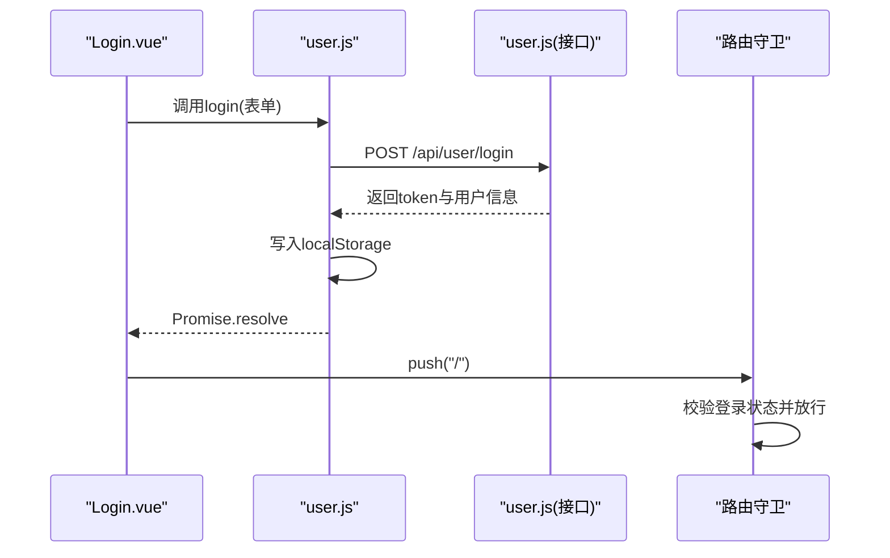
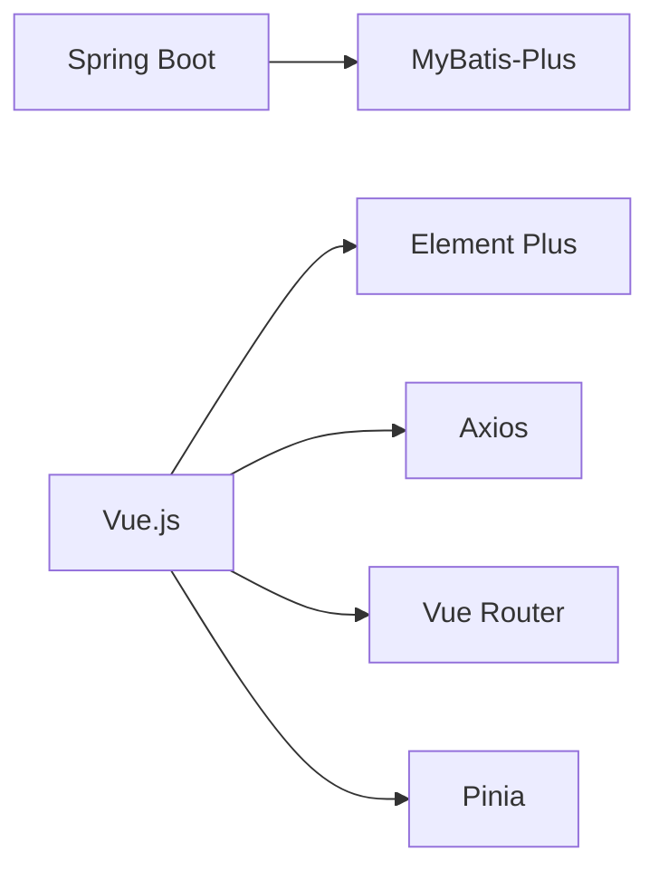
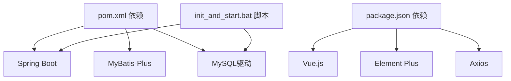

# 整体架构概览

<cite>
**本文档引用的文件**
- [DrugManagementApplication.java](file://src/main/java/com/hospital/drugmanagement/DrugManagementApplication.java)
- [application.yml](file://src/main/resources/application.yml)
- [pom.xml](file://pom.xml)
- [CorsConfig.java](file://src/main/java/com/hospital/drugmanagement/config/CorsConfig.java)
- [MybatisPlusConfig.java](file://src/main/java/com/hospital/drugmanagement/config/MybatisPlusConfig.java)
- [Result.java](file://src/main/java/com/hospital/drugmanagement/dto/Result.java)
- [DrugInfoController.java](file://src/main/java/com/hospital/drugmanagement/controller/DrugInfoController.java)
- [SysUserController.java](file://src/main/java/com/hospital/drugmanagement/controller/SysUserController.java)
- [package.json](file://drug-front/package.json)
- [vite.config.js](file://drug-front/vite.config.js)
- [request.js](file://drug-front/src/utils/request.js)
- [index.js](file://drug-front/src/router/index.js)
- [drug.js](file://drug-front/src/api/drug.js)
- [user.js](file://drug-front/src/store/user.js)
- [Login.vue](file://drug-front/src/views/Login.vue)
- [hospital_drug.sql](file://hospital_drug.sql)
- [init_and_start.bat](file://init_and_start.bat)
</cite>

## 目录
1. [引言](#引言)
2. [项目结构](#项目结构)
3. [核心组件](#核心组件)
4. [架构总览](#架构总览)
5. [详细组件分析](#详细组件分析)
6. [依赖分析](#依赖分析)
7. [性能考虑](#性能考虑)
8. [故障排查指南](#故障排查指南)
9. [结论](#结论)
10. [附录](#附录)

## 引言
本项目为一个基于前后端分离架构的医院药品管理系统，采用 Spring Boot + MyBatis-Plus 作为后端技术栈，Vue.js + Element Plus 作为前端技术栈。系统通过 RESTful API 提供统一接口规范，支持跨域访问与统一响应封装，具备完善的用户认证与权限控制能力。本文档旨在帮助开发者快速理解系统的整体设计思路与实现要点。

## 项目结构
项目采用多模块结构，后端位于 src/main/java，前端位于 drug-front 目录。后端通过 Spring Boot 自动装配与组件扫描机制启动，前端通过 Vite 进行开发与构建。

图表来源
- [DrugManagementApplication.java:14-33](file://src/main/java/com/hospital/drugmanagement/DrugManagementApplication.java#L14-L33)
- [application.yml:1-24](file://src/main/resources/application.yml#L1-L24)
- [pom.xml:32-84](file://pom.xml#L32-L84)
- [vite.config.js:12-21](file://drug-front/vite.config.js#L12-L21)
- [request.js:6-9](file://drug-front/src/utils/request.js#L6-L9)

章节来源
- [DrugManagementApplication.java:14-33](file://src/main/java/com/hospital/drugmanagement/DrugManagementApplication.java#L14-L33)
- [application.yml:1-24](file://src/main/resources/application.yml#L1-L24)
- [pom.xml:29-84](file://pom.xml#L29-L84)
- [vite.config.js:1-22](file://drug-front/vite.config.js#L1-L22)

## 核心组件
- 应用入口与组件扫描
  - 应用入口类负责启动 Spring Boot 应用，并通过组件扫描与 @Import 注解确保控制器被纳入容器管理。
  - 数据访问层通过 @MapperScan 扫描 Mapper 接口，保证 MyBatis-Plus 的实体映射与分页插件生效。
- 统一响应封装
  - DTO 层提供统一响应结构，便于前后端约定一致的数据格式。
- RESTful API 设计
  - 控制器层遵循资源化命名与标准 HTTP 方法，提供增删改查与分页查询接口。
- 跨域与安全
  - CORS 配置允许跨域访问，结合前端代理减少开发时的跨域问题。
- 前端交互
  - Axios 封装统一请求与响应拦截，路由守卫保障登录态校验，Pinia 管理用户状态。

章节来源
- [DrugManagementApplication.java:14-33](file://src/main/java/com/hospital/drugmanagement/DrugManagementApplication.java#L14-L33)
- [Result.java:1-99](file://src/main/java/com/hospital/drugmanagement/dto/Result.java#L1-L99)
- [CorsConfig.java:1-19](file://src/main/java/com/hospital/drugmanagement/config/CorsConfig.java#L1-L19)
- [request.js:1-56](file://drug-front/src/utils/request.js#L1-L56)

## 架构总览
系统采用前后端分离架构，后端提供 RESTful API，前端通过 Axios 发起请求并与后端进行数据交互。开发阶段通过 Vite 代理将 /api 前缀的请求转发至后端服务，生产环境可部署于同一域名或通过网关统一管理。

图表来源
- [vite.config.js:14-19](file://drug-front/vite.config.js#L14-L19)
- [request.js:7](file://drug-front/src/utils/request.js#L7)
- [application.yml:15-16](file://src/main/resources/application.yml#L15-L16)

## 详细组件分析

### 后端启动与组件扫描机制
- 应用入口类通过 @SpringBootApplication 启动，结合 @ComponentScan 与 @Import 确保控制器、服务与配置类被正确注册。
- @MapperScan 扫描 Mapper 接口，配合 MyBatis-Plus 配置启用分页插件。
- 数据源与 MyBatis-Plus 配置在 application.yml 中集中管理，便于维护与切换。

图表来源
- [DrugManagementApplication.java:18-24](file://src/main/java/com/hospital/drugmanagement/DrugManagementApplication.java#L18-L24)
- [MybatisPlusConfig.java:8-16](file://src/main/java/com/hospital/drugmanagement/config/MybatisPlusConfig.java#L8-L16)
- [application.yml:19-24](file://src/main/resources/application.yml#L19-L24)

章节来源
- [DrugManagementApplication.java:14-33](file://src/main/java/com/hospital/drugmanagement/DrugManagementApplication.java#L14-L33)
- [MybatisPlusConfig.java:1-16](file://src/main/java/com/hospital/drugmanagement/config/MybatisPlusConfig.java#L1-L16)
- [application.yml:1-24](file://src/main/resources/application.yml#L1-L24)

### RESTful API 设计与统一接口规范
- 资源命名与路径
  - 药品管理：/api/drug
  - 用户管理：/api/user
  - 其他模块以此类推，遵循“按资源划分”的 RESTful 设计原则。
- 统一响应结构
  - 使用 Result<T> 或 Map<String,Object> 返回统一结构，包含状态码、消息与数据体，便于前端统一处理。
- 分页与查询
  - 控制器接收分页参数与过滤条件，结合 MyBatis-Plus 分页插件实现高效查询。
- 跨域处理
  - 在控制器层使用 @CrossOrigin 或全局 CORS 配置，满足前后端分离开发需求。

图表来源
- [DrugInfoController.java:22-58](file://src/main/java/com/hospital/drugmanagement/controller/DrugInfoController.java#L22-L58)
- [MybatisPlusConfig.java:10-15](file://src/main/java/com/hospital/drugmanagement/config/MybatisPlusConfig.java#L10-L15)

章节来源
- [DrugInfoController.java:14-169](file://src/main/java/com/hospital/drugmanagement/controller/DrugInfoController.java#L14-L169)
- [SysUserController.java:26-147](file://src/main/java/com/hospital/drugmanagement/controller/SysUserController.java#L26-L147)
- [Result.java:1-99](file://src/main/java/com/hospital/drugmanagement/dto/Result.java#L1-L99)

### 跨域处理机制与CORS配置策略
- 全局 CORS 配置
  - 通过实现 WebMvcConfigurer 接口，在 CorsConfig 中开放所有路径的跨域访问，允许常见方法与头部，设置合理的缓存时间。
- 控制器级 CORS
  - 部分控制器使用 @CrossOrigin 注解，确保特定接口的跨域行为符合预期。
- 前端代理
  - Vite 开发服务器配置 /api 代理，将前端请求转发至后端，避免浏览器同源策略限制。

图表来源
- [CorsConfig.java:10-17](file://src/main/java/com/hospital/drugmanagement/config/CorsConfig.java#L10-L17)
- [vite.config.js:14-19](file://drug-front/vite.config.js#L14-L19)

章节来源
- [CorsConfig.java:1-19](file://src/main/java/com/hospital/drugmanagement/config/CorsConfig.java#L1-L19)
- [vite.config.js:12-21](file://drug-front/vite.config.js#L12-L21)

### 前端交互与路由守卫
- Axios 封装
  - 在 request.js 中创建 axios 实例，设置基础路径、超时时间与请求/响应拦截器，统一处理鉴权头与错误提示。
- 路由与守卫
  - 路由配置包含登录页与主布局子路由；beforeEach 守卫根据登录状态决定放行或重定向至登录页。
- 状态管理
  - Pinia Store 管理 token、用户信息、角色与菜单，持久化存储于 localStorage，支持登录、获取当前用户与登出操作。
- 页面组件
  - Login.vue 提供基础登录表单与校验逻辑，提交后调用用户 Store 完成登录流程。

图表来源
- [Login.vue:75-92](file://drug-front/src/views/Login.vue#L75-L92)
- [user.js:22-38](file://drug-front/src/store/user.js#L22-L38)
- [index.js:92-112](file://drug-front/src/router/index.js#L92-L112)
- [request.js:12-25](file://drug-front/src/utils/request.js#L12-L25)

章节来源
- [request.js:1-56](file://drug-front/src/utils/request.js#L1-L56)
- [index.js:1-115](file://drug-front/src/router/index.js#L1-L115)
- [user.js:1-68](file://drug-front/src/store/user.js#L1-L68)
- [Login.vue:1-127](file://drug-front/src/views/Login.vue#L1-L127)

### 技术栈对比与组合优势
- Spring Boot + MyBatis-Plus
  - 快速开发、自动配置、强大的分页与条件构造器，降低数据库操作复杂度。
- Vue.js + Element Plus
  - 组件化开发体验良好，Element Plus 提供丰富的 UI 组件，适合后台管理系统。
- 前后端分离
  - 明确职责边界，提升开发效率与可维护性；通过统一 API 规范降低耦合。

图表来源
- [pom.xml:32-64](file://pom.xml#L32-L64)
- [package.json:13-27](file://drug-front/package.json#L13-L27)

章节来源
- [pom.xml:29-84](file://pom.xml#L29-L84)
- [package.json:1-29](file://drug-front/package.json#L1-L29)

## 依赖分析
- 后端依赖
  - Web、Thymeleaf、MySQL 驱动、MyBatis-Plus、分页插件与测试依赖构成后端核心能力。
- 前端依赖
  - Vue 3、Vue Router、Pinia、Element Plus、Axios 等组成现代前端开发栈。
- 启动与初始化
  - init_and_start.bat 脚本用于初始化数据库并启动后端服务，简化本地开发流程。

图表来源
- [pom.xml:32-84](file://pom.xml#L32-L84)
- [package.json:13-27](file://drug-front/package.json#L13-L27)
- [init_and_start.bat:4-9](file://init_and_start.bat#L4-L9)

章节来源
- [pom.xml:29-84](file://pom.xml#L29-L84)
- [package.json:1-29](file://drug-front/package.json#L1-L29)
- [init_and_start.bat:1-11](file://init_and_start.bat#L1-L11)

## 性能考虑
- 数据访问层
  - 使用 MyBatis-Plus 分页插件与条件构造器，避免全表扫描，合理使用索引提升查询性能。
- 前端交互
  - Axios 统一拦截器减少重复代码，路由懒加载与组件按需加载优化首屏性能。
- 配置优化
  - application.yml 中的日志与命名转换配置有助于调试与性能观测。

## 故障排查指南
- 启动失败
  - 检查 application.yml 中数据库连接配置与端口占用情况；确认 init_and_start.bat 是否正确执行。
- 跨域问题
  - 确认 CORS 配置是否生效，或检查 Vite 代理是否正确指向后端服务。
- 登录异常
  - 检查前端请求拦截器是否正确设置 Authorization 头，后端路由守卫是否正确解析 token。
- 数据库初始化
  - 使用 hospital_drug.sql 初始化表结构与基础数据，确保字段与实体映射一致。

章节来源
- [application.yml:1-24](file://src/main/resources/application.yml#L1-L24)
- [CorsConfig.java:10-17](file://src/main/java/com/hospital/drugmanagement/config/CorsConfig.java#L10-L17)
- [vite.config.js:14-19](file://drug-front/vite.config.js#L14-L19)
- [request.js:14-18](file://drug-front/src/utils/request.js#L14-L18)
- [hospital_drug.sql:1-200](file://hospital_drug.sql#L1-L200)

## 结论
本系统通过前后端分离架构实现了清晰的职责划分与高效的开发流程。后端以 Spring Boot + MyBatis-Plus 提供稳定的数据访问与业务处理能力，前端以 Vue.js + Element Plus 构建现代化的用户界面。统一的 RESTful API 与 CORS 配置确保了良好的跨域与交互体验。建议在生产环境中进一步完善安全策略、监控与日志体系，持续优化性能与用户体验。

## 附录
- 数据库初始化脚本与表结构定义可参考 hospital_drug.sql。
- 项目启动脚本 init_and_start.bat 可一键完成数据库初始化与后端启动。

章节来源
- [hospital_drug.sql:1-200](file://hospital_drug.sql#L1-L200)
- [init_and_start.bat:1-11](file://init_and_start.bat#L1-L11)