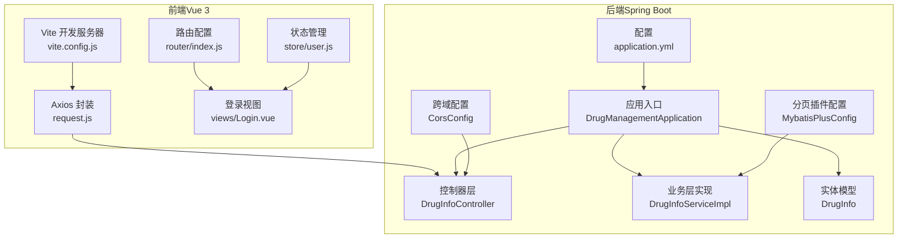
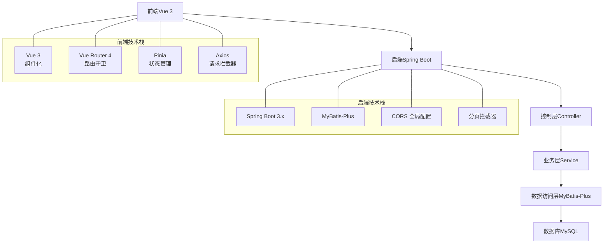
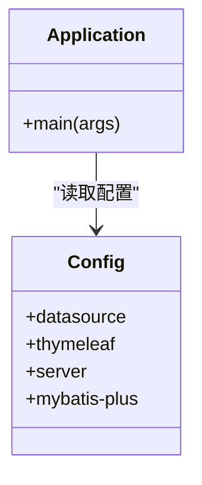
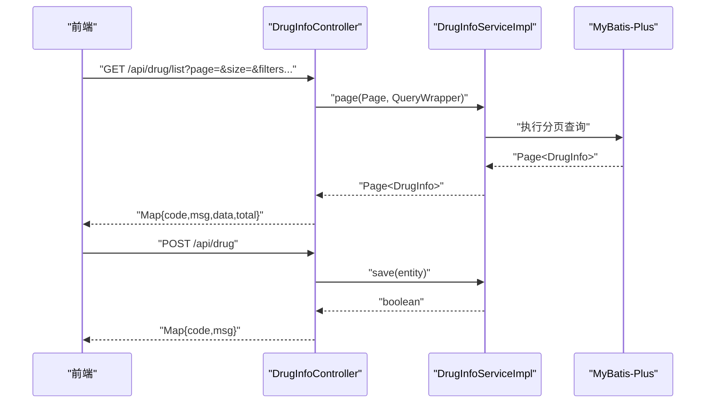
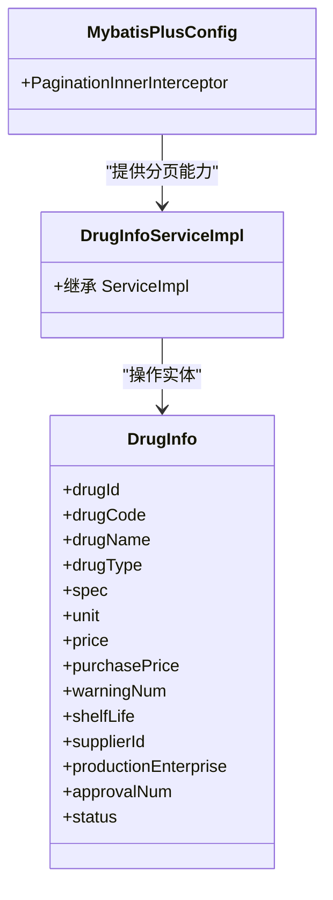
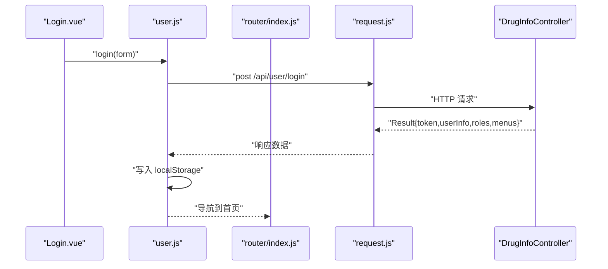
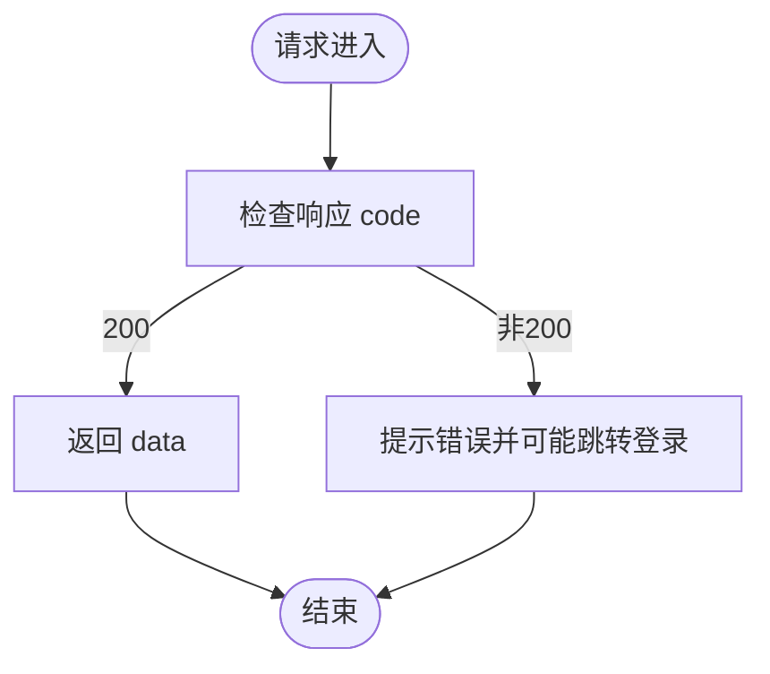
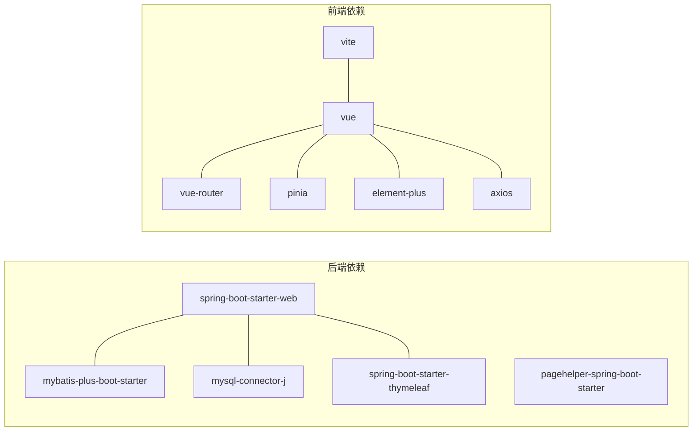

# 系统架构设计

<cite>
**本文引用的文件**
- [DrugManagementApplication.java](file://src/main/java/com/hospital/drugmanagement/DrugManagementApplication.java)
- [application.yml](file://src/main/resources/application.yml)
- [pom.xml](file://pom.xml)
- [CorsConfig.java](file://src/main/java/com/hospital/drugmanagement/config/CorsConfig.java)
- [MybatisPlusConfig.java](file://src/main/java/com/hospital/drugmanagement/config/MybatisPlusConfig.java)
- [Result.java](file://src/main/java/com/hospital/drugmanagement/dto/Result.java)
- [DrugInfoController.java](file://src/main/java/com/hospital/drugmanagement/controller/DrugInfoController.java)
- [DrugInfoServiceImpl.java](file://src/main/java/com/hospital/drugmanagement/service/impl/DrugInfoServiceImpl.java)
- [DrugInfo.java](file://src/main/java/com/hospital/drugmanagement/entity/DrugInfo.java)
- [vite.config.js](file://drug-front/vite.config.js)
- [package.json](file://drug-front/package.json)
- [request.js](file://drug-front/src/utils/request.js)
- [index.js](file://drug-front/src/router/index.js)
- [user.js](file://drug-front/src/store/user.js)
- [Login.vue](file://drug-front/src/views/Login.vue)
</cite>

## 目录
1. [引言](#引言)
2. [项目结构](#项目结构)
3. [核心组件](#核心组件)
4. [架构总览](#架构总览)
5. [详细组件分析](#详细组件分析)
6. [依赖分析](#依赖分析)
7. [性能考虑](#性能考虑)
8. [故障排查指南](#故障排查指南)
9. [结论](#结论)
10. [附录](#附录)

## 引言
本文件面向医院药品管理系统，提供系统架构设计的综合文档。重点阐述分层架构（表现层、控制层、业务层、数据访问层）的设计理念与职责边界；前后端分离的实现方式（RESTful API 设计、跨域处理、统一响应格式）；Spring Boot 自动配置与依赖注入容器的工作原理；MyBatis-Plus 的 ORM 映射、分页查询优化与乐观锁机制；Vue.js 组件化架构、单文件组件与状态管理模式；以及可扩展性、性能优化与安全防护等架构决策。

## 项目结构
系统采用前后端分离架构：
- 后端基于 Spring Boot 3.x + MyBatis-Plus，使用 Maven 管理依赖，提供 RESTful API。
- 前端基于 Vue 3 + Vite + Element Plus + Pinia，通过 Axios 发起请求，路由采用 Vue Router 4。

图表来源
- [DrugManagementApplication.java:14-32](file://src/main/java/com/hospital/drugmanagement/DrugManagementApplication.java#L14-L32)
- [application.yml:1-24](file://src/main/resources/application.yml#L1-L24)
- [CorsConfig.java:7-18](file://src/main/java/com/hospital/drugmanagement/config/CorsConfig.java#L7-L18)
- [MybatisPlusConfig.java:8-16](file://src/main/java/com/hospital/drugmanagement/config/MybatisPlusConfig.java#L8-L16)
- [DrugInfoController.java:14-169](file://src/main/java/com/hospital/drugmanagement/controller/DrugInfoController.java#L14-L169)
- [DrugInfoServiceImpl.java:13-18](file://src/main/java/com/hospital/drugmanagement/service/impl/DrugInfoServiceImpl.java#L13-L18)
- [DrugInfo.java:9-167](file://src/main/java/com/hospital/drugmanagement/entity/DrugInfo.java#L9-L167)
- [vite.config.js:5-21](file://drug-front/vite.config.js#L5-L21)
- [request.js:5-56](file://drug-front/src/utils/request.js#L5-L56)
- [index.js:86-115](file://drug-front/src/router/index.js#L86-L115)
- [user.js:1-68](file://drug-front/src/store/user.js#L1-L68)
- [Login.vue:1-127](file://drug-front/src/views/Login.vue#L1-L127)

章节来源
- [pom.xml:32-84](file://pom.xml#L32-L84)
- [package.json:13-22](file://drug-front/package.json#L13-L22)

## 核心组件
- 应用入口与自动配置
  - 应用入口通过注解组合启用 Spring Boot 自动装配、Mapper 接口扫描与组件扫描，并显式导入部分控制器以确保被纳入容器。
  - 关键配置项包括数据源、Thymeleaf、服务端口与 MyBatis-Plus 的别名包、SQL 日志与下划线转驼峰映射。
- 统一响应封装
  - 定义 Result<T> 统一响应结构，提供成功/失败静态工厂方法，便于前后端约定一致的数据契约。
- 跨域与分页
  - CORS 全局配置允许任意来源与方法，关闭凭据，设置最大预检时间。
  - MyBatis-Plus 插件注册分页拦截器，实现全局分页能力。
- 控制器与服务
  - 控制器层负责接收请求、参数校验与调用服务层；服务层基于 MyBatis-Plus 的 ServiceImpl 提供基础 CRUD 能力。
- 前端工程
  - Vite 作为构建工具与开发服务器，配置代理将 /api 前缀转发至后端；Axios 封装统一设置 baseURL、超时与拦截器；Pinia 管理用户态；Vue Router 实现路由守卫与页面标题动态设置。

章节来源
- [DrugManagementApplication.java:14-32](file://src/main/java/com/hospital/drugmanagement/DrugManagementApplication.java#L14-L32)
- [application.yml:1-24](file://src/main/resources/application.yml#L1-L24)
- [CorsConfig.java:7-18](file://src/main/java/com/hospital/drugmanagement/config/CorsConfig.java#L7-L18)
- [MybatisPlusConfig.java:8-16](file://src/main/java/com/hospital/drugmanagement/config/MybatisPlusConfig.java#L8-L16)
- [Result.java:8-99](file://src/main/java/com/hospital/drugmanagement/dto/Result.java#L8-L99)
- [DrugInfoController.java:14-169](file://src/main/java/com/hospital/drugmanagement/controller/DrugInfoController.java#L14-L169)
- [DrugInfoServiceImpl.java:13-18](file://src/main/java/com/hospital/drugmanagement/service/impl/DrugInfoServiceImpl.java#L13-L18)
- [vite.config.js:12-20](file://drug-front/vite.config.js#L12-L20)
- [request.js:5-56](file://drug-front/src/utils/request.js#L5-L56)
- [user.js:1-68](file://drug-front/src/store/user.js#L1-L68)
- [index.js:86-115](file://drug-front/src/router/index.js#L86-L115)

## 架构总览
系统采用经典的四层架构：
- 表现层：Vue 3 单页面应用，组件化开发，路由与状态管理解耦。
- 控制层：Spring MVC 控制器，接收前端请求，组装参数，调用服务层。
- 业务层：服务接口与实现，封装领域业务逻辑，复用 MyBatis-Plus 的通用 CRUD。
- 数据访问层：MyBatis-Plus Mapper 与实体映射，结合分页插件与 SQL 日志辅助调试。

图表来源
- [DrugManagementApplication.java:14-32](file://src/main/java/com/hospital/drugmanagement/DrugManagementApplication.java#L14-L32)
- [application.yml:1-24](file://src/main/resources/application.yml#L1-L24)
- [CorsConfig.java:7-18](file://src/main/java/com/hospital/drugmanagement/config/CorsConfig.java#L7-L18)
- [MybatisPlusConfig.java:8-16](file://src/main/java/com/hospital/drugmanagement/config/MybatisPlusConfig.java#L8-L16)
- [DrugInfoController.java:14-169](file://src/main/java/com/hospital/drugmanagement/controller/DrugInfoController.java#L14-L169)
- [DrugInfoServiceImpl.java:13-18](file://src/main/java/com/hospital/drugmanagement/service/impl/DrugInfoServiceImpl.java#L13-L18)
- [vite.config.js:12-20](file://drug-front/vite.config.js#L12-L20)
- [request.js:5-56](file://drug-front/src/utils/request.js#L5-L56)
- [index.js:86-115](file://drug-front/src/router/index.js#L86-L115)
- [user.js:1-68](file://drug-front/src/store/user.js#L1-L68)

## 详细组件分析

### 后端应用与自动配置
- 自动配置要点
  - @SpringBootApplication 启用组件扫描与 Web 环境。
  - @MapperScan 扫描 Mapper 接口，配合 MyBatis-Plus 启动器。
  - @ComponentScan 指定扫描包范围，确保控制器、服务、配置类被发现。
  - @Import 显式导入特定控制器，保证其被 Spring 容器管理。
- 配置文件要点
  - 数据源：MySQL 连接参数、驱动类名。
  - Thymeleaf：模板目录与缓存关闭，便于调试。
  - 服务端口：8081。
  - MyBatis-Plus：XML 映射路径、实体包、日志输出、下划线转驼峰。

图表来源
- [DrugManagementApplication.java:14-32](file://src/main/java/com/hospital/drugmanagement/DrugManagementApplication.java#L14-L32)
- [application.yml:1-24](file://src/main/resources/application.yml#L1-L24)

章节来源
- [DrugManagementApplication.java:14-32](file://src/main/java/com/hospital/drugmanagement/DrugManagementApplication.java#L14-L32)
- [application.yml:1-24](file://src/main/resources/application.yml#L1-L24)

### 控制器层（RESTful API）
- 设计原则
  - 使用 @RestController 与 @RequestMapping 统一前缀，按资源命名。
  - 参数校验与分页：支持分页参数与多字段过滤。
  - 统一响应：返回 Map 结构，便于快速扩展。
- 典型流程
  - GET /api/drug/list：构建查询条件，调用分页服务，返回记录与总数。
  - POST /api/drug：保存前进行唯一性校验，避免重复编码或名称。
  - PUT /api/drug：更新前进行唯一性校验（排除自身）。
  - DELETE /api/drug/{id}：删除并返回结果。

图表来源
- [DrugInfoController.java:22-58](file://src/main/java/com/hospital/drugmanagement/controller/DrugInfoController.java#L22-L58)
- [DrugInfoController.java:76-113](file://src/main/java/com/hospital/drugmanagement/controller/DrugInfoController.java#L76-L113)
- [DrugInfoController.java:115-151](file://src/main/java/com/hospital/drugmanagement/controller/DrugInfoController.java#L115-L151)
- [DrugInfoController.java:153-167](file://src/main/java/com/hospital/drugmanagement/controller/DrugInfoController.java#L153-L167)
- [DrugInfoServiceImpl.java:13-18](file://src/main/java/com/hospital/drugmanagement/service/impl/DrugInfoServiceImpl.java#L13-L18)

章节来源
- [DrugInfoController.java:14-169](file://src/main/java/com/hospital/drugmanagement/controller/DrugInfoController.java#L14-L169)

### 业务层与数据访问层
- 业务层
  - 基于 MyBatis-Plus 的 ServiceImpl，继承通用 CRUD 能力，减少样板代码。
- 数据访问层
  - 实体类使用注解映射数据库表字段，支持主键类型与精度字段。
  - 配合分页插件，实现全局分页拦截。

图表来源
- [DrugInfoServiceImpl.java:13-18](file://src/main/java/com/hospital/drugmanagement/service/impl/DrugInfoServiceImpl.java#L13-L18)
- [DrugInfo.java:9-167](file://src/main/java/com/hospital/drugmanagement/entity/DrugInfo.java#L9-L167)
- [MybatisPlusConfig.java:8-16](file://src/main/java/com/hospital/drugmanagement/config/MybatisPlusConfig.java#L8-L16)

章节来源
- [DrugInfoServiceImpl.java:13-18](file://src/main/java/com/hospital/drugmanagement/service/impl/DrugInfoServiceImpl.java#L13-L18)
- [DrugInfo.java:9-167](file://src/main/java/com/hospital/drugmanagement/entity/DrugInfo.java#L9-L167)
- [MybatisPlusConfig.java:8-16](file://src/main/java/com/hospital/drugmanagement/config/MybatisPlusConfig.java#L8-L16)

### 前端组件化与状态管理
- 组件化架构
  - 单文件组件（.vue）封装模板、脚本与样式，提升可维护性。
  - 登录组件 Login.vue 使用 Element Plus 表单与按钮，配合表单校验与异步提交。
- 路由与守卫
  - Vue Router 4 配置多级路由与懒加载；路由守卫根据登录状态重定向。
- 状态管理
  - Pinia Store 管理 token、用户信息、角色与菜单；持久化到 localStorage。
- 请求封装
  - Axios 实例设置 baseURL、超时；请求头携带 Authorization；响应拦截器统一处理非 200 状态与 401 未授权跳转。

图表来源
- [Login.vue:74-92](file://drug-front/src/views/Login.vue#L74-L92)
- [user.js:20-38](file://drug-front/src/store/user.js#L20-L38)
- [index.js:91-112](file://drug-front/src/router/index.js#L91-L112)
- [request.js:11-25](file://drug-front/src/utils/request.js#L11-L25)
- [request.js:27-53](file://drug-front/src/utils/request.js#L27-L53)
- [DrugInfoController.java:14-169](file://src/main/java/com/hospital/drugmanagement/controller/DrugInfoController.java#L14-L169)

章节来源
- [Login.vue:1-127](file://drug-front/src/views/Login.vue#L1-L127)
- [user.js:1-68](file://drug-front/src/store/user.js#L1-L68)
- [index.js:1-115](file://drug-front/src/router/index.js#L1-L115)
- [request.js:1-56](file://drug-front/src/utils/request.js#L1-L56)

### 统一响应与跨域处理
- 统一响应
  - Result<T> 提供成功/失败静态方法，约定 code、msg、data 字段，便于前端统一处理。
- 跨域配置
  - 允许任意来源与常见方法，关闭凭据，设置最大预检时间，满足开发阶段的跨域需求。

图表来源
- [Result.java:50-97](file://src/main/java/com/hospital/drugmanagement/dto/Result.java#L50-L97)
- [request.js:27-53](file://drug-front/src/utils/request.js#L27-L53)

章节来源
- [Result.java:8-99](file://src/main/java/com/hospital/drugmanagement/dto/Result.java#L8-L99)
- [CorsConfig.java:7-18](file://src/main/java/com/hospital/drugmanagement/config/CorsConfig.java#L7-L18)

## 依赖分析
- 后端依赖
  - spring-boot-starter-web：提供 Web 与嵌入式 Tomcat。
  - mybatis-spring-boot-starter 与 mybatis-plus-boot-starter：集成 MyBatis 与 MyBatis-Plus。
  - pagehelper-spring-boot-starter：分页插件。
  - mysql-connector-j：MySQL 驱动。
  - thymeleaf：服务端模板渲染（开发调试友好）。
- 前端依赖
  - vue、vue-router、pinia：框架与状态管理。
  - element-plus、@element-plus/icons-vue：UI 组件库。
  - axios：HTTP 客户端。
  - vite、@vitejs/plugin-vue：构建与开发服务器。

图表来源
- [pom.xml:32-84](file://pom.xml#L32-L84)
- [package.json:13-22](file://drug-front/package.json#L13-L22)

章节来源
- [pom.xml:32-84](file://pom.xml#L32-L84)
- [package.json:13-22](file://drug-front/package.json#L13-L22)

## 性能考虑
- 数据访问层
  - 下划线转驼峰映射减少字段映射成本，提升可读性。
  - 分页插件在服务端进行分页，避免一次性加载大量数据。
- 控制器层
  - 查询条件使用条件构造器，避免全表扫描。
- 前端层
  - 路由懒加载与组件按需加载，降低首屏体积。
  - Axios 超时设置与错误统一处理，提升用户体验。
- 可扩展性
  - 控制器与服务层职责清晰，便于横向扩展新模块。
  - MyBatis-Plus 提供便捷的 CRUD 与分页能力，减少重复开发。

## 故障排查指南
- 启动与连接
  - 确认 application.yml 中数据库连接参数正确，端口 8081 可用。
  - 若出现 SQL 日志未输出，检查 MyBatis-Plus 日志配置。
- 跨域问题
  - 前端代理配置需与后端端口一致；若仍跨域，检查 CORS 配置与请求头。
- 统一响应
  - 前端拦截器会根据 code 字段判断是否成功；遇到 401 自动清空本地存储并跳转登录页。
- 分页异常
  - 确认分页参数传递正确；检查分页插件是否生效。

章节来源
- [application.yml:1-24](file://src/main/resources/application.yml#L1-L24)
- [CorsConfig.java:7-18](file://src/main/java/com/hospital/drugmanagement/config/CorsConfig.java#L7-L18)
- [request.js:27-53](file://drug-front/src/utils/request.js#L27-L53)
- [MybatisPlusConfig.java:8-16](file://src/main/java/com/hospital/drugmanagement/config/MybatisPlusConfig.java#L8-L16)

## 结论
本系统通过前后端分离与分层架构实现了清晰的职责划分与良好的可扩展性。后端依托 Spring Boot 与 MyBatis-Plus 提供稳定的数据访问与业务处理能力；前端采用 Vue 3 生态实现组件化与状态管理。统一响应与跨域配置提升了前后端协作效率。建议在生产环境进一步完善安全策略（如 JWT、权限控制）、接入缓存与监控体系，并对热点接口进行压测与优化。

## 附录
- 开发与运行
  - 后端：启动入口见应用类，访问示例接口地址在启动日志中打印。
  - 前端：Vite 开发服务器默认端口 3000，代理转发至后端 8081。
- 数据模型（简化）
  - 药品信息实体包含主键、编码、名称、规格、单位、价格、预警数量、有效期、供应商、批准文号、状态等字段。

章节来源
- [DrugManagementApplication.java:26-31](file://src/main/java/com/hospital/drugmanagement/DrugManagementApplication.java#L26-L31)
- [vite.config.js:12-20](file://drug-front/vite.config.js#L12-L20)
- [DrugInfo.java:9-167](file://src/main/java/com/hospital/drugmanagement/entity/DrugInfo.java#L9-L167)