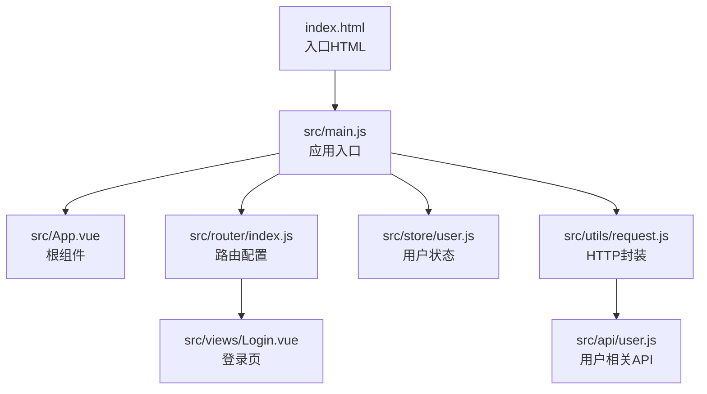
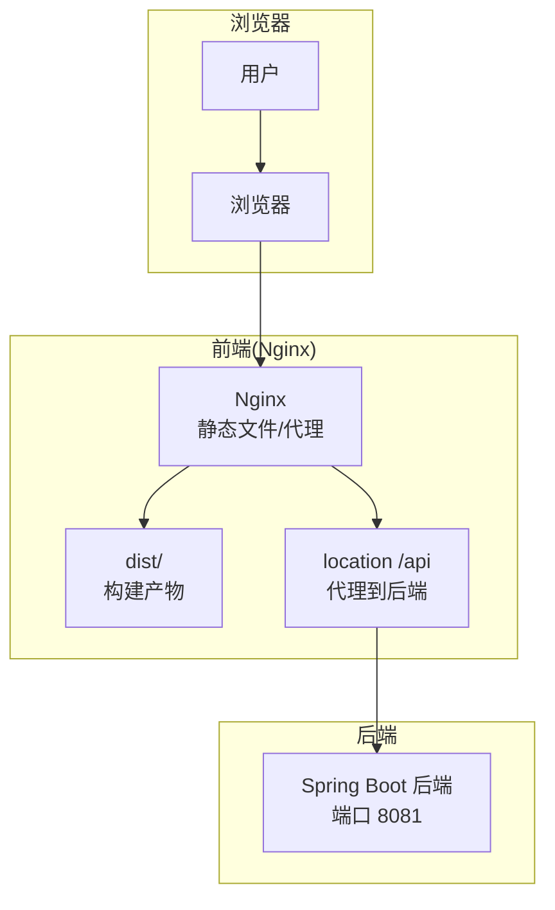

# 前端部署

<cite>
**本文引用的文件**
- [package.json](file://drug-front/package.json)
- [vite.config.js](file://drug-front/vite.config.js)
- [index.html](file://drug-front/index.html)
- [main.js](file://drug-front/src/main.js)
- [README.md](file://drug-front/README.md)
- [request.js](file://drug-front/src/utils/request.js)
- [router/index.js](file://drug-front/src/router/index.js)
- [store/user.js](file://drug-front/src/store/user.js)
- [api/user.js](file://drug-front/src/api/user.js)
- [views/Login.vue](file://drug-front/src/views/Login.vue)
- [App.vue](file://drug-front/src/App.vue)
</cite>

## 目录
1. [简介](#简介)
2. [项目结构](#项目结构)
3. [核心组件](#核心组件)
4. [架构总览](#架构总览)
5. [详细组件分析](#详细组件分析)
6. [依赖分析](#依赖分析)
7. [性能考虑](#性能考虑)
8. [故障排查指南](#故障排查指南)
9. [结论](#结论)
10. [附录](#附录)

## 简介
本指南面向部署基于 Vue 3 + Vite 的前端应用，覆盖开发与生产构建差异、静态资源打包优化、CDN 与缓存策略、Nginx 反向代理（静态文件服务、API 代理转发、跨域处理）、域名与 HTTPS、Gzip 压缩、性能优化与监控配置等。文档以仓库中的实际配置与代码为依据，提供可落地的部署实践。

## 项目结构
前端工程位于 drug-front 目录，采用 Vite 作为构建工具，使用 Vue 3、Element Plus、Pinia、Vue Router、Axios 等技术栈。入口 HTML 与入口 JS 分别位于根目录与 src 目录；路由、状态管理、HTTP 封装与业务 API 均在 src 子目录下组织。

图示来源
- [index.html:1-14](file://drug-front/index.html#L1-L14)
- [main.js:1-26](file://drug-front/src/main.js#L1-L26)
- [App.vue:1-24](file://drug-front/src/App.vue#L1-L24)
- [router/index.js:1-115](file://drug-front/src/router/index.js#L1-L115)
- [store/user.js:1-68](file://drug-front/src/store/user.js#L1-L68)
- [request.js:1-56](file://drug-front/src/utils/request.js#L1-L56)
- [api/user.js:1-71](file://drug-front/src/api/user.js#L1-L71)
- [views/Login.vue:1-127](file://drug-front/src/views/Login.vue#L1-L127)

章节来源
- [package.json:1-29](file://drug-front/package.json#L1-L29)
- [vite.config.js:1-22](file://drug-front/vite.config.js#L1-L22)
- [index.html:1-14](file://drug-front/index.html#L1-L14)
- [main.js:1-26](file://drug-front/src/main.js#L1-L26)

## 核心组件
- 构建与脚本
  - 开发：通过 Vite 启动本地开发服务器，端口默认 3000，内置代理到后端 API。
  - 生产：使用 Vite 进行产物构建，输出至 dist 目录，可通过 vite preview 预览。
- 应用入口
  - main.js 初始化应用、注册 Element Plus、全局图标、Pinia、Router，并挂载到 DOM。
- 路由与鉴权
  - 路由采用 history 模式，结合 Pinia 用户状态进行登录态判断与页面标题设置。
- HTTP 封装
  - request.js 基于 Axios，统一设置基础路径、超时、请求头携带 Token、响应拦截与错误处理。
- API 层
  - api/user.js 提供登录、获取当前用户等接口调用方法，供视图层使用。

章节来源
- [package.json:8-12](file://drug-front/package.json#L8-L12)
- [vite.config.js:12-21](file://drug-front/vite.config.js#L12-L21)
- [main.js:1-26](file://drug-front/src/main.js#L1-L26)
- [router/index.js:91-112](file://drug-front/src/router/index.js#L91-L112)
- [request.js:5-53](file://drug-front/src/utils/request.js#L5-L53)
- [api/user.js:55-70](file://drug-front/src/api/user.js#L55-L70)

## 架构总览
前端应用通过 Vite 在开发环境提供热更新与代理能力；生产环境构建产物交由 Nginx 提供静态文件服务，并将 /api 前缀的请求代理至后端服务。登录流程通过 Pinia 管理 Token 与用户信息，Axios 封装统一处理鉴权与错误提示。

图示来源
- [vite.config.js:12-21](file://drug-front/vite.config.js#L12-L21)
- [request.js:6-9](file://drug-front/src/utils/request.js#L6-L9)
- [README.md:236-255](file://drug-front/README.md#L236-L255)

## 详细组件分析

### Vite 构建与开发服务器
- 开发服务器
  - 端口：3000
  - 代理：/api 前缀代理到 http://localhost:8081，开启跨域模拟
- 生产构建
  - 输出目录：dist
  - 预览：vite preview
- 路径别名
  - @ 指向 src 目录，便于导入

章节来源
- [vite.config.js:12-21](file://drug-front/vite.config.js#L12-L21)
- [package.json:8-12](file://drug-front/package.json#L8-L12)

### 应用入口与插件初始化
- 注册 Element Plus 国际化为简体中文
- 注册 Element Plus 图标组件
- 初始化 Pinia、Router 并挂载应用

章节来源
- [main.js:1-26](file://drug-front/src/main.js#L1-L26)

### 路由与鉴权
- 路由模式：history
- 导航守卫：根据登录态决定放行或跳转登录页
- 页面标题：动态设置

章节来源
- [router/index.js:86-112](file://drug-front/src/router/index.js#L86-L112)

### HTTP 封装与鉴权
- 基础路径：开发环境固定为 http://localhost:8081/api
- 超时：15 秒
- 请求头：自动附加 Authorization: Bearer <token>
- 响应拦截：统一错误提示；401 自动清理本地存储并跳转登录

章节来源
- [request.js:5-53](file://drug-front/src/utils/request.js#L5-L53)

### 登录流程与状态管理
- 登录成功写入 token、用户信息、菜单与角色至本地存储
- 登出清理本地存储
- 登录页使用 Element Plus 表单校验与按钮加载态

章节来源
- [store/user.js:20-66](file://drug-front/src/store/user.js#L20-L66)
- [views/Login.vue:74-92](file://drug-front/src/views/Login.vue#L74-L92)

### API 使用示例
- 用户登录、获取当前用户等接口通过 request.js 发起请求

章节来源
- [api/user.js:55-70](file://drug-front/src/api/user.js#L55-L70)
- [request.js:1-56](file://drug-front/src/utils/request.js#L1-L56)

### 构建与部署流程（开发到生产）
- 开发
  - 启动：npm run dev
  - 访问：http://localhost:3000
  - 代理：/api -> http://localhost:8081
- 生产
  - 构建：npm run build
  - 预览：npm run preview
  - 部署：将 dist 目录内容部署到 Nginx 根目录或子路径

章节来源
- [README.md:70-93](file://drug-front/README.md#L70-L93)
- [README.md:224-255](file://drug-front/README.md#L224-L255)

### Nginx 反向代理与静态文件服务
- 静态文件服务
  - root 指向 dist 目录，index 指定 index.html
  - try_files 回退到 /index.html，支持 Vue Router history 模式
- API 代理
  - location /api 代理到后端服务（如 http://localhost:8081）
  - 保留 Host 与客户端 IP 头
- 跨域处理
  - 建议在后端配置 CORS，或在 Nginx 中添加必要响应头（如 Access-Control-Allow-Origin）

章节来源
- [README.md:236-255](file://drug-front/README.md#L236-L255)

### 域名、HTTPS 与压缩
- 域名
  - server_name 指定站点域名
- HTTPS
  - 配置 ssl_certificate 与 ssl_certificate_key
- Gzip 压缩
  - gzip on; gzip_types application/javascript text/css application/json 等

章节来源
- [README.md:236-255](file://drug-front/README.md#L236-L255)

### 性能优化与缓存策略
- 静态资源缓存
  - 对 dist 中的 JS/CSS 添加长缓存策略，HTML 不缓存
- CDN
  - 将第三方库（如 Element Plus、Vue）指向 CDN，减少主包体积
- 资源压缩
  - 启用 Gzip/Brotli 压缩
- 路由与组件懒加载
  - 使用动态 import 实现按需加载，降低首屏体积
- 图片与图标
  - SVG 内联或使用雪碧图；矢量图标优先使用 @element-plus/icons-vue

章节来源
- [README.md:257-264](file://drug-front/README.md#L257-L264)
- [main.js:14-17](file://drug-front/src/main.js#L14-L17)

### 监控与可观测性
- 前端监控
  - 错误上报：捕获 Promise Rejection 与全局异常
  - 性能指标：记录首屏时间、交互延迟
- 日志审计
  - 建议在后端记录用户操作日志，前端记录关键事件与错误

章节来源
- [request.js:21-24](file://drug-front/src/utils/request.js#L21-L24)
- [request.js:48-52](file://drug-front/src/utils/request.js#L48-L52)
- [README.md:257-264](file://drug-front/README.md#L257-L264)

## 依赖分析
- 构建工具链
  - Vite、@vitejs/plugin-vue、sass
- 运行时依赖
  - Vue 3、Vue Router、Pinia、Element Plus、Axios、图标库、日期库、图表库
- 开发依赖
  - Vite、Vue 插件、Sass

章节来源
- [package.json:13-27](file://drug-front/package.json#L13-L27)

## 性能考虑
- 构建优化
  - 合理拆分包，减少 vendor 体积
  - Tree-shaking 与按需引入
- 运行时优化
  - 路由与组件懒加载
  - 图标与图片资源优化
- 缓存与传输
  - 静态资源强缓存、HTML 不缓存
  - 启用 Gzip/Brotli 压缩

章节来源
- [README.md:257-264](file://drug-front/README.md#L257-L264)

## 故障排查指南
- 依赖安装失败
  - 清理缓存、删除 node_modules 与 lockfile 后重装
- 端口占用
  - 修改 Vite 端口或释放占用端口
- 后端接口不可达
  - 确认后端已启动、端口正确、数据库连接正常
- 跨域问题
  - 开发环境使用 Vite 代理；生产环境在后端或 Nginx 配置 CORS

章节来源
- [README.md:184-208](file://drug-front/README.md#L184-L208)
- [README.md:157-168](file://drug-front/README.md#L157-L168)

## 结论
本指南基于仓库现有配置，给出了从开发到生产的完整部署路径与优化建议。建议在生产环境中结合 Nginx 的静态文件服务与 API 代理、CDN 与缓存策略、HTTPS 与压缩，配合前端监控与后端日志审计，实现稳定高效的前端上线方案。

## 附录

### 开发与生产构建差异速览
- 开发
  - 端口 3000，/api 代理到后端
- 生产
  - 构建产物 dist，Nginx 提供静态文件与 API 代理

章节来源
- [vite.config.js:12-21](file://drug-front/vite.config.js#L12-L21)
- [README.md:70-93](file://drug-front/README.md#L70-L93)
- [README.md:224-255](file://drug-front/README.md#L224-L255)