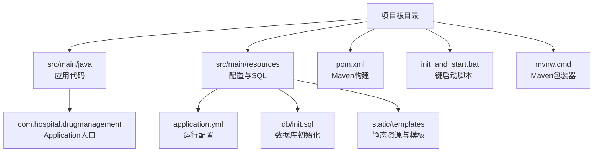
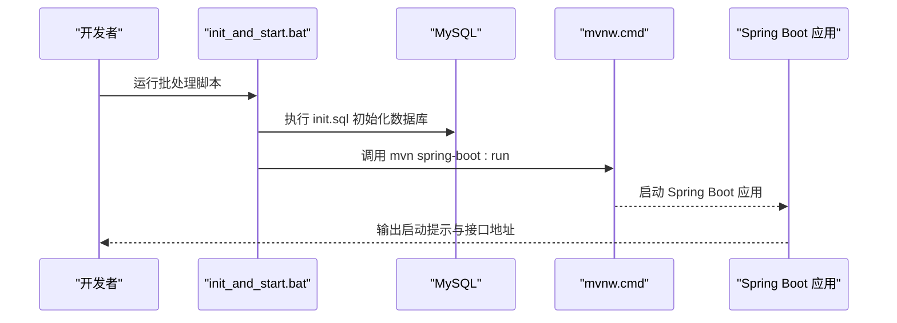
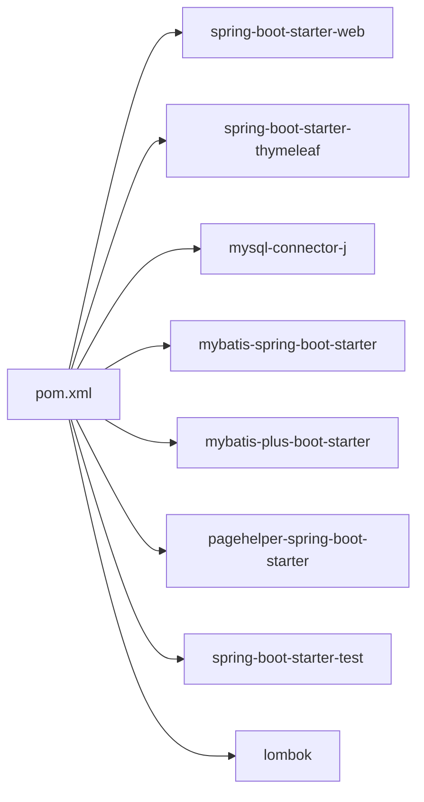

# 后端部署

<cite>
**本文引用的文件**
- [pom.xml](file://pom.xml)
- [application.yml](file://src/main/resources/application.yml)
- [init_and_start.bat](file://init_and_start.bat)
- [mvnw.cmd](file://mvnw.cmd)
- [DrugManagementApplication.java](file://src/main/java/com/hospital/drugmanagement/DrugManagementApplication.java)
- [init.sql](file://src/main/resources/db/init.sql)
- [JacksonConfig.java](file://src/main/java/com/hospital/drugmanagement/config/JacksonConfig.java)
</cite>

## 目录
1. [简介](#简介)
2. [项目结构](#项目结构)
3. [核心组件](#核心组件)
4. [架构概览](#架构概览)
5. [详细组件分析](#详细组件分析)
6. [依赖分析](#依赖分析)
7. [性能考虑](#性能考虑)
8. [故障排查指南](#故障排查指南)
9. [结论](#结论)
10. [附录](#附录)

## 简介
本指南面向运维与开发团队，提供基于 Spring Boot 的后端服务部署全流程说明，涵盖 Maven 构建、JAR 打包、启动参数、环境配置、进程管理、日志与健康检查、以及 PM2 与 systemd 的守护方案与多实例/负载均衡建议。文档同时给出与前端交互的端口与跨域注意事项。

## 项目结构
后端采用标准 Spring Boot 结构，核心目录与文件如下：
- 构建与依赖：pom.xml
- 应用入口：DrugManagementApplication.java
- 配置文件：application.yml
- 初始化脚本：init_and_start.bat、mvnw.cmd
- 数据库初始化：init.sql
- JSON 序列化配置：JacksonConfig.java

图表来源
- [pom.xml](file://pom.xml)
- [DrugManagementApplication.java](file://src/main/java/com/hospital/drugmanagement/DrugManagementApplication.java)
- [application.yml](file://src/main/resources/application.yml)
- [init_and_start.bat](file://init_and_start.bat)
- [mvnw.cmd](file://mvnw.cmd)
- [init.sql](file://src/main/resources/db/init.sql)

章节来源
- [pom.xml](file://pom.xml)
- [DrugManagementApplication.java](file://src/main/java/com/hospital/drugmanagement/DrugManagementApplication.java)
- [application.yml](file://src/main/resources/application.yml)
- [init_and_start.bat](file://init_and_start.bat)
- [mvnw.cmd](file://mvnw.cmd)
- [init.sql](file://src/main/resources/db/init.sql)

## 核心组件
- 应用入口与启动
  - 应用入口类负责启动 Spring Boot 并输出服务启动提示与接口地址。
  - 关键路径参考：[DrugManagementApplication.java](file://src/main/java/com/hospital/drugmanagement/DrugManagementApplication.java)
- 配置文件
  - application.yml 提供数据源、Thymeleaf、服务端口、MyBatis-Plus 等基础配置。
  - 关键路径参考：[application.yml](file://src/main/resources/application.yml)
- 构建与打包
  - pom.xml 中定义了 Java 版本、依赖与 spring-boot-maven-plugin 插件，支持直接打包为可执行 JAR。
  - 关键路径参考：[pom.xml](file://pom.xml)
- 初始化脚本
  - init_and_start.bat 提供数据库初始化与启动后端服务的便捷流程。
  - 关键路径参考：[init_and_start.bat](file://init_and_start.bat)
- Maven 包装器
  - mvnw.cmd 提供跨平台的 Maven 启动能力，自动下载并缓存 Maven 发行版。
  - 关键路径参考：[mvnw.cmd](file://mvnw.cmd)
- JSON 序列化
  - JacksonConfig 将 Long 类型序列化为字符串，避免前端精度丢失。
  - 关键路径参考：[JacksonConfig.java](file://src/main/java/com/hospital/drugmanagement/config/JacksonConfig.java)

章节来源
- [DrugManagementApplication.java](file://src/main/java/com/hospital/drugmanagement/DrugManagementApplication.java)
- [application.yml](file://src/main/resources/application.yml)
- [pom.xml](file://pom.xml)
- [init_and_start.bat](file://init_and_start.bat)
- [mvnw.cmd](file://mvnw.cmd)
- [JacksonConfig.java](file://src/main/java/com/hospital/drugmanagement/config/JacksonConfig.java)

## 架构概览
后端服务启动流程与关键交互如下：

图表来源
- [init_and_start.bat](file://init_and_start.bat)
- [mvnw.cmd](file://mvnw.cmd)
- [init.sql](file://src/main/resources/db/init.sql)
- [DrugManagementApplication.java](file://src/main/java/com/hospital/drugmanagement/DrugManagementApplication.java)

## 详细组件分析

### Maven 构建与打包
- 构建命令
  - 使用 Maven 包装器统一构建，支持 Windows 与 Unix 环境。
  - 参考路径：[mvnw.cmd](file://mvnw.cmd)
- 打包产物
  - spring-boot-maven-plugin 插件负责生成可执行 JAR，包含应用与依赖。
  - 参考路径：[pom.xml](file://pom.xml)
- 启动参数
  - 可通过 JVM 参数与 Spring Boot 配置文件传参，如端口、数据源、日志级别等。
  - 参考路径：[application.yml](file://src/main/resources/application.yml)

章节来源
- [mvnw.cmd](file://mvnw.cmd)
- [pom.xml](file://pom.xml)
- [application.yml](file://src/main/resources/application.yml)

### 应用启动与入口
- 启动类职责
  - 启动 Spring Boot 应用并打印服务提示与接口地址。
  - 参考路径：[DrugManagementApplication.java](file://src/main/java/com/hospital/drugmanagement/DrugManagementApplication.java)
- 端口与接口
  - 默认端口与示例接口地址在启动日志中输出，便于快速验证。
  - 参考路径：[DrugManagementApplication.java](file://src/main/java/com/hospital/drugmanagement/DrugManagementApplication.java)

章节来源
- [DrugManagementApplication.java](file://src/main/java/com/hospital/drugmanagement/DrugManagementApplication.java)

### 数据库初始化与配置
- 初始化脚本
  - init_and_start.bat 在启动前执行 init.sql，创建数据库与表结构并插入示例数据。
  - 参考路径：[init_and_start.bat](file://init_and_start.bat)、[init.sql](file://src/main/resources/db/init.sql)
- 数据源配置
  - application.yml 中包含驱动、URL、用户名、密码等基础配置。
  - 参考路径：[application.yml](file://src/main/resources/application.yml)

章节来源
- [init_and_start.bat](file://init_and_start.bat)
- [init.sql](file://src/main/resources/db/init.sql)
- [application.yml](file://src/main/resources/application.yml)

### 配置文件管理策略
- 环境区分
  - 建议按环境拆分配置文件，例如 application-dev.yml、application-prod.yml，分别覆盖开发与生产差异。
  - 参考路径：[application.yml](file://src/main/resources/application.yml)
- 推荐差异项
  - 数据源连接串与凭据、日志级别、端口、跨域策略、MyBatis-Plus 日志与驼峰映射等。
  - 参考路径：[application.yml](file://src/main/resources/application.yml)

章节来源
- [application.yml](file://src/main/resources/application.yml)

### JSON 序列化与前端兼容
- 配置目的
  - 将 Long 类型序列化为字符串，避免前端解析精度丢失。
  - 参考路径：[JacksonConfig.java](file://src/main/java/com/hospital/drugmanagement/config/JacksonConfig.java)

章节来源
- [JacksonConfig.java](file://src/main/java/com/hospital/drugmanagement/config/JacksonConfig.java)

### 进程管理与守护
- Windows 批处理
  - init_and_start.bat 提供“初始化数据库 + 启动应用”的一键流程，适合本地开发。
  - 参考路径：[init_and_start.bat](file://init_and_start.bat)
- Linux/Unix 守护
  - systemd 单实例示例思路：编写服务单元文件，设置 ExecStart 指向 java -jar，配置 Restart、RestartSec、User 等。
  - 参考路径：[pom.xml](file://pom.xml)（可执行 JAR）
- Node 生态守护
  - PM2 可用于守护 Spring Boot JAR，支持日志聚合、自动重启、监控等。
  - 参考路径：[pom.xml](file://pom.xml)（可执行 JAR）

章节来源
- [init_and_start.bat](file://init_and_start.bat)
- [pom.xml](file://pom.xml)

### 日志配置
- 控制台日志
  - application.yml 中已开启 SQL 输出，便于开发调试。
  - 参考路径：[application.yml](file://src/main/resources/application.yml)
- 生产日志
  - 建议在生产环境配置文件中调整日志级别与输出目标（文件/远程），并结合集中式日志收集。

章节来源
- [application.yml](file://src/main/resources/application.yml)

### 健康检查接口
- 健康检查
  - Spring Boot Actuator 提供 /actuator/health 等端点，可用于容器编排与负载均衡探活。
  - 参考路径：[pom.xml](file://pom.xml)（Actuator 依赖未在当前文件中出现，需按需引入）

章节来源
- [pom.xml](file://pom.xml)

### 多实例部署与负载均衡
- 多实例
  - 同一 JAR 可在不同端口启动多个实例，或通过容器编排实现水平扩展。
  - 参考路径：[application.yml](file://src/main/resources/application.yml)（端口配置）
- 负载均衡
  - Nginx/HAProxy/云负载均衡器可对多实例进行流量分发；结合健康检查端点实现故障摘除。

章节来源
- [application.yml](file://src/main/resources/application.yml)

## 依赖分析
- 构建插件
  - spring-boot-maven-plugin：生成可执行 JAR。
  - maven-compiler-plugin：指定 Java 版本与 Lombok 注解处理器。
- 运行时依赖
  - Spring Web、Thymeleaf、MySQL 驱动、MyBatis-Plus、分页插件、测试依赖等。
- 依赖关系示意

图表来源
- [pom.xml](file://pom.xml)

章节来源
- [pom.xml](file://pom.xml)

## 性能考虑
- JVM 参数
  - 建议根据实例规模设置堆大小、GC 策略与线程池参数。
- 数据库连接池
  - 合理配置连接数、超时与空闲回收策略。
- 日志级别
  - 生产环境降低日志级别，避免 IO 压力。
- 缓存与序列化
  - Jackson 对 Long 的序列化策略有助于减少前端解析开销。

## 故障排查指南
- 启动失败
  - 检查数据库连接串与凭据是否正确，确认数据库已初始化。
  - 参考路径：[application.yml](file://src/main/resources/application.yml)、[init.sql](file://src/main/resources/db/init.sql)
- 端口冲突
  - 修改 server.port 或释放占用端口。
  - 参考路径：[application.yml](file://src/main/resources/application.yml)
- 跨域问题
  - 若前端与后端端口不一致，需在后端配置跨域策略。
  - 参考路径：[application.yml](file://src/main/resources/application.yml)
- JSON 精度丢失
  - 确认 JacksonConfig 已生效，Long 字段应序列化为字符串。
  - 参考路径：[JacksonConfig.java](file://src/main/java/com/hospital/drugmanagement/config/JacksonConfig.java)

章节来源
- [application.yml](file://src/main/resources/application.yml)
- [init.sql](file://src/main/resources/db/init.sql)
- [JacksonConfig.java](file://src/main/java/com/hospital/drugmanagement/config/JacksonConfig.java)

## 结论
本指南提供了从构建、打包、启动到运维守护与扩展的完整路径。建议在生产环境中完善环境配置文件、启用健康检查、配置集中日志与监控，并结合负载均衡实现高可用部署。

## 附录
- 快速命令摘要
  - 使用 Maven 包装器构建与运行：参考 [mvnw.cmd](file://mvnw.cmd)
  - 一键初始化与启动：参考 [init_and_start.bat](file://init_and_start.bat)
  - 可执行 JAR 生成：参考 [pom.xml](file://pom.xml)
- 配置文件位置
  - 运行配置：参考 [application.yml](file://src/main/resources/application.yml)
- 数据库初始化
  - 初始化脚本：参考 [init.sql](file://src/main/resources/db/init.sql)