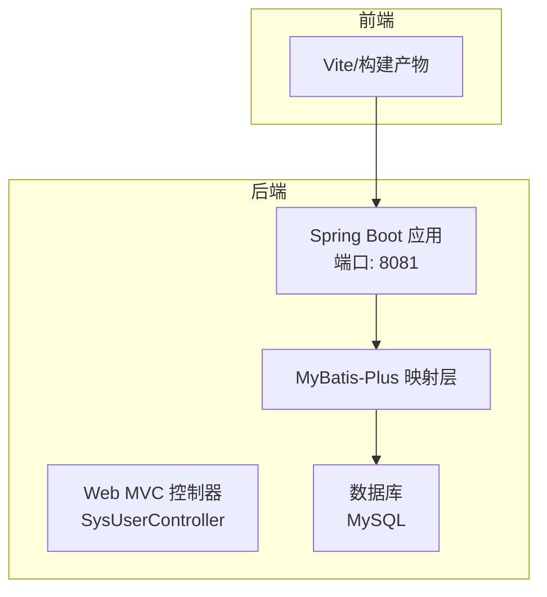
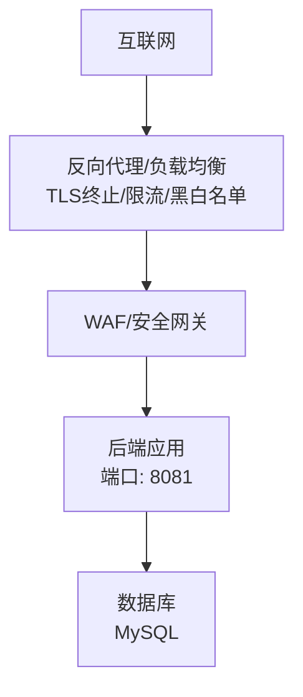
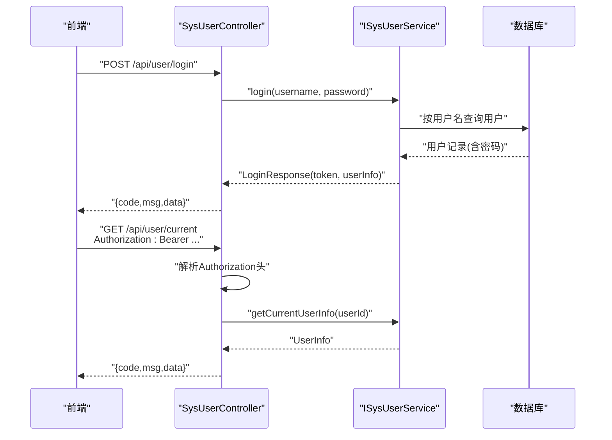
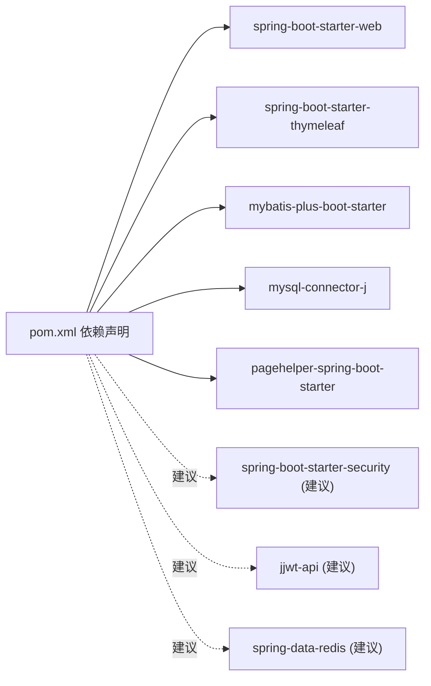

# 安全加固

<cite>
**本文引用的文件**
- [application.yml](file://src/main/resources/application.yml)
- [CorsConfig.java](file://src/main/java/com/hospital/drugmanagement/config/CorsConfig.java)
- [SysUserController.java](file://src/main/java/com/hospital/drugmanagement/controller/SysUserController.java)
- [LoginRequest.java](file://src/main/java/com/hospital/drugmanagement/dto/LoginRequest.java)
- [LoginResponse.java](file://src/main/java/com/hospital/drugmanagement/dto/LoginResponse.java)
- [SysUser.java](file://src/main/java/com/hospital/drugmanagement/entity/SysUser.java)
- [MyMetaObjectHandler.java](file://src/main/java/com/hospital/drugmanagement/common/handler/MyMetaObjectHandler.java)
- [init.sql](file://src/main/resources/db/init.sql)
- [pom.xml](file://pom.xml)
</cite>

## 目录
1. [简介](#简介)
2. [项目结构](#项目结构)
3. [核心组件](#核心组件)
4. [架构总览](#架构总览)
5. [详细组件分析](#详细组件分析)
6. [依赖分析](#依赖分析)
7. [性能考虑](#性能考虑)
8. [故障排查指南](#故障排查指南)
9. [结论](#结论)
10. [附录](#附录)

## 简介
本指南面向生产环境的安全加固，结合当前代码库现状，提出可落地的配置与实践建议，覆盖网络与传输安全、应用层安全、认证授权与会话管理、日志与审计、以及持续运维与合规要点。由于当前仓库未包含Spring Security、HTTPS、WAF、入侵检测、漏洞扫描等生产级安全部署组件，本文在“现状”基础上给出“建议”与“最佳实践”，帮助团队逐步完善。

## 项目结构
后端基于Spring Boot 3.2.5 + MyBatis-Plus，前端位于独立目录，后端提供REST接口，数据库初始化脚本包含基础表结构与默认数据。生产环境应将前后端分离部署，并在网关或反向代理层统一接入TLS终止与访问控制。

图表来源
- [application.yml:14-16](file://src/main/resources/application.yml#L14-L16)
- [SysUserController.java:26-28](file://src/main/java/com/hospital/drugmanagement/controller/SysUserController.java#L26-L28)

章节来源
- [application.yml:1-24](file://src/main/resources/application.yml#L1-L24)
- [pom.xml:32-84](file://pom.xml#L32-L84)

## 核心组件
- 认证与会话
  - 当前登录流程：控制器接收用户名/密码，调用服务进行校验，返回包含令牌与用户信息的响应；前端通过Authorization头携带令牌访问受保护资源。
  - 令牌格式：控制器对Authorization头进行简单解析，提取用户ID用于后续查询。
- CORS跨域
  - 全局注册表允许任意来源、方法与头部，且未启用凭据。
- 数据访问
  - MyBatis-Plus自动填充创建/更新时间，SQL打印在开发阶段开启，生产需关闭。
- 数据库
  - 初始脚本定义了用户、角色、菜单、药品、供应商、仓库、库存、出入库、盘点、审核等表，含默认角色与菜单权限映射。

章节来源
- [SysUserController.java:43-68](file://src/main/java/com/hospital/drugmanagement/controller/SysUserController.java#L43-L68)
- [LoginResponse.java:12-31](file://src/main/java/com/hospital/drugmanagement/dto/LoginResponse.java#L12-L31)
- [CorsConfig.java:10-17](file://src/main/java/com/hospital/drugmanagement/config/CorsConfig.java#L10-L17)
- [application.yml:19-24](file://src/main/resources/application.yml#L19-L24)
- [init.sql:8-22](file://src/main/resources/db/init.sql#L8-L22)

## 架构总览
下图展示生产环境建议的网络与安全边界：外网通过反向代理/负载均衡接入，内网仅开放必要的后端端口；后端与数据库之间建立最小化访问链路；应用层启用认证授权与访问控制；日志与审计集中化。

图表来源
- [application.yml:14-16](file://src/main/resources/application.yml#L14-L16)

## 详细组件分析

### 网络与传输安全
- 防火墙与端口访问
  - 生产服务器仅开放反向代理端口（如443），后端应用端口仅对内网/容器网络开放。
  - 反向代理负责TLS终止，后端可使用HTTP（内网）或强制HTTPS（公网）。
- 网络隔离
  - 将应用与数据库置于不同子网或安全组，限制数据库仅允许应用所在网段访问。
- TLS/SSL证书
  - 建议在反向代理层统一部署证书，支持Let’s Encrypt自动化续期与商业证书分级管理。
  - 证书更新流程：自动化脚本轮询到期时间，提前续期并触发代理热加载；失败回滚至旧证书并告警。

章节来源
- [application.yml:14-16](file://src/main/resources/application.yml#L14-L16)

### 应用层安全配置
- CORS跨域
  - 现状：允许任意来源与头部，未启用凭据。
  - 建议：固定可信域名列表，按环境区分（开发/测试/生产），关闭凭据以降低CSRF风险。
- CSRF防护
  - 建议：引入Spring Security CSRF模块，配合同源策略与自定义拦截器，对非GET/HEAD/OPTIONS请求进行校验。
- SQL注入防护
  - 现状：使用MyBatis-Plus与参数化查询，未见原生SQL拼接。
  - 建议：保持参数化查询；对动态表名/列名进行白名单校验；开启数据库只读账户用于查询，写操作使用受限账户。

章节来源
- [CorsConfig.java:10-17](file://src/main/java/com/hospital/drugmanagement/config/CorsConfig.java#L10-L17)
- [SysUserController.java:15-21](file://src/main/java/com/hospital/drugmanagement/controller/SysUserController.java#L15-L21)

### 认证授权与会话管理
- 当前实现
  - 登录请求DTO包含用户名与密码；控制器接收请求并调用服务登录，返回令牌与用户信息。
  - 令牌解析：从Authorization头提取Bearer令牌，简单拆分后取用户ID进行后续查询。
- 强化建议
  - 使用标准JWT库解析与验证签名，设置签发者、受众、有效期与密钥轮换。
  - 会话管理：采用短期令牌+刷新令牌机制；刷新令牌单独存储与轮换；服务端维护令牌黑名单（Redis）以支持即时吊销。
  - 权限模型：RBAC（角色-权限）与ABAC（属性-权限）结合，细粒度到资源与操作。

图表来源
- [SysUserController.java:43-68](file://src/main/java/com/hospital/drugmanagement/controller/SysUserController.java#L43-L68)
- [SysUserController.java:73-147](file://src/main/java/com/hospital/drugmanagement/controller/SysUserController.java#L73-L147)
- [LoginRequest.java:8-18](file://src/main/java/com/hospital/drugmanagement/dto/LoginRequest.java#L8-L18)
- [LoginResponse.java:12-31](file://src/main/java/com/hospital/drugmanagement/dto/LoginResponse.java#L12-L31)

章节来源
- [SysUserController.java:43-68](file://src/main/java/com/hospital/drugmanagement/controller/SysUserController.java#L43-L68)
- [SysUserController.java:73-147](file://src/main/java/com/hospital/drugmanagement/controller/SysUserController.java#L73-L147)
- [LoginRequest.java:8-18](file://src/main/java/com/hospital/drugmanagement/dto/LoginRequest.java#L8-L18)
- [LoginResponse.java:12-31](file://src/main/java/com/hospital/drugmanagement/dto/LoginResponse.java#L12-L31)

### 密码策略与数据安全
- 密码存储
  - 现状：使用MD5加固定盐进行哈希存储。
  - 建议：升级为PBKDF2/Argon2/Bcrypt等自适应哈希算法，随机盐，增加迭代次数；禁止明文或弱哈希。
- 敏感字段
  - 建议：对日志输出进行脱敏，避免打印敏感字段；数据库连接串与密钥通过环境变量或密钥管理服务注入。

章节来源
- [SysUserController.java:292-296](file://src/main/java/com/hospital/drugmanagement/controller/SysUserController.java#L292-L296)
- [SysUser.java:20-22](file://src/main/java/com/hospital/drugmanagement/entity/SysUser.java#L20-L22)

### 日志与审计
- 开发阶段SQL打印
  - 现状：已开启SQL日志输出，便于调试。
  - 生产建议：关闭StdOut日志，统一接入结构化日志（JSON）与集中式日志平台（ELK/OTEL）。
- 审计日志
  - 建议：记录关键操作（登录、新增/修改/删除用户、权限变更、敏感业务操作）的时间、用户、IP、操作内容与结果；支持可追溯性与合规审计。

章节来源
- [application.yml:22-24](file://src/main/resources/application.yml#L22-L24)
- [MyMetaObjectHandler.java:21-32](file://src/main/java/com/hospital/drugmanagement/common/handler/MyMetaObjectHandler.java#L21-L32)

### 漏洞扫描与入侵检测
- 漏洞扫描
  - 建议：CI流水线集成静态分析（SpotBugs/Checkmarx）、依赖漏洞扫描（OWASP Dependency-Check/OSV Scanner），定期扫描数据库与第三方组件。
- 入侵检测
  - 建议：在反向代理层启用WAF，配置常见攻击规则（SQL注入、XSS、文件包含、暴力破解）；对异常访问行为进行限速与阻断。
- 安全基线
  - 建议：操作系统与容器镜像遵循最小化原则，禁用不必要的服务与端口；定期更新补丁与依赖版本。

## 依赖分析
后端依赖Spring Web、Thymeleaf、MyBatis-Plus、MySQL驱动与分页插件；生产环境建议引入Spring Security、JWT、Redis、日志与审计组件。

图表来源
- [pom.xml:32-84](file://pom.xml#L32-L84)

章节来源
- [pom.xml:32-84](file://pom.xml#L32-L84)

## 性能考虑
- 连接池与数据库
  - 建议：合理配置连接池大小、超时与空闲回收；对热点表建立必要索引，避免全表扫描。
- 缓存
  - 建议：对菜单、角色、用户信息等读多写少的数据使用Redis缓存，设置TTL与失效策略。
- 日志
  - 建议：异步日志与滚动策略，避免I/O阻塞；生产关闭冗余日志级别。

## 故障排查指南
- 登录失败
  - 检查用户名是否存在、密码是否正确（确认哈希算法与盐一致）、令牌是否被正确传递。
- 跨域问题
  - 检查CORS配置是否允许前端域名、是否启用了凭据；浏览器开发者工具查看预检请求结果。
- 数据库连接
  - 检查URL、用户名、密码与时区配置；确认数据库服务可达与防火墙放行。
- SQL日志
  - 生产关闭StdOut日志，使用集中式日志平台检索慢SQL与错误堆栈。

章节来源
- [application.yml:3-7](file://src/main/resources/application.yml#L3-L7)
- [CorsConfig.java:10-17](file://src/main/java/com/hospital/drugmanagement/config/CorsConfig.java#L10-L17)
- [application.yml:22-24](file://src/main/resources/application.yml#L22-L24)

## 结论
当前代码库提供了基础的用户认证与数据访问能力，但生产环境仍需补齐：统一TLS终止与访问控制、引入Spring Security与JWT、强化密码策略、完善日志与审计、部署WAF与漏洞扫描。建议按优先级分阶段实施，先完成传输加密与访问控制，再推进认证授权与审计体系，最终形成闭环的安全运维流程。

## 附录
- SSL/TLS证书申请与部署（建议流程）
  - Let’s Encrypt：通过自动化脚本申请与续期，配置定时任务与证书热加载。
  - 商业证书：按机构流程申请，导入CA链，配置代理层证书与私钥权限。
- 端口与访问控制清单（建议）
  - 外网：443（HTTPS）、80（重定向）
  - 内网：8081（应用）、3306（数据库，仅限应用网段）
- 安全基线检查项
  - 依赖版本与漏洞扫描、密码复杂度策略、最小权限原则、日志脱敏与保留周期、备份与恢复演练