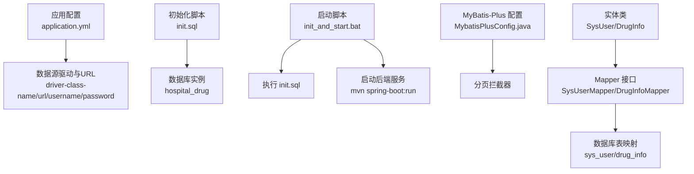
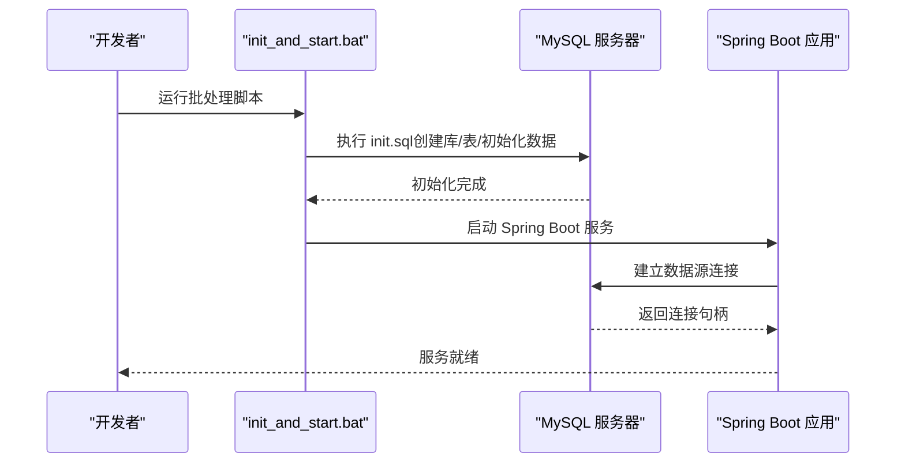
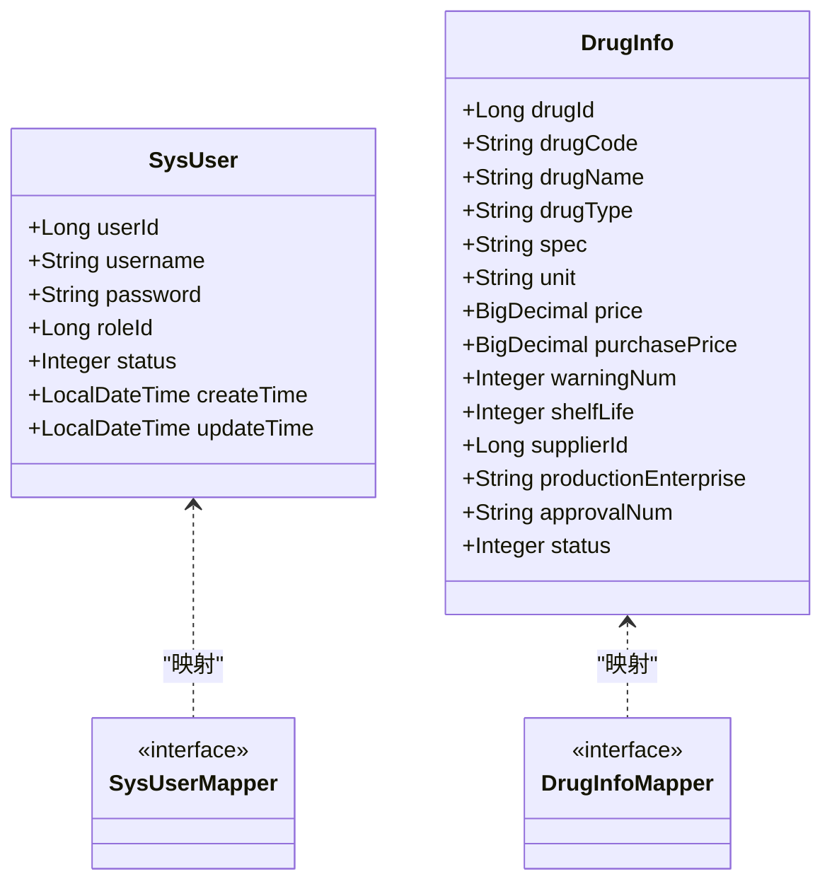
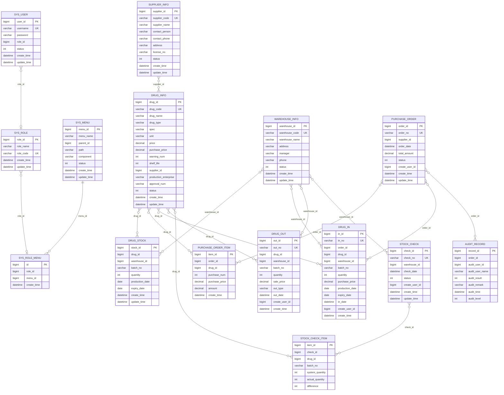
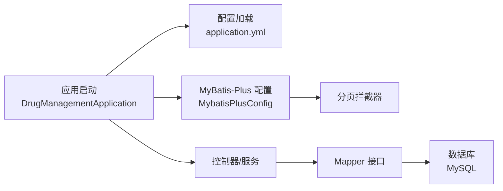

# 数据库部署

<cite>
**本文引用的文件**
- [application.yml](file://src/main/resources/application.yml)
- [init.sql](file://src/main/resources/db/init.sql)
- [hospital_drug.sql](file://hospital_drug.sql)
- [init_and_start.bat](file://init_and_start.bat)
- [MybatisPlusConfig.java](file://src/main/java/com/hospital/drugmanagement/config/MybatisPlusConfig.java)
- [SysUser.java](file://src/main/java/com/hospital/drugmanagement/entity/SysUser.java)
- [DrugInfo.java](file://src/main/java/com/hospital/drugmanagement/entity/DrugInfo.java)
- [SysUserMapper.java](file://src/main/java/com/hospital/drugmanagement/mapper/SysUserMapper.java)
- [DrugInfoMapper.java](file://src/main/java/com/hospital/drugmanagement/mapper/DrugInfoMapper.java)
- [DrugManagementApplication.java](file://src/main/java/com/hospital/drugmanagement/DrugManagementApplication.java)
</cite>

## 目录
1. [简介](#简介)
2. [项目结构](#项目结构)
3. [核心组件](#核心组件)
4. [架构总览](#架构总览)
5. [详细组件分析](#详细组件分析)
6. [依赖关系分析](#依赖关系分析)
7. [性能考虑](#性能考虑)
8. [故障排查指南](#故障排查指南)
9. [结论](#结论)
10. [附录](#附录)

## 简介
本文件面向数据库管理员与运维工程师，提供一套完整的数据库部署与初始化方案，覆盖以下主题：
- MySQL 数据库安装与基础配置
- 数据库实例创建、字符集与排序规则设置
- 权限与账户配置
- 初始化脚本执行流程与数据库结构初始化
- application.yml 中数据库连接参数说明（含连接池、事务、数据源）
- 备份与恢复策略建议
- 性能调优参数与监控指标配置建议
- 安全配置、SSL 连接与主从复制方案

## 项目结构
本项目采用 Spring Boot + MyBatis-Plus 架构，数据库相关资源集中在 resources 目录中，初始化脚本与启动脚本如下：
- 数据库初始化脚本：src/main/resources/db/init.sql
- 应用配置文件：src/main/resources/application.yml
- 启动批处理脚本：init_and_start.bat
- MyBatis-Plus 分页插件配置：src/main/java/.../config/MybatisPlusConfig.java
- 实体与 Mapper 示例：SysUser、DrugInfo 及其 Mapper 接口

**图示来源**
- [application.yml:1-24](file://src/main/resources/application.yml#L1-L24)
- [init.sql:1-312](file://src/main/resources/db/init.sql#L1-L312)
- [init_and_start.bat:1-11](file://init_and_start.bat#L1-L11)
- [MybatisPlusConfig.java:1-16](file://src/main/java/com/hospital/drugmanagement/config/MybatisPlusConfig.java#L1-L16)
- [SysUser.java:1-130](file://src/main/java/com/hospital/drugmanagement/entity/SysUser.java#L1-L130)
- [DrugInfo.java:1-167](file://src/main/java/com/hospital/drugmanagement/entity/DrugInfo.java#L1-L167)
- [SysUserMapper.java:1-7](file://src/main/java/com/hospital/drugmanagement/mapper/SysUserMapper.java#L1-L7)
- [DrugInfoMapper.java:1-9](file://src/main/java/com/hospital/drugmanagement/mapper/DrugInfoMapper.java#L1-L9)

**章节来源**
- [application.yml:1-24](file://src/main/resources/application.yml#L1-L24)
- [init.sql:1-312](file://src/main/resources/db/init.sql#L1-L312)
- [init_and_start.bat:1-11](file://init_and_start.bat#L1-L11)

## 核心组件
- 数据库连接配置
  - 驱动类名：com.mysql.cj.jdbc.Driver
  - JDBC URL：jdbc:mysql://localhost:3306/hospital_drug?useUnicode=true&characterEncoding=utf-8&useSSL=false&serverTimezone=Asia/Shanghai
  - 用户名与密码：root/123456（需按环境修改）
- MyBatis-Plus 配置
  - Mapper XML 位置：classpath:mapper/*.xml
  - 实体包扫描：com.hospital.drugmanagement.entity
  - 日志打印：org.apache.ibatis.logging.stdout.StdOutImpl
  - 下划线转驼峰：开启
  - 分页拦截器：PaginationInnerInterceptor
- 启动与初始化
  - 批处理脚本先执行 init.sql，再启动 Spring Boot 服务

**章节来源**
- [application.yml:1-24](file://src/main/resources/application.yml#L1-L24)
- [MybatisPlusConfig.java:1-16](file://src/main/java/com/hospital/drugmanagement/config/MybatisPlusConfig.java#L1-L16)
- [init_and_start.bat:1-11](file://init_and_start.bat#L1-L11)

## 架构总览
应用通过 JDBC 连接 MySQL，使用 MyBatis-Plus 访问数据库。初始化脚本负责创建数据库与表结构，并插入基础数据。

**图示来源**
- [init_and_start.bat:1-11](file://init_and_start.bat#L1-L11)
- [application.yml:1-24](file://src/main/resources/application.yml#L1-L24)
- [init.sql:1-312](file://src/main/resources/db/init.sql#L1-L312)

## 详细组件分析

### 数据库实例与字符集设置
- 实例创建与字符集
  - 初始化脚本明确创建数据库 hospital_drug，并指定字符集为 utf8mb4，排序规则为 utf8mb4_unicode_ci
- 表结构与索引
  - 所有业务表均使用 InnoDB 引擎，统一字符集 utf8mb4
  - 关键字段建立必要索引（如外键、唯一约束），提升查询与关联性能
- 初始化数据
  - 默认角色、菜单、用户、药品、供应商、仓库及库存等初始数据已内置

**章节来源**
- [init.sql:1-312](file://src/main/resources/db/init.sql#L1-L312)

### 权限配置
- 应用侧连接凭据
  - application.yml 中配置了用户名与密码，用于连接目标数据库
- 建议的数据库级权限
  - 为应用创建专用用户，仅授予所需数据库与表的读写权限
  - 避免使用 root 用户长期连接，定期轮换密码

**章节来源**
- [application.yml:1-24](file://src/main/resources/application.yml#L1-L24)

### 初始化脚本执行步骤
- 执行顺序
  - 使用批处理脚本自动执行 init.sql，完成数据库与表结构初始化
  - 初始化完成后启动 Spring Boot 服务
- 执行入口
  - init_and_start.bat 内部调用 mysql 客户端执行 SQL 脚本

**章节来源**
- [init_and_start.bat:1-11](file://init_and_start.bat#L1-L11)
- [init.sql:1-312](file://src/main/resources/db/init.sql#L1-L312)

### 数据库结构初始化
- 数据库与表
  - hospital_drug 数据库
  - 系统用户、角色、菜单、角色菜单、药品、供应商、仓库、库存、采购订单、入库、出库、盘点、盘点明细、审核记录等
- 初始数据
  - 角色、用户、菜单、权限分配、示例药品、供应商、仓库与库存数据

**章节来源**
- [init.sql:1-312](file://src/main/resources/db/init.sql#L1-L312)

### application.yml 中的数据库连接配置
- 数据源参数
  - driver-class-name：JDBC 驱动类名
  - url：JDBC URL，包含时区、字符集与 SSL 设置
  - username/password：数据库连接凭据
- MyBatis-Plus 参数
  - mapper-locations：Mapper XML 位置
  - type-aliases-package：实体类包名
  - configuration.log-impl：SQL 输出实现
  - configuration.map-underscore-to-camel-case：下划线转驼峰
- 事务与连接池
  - 项目未显式声明 HikariCP 连接池参数，将使用默认配置；建议在生产环境显式配置连接池大小、超时与健康检查参数

**章节来源**
- [application.yml:1-24](file://src/main/resources/application.yml#L1-L24)

### MyBatis-Plus 分页配置
- 分页拦截器
  - 在 MybatisPlusConfig 中注册 PaginationInnerInterceptor，支持分页查询
- 实体与映射
  - SysUser、DrugInfo 等实体类通过注解映射到对应表
  - Mapper 接口继承 BaseMapper，提供通用 CRUD 能力

**图示来源**
- [SysUser.java:1-130](file://src/main/java/com/hospital/drugmanagement/entity/SysUser.java#L1-L130)
- [DrugInfo.java:1-167](file://src/main/java/com/hospital/drugmanagement/entity/DrugInfo.java#L1-L167)
- [SysUserMapper.java:1-7](file://src/main/java/com/hospital/drugmanagement/mapper/SysUserMapper.java#L1-L7)
- [DrugInfoMapper.java:1-9](file://src/main/java/com/hospital/drugmanagement/mapper/DrugInfoMapper.java#L1-L9)

**章节来源**
- [MybatisPlusConfig.java:1-16](file://src/main/java/com/hospital/drugmanagement/config/MybatisPlusConfig.java#L1-L16)
- [SysUser.java:1-130](file://src/main/java/com/hospital/drugmanagement/entity/SysUser.java#L1-L130)
- [DrugInfo.java:1-167](file://src/main/java/com/hospital/drugmanagement/entity/DrugInfo.java#L1-L167)
- [SysUserMapper.java:1-7](file://src/main/java/com/hospital/drugmanagement/mapper/SysUserMapper.java#L1-L7)
- [DrugInfoMapper.java:1-9](file://src/main/java/com/hospital/drugmanagement/mapper/DrugInfoMapper.java#L1-L9)

### 数据模型与索引设计
- 主要实体与表
  - sys_user、sys_role、sys_menu、sys_role_menu、drug_info、supplier_info、warehouse_info、drug_stock、purchase_order、purchase_order_item、drug_in、drug_out、stock_check、stock_check_item、audit_record
- 设计要点
  - 统一使用 utf8mb4 字符集与 InnoDB 引擎
  - 为常用查询字段建立索引，减少全表扫描
  - 时间戳字段统一使用 CURRENT_TIMESTAMP 与 ON UPDATE CURRENT_TIMESTAMP

**图示来源**
- [init.sql:1-312](file://src/main/resources/db/init.sql#L1-L312)

## 依赖关系分析
- 应用启动流程
  - Application 启动 -> 扫描配置与组件 -> 读取 application.yml -> 建立数据源 -> 初始化 MyBatis-Plus -> 启动控制器
- 数据访问链路
  - 控制器 -> 服务 -> Mapper -> MyBatis-Plus -> JDBC -> MySQL

**图示来源**
- [DrugManagementApplication.java:1-33](file://src/main/java/com/hospital/drugmanagement/DrugManagementApplication.java#L1-L33)
- [application.yml:1-24](file://src/main/resources/application.yml#L1-L24)
- [MybatisPlusConfig.java:1-16](file://src/main/java/com/hospital/drugmanagement/config/MybatisPlusConfig.java#L1-L16)

**章节来源**
- [DrugManagementApplication.java:1-33](file://src/main/java/com/hospital/drugmanagement/DrugManagementApplication.java#L1-L33)
- [application.yml:1-24](file://src/main/resources/application.yml#L1-L24)
- [MybatisPlusConfig.java:1-16](file://src/main/java/com/hospital/drugmanagement/config/MybatisPlusConfig.java#L1-L16)

## 性能考虑
- 连接池与事务
  - 建议显式配置连接池参数（最小/最大连接数、空闲超时、连接生命周期、获取超时）
  - 生产环境启用事务管理与只读事务优化读多写少场景
- 查询优化
  - 为高频查询字段建立合适索引，避免全表扫描
  - 使用分页拦截器限制单页数据量，降低内存压力
- 缓存与归档
  - 对热点数据引入缓存（如 Redis），对历史数据进行归档或分区
- 监控与日志
  - 开启慢查询日志与慢查询阈值，结合 APM 工具定位瓶颈

## 故障排查指南
- 连接失败
  - 检查 JDBC URL、用户名与密码是否正确
  - 确认 MySQL 服务运行与网络连通性
- 字符集乱码
  - 确认数据库、表与连接参数字符集一致（utf8mb4）
- 初始化异常
  - 查看 init_and_start.bat 执行输出，确认 init.sql 是否完整执行
  - 检查是否存在重复建库/建表语句冲突
- SQL 日志
  - application.yml 已开启 SQL 输出实现，便于定位问题

**章节来源**
- [application.yml:1-24](file://src/main/resources/application.yml#L1-L24)
- [init_and_start.bat:1-11](file://init_and_start.bat#L1-L11)

## 结论
本部署文档基于现有配置与脚本，给出了从数据库实例创建、字符集与权限设置，到初始化脚本执行、连接配置与分页能力的完整流程。建议在生产环境中补充连接池参数、事务策略、监控与备份恢复机制，并根据业务增长持续优化索引与查询路径。

## 附录

### 备份与恢复策略
- 备份
  - 使用逻辑备份工具导出 SQL（mysqldump 或 Percona XtraBackup），定期校验完整性
  - 对关键业务表进行增量备份与全量备份结合
- 恢复
  - 恢复前先停写或切换只读，确保一致性
  - 恢复后验证数据完整性与索引有效性

### 性能调优参数（建议）
- 连接池
  - 最小/最大连接数、空闲超时、连接生命周期、获取超时
- MySQL
  - innodb_buffer_pool_size、innodb_log_file_size、sort_buffer_size、read_buffer_size、tmp_table_size、max_heap_table_size
  - 慢查询阈值与慢查询日志

### 监控指标配置（建议）
- 连接池指标：活跃连接数、空闲连接数、等待时间、获取超时次数
- 数据库指标：QPS、TPS、连接数、锁等待、缓冲池命中率、磁盘 IO

### 安全配置
- SSL 连接
  - 在 JDBC URL 中启用 SSL 参数，配置证书与信任库
- 账户与权限
  - 为应用创建专用用户，限制主机来源与权限范围
- 加密与审计
  - 对敏感字段进行加密存储，开启审计日志

### 主从复制配置方案（建议）
- 主库
  - 开启二进制日志，设置 server-id，合理配置 binlog 格式
- 从库
  - 配置 relay log，设置只读与半同步复制（可选）
- 运维
  - 定期校验主从延迟，制定故障切换预案