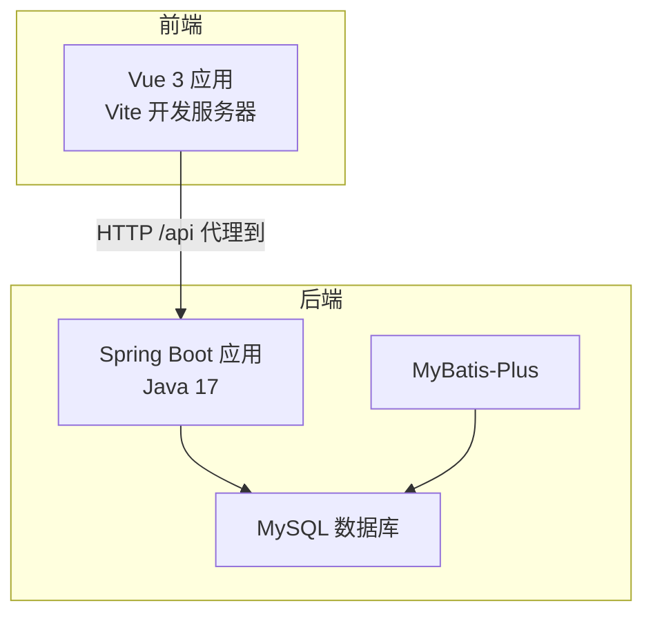
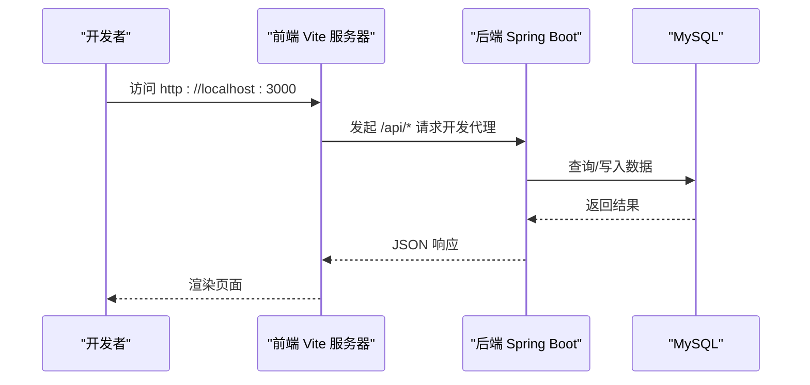
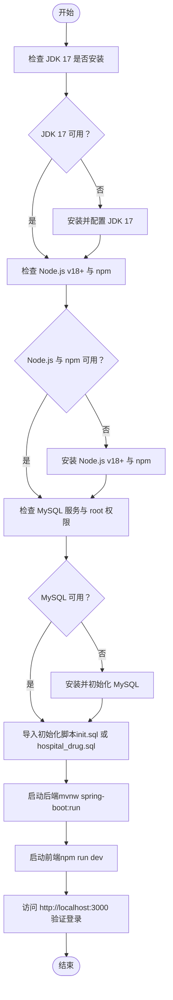
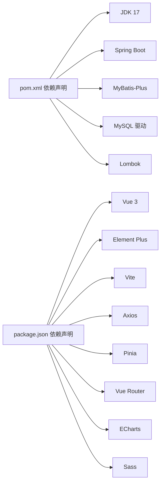

# 环境准备

<cite>
**本文引用的文件**
- [pom.xml](file://pom.xml)
- [application.yml](file://src/main/resources/application.yml)
- [init_and_start.bat](file://init_and_start.bat)
- [hospital_drug.sql](file://hospital_drug.sql)
- [init.sql](file://src/main/resources/db/init.sql)
- [package.json](file://drug-front/package.json)
- [README.md（前端）](file://drug-front/README.md)
- [maven-wrapper.properties](file://.mvn/wrapper/maven-wrapper.properties)
- [LOGIN_SETUP_README.md](file://LOGIN_SETUP_README.md)
</cite>

## 目录
1. [简介](#简介)
2. [项目结构](#项目结构)
3. [核心组件](#核心组件)
4. [架构概览](#架构概览)
5. [详细组件分析](#详细组件分析)
6. [依赖关系分析](#依赖关系分析)
7. [性能考虑](#性能考虑)
8. [故障排查指南](#故障排查指南)
9. [结论](#结论)
10. [附录](#附录)

## 简介
本指南面向开发与生产环境的准备与部署，覆盖以下要点：
- JDK 17 的安装与配置
- MySQL 数据库的安装与部署
- Node.js 与 npm 的环境配置
- Maven 构建工具的安装与配置
- IDE 开发环境推荐设置
- Windows、Linux、macOS 的具体安装步骤与验证方法
- 环境变量、端口开放、防火墙设置等系统级配置
- 环境验证脚本与常见问题排查

## 项目结构
该工程采用前后端分离架构：
- 后端：Spring Boot 3.2.5（Java 17），MyBatis-Plus，MySQL 连接
- 前端：Vue 3 + Vite + Element Plus
- 构建与打包：Maven（含 Maven Wrapper）

图示来源
- [pom.xml:1-119](file://pom.xml#L1-L119)
- [application.yml:1-24](file://src/main/resources/application.yml#L1-L24)
- [package.json:1-29](file://drug-front/package.json#L1-L29)

章节来源
- [pom.xml:1-119](file://pom.xml#L1-L119)
- [application.yml:1-24](file://src/main/resources/application.yml#L1-L24)
- [package.json:1-29](file://drug-front/package.json#L1-L29)

## 核心组件
- Java 版本与构建
  - Java 版本：17（源码与目标编译版本均为 17）
  - Maven 插件：maven-compiler-plugin、spring-boot-maven-plugin
  - Maven Wrapper：内置脚本型 wrapper，自动下载指定版本 Maven
- 数据库与连接
  - MySQL 驱动：mysql-connector-j
  - 连接配置：application.yml 中定义 JDBC URL、用户名、密码
  - 默认端口：3306
- 前端运行
  - Node.js：推荐 v18+
  - 包管理：npm
  - 开发服务器：Vite（默认端口 3000）
  - 代理：开发时将 /api 代理至后端 8080/8081

章节来源
- [pom.xml:29-31](file://pom.xml#L29-L31)
- [pom.xml:86-116](file://pom.xml#L86-L116)
- [maven-wrapper.properties:1-4](file://.mvn/wrapper/maven-wrapper.properties#L1-L4)
- [application.yml:3-7](file://src/main/resources/application.yml#L3-L7)
- [application.yml:14-16](file://src/main/resources/application.yml#L14-L16)
- [package.json:1-29](file://drug-front/package.json#L1-L29)
- [README.md（前端）:46-78](file://drug-front/README.md#L46-L78)

## 架构概览
后端通过 Spring Boot 提供 REST API，前端通过 Vite 开发服务器访问后端接口。默认情况下，前端开发服务器监听 3000 端口，后端默认监听 8081 端口；若需代理，请确认前端代理配置与后端端口一致。

图示来源
- [application.yml:14-16](file://src/main/resources/application.yml#L14-L16)
- [README.md（前端）:141-155](file://drug-front/README.md#L141-L155)

章节来源
- [application.yml:14-16](file://src/main/resources/application.yml#L14-L16)
- [README.md（前端）:141-155](file://drug-front/README.md#L141-L155)

## 详细组件分析

### JDK 17 安装与配置
- 必要性
  - Java 17 是项目源码与编译目标版本
- 安装步骤（通用）
  - Windows：下载并安装 OpenJDK 17，配置 JAVA_HOME 指向安装目录，将 %JAVA_HOME%\bin 加入 PATH
  - Linux：使用发行版包管理器安装 openjdk-17-jdk，或下载二进制包解压配置
  - macOS：使用 Homebrew 安装 openjdk@17，或下载官方 JDK 安装
- 验证
  - 在终端执行 java -version 与 javac -version，均显示 17.x
- Maven 使用
  - 项目内置 Maven Wrapper，无需手动安装 Maven 即可使用 mvnw（Windows）或 ./mvnw（Unix）

章节来源
- [pom.xml:29-31](file://pom.xml#L29-L31)
- [maven-wrapper.properties:1-4](file://.mvn/wrapper/maven-wrapper.properties#L1-L4)

### MySQL 数据库安装与部署
- 安装
  - Windows：下载 MySQL 安装包，选择完整安装，配置 root 密码
  - Linux：使用 apt/yum 安装 mysql-server，初始化数据库
  - macOS：使用 Homebrew 安装 mysql，初始化数据库
- 初始配置
  - 默认端口：3306
  - 默认数据库名：hospital_drug
  - 默认用户名：root，密码在 application.yml 中配置
- 初始化脚本
  - 提供 SQL 文件与 SQL 脚本，包含数据库创建、表结构与初始化数据
  - 可通过命令行导入或在图形化工具中执行
- 验证
  - 登录 MySQL，查看 database 与表是否存在
  - 在 application.yml 中确认 JDBC URL、用户名、密码正确

章节来源
- [application.yml:3-7](file://src/main/resources/application.yml#L3-L7)
- [hospital_drug.sql:1-307](file://hospital_drug.sql#L1-L307)
- [init.sql:1-312](file://src/main/resources/db/init.sql#L1-L312)

### Node.js 与 npm 环境配置
- 版本要求
  - 推荐 Node.js v18+（前端 README 明确）
- 安装
  - Windows/macOS：从官网下载安装包
  - Linux：使用包管理器安装或 nvm 管理多版本
- 验证
  - node -v 与 npm -v 输出版本号
- 依赖安装与运行
  - 在前端目录执行 npm install 安装依赖
  - npm run dev 启动开发服务器，默认端口 3000
  - 若端口冲突，可在 vite.config.js 中调整端口

章节来源
- [package.json:1-29](file://drug-front/package.json#L1-L29)
- [README.md（前端）:46-78](file://drug-front/README.md#L46-L78)
- [README.md（前端）:193-200](file://drug-front/README.md#L193-L200)

### Maven 构建工具安装与配置
- 内置 Wrapper
  - 项目提供 Maven Wrapper（mvnw/mvnw.cmd），自动下载指定版本的 Maven（3.9.12）
- 无需全局安装 Maven
  - Windows：使用 mvnw.cmd
  - Unix：使用 ./mvnw
- 常用命令
  - 构建：./mvnw clean package
  - 运行：./mvnw spring-boot:run
- 编译与注解处理器
  - maven-compiler-plugin 配置源/目标版本为 17
  - Lombok 注解处理器已配置

章节来源
- [maven-wrapper.properties:1-4](file://.mvn/wrapper/maven-wrapper.properties#L1-L4)
- [pom.xml:86-116](file://pom.xml#L86-L116)

### IDE 开发环境推荐设置
- 推荐 IDE
  - IntelliJ IDEA（Ultimate 或 Community）
  - Eclipse（安装 Buildship、Lombok 插件）
  - VS Code（配合 Java/MyBatis/MySQL 插件）
- 关键设置
  - Java 17 SDK 指定
  - Maven Wrapper 自动识别
  - Lombok 注解支持启用
  - Spring Boot 运行配置（application.yml 覆盖项按需设置）

章节来源
- [pom.xml:86-116](file://pom.xml#L86-L116)

### 各操作系统安装步骤与验证方法
- Windows
  - 安装 JDK 17、Node.js v18+、MySQL
  - 配置环境变量 JAVA_HOME、NODE_PATH、PATH
  - 验证：java -version、node -v、npm -v、mysql -u root -p
  - 启动：双击 init_and_start.bat（自动初始化数据库并启动后端）
- Linux
  - 使用包管理器安装 openjdk-17-jdk、nodejs、npm、mysql-server
  - 配置环境变量（~/.bashrc 或 ~/.zshrc）
  - 验证：java -version、node -v、npm -v、mysql -u root -p
  - 启动：./mvnw spring-boot:run（后端），在前端目录执行 npm run dev
- macOS
  - 使用 Homebrew 安装 openjdk@17、node、mysql
  - 配置 JAVA_HOME 与 PATH
  - 验证：同上
  - 启动：同上

章节来源
- [init_and_start.bat:1-11](file://init_and_start.bat#L1-L11)
- [application.yml:14-16](file://src/main/resources/application.yml#L14-L16)
- [README.md（前端）:46-78](file://drug-front/README.md#L46-L78)

### 系统级配置：环境变量、端口与防火墙
- 环境变量
  - JAVA_HOME：指向 JDK 17 安装目录
  - PATH：追加 %JAVA_HOME%/bin
  - NODE_PATH：可选，指向全局 npm 包目录（如需）
- 端口
  - 后端：默认 8081（application.yml）
  - 前端：默认 3000（Vite）
  - 数据库：默认 3306（MySQL）
- 防火墙
  - 开放 3306（数据库）、8081（后端）、3000（前端）
  - 如在云服务器或公司网络，确保安全组/ACL 放行相应端口

章节来源
- [application.yml:14-16](file://src/main/resources/application.yml#L14-L16)
- [README.md（前端）:193-200](file://drug-front/README.md#L193-L200)

### 环境验证脚本与流程
- 后端验证
  - 启动后端：./mvnw spring-boot:run 或使用 IDE 运行主类
  - 访问健康检查端点（如有）或直接访问接口
  - 查看控制台输出，确认数据库连接成功
- 前端验证
  - 在前端目录执行 npm run dev
  - 浏览器访问 http://localhost:3000
  - 登录默认账号（参考默认凭据说明）
- 数据库验证
  - 登录 MySQL，确认 hospital_drug 数据库存在且表结构完整
  - 执行初始化脚本（init.sql 或 hospital_drug.sql）以确保数据存在

图示来源
- [init_and_start.bat:1-11](file://init_and_start.bat#L1-L11)
- [application.yml:3-7](file://src/main/resources/application.yml#L3-L7)
- [application.yml:14-16](file://src/main/resources/application.yml#L14-L16)
- [init.sql:1-312](file://src/main/resources/db/init.sql#L1-L312)
- [hospital_drug.sql:1-307](file://hospital_drug.sql#L1-L307)

章节来源
- [init_and_start.bat:1-11](file://init_and_start.bat#L1-L11)
- [application.yml:3-7](file://src/main/resources/application.yml#L3-L7)
- [application.yml:14-16](file://src/main/resources/application.yml#L14-L16)
- [init.sql:1-312](file://src/main/resources/db/init.sql#L1-L312)
- [hospital_drug.sql:1-307](file://hospital_drug.sql#L1-L307)

## 依赖关系分析
- 后端依赖
  - Spring Boot Web、Thymeleaf、MyBatis-Plus、PageHelper、MySQL 驱动、Lombok
- 前端依赖
  - Vue 3、Element Plus、Vite、Axios、Pinia、Vue Router、ECharts、Sass
- 构建链路
  - Maven Wrapper -> Maven -> Spring Boot -> 打包 -> 运行
  - npm -> Vite -> 开发服务器 -> 代理 /api -> 后端

图示来源
- [pom.xml:32-84](file://pom.xml#L32-L84)
- [package.json:13-27](file://drug-front/package.json#L13-L27)

章节来源
- [pom.xml:32-84](file://pom.xml#L32-L84)
- [package.json:13-27](file://drug-front/package.json#L13-L27)

## 性能考虑
- 开发阶段
  - 后端开启 Thymeleaf 缓存关闭（便于调试），生产环境建议开启缓存
  - 前端使用 Vite 的快速热更新与按需打包
- 生产阶段
  - 后端启用生产配置（关闭调试日志、开启 SQL 日志控制）
  - 前端构建产物部署至静态服务器（Nginx），并配置反向代理到后端
  - 数据库连接池与慢查询监控（如需）

章节来源
- [application.yml:8-10](file://src/main/resources/application.yml#L8-L10)
- [README.md（前端）:224-255](file://drug-front/README.md#L224-L255)

## 故障排查指南
- 后端无法启动或连接数据库
  - 检查 application.yml 中 JDBC URL、用户名、密码
  - 确认 MySQL 服务已启动，端口 3306 可访问
  - 使用 init.sql 或 hospital_drug.sql 初始化数据库
- 前端无法访问后端接口
  - 确认后端已启动（默认 8081），前端代理配置指向正确端口
  - 检查浏览器控制台是否有跨域错误（CORS）
- 端口冲突
  - 修改后端端口（application.yml server.port）
  - 修改前端端口（vite.config.js server.port）
- 环境变量未生效
  - 重启终端或 IDE，确保 JAVA_HOME 与 PATH 生效
  - Windows 使用系统设置或 PowerShell 配置

章节来源
- [application.yml:3-7](file://src/main/resources/application.yml#L3-L7)
- [application.yml:14-16](file://src/main/resources/application.yml#L14-L16)
- [README.md（前端）:157-169](file://drug-front/README.md#L157-L169)
- [README.md（前端）:193-200](file://drug-front/README.md#L193-L200)
- [LOGIN_SETUP_README.md:181-197](file://LOGIN_SETUP_README.md#L181-L197)

## 结论
按照本指南完成 JDK 17、MySQL、Node.js/npm、Maven 的安装与配置，并根据操作系统完成环境变量与端口设置，即可顺利启动后端与前端服务。建议在生产环境中进一步完善安全策略（如 JWT、HTTPS、数据库强密码）与性能优化（缓存、连接池、静态资源优化）。

## 附录
- 默认登录账号（来自初始化数据）
  - 管理员：admin / 123456
  - 普通用户：user1 / 123456
- 关键端口
  - 后端：8081
  - 前端：3000
  - 数据库：3306

章节来源
- [init.sql:248-252](file://src/main/resources/db/init.sql#L248-L252)
- [application.yml:14-16](file://src/main/resources/application.yml#L14-L16)