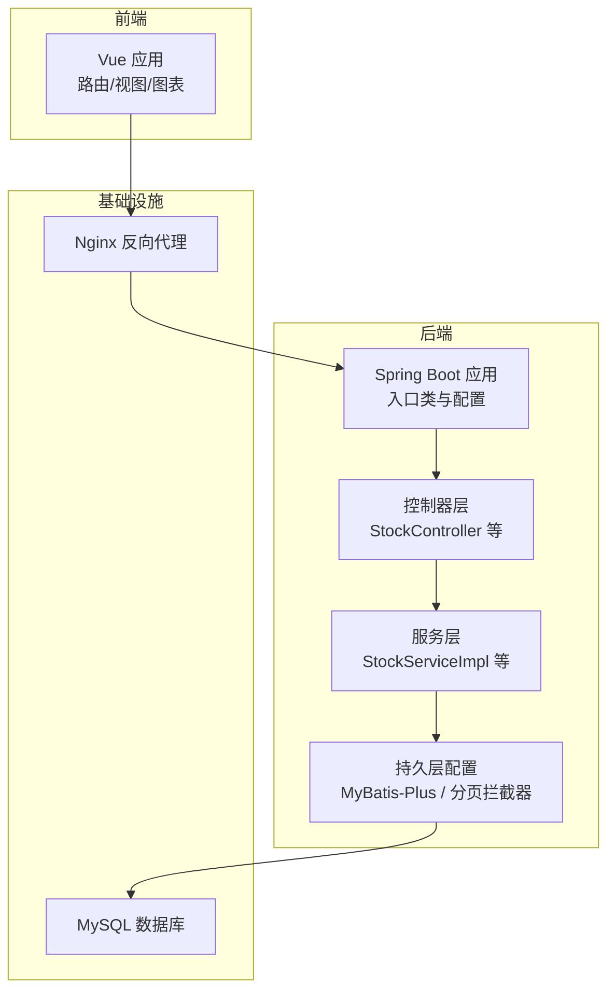
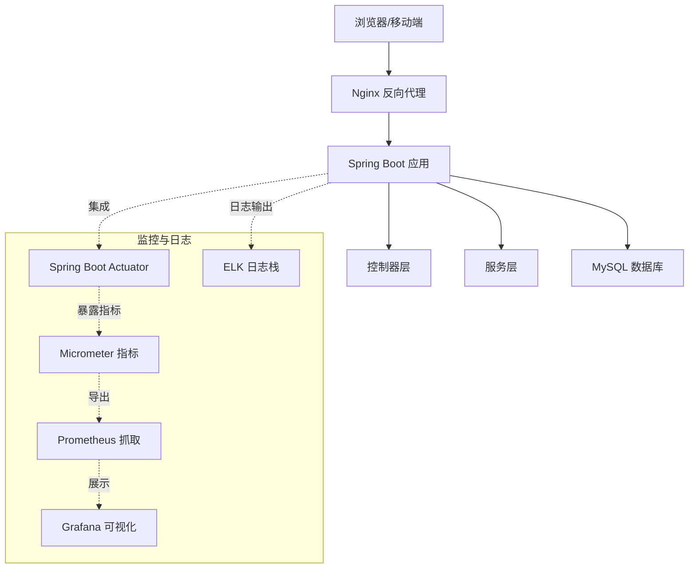
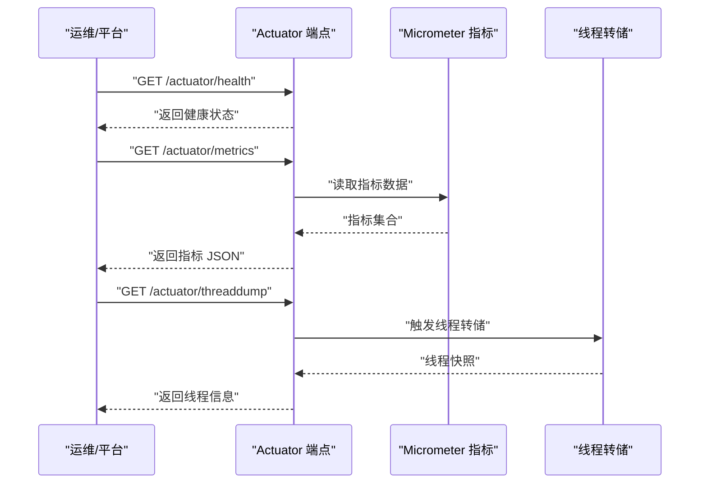
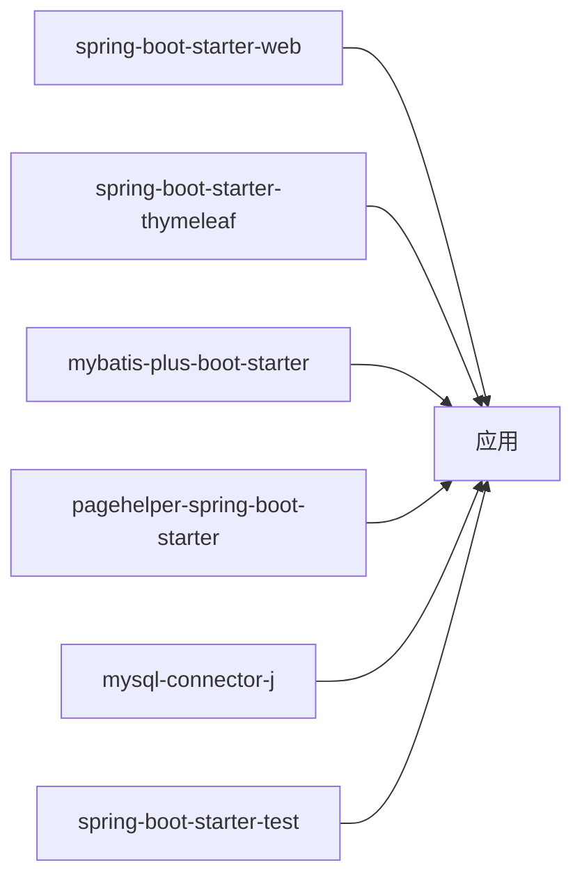

# 监控告警

<cite>
**本文引用的文件**
- [pom.xml](file://pom.xml)
- [application.yml](file://src/main/resources/application.yml)
- [DrugManagementApplication.java](file://src/main/java/com/hospital/drugmanagement/DrugManagementApplication.java)
- [StockController.java](file://src/main/java/com/hospital/drugmanagement/controller/StockController.java)
- [StockServiceImpl.java](file://src/main/java/com/hospital/drugmanagement/service/impl/StockServiceImpl.java)
- [JacksonConfig.java](file://src/main/java/com/hospital/drugmanagement/config/JacksonConfig.java)
- [CorsConfig.java](file://src/main/java/com/hospital/drugmanagement/config/CorsConfig.java)
- [MybatisPlusConfig.java](file://src/main/java/com/hospital/drugmanagement/config/MybatisPlusConfig.java)
- [README.md（前端）](file://drug-front/README.md)
- [init.sql](file://src/main/resources/db/init.sql)
</cite>

## 目录
1. [简介](#简介)
2. [项目结构](#项目结构)
3. [核心组件](#核心组件)
4. [架构总览](#架构总览)
5. [详细组件分析](#详细组件分析)
6. [依赖分析](#依赖分析)
7. [性能考虑](#性能考虑)
8. [故障排查指南](#故障排查指南)
9. [结论](#结论)
10. [附录](#附录)

## 简介
本指南面向“药物管理系统”的系统监控与告警配置，目标是帮助运维与开发团队建立完善的运行时可观测性体系，覆盖应用性能监控、指标采集、健康检查、线程转储、Prometheus/Grafana 可视化、日志收集与分析（ELK）、告警规则与通知渠道、以及容量规划与扩容策略。当前代码库未内置 Actuator、Micrometer、Prometheus 导出器或日志栈依赖，因此本指南提供从零到一的集成步骤与最佳实践。

## 项目结构
后端基于 Spring Boot 3.2.5，采用 Maven 构建；前端为 Vue 项目，通过 Nginx 或反向代理对接后端 API。数据库初始化脚本位于资源目录，便于快速部署。

**章节来源**
- [DrugManagementApplication.java:14-33](file://src/main/java/com/hospital/drugmanagement/DrugManagementApplication.java#L14-L33)
- [application.yml:1-24](file://src/main/resources/application.yml#L1-L24)
- [pom.xml:32-84](file://pom.xml#L32-L84)

## 核心组件
- 应用入口与组件扫描：负责启动 Spring 上下文、扫描控制器、服务与配置类。
- 控制器与服务：对外提供业务接口，如库存预警列表、库存盘点等。
- ORM 与分页：MyBatis-Plus 配置与分页拦截器，提升查询性能与可维护性。
- JSON 序列化：Long 精度处理，避免前端精度丢失。
- CORS 配置：统一跨域策略，便于前后端联调与生产部署。

**章节来源**
- [DrugManagementApplication.java:18-24](file://src/main/java/com/hospital/drugmanagement/DrugManagementApplication.java#L18-L24)
- [StockController.java:65-100](file://src/main/java/com/hospital/drugmanagement/controller/StockController.java#L65-L100)
- [StockServiceImpl.java:39-113](file://src/main/java/com/hospital/drugmanagement/service/impl/StockServiceImpl.java#L39-L113)
- [MybatisPlusConfig.java:8-16](file://src/main/java/com/hospital/drugmanagement/config/MybatisPlusConfig.java#L8-L16)
- [JacksonConfig.java:14-33](file://src/main/java/com/hospital/drugmanagement/config/JacksonConfig.java#L14-L33)
- [CorsConfig.java:7-18](file://src/main/java/com/hospital/drugmanagement/config/CorsConfig.java#L7-L18)

## 架构总览
下图展示从浏览器到后端接口、数据库的典型链路，以及可扩展的监控与日志栈接入点。

[此图为概念性架构示意，不直接映射具体源码文件]

## 详细组件分析

### Spring Boot Actuator 集成与监控端点配置
Actuator 提供健康检查、指标暴露、线程转储、环境信息等能力，是构建可观测性的基础。

- 添加依赖
  - 在依赖管理中引入 Actuator 与 Micrometer Prometheus 导出器。
- 配置端点
  - 开启所需端点（如 health、metrics、threaddump、env），限制敏感端点访问。
  - 设置端点前缀与安全策略（仅内网或受信网段）。
- 健康检查
  - 自定义健康指示器（数据库、缓存、外部服务）。
  - 使用复合健康组区分应用与依赖健康状态。
- 指标收集
  - 默认暴露 JVM、进程、HTTP 请求、业务指标。
  - 通过 MeterRegistry 自定义计数器/计时器/分布摘要。
- 线程转储
  - 通过 HTTP 端点触发线程转储，结合 APM 工具定位热点线程。
- 健康检查与线程转储的调用序列

[此图为概念性流程示意，不直接映射具体源码文件]

**章节来源**
- [pom.xml:32-84](file://pom.xml#L32-L84)
- [application.yml:14-24](file://src/main/resources/application.yml#L14-L24)

### Prometheus 监控系统集成
- 指标导出
  - 启用 Micrometer Prometheus 导出器，暴露 /actuator/prometheus。
  - 配置抓取间隔与超时，确保与 Prometheus 时钟同步。
- 监控项建议
  - HTTP 请求：请求量、成功率、P95/P99 延迟、异常率。
  - JVM：堆内存、GC 次数与耗时、线程数、类加载数。
  - 数据库：连接池使用、慢查询、SQL 错误。
  - 业务指标：库存预警数量、盘点任务执行时长。
- Grafana 可视化
  - 创建仪表盘：请求速率、错误率、延迟分布、JVM 指标、业务看板。
  - 使用变量与模板，支持多实例/多环境切换。
  - 配置告警阈值与通知通道（邮件、Webhook、IM）。

**章节来源**
- [pom.xml:32-84](file://pom.xml#L32-L84)
- [application.yml:14-24](file://src/main/resources/application.yml#L14-L24)

### 日志收集与分析系统（ELK）
- 日志输出
  - 使用结构化日志（JSON），包含 traceId、spanId、模块、级别、消息、异常。
  - 控制台与文件同时输出，生产环境优先文件落盘。
- 日志轮转
  - 使用 logback/log4j2 的 RollingPolicy，按日期/大小切分，保留天数与最大文件数。
- ELK 集成
  - Logstash/Fluentd 收集日志，过滤与解析字段。
  - Elasticsearch 存储，索引模板与别名管理。
  - Kibana 可视化：日志检索、趋势图、错误聚合、TopN 异常。
- 错误追踪
  - 结合 APM（如 SkyWalking/Zipkin）进行全链路追踪，定位根因。

**章节来源**
- [application.yml:14-24](file://src/main/resources/application.yml#L14-L24)

### 告警规则配置、通知渠道与故障自愈
- 告警规则
  - CPU 使用率、内存占用、GC 停顿、请求错误率、P95 延迟、线程池排队长度、数据库连接池空闲率。
  - 业务规则：库存预警数量突增、盘点任务失败、报表统计异常。
- 通知渠道
  - 邮件、短信、企业微信、钉钉机器人、Webhook。
  - 为不同严重级别设置不同通知策略与静默窗口。
- 故障自愈
  - 健康检查失败自动摘除实例，触发弹性扩缩容。
  - 关键任务失败自动重试与降级，记录失败原因并告警。

**章节来源**
- [StockController.java:65-100](file://src/main/java/com/hospital/drugmanagement/controller/StockController.java#L65-L100)
- [StockServiceImpl.java:39-113](file://src/main/java/com/hospital/drugmanagement/service/impl/StockServiceImpl.java#L39-L113)

### 性能基线、容量规划与扩容策略
- 性能基线
  - 压测确定 P50/P90/P95/P99 延迟、吞吐、资源占用阈值。
  - 建立指标基线：CPU、内存、IO、网络、数据库连接。
- 容量规划
  - 以峰值 QPS 与 SLA 为目标，评估 CPU/内存/存储/网络容量。
  - 考虑业务波动与增长趋势，预留 30%-50% 缓冲。
- 扩容策略
  - 垂直扩容：提升实例规格，适用于短期峰值。
  - 水平扩容：多副本部署，配合负载均衡与限流。
  - 无服务器/容器编排：根据 CPU/内存/请求速率自动扩缩。

**章节来源**
- [application.yml:14-24](file://src/main/resources/application.yml#L14-L24)

## 依赖分析
后端使用 Spring Boot Starter Web、Thymeleaf、MyBatis-Plus、分页插件与测试依赖；数据库驱动为 MySQL Connector/J。当前未包含 Actuator、Micrometer、Prometheus、日志栈相关依赖，需按需引入。

**图表来源**
- [pom.xml:34-57](file://pom.xml#L34-L57)

**章节来源**
- [pom.xml:32-84](file://pom.xml#L32-L84)

## 性能考虑
- 接口性能
  - 对分页查询与复杂筛选（如库存预警列表）建立索引，避免全表扫描。
  - 使用服务层聚合与缓存热点数据（如药品与仓库信息）。
- 数据库性能
  - 合理设置连接池大小与超时；监控慢查询与锁等待。
  - 读写分离与分库分表（未来演进）。
- JVM 与 GC
  - 观察 GC 频率与停顿，调整堆大小与 GC 参数。
- 网络与 IO
  - 控制响应体大小，启用压缩；合理设置超时与重试。

**章节来源**
- [StockController.java:65-100](file://src/main/java/com/hospital/drugmanagement/controller/StockController.java#L65-L100)
- [StockServiceImpl.java:39-113](file://src/main/java/com/hospital/drugmanagement/service/impl/StockServiceImpl.java#L39-L113)
- [MybatisPlusConfig.java:8-16](file://src/main/java/com/hospital/drugmanagement/config/MybatisPlusConfig.java#L8-L16)

## 故障排查指南
- 健康检查
  - 通过 Actuator 健康端点快速判断应用与依赖状态。
- 指标分析
  - 查看 JVM 与业务指标，定位异常时段与热点接口。
- 线程转储
  - 在高延迟或线程堆积时触发线程转储，分析阻塞与死锁。
- 日志分析
  - 使用 Kibana 快速检索错误日志，结合 TraceId 追踪请求链路。
- 前后端联调
  - 检查 CORS 配置与代理转发，确认端口与路径一致。
- 数据库初始化
  - 确认初始化脚本已执行，表结构与索引完整。

**章节来源**
- [CorsConfig.java:7-18](file://src/main/java/com/hospital/drugmanagement/config/CorsConfig.java#L7-L18)
- [README.md（前端）:236-255](file://drug-front/README.md#L236-L255)
- [init.sql](file://src/main/resources/db/init.sql)

## 结论
本指南提供了从零开始构建“药物管理系统”可观测性的完整路径：先补齐 Actuator/Micrometer/Prometheus 与日志栈，再完善告警与自愈机制，最后以压测与基线为依据制定容量与扩容策略。建议按阶段实施，优先保障健康检查与关键指标可见，逐步完善可视化与自动化运维能力。

## 附录
- 前端部署与反向代理参考
  - 参考前端 README 中的 Nginx 示例，将静态资源与 API 路由正确转发至后端。
- 数据库初始化
  - 初始化脚本位于资源目录，部署时确保数据库与用户权限正确。

**章节来源**
- [README.md（前端）:236-255](file://drug-front/README.md#L236-L255)
- [init.sql](file://src/main/resources/db/init.sql)