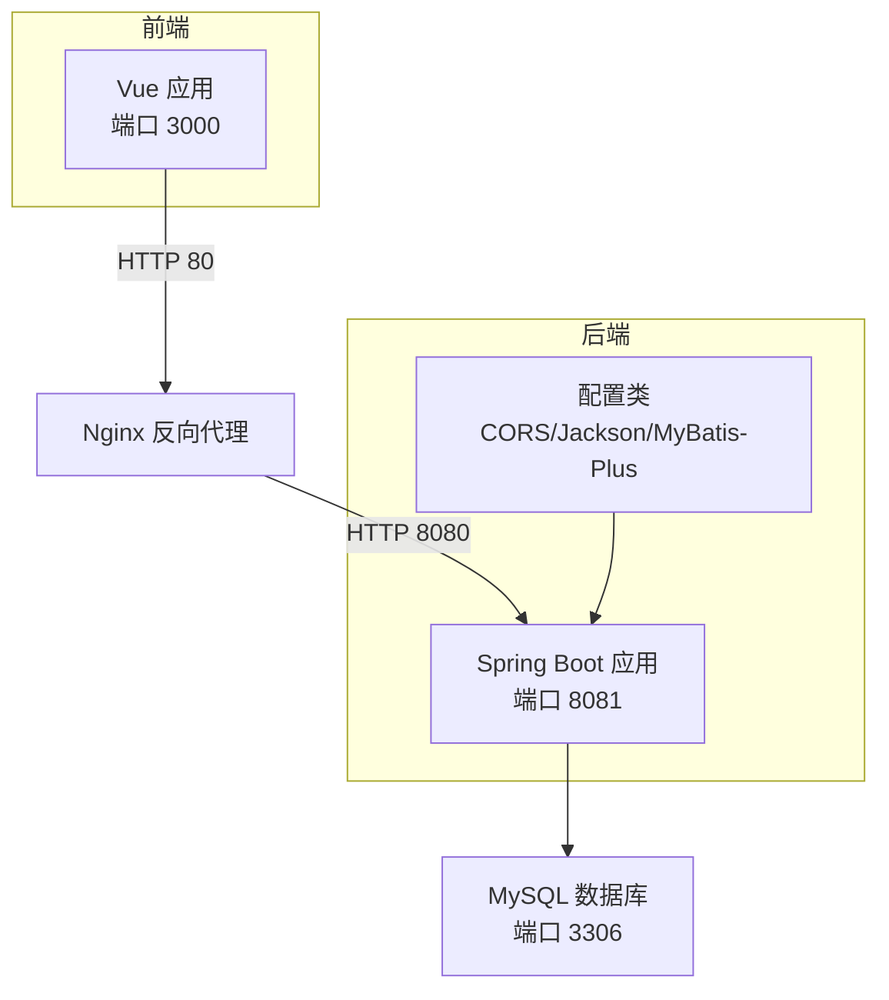
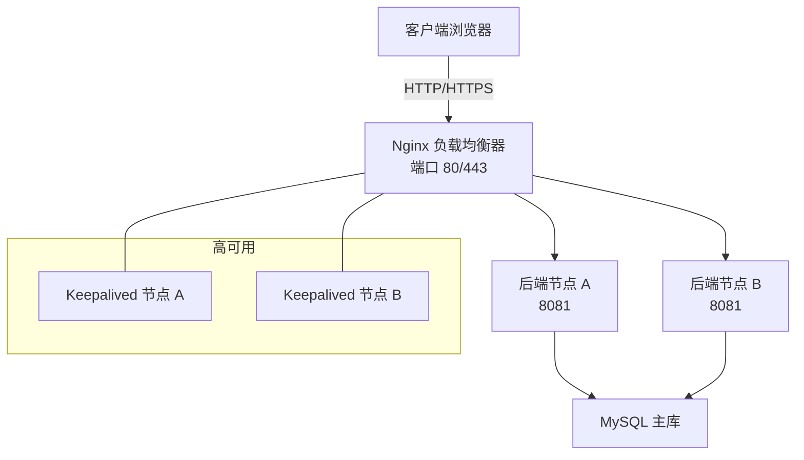
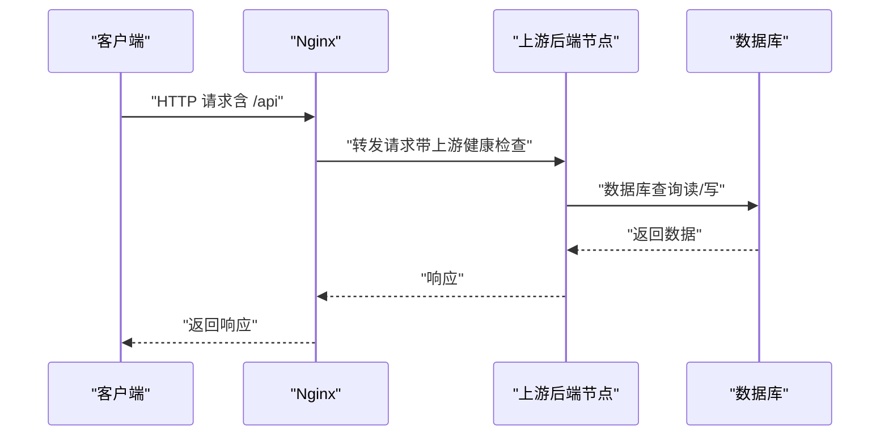
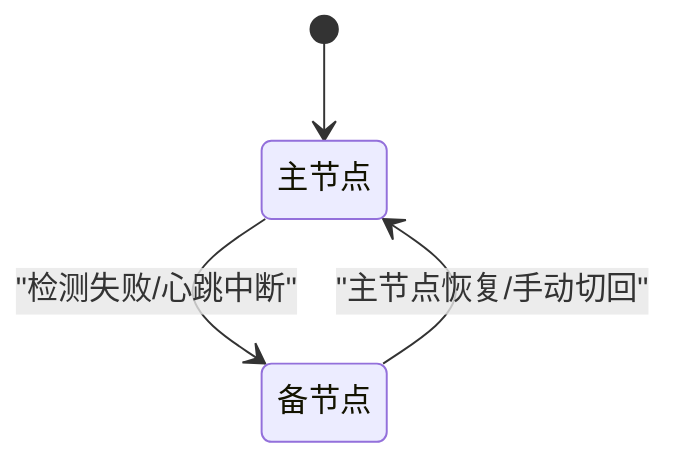
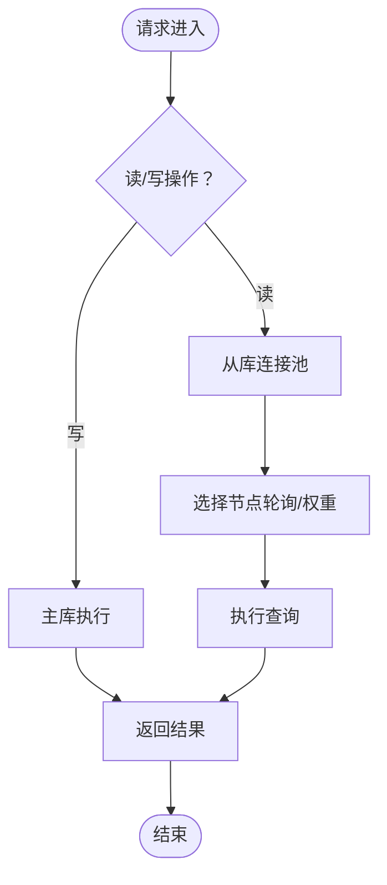
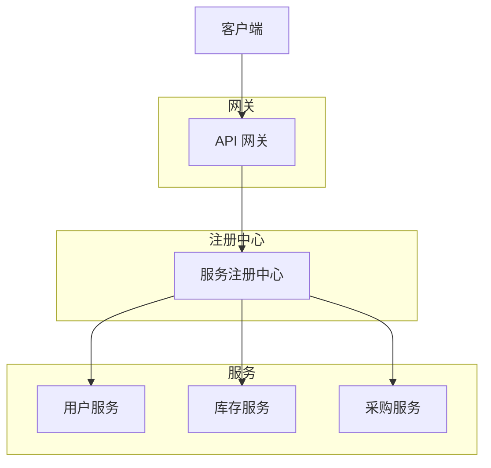
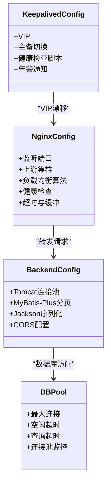
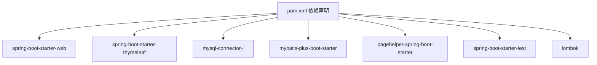

# 负载均衡配置

<cite>
**本文引用的文件**
- [application.yml](file://src/main/resources/application.yml)
- [pom.xml](file://pom.xml)
- [CorsConfig.java](file://src/main/java/com/hospital/drugmanagement/config/CorsConfig.java)
- [JacksonConfig.java](file://src/main/java/com/hospital/drugmanagement/config/JacksonConfig.java)
- [MybatisPlusConfig.java](file://src/main/java/com/hospital/drugmanagement/config/MybatisPlusConfig.java)
- [vite.config.js](file://drug-front/vite.config.js)
- [SysUserController.java](file://src/main/java/com/hospital/drugmanagement/controller/SysUserController.java)
- [SysUserServiceImpl.java](file://src/main/java/com/hospital/drugmanagement/service/impl/SysUserServiceImpl.java)
- [init.sql](file://src/main/resources/db/init.sql)
- [hospital_drug.sql](file://hospital_drug.sql)
- [init_and_start.bat](file://init_and_start.bat)
- [LOGIN_SETUP_README.md](file://LOGIN_SETUP_README.md)
</cite>

## 目录
1. [简介](#简介)
2. [项目结构](#项目结构)
3. [核心组件](#核心组件)
4. [架构总览](#架构总览)
5. [详细组件分析](#详细组件分析)
6. [依赖分析](#依赖分析)
7. [性能考虑](#性能考虑)
8. [故障排查指南](#故障排查指南)
9. [结论](#结论)
10. [附录](#附录)

## 简介
本指南面向在微服务与传统单体架构下部署“药物管理系统”的运维与开发人员，围绕负载均衡与高可用展开，涵盖：
- Nginx 反向代理与上游集群配置、负载均衡算法选择、健康检查机制
- Keepalived 高可用配置（虚拟IP漂移、故障切换）
- 数据库主从复制与读写分离策略、数据同步机制
- 微服务架构下的服务发现与注册配置思路
- 性能调优参数、连接池配置、超时设置等优化方案

说明：当前代码库为单体Spring Boot应用，未包含Nginx/Keepalived配置文件与微服务注册中心代码。本指南以“如何在现有应用基础上扩展到高可用与分布式”为目标，提供可落地的配置建议与最佳实践。

## 项目结构
该工程采用Spring Boot标准目录结构，包含后端服务、前端Vue应用、数据库初始化脚本与构建配置文件。后端服务通过Spring MVC对外提供REST API，前端通过Vite代理访问后端。

图示来源
- [vite.config.js:12-21](file://drug-front/vite.config.js#L12-L21)
- [application.yml:14-16](file://src/main/resources/application.yml#L14-L16)
- [CorsConfig.java:10-16](file://src/main/java/com/hospital/drugmanagement/config/CorsConfig.java#L10-L16)
- [pom.xml:32-84](file://pom.xml#L32-L84)

章节来源
- [vite.config.js:12-21](file://drug-front/vite.config.js#L12-L21)
- [application.yml:14-16](file://src/main/resources/application.yml#L14-L16)
- [CorsConfig.java:10-16](file://src/main/java/com/hospital/drugmanagement/config/CorsConfig.java#L10-L16)
- [pom.xml:32-84](file://pom.xml#L32-L84)

## 核心组件
- 后端服务：基于Spring Boot，提供REST接口（如用户登录、用户列表等），默认监听8081端口。
- 前端应用：Vue + Vite，默认监听3000端口；通过代理将/api前缀转发至后端8081端口。
- 数据库：MySQL，初始化脚本包含用户、角色、菜单、药品、供应商、仓库、库存、出入库、盘点、审核等表。
- 配置类：CORS跨域、Jackson序列化Long为字符串、MyBatis-Plus分页插件。

章节来源
- [SysUserController.java:26-28](file://src/main/java/com/hospital/drugmanagement/controller/SysUserController.java#L26-L28)
- [SysUserServiceImpl.java:42-102](file://src/main/java/com/hospital/drugmanagement/service/impl/SysUserServiceImpl.java#L42-L102)
- [application.yml:14-16](file://src/main/resources/application.yml#L14-L16)
- [vite.config.js:12-21](file://drug-front/vite.config.js#L12-L21)
- [CorsConfig.java:10-16](file://src/main/java/com/hospital/drugmanagement/config/CorsConfig.java#L10-L16)
- [JacksonConfig.java:17-32](file://src/main/java/com/hospital/drugmanagement/config/JacksonConfig.java#L17-L32)
- [MybatisPlusConfig.java:9-15](file://src/main/java/com/hospital/drugmanagement/config/MybatisPlusConfig.java#L9-L15)
- [init.sql:8-312](file://src/main/resources/db/init.sql#L8-L312)

## 架构总览
下图展示从客户端到后端服务、数据库的整体交互流程，以及Nginx与Keepalived在高可用场景下的位置。

图示来源
- [vite.config.js:14-18](file://drug-front/vite.config.js#L14-L18)
- [application.yml:14-16](file://src/main/resources/application.yml#L14-L16)

## 详细组件分析

### Nginx 反向代理与上游集群配置
- 监听端口与上游节点
  - 监听80/443，将/api前缀转发至后端节点（8081端口）。
  - 上游集群建议至少两台后端节点，便于横向扩展与故障隔离。
- 负载均衡算法选择
  - 轮询（默认）：适用于节点性能相近。
  - 权重轮询：根据节点资源分配权重。
  - 最少连接：动态分配到空闲连接较少的节点。
  - IP哈希：保证同一客户端固定到同一节点（需结合会话保持）。
- 健康检查机制
  - 健康检查端口与路径：建议对后端8081端口的健康接口进行探测。
  - 失败阈值与恢复阈值：合理设置失败次数与恢复时间，避免雪崩。
  - 故障剔除与恢复：自动摘除故障节点，恢复后自动加入。
- 会话保持与粘性会话
  - 若后端无共享会话，建议启用IP哈希或基于Cookie的会话保持。
- SSL/TLS与安全
  - 强制HTTPS，启用TLS1.2+，配置安全套件与证书。
- 超时与缓冲
  - 客户端请求超时、后端响应超时、缓冲区大小按业务峰值调整。
- 日志与监控
  - 访问日志与错误日志分离，接入集中式日志与指标监控。

图示来源
- [vite.config.js:14-18](file://drug-front/vite.config.js#L14-L18)
- [application.yml:14-16](file://src/main/resources/application.yml#L14-L16)

章节来源
- [vite.config.js:14-18](file://drug-front/vite.config.js#L14-L18)
- [application.yml:14-16](file://src/main/resources/application.yml#L14-L16)

### Keepalived 高可用配置
- 虚拟IP（VIP）漂移
  - 配置主备节点的VIP（如192.168.1.100），主节点持有VIP，备用节点待命。
- 故障检测与切换
  - 健康检查脚本检测Nginx/后端进程状态，失败则触发主备切换。
  - 切换时自动释放/接管VIP，确保服务连续性。
- 通知与告警
  - 切换事件通过脚本或系统日志通知运维团队。
- 一致性与脑裂防护
  - 降低优先级差异，启用抢占模式与防脑裂策略。

图示来源
- [vite.config.js:14-18](file://drug-front/vite.config.js#L14-L18)
- [application.yml:14-16](file://src/main/resources/application.yml#L14-L16)

章节来源
- [vite.config.js:14-18](file://drug-front/vite.config.js#L14-L18)
- [application.yml:14-16](file://src/main/resources/application.yml#L14-L16)

### 数据库主从复制与读写分离
- 主从复制
  - 主库开启二进制日志，从库配置复制源，建立IO/SQL线程同步。
  - 建议使用半同步复制提升一致性与可靠性。
- 读写分离策略
  - 写操作：固定路由到主库。
  - 读操作：通过中间层（如数据库连接池或代理）分发到从库，支持多从库轮询或权重。
- 数据同步机制
  - GTID或基于位点的复制，确保一致性与断点续传。
  - 定期校验主从延迟，异常告警。
- 连接池与超时
  - 连接池配置最大连接数、空闲连接、连接超时、查询超时。
  - 读写分离时区分读写连接池，避免阻塞。
- 事务与一致性
  - 严格控制跨库事务，必要时采用分布式事务框架。

图示来源
- [application.yml:3-7](file://src/main/resources/application.yml#L3-L7)

章节来源
- [application.yml:3-7](file://src/main/resources/application.yml#L3-L7)

### 微服务架构下的服务发现与注册
- 服务注册与发现
  - 使用注册中心（如Eureka、Consul、Nacos），服务启动时注册，定期续约。
  - 客户端通过注册中心拉取服务实例列表，配合负载均衡器实现动态路由。
- 配置中心
  - 将数据库连接、超时、日志级别等配置集中管理，支持热更新。
- 熔断与限流
  - 在网关或服务侧启用熔断（Hystrix/Resilience4j）、限流（令牌桶/漏桶）。
- 链路追踪
  - 集成Zipkin/SkyWalking，定位慢调用与故障点。
- 安全与鉴权
  - OAuth2/JWT统一认证，网关侧鉴权与放行。

图示来源
- [pom.xml:32-84](file://pom.xml#L32-L84)

章节来源
- [pom.xml:32-84](file://pom.xml#L32-L84)

### 性能调优参数、连接池与超时设置
- Nginx
  - worker_processes、worker_connections、multi_accept、sendfile、tcp_nopush、keepalive_timeout。
  - gzip压缩、静态资源缓存、缓存键设计。
- 后端（Spring Boot）
  - Tomcat/Apache HttpComponents连接池参数（最大连接、空闲超时、队列长度）。
  - MyBatis-Plus分页插件、Jackson序列化优化（Long转字符串避免精度丢失）。
  - CORS配置、Thymeleaf缓存关闭（开发阶段）。
- 数据库
  - 连接池（HikariCP/Druid）参数：最大池大小、最小空闲、连接超时、空闲超时、最大生命周期。
  - 查询超时、慢查询日志、索引优化。
- 前端
  - Vite代理目标端口与变更源，避免跨域问题。

图示来源
- [application.yml:3-7](file://src/main/resources/application.yml#L3-L7)
- [JacksonConfig.java:17-32](file://src/main/java/com/hospital/drugmanagement/config/JacksonConfig.java#L17-L32)
- [MybatisPlusConfig.java:9-15](file://src/main/java/com/hospital/drugmanagement/config/MybatisPlusConfig.java#L9-L15)
- [CorsConfig.java:10-16](file://src/main/java/com/hospital/drugmanagement/config/CorsConfig.java#L10-L16)

章节来源
- [application.yml:3-7](file://src/main/resources/application.yml#L3-L7)
- [JacksonConfig.java:17-32](file://src/main/java/com/hospital/drugmanagement/config/JacksonConfig.java#L17-L32)
- [MybatisPlusConfig.java:9-15](file://src/main/java/com/hospital/drugmanagement/config/MybatisPlusConfig.java#L9-L15)
- [CorsConfig.java:10-16](file://src/main/java/com/hospital/drugmanagement/config/CorsConfig.java#L10-L16)

## 依赖分析
- 后端依赖
  - Spring Boot Web、Thymeleaf、MySQL驱动、MyBatis-Plus、PageHelper、测试依赖。
- 前端依赖
  - Vue、Vite、Vue插件，开发服务器端口3000，代理/api至8081。
- 数据库初始化
  - 提供完整的DDL与初始化数据，包含用户、角色、菜单、药品、供应商、仓库、库存、出入库、盘点、审核等表。

图示来源
- [pom.xml:32-84](file://pom.xml#L32-L84)

章节来源
- [pom.xml:32-84](file://pom.xml#L32-L84)
- [init.sql:1-312](file://src/main/resources/db/init.sql#L1-L312)
- [hospital_drug.sql:1-307](file://hospital_drug.sql#L1-L307)

## 性能考虑
- 端到端延迟
  - Nginx与后端节点间网络延迟、数据库查询延迟、前端渲染时间。
- 连接池与线程
  - 合理设置Nginx worker与连接数、后端线程池与数据库连接池，避免过载。
- 缓存策略
  - 前端静态资源缓存、后端热点数据缓存（Redis）、数据库查询缓存。
- 监控与告警
  - 指标采集（QPS、P95/P99、错误率、连接数、CPU/内存）、日志聚合、链路追踪。
- 自动扩缩容
  - 基于指标的水平扩展，结合Kubernetes HPA与服务网格。

## 故障排查指南
- 前端无法访问后端
  - 检查Vite代理配置是否指向后端8081端口，确认CORS配置允许前端域名。
- 数据库连接失败
  - 检查application.yml中的数据库URL、用户名、密码，确认MySQL服务已启动且数据库存在。
- 登录接口异常
  - 检查SysUserController与SysUserServiceImpl的登录逻辑，确认密码加密与用户状态。
- 启动脚本
  - 使用init_and_start.bat初始化数据库并启动后端服务。

章节来源
- [vite.config.js:14-18](file://drug-front/vite.config.js#L14-L18)
- [CorsConfig.java:10-16](file://src/main/java/com/hospital/drugmanagement/config/CorsConfig.java#L10-L16)
- [application.yml:3-7](file://src/main/resources/application.yml#L3-L7)
- [SysUserController.java:43-68](file://src/main/java/com/hospital/drugmanagement/controller/SysUserController.java#L43-L68)
- [SysUserServiceImpl.java:42-102](file://src/main/java/com/hospital/drugmanagement/service/impl/SysUserServiceImpl.java#L42-L102)
- [init_and_start.bat:4-9](file://init_and_start.bat#L4-L9)

## 结论
- 当前系统为单体架构，具备良好的基础配置与接口能力。
- 扩展到高可用与分布式的关键在于：Nginx反向代理与上游集群、Keepalived高可用、数据库主从与读写分离、微服务注册与配置中心、完善的性能调优与监控体系。
- 建议逐步引入服务网格、配置中心与可观测性平台，持续优化系统稳定性与可维护性。

## 附录
- 数据库初始化脚本与表结构
  - init.sql与hospital_drug.sql提供了完整的DDL与初始化数据，便于快速部署与验证。
- 启动与登录说明
  - LOGIN_SETUP_README.md提供了数据库初始化、后端启动、前端启动与登录测试的完整流程。

章节来源
- [init.sql:1-312](file://src/main/resources/db/init.sql#L1-L312)
- [hospital_drug.sql:1-307](file://hospital_drug.sql#L1-L307)
- [LOGIN_SETUP_README.md:74-128](file://LOGIN_SETUP_README.md#L74-L128)