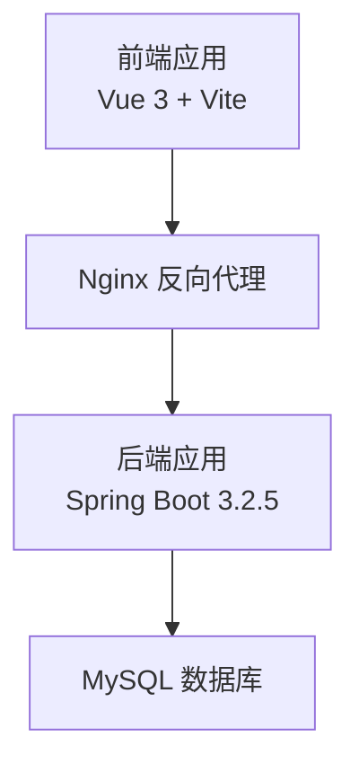
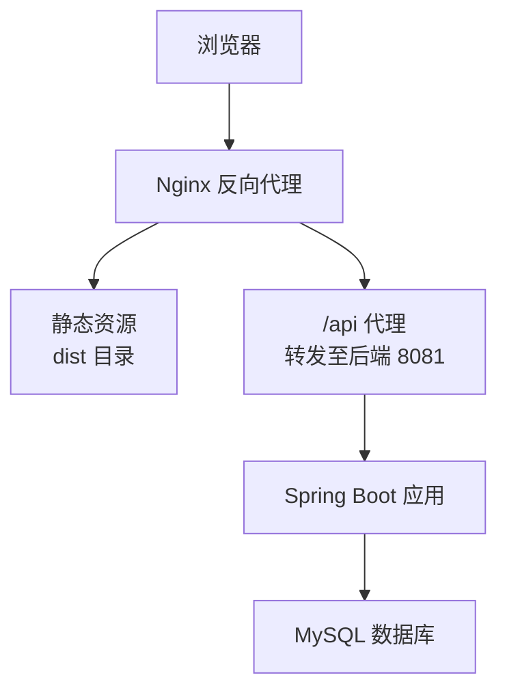
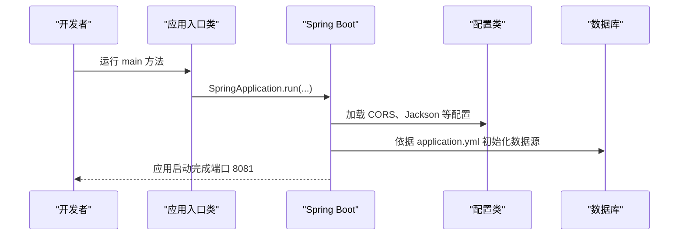
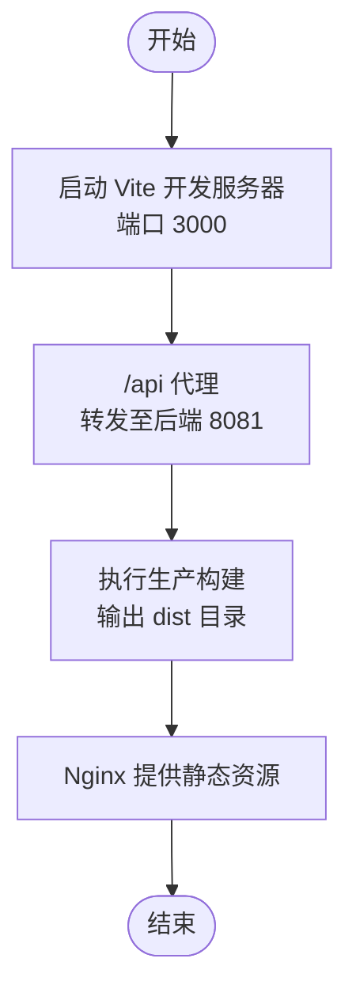
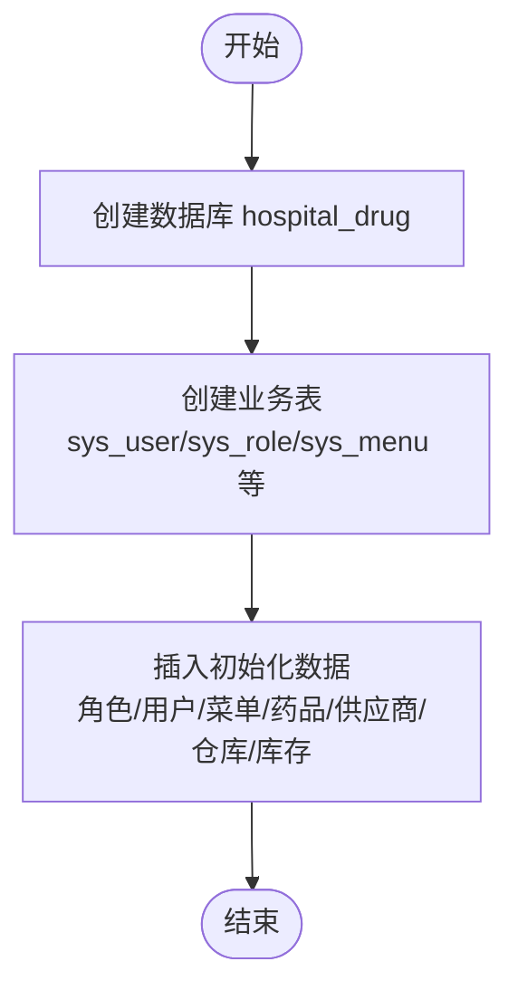
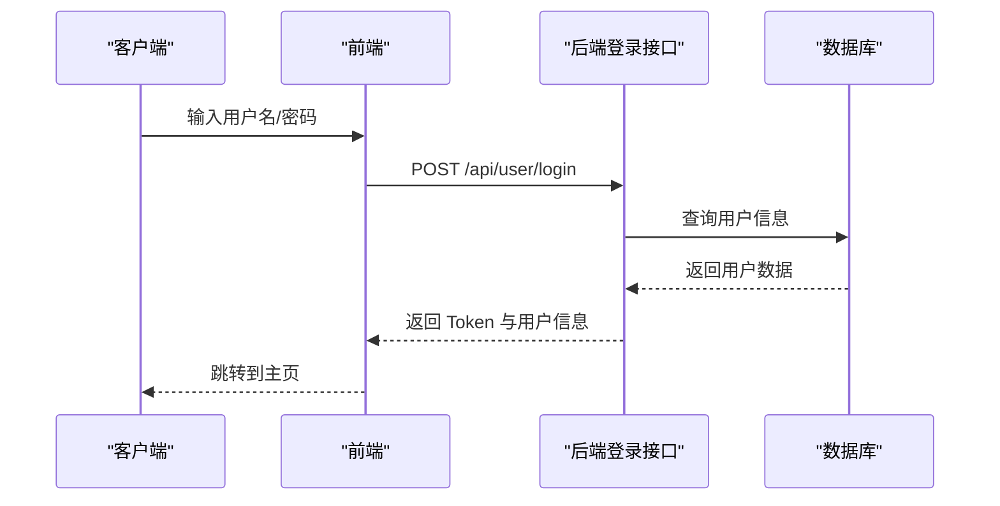
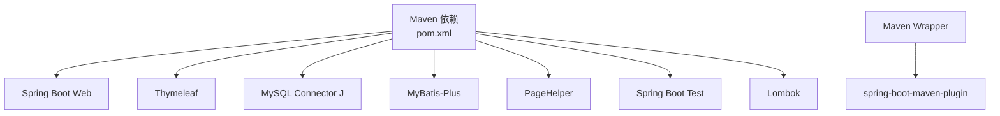

# 部署指南

<cite>
**本文引用的文件**
- [pom.xml](file://pom.xml)
- [application.yml](file://src/main/resources/application.yml)
- [init_and_start.bat](file://init_and_start.bat)
- [init.sql](file://src/main/resources/db/init.sql)
- [hospital_drug.sql](file://hospital_drug.sql)
- [DrugManagementApplication.java](file://src/main/java/com/hospital/drugmanagement/DrugManagementApplication.java)
- [CorsConfig.java](file://src/main/java/com/hospital/drugmanagement/config/CorsConfig.java)
- [JacksonConfig.java](file://src/main/java/com/hospital/drugmanagement/config/JacksonConfig.java)
- [package.json](file://drug-front/package.json)
- [vite.config.js](file://drug-front/vite.config.js)
- [index.html](file://drug-front/index.html)
- [LOGIN_SETUP_README.md](file://LOGIN_SETUP_README.md)
- [mvnw.cmd](file://mvnw.cmd)
</cite>

## 目录
1. [简介](#简介)
2. [项目结构](#项目结构)
3. [核心组件](#核心组件)
4. [架构总览](#架构总览)
5. [详细组件分析](#详细组件分析)
6. [依赖关系分析](#依赖关系分析)
7. [性能考虑](#性能考虑)
8. [故障排除指南](#故障排除指南)
9. [结论](#结论)
10. [附录](#附录)

## 简介
本指南面向从开发环境到生产环境的完整部署需求，覆盖服务器环境准备、JDK与Node.js安装、MySQL数据库部署、Nginx反向代理配置；同时提供Docker容器化部署思路（镜像构建、容器编排、服务发现）、云平台部署（阿里云、腾讯云、AWS）的通用方案；并涵盖负载均衡（Nginx、Keepalived高可用）、数据库主从复制、监控告警、部署脚本（自动化部署、回滚策略、蓝绿部署）、安全加固（防火墙、SSL、访问控制、数据备份）以及运维最佳实践与故障排除。

## 项目结构
该工程采用前后端分离架构：
- 后端：基于 Spring Boot 3.2.5 + Java 17，使用 MyBatis-Plus、MySQL Connector J、分页插件 PageHelper 等依赖。
- 前端：基于 Vue 3 + Vite，使用 Element Plus、Axios 等生态，开发时通过代理将 /api 前缀转发至后端 8081 端口。
- 数据库：初始化脚本包含完整的业务表结构与基础数据，支持快速本地初始化。

图表来源
- [vite.config.js:12-21](file://drug-front/vite.config.js#L12-L21)
- [application.yml:14-16](file://src/main/resources/application.yml#L14-L16)
- [init.sql:1-312](file://src/main/resources/db/init.sql#L1-L312)

章节来源
- [pom.xml:32-84](file://pom.xml#L32-L84)
- [application.yml:1-24](file://src/main/resources/application.yml#L1-L24)
- [package.json:8-12](file://drug-front/package.json#L8-L12)
- [vite.config.js:12-21](file://drug-front/vite.config.js#L12-L21)

## 核心组件
- 后端应用入口与配置
  - 应用入口类负责启动 Spring Boot 应用，并显式导入部分控制器以确保被容器管理。
  - 配置文件定义数据源、Thymeleaf、服务端口、MyBatis-Plus 等关键参数。
- 前端开发与构建
  - 开发服务器监听 3000 端口，通过代理将 /api 请求转发至后端 8081。
  - 生产构建输出至 dist 目录，可由 Nginx 提供静态资源服务。
- 数据库初始化
  - 提供 init.sql 与 hospital_drug.sql 两种形式，包含完整的业务表结构与初始化数据。
- 跨域与序列化
  - CORS 配置允许跨域访问，Jackson 序列化配置解决 Long 类型精度问题。

章节来源
- [DrugManagementApplication.java:14-33](file://src/main/java/com/hospital/drugmanagement/DrugManagementApplication.java#L14-L33)
- [application.yml:1-24](file://src/main/resources/application.yml#L1-L24)
- [CorsConfig.java:7-18](file://src/main/java/com/hospital/drugmanagement/config/CorsConfig.java#L7-L18)
- [JacksonConfig.java:14-33](file://src/main/java/com/hospital/drugmanagement/config/JacksonConfig.java#L14-L33)
- [init.sql:1-312](file://src/main/resources/db/init.sql#L1-L312)
- [hospital_drug.sql:1-200](file://hospital_drug.sql#L1-L200)
- [package.json:8-12](file://drug-front/package.json#L8-L12)
- [vite.config.js:12-21](file://drug-front/vite.config.js#L12-L21)

## 架构总览
下图展示从浏览器到后端再到数据库的整体链路，以及 Nginx 在其中承担的静态资源与反向代理职责。

图表来源
- [vite.config.js:12-21](file://drug-front/vite.config.js#L12-L21)
- [application.yml:14-16](file://src/main/resources/application.yml#L14-L16)
- [init.sql:1-312](file://src/main/resources/db/init.sql#L1-L312)

## 详细组件分析

### 后端应用启动流程
后端通过 Spring Boot 启动，应用入口类负责扫描控制器、服务与配置包，并显式导入特定控制器以确保被容器管理。

图表来源
- [DrugManagementApplication.java:26-33](file://src/main/java/com/hospital/drugmanagement/DrugManagementApplication.java#L26-L33)
- [application.yml:1-24](file://src/main/resources/application.yml#L1-L24)
- [CorsConfig.java:7-18](file://src/main/java/com/hospital/drugmanagement/config/CorsConfig.java#L7-L18)
- [JacksonConfig.java:14-33](file://src/main/java/com/hospital/drugmanagement/config/JacksonConfig.java#L14-L33)

章节来源
- [DrugManagementApplication.java:14-33](file://src/main/java/com/hospital/drugmanagement/DrugManagementApplication.java#L14-L33)
- [application.yml:1-24](file://src/main/resources/application.yml#L1-L24)

### 前端开发与构建流程
前端开发服务器通过 Vite 提供热更新与代理能力，生产构建输出静态资源，由 Nginx 提供服务。

图表来源
- [vite.config.js:12-21](file://drug-front/vite.config.js#L12-L21)
- [package.json:8-12](file://drug-front/package.json#L8-L12)

章节来源
- [vite.config.js:1-22](file://drug-front/vite.config.js#L1-L22)
- [package.json:1-29](file://drug-front/package.json#L1-L29)

### 数据库初始化流程
数据库初始化脚本包含完整的业务表结构与基础数据，支持快速本地初始化。

图表来源
- [init.sql:1-312](file://src/main/resources/db/init.sql#L1-L312)
- [hospital_drug.sql:1-200](file://hospital_drug.sql#L1-L200)

章节来源
- [init.sql:1-312](file://src/main/resources/db/init.sql#L1-L312)
- [hospital_drug.sql:1-200](file://hospital_drug.sql#L1-L200)

### 登录与认证流程（概念性说明）
登录接口与 Token 机制在登录功能说明中有详细描述，生产环境建议使用 JWT 替代简单 Token。

图表来源
- [LOGIN_SETUP_README.md:30-72](file://LOGIN_SETUP_README.md#L30-L72)

章节来源
- [LOGIN_SETUP_README.md:140-155](file://LOGIN_SETUP_README.md#L140-L155)

## 依赖关系分析
后端依赖包括 Spring Web、Thymeleaf、MySQL Connector J、MyBatis-Plus、PageHelper 等，构建工具使用 Maven Wrapper。

图表来源
- [pom.xml:32-84](file://pom.xml#L32-L84)
- [mvnw.cmd:98-128](file://mvnw.cmd#L98-L128)

章节来源
- [pom.xml:29-118](file://pom.xml#L29-L118)
- [mvnw.cmd:98-128](file://mvnw.cmd#L98-L128)

## 性能考虑
- 后端
  - 启用 MyBatis-Plus 下划线转驼峰命名，提升字段映射一致性。
  - Jackson 序列化 Long 为字符串，避免前端精度丢失。
  - 合理设置数据库连接池大小与超时参数。
- 前端
  - 生产构建启用压缩与 Tree Shaking，减少体积。
  - 使用 CDN 加速静态资源。
- 数据库
  - 为高频查询字段建立索引（如药品、供应商、仓库、库存相关字段）。
  - 定期维护与分析慢查询日志。

章节来源
- [application.yml:18-24](file://src/main/resources/application.yml#L18-L24)
- [JacksonConfig.java:14-33](file://src/main/java/com/hospital/drugmanagement/config/JacksonConfig.java#L14-L33)
- [init.sql:60-225](file://src/main/resources/db/init.sql#L60-L225)

## 故障排除指南
- 前端无法访问后端接口
  - 确认后端服务已启动且端口为 8081。
  - 检查前端代理配置是否指向正确端口。
  - 检查浏览器控制台是否存在跨域错误。
- 数据库连接失败
  - 确认 MySQL 服务已启动。
  - 检查 application.yml 中的数据库连接参数。
  - 确认数据库 hospital_drug 已创建。
- 登录失败
  - 检查数据库中 sys_user 表的密码是否为加密后的值。
  - 如为演示目的，可临时调整加密逻辑或更新为加密值。
- 启动脚本
  - Windows 可使用提供的批处理脚本一键初始化数据库并启动后端服务。

章节来源
- [LOGIN_SETUP_README.md:181-197](file://LOGIN_SETUP_README.md#L181-L197)
- [vite.config.js:12-21](file://drug-front/vite.config.js#L12-L21)
- [application.yml:1-24](file://src/main/resources/application.yml#L1-L24)
- [init_and_start.bat:1-11](file://init_and_start.bat#L1-L11)

## 结论
本指南提供了从开发到生产的完整部署路径，涵盖服务器环境准备、JDK/Node.js 安装、MySQL 部署、Nginx 反向代理、Docker 容器化思路、云平台部署、负载均衡与高可用、监控告警、部署脚本与安全加固等关键环节。结合项目现有配置与脚本，可快速搭建稳定可靠的药品管理系统运行环境。

## 附录

### A. 服务器环境准备与软件安装
- 操作系统：推荐 CentOS 7+/Ubuntu 18.04+ 或同等发行版。
- JDK：安装 OpenJDK 17 或 Oracle JDK 17。
- Node.js：安装 LTS 版本，用于前端构建。
- MySQL：安装 MySQL 8.0+，创建数据库 hospital_drug 并执行初始化脚本。
- Nginx：安装最新稳定版，配置静态资源与反向代理。

章节来源
- [application.yml:4-7](file://src/main/resources/application.yml#L4-L7)
- [init.sql:1-312](file://src/main/resources/db/init.sql#L1-L312)

### B. Docker 容器化部署（思路）
- 镜像构建
  - 基于官方 OpenJDK 17 镜像作为基础镜像。
  - 将后端打包产物复制进镜像，暴露 8081 端口。
  - 前端构建产物复制至 Nginx 镜像，暴露 80 端口。
- 容器编排
  - 使用 Docker Compose 编排后端、MySQL、Nginx。
  - 通过网络隔离与卷挂载持久化数据。
- 服务发现
  - 在容器编排中使用服务名进行内部通信。
  - 外部通过 Nginx 暴露统一入口。

[本节为概念性说明，未直接分析具体文件，故不附加“章节来源”]

### C. 云平台部署（阿里云/腾讯云/AWS）
- 阿里云
  - 使用 ECS 承载应用，RDS 托管数据库，SLB 提供流量分发。
  - OSS 存储静态资源，CDN 加速。
- 腾讯云
  - 使用 CVM + CDB，CLB 提供负载均衡。
  - COS 托管静态资源，API 网关统一入口。
- AWS
  - 使用 EC2 + RDS，ALB 提供负载均衡。
  - S3 托管静态资源，CloudFront 加速。
- 通用要点
  - 安全组放通必要端口（80/443/8081/3306）。
  - 使用密钥对与最小权限原则管理访问。
  - 自动化部署与蓝绿发布策略。

[本节为概念性说明，未直接分析具体文件，故不附加“章节来源”]

### D. 负载均衡与高可用
- Nginx
  - 反向代理后端多实例，实现横向扩展。
  - 配置健康检查与错误重试。
- Keepalived
  - 通过虚拟 IP（VIP）实现高可用切换。
  - 配置主备节点心跳检测与故障转移。
- 数据库主从复制
  - 主库写入，从库只读，读写分离。
  - 使用半同步复制降低数据丢失风险。

[本节为概念性说明，未直接分析具体文件，故不附加“章节来源”]

### E. 监控告警
- 系统监控
  - 使用 Prometheus + Grafana 监控 CPU、内存、磁盘、网络。
- 应用性能监控
  - 使用 Micrometer + Spring Boot Actuator 暴露指标。
  - 结合 Zipkin/Sleuth 进行链路追踪。
- 日志收集分析
  - 使用 ELK（Elasticsearch + Logstash + Kibana）集中收集与检索日志。
  - 前端错误上报与后端异常日志统一采集。

[本节为概念性说明，未直接分析具体文件，故不附加“章节来源”]

### F. 部署脚本与自动化
- 自动化部署
  - 使用 Jenkins/GitLab CI 等流水线，自动构建、测试、打包。
  - 通过 Ansible/Docker Compose 自动化部署。
- 回滚策略
  - 采用蓝绿部署或滚动更新，失败自动回滚。
  - 镜像版本标签化管理。
- 蓝绿部署
  - 两套环境并行运行，切换流量实现零停机升级。

[本节为概念性说明，未直接分析具体文件，故不附加“章节来源”]

### G. 安全加固
- 防火墙
  - 仅开放必要端口，限制来源 IP。
- SSL 证书
  - 申请并配置免费/付费证书，强制 HTTPS。
- 访问控制
  - 引入 JWT 认证与 RBAC 权限模型。
  - 对敏感接口增加限流与风控。
- 数据备份
  - 定时快照与增量备份，异地容灾。
  - 数据脱敏与最小可见范围。

[本节为概念性说明，未直接分析具体文件，故不附加“章节来源”]