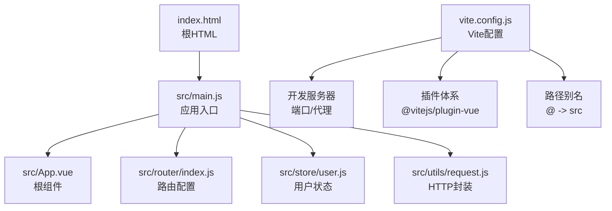
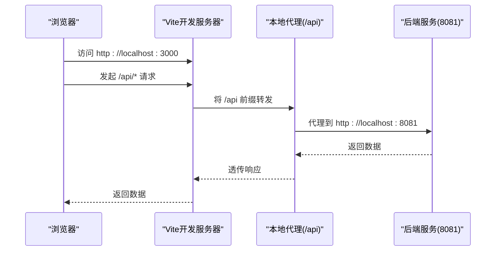
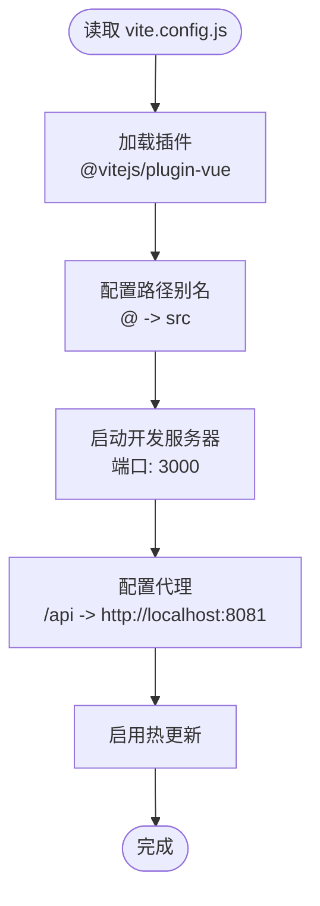
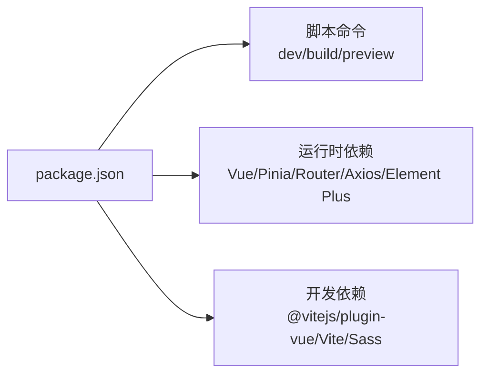
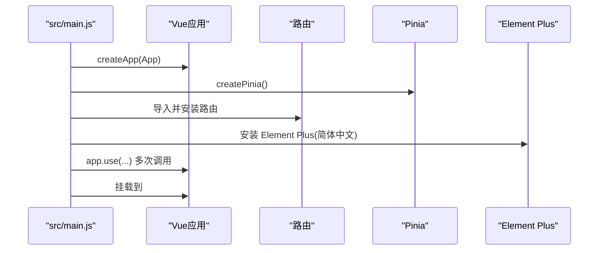
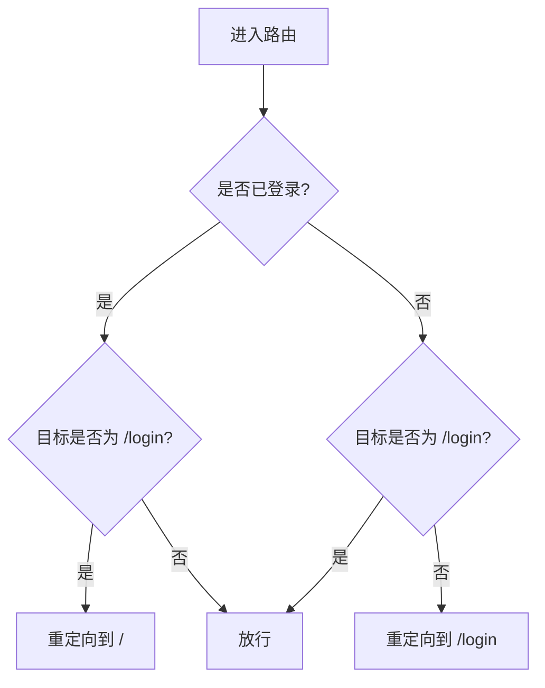
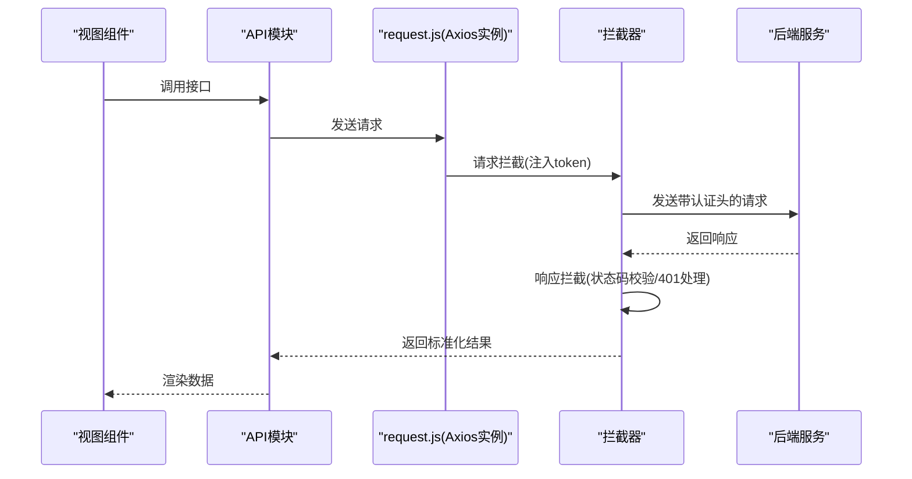
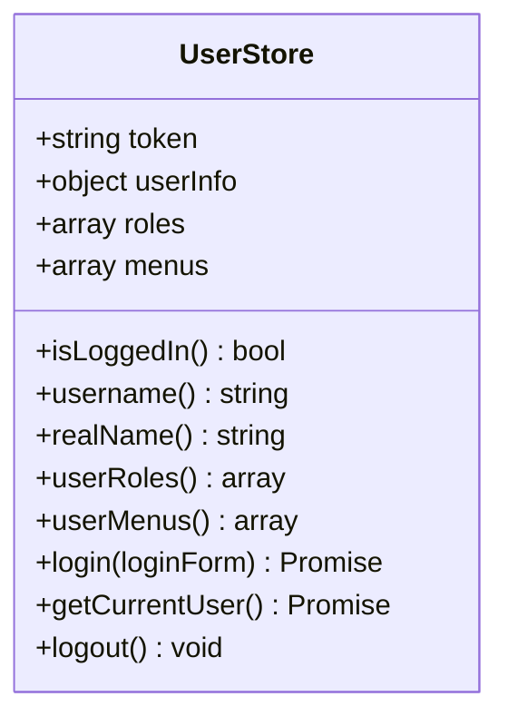
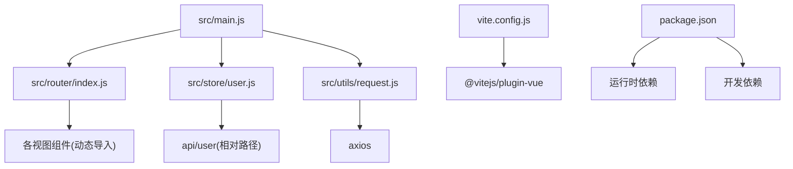

# 前端配置

<cite>
**本文引用的文件**
- [vite.config.js](file://drug-front/vite.config.js)
- [package.json](file://drug-front/package.json)
- [index.html](file://drug-front/index.html)
- [main.js](file://drug-front/src/main.js)
- [App.vue](file://drug-front/src/App.vue)
- [request.js](file://drug-front/src/utils/request.js)
- [router/index.js](file://drug-front/src/router/index.js)
- [store/user.js](file://drug-front/src/store/user.js)
</cite>

## 目录
1. [简介](#简介)
2. [项目结构](#项目结构)
3. [核心组件](#核心组件)
4. [架构总览](#架构总览)
5. [详细组件分析](#详细组件分析)
6. [依赖关系分析](#依赖关系分析)
7. [性能考虑](#性能考虑)
8. [故障排查指南](#故障排查指南)
9. [结论](#结论)
10. [附录](#附录)

## 简介
本文件面向Vue.js项目的前端配置与开发流程，围绕Vite构建工具与相关生态进行系统化说明。重点覆盖以下方面：
- Vite配置：开发服务器（端口、代理）、热更新、别名解析、插件体系
- 构建优化：打包输出、资源处理、压缩策略（按现有配置说明）
- 依赖管理：生产依赖与开发依赖、脚本命令
- 环境变量与环境区分：当前仓库未提供.env文件，给出通用实践建议
- 静态资源处理：图片、字体、CSS的加载与优化
- TypeScript、ESLint、Prettier：当前仓库未启用，提供可选集成建议
- 浏览器兼容性与Polyfill：当前仓库未配置，提供可选方案
- 开发与生产差异化策略：基于现有配置的对比与扩展建议
- 高级优化：构建性能、代码分割、懒加载
- 常见问题排查与解决方案

## 项目结构
前端项目位于 drug-front 目录，采用Vite作为构建工具，Vue 3 + Element Plus + Pinia + Vue Router 的主流组合。入口HTML为 index.html，应用挂载于 #app；应用主入口在 src/main.js 中初始化Vue实例、路由、状态管理与UI组件库。

图表来源
- [index.html:1-14](file://drug-front/index.html#L1-L14)
- [main.js:1-26](file://drug-front/src/main.js#L1-L26)
- [App.vue:1-24](file://drug-front/src/App.vue#L1-L24)
- [router/index.js:1-115](file://drug-front/src/router/index.js#L1-L115)
- [store/user.js:1-68](file://drug-front/src/store/user.js#L1-L68)
- [vite.config.js:1-22](file://drug-front/vite.config.js#L1-L22)

章节来源
- [index.html:1-14](file://drug-front/index.html#L1-L14)
- [main.js:1-26](file://drug-front/src/main.js#L1-L26)
- [vite.config.js:1-22](file://drug-front/vite.config.js#L1-L22)

## 核心组件
- Vite配置（vite.config.js）：定义插件、路径别名、开发服务器端口与代理
- 依赖与脚本（package.json）：声明运行时依赖、开发依赖与构建脚本
- 应用入口（src/main.js）：注册Element Plus、图标、路由、状态管理
- 路由与鉴权（src/router/index.js）：动态导入视图组件、路由守卫
- HTTP客户端（src/utils/request.js）：Axios实例、拦截器、统一错误处理
- 用户状态（src/store/user.js）：Token与用户信息持久化、登录/登出动作
- 根组件（src/App.vue）：全局样式与基础布局

章节来源
- [vite.config.js:1-22](file://drug-front/vite.config.js#L1-L22)
- [package.json:1-29](file://drug-front/package.json#L1-L29)
- [main.js:1-26](file://drug-front/src/main.js#L1-L26)
- [router/index.js:1-115](file://drug-front/src/router/index.js#L1-L115)
- [request.js:1-56](file://drug-front/src/utils/request.js#L1-L56)
- [store/user.js:1-68](file://drug-front/src/store/user.js#L1-L68)
- [App.vue:1-24](file://drug-front/src/App.vue#L1-L24)

## 架构总览
下图展示从浏览器到后端服务的请求链路，包括本地开发代理与HTTP拦截器的协作。

图表来源
- [vite.config.js:12-20](file://drug-front/vite.config.js#L12-L20)
- [request.js:6-9](file://drug-front/src/utils/request.js#L6-L9)

章节来源
- [vite.config.js:12-20](file://drug-front/vite.config.js#L12-L20)
- [request.js:6-9](file://drug-front/src/utils/request.js#L6-L9)

## 详细组件分析

### Vite配置分析（vite.config.js）
- 插件体系
  - 使用 @vitejs/plugin-vue 提供对单文件组件（SFC）的编译支持
- 路径别名
  - 将 @ 映射到 src 目录，便于模块导入与维护
- 开发服务器
  - 端口：3000
  - 代理：将 /api 前缀代理至 http://localhost:8081，并开启跨域
- 热更新
  - 默认启用，无需额外配置

图表来源
- [vite.config.js:5-21](file://drug-front/vite.config.js#L5-L21)

章节来源
- [vite.config.js:1-22](file://drug-front/vite.config.js#L1-L22)

### 依赖与脚本（package.json）
- 运行时依赖（生产环境）
  - Vue 3、Vue Router、Pinia、Element Plus、Axios、图标库、日期库、图表库
- 开发依赖（开发环境）
  - @vitejs/plugin-vue、Vite、Sass
- 脚本命令
  - dev：启动开发服务器
  - build：构建生产包
  - preview：预览生产包

图表来源
- [package.json:8-27](file://drug-front/package.json#L8-L27)

章节来源
- [package.json:1-29](file://drug-front/package.json#L1-L29)

### 应用入口与UI初始化（src/main.js）
- 初始化Vue应用、Pinia、路由
- 全量注册 Element Plus 图标
- 安装 Element Plus 并设置语言为简体中文
- 挂载应用到 #app

图表来源
- [main.js:1-26](file://drug-front/src/main.js#L1-L26)

章节来源
- [main.js:1-26](file://drug-front/src/main.js#L1-L26)

### 路由与鉴权（src/router/index.js）
- 动态导入视图组件，实现懒加载
- 路由守卫：根据登录状态控制访问与页面标题
- 子路由组织：仪表盘、药品、供应商、采购、库存、出入库、报表、系统管理等

图表来源
- [router/index.js:91-112](file://drug-front/src/router/index.js#L91-L112)

章节来源
- [router/index.js:1-115](file://drug-front/src/router/index.js#L1-L115)

### HTTP客户端与拦截器（src/utils/request.js）
- Axios实例：baseURL指向后端API前缀，超时时间设置
- 请求拦截：自动注入 Authorization 头（若存在token）
- 响应拦截：统一处理业务状态码、错误提示、401跳转登录
- 统一导出实例供各模块使用

图表来源
- [request.js:6-53](file://drug-front/src/utils/request.js#L6-L53)

章节来源
- [request.js:1-56](file://drug-front/src/utils/request.js#L1-L56)

### 用户状态管理（src/store/user.js）
- 状态：token、用户信息、角色、菜单
- Getters：登录态、用户名、真实姓名、角色列表、菜单列表
- Actions：登录（写入localStorage）、获取当前用户、登出（清理localStorage）

图表来源
- [store/user.js:4-67](file://drug-front/src/store/user.js#L4-L67)

章节来源
- [store/user.js:1-68](file://drug-front/src/store/user.js#L1-L68)

### 根组件与全局样式（src/App.vue）
- 全局重置样式与盒模型
- 设置默认字体族
- 根容器 #app 占满视口

章节来源
- [App.vue:1-24](file://drug-front/src/App.vue#L1-L24)

## 依赖关系分析
- 应用层依赖
  - main.js 依赖 router、store、Element Plus、icons
  - router/index.js 依赖 store/user.js 与各视图组件（动态导入）
  - utils/request.js 依赖 axios 与 Element Plus 消息提示
  - store/user.js 依赖 api/user（通过相对路径引入）
- 构建层依赖
  - vite.config.js 依赖 @vitejs/plugin-vue 与 Node 内置URL模块
  - package.json 定义运行时与开发时依赖及脚本

图表来源
- [main.js:1-26](file://drug-front/src/main.js#L1-L26)
- [router/index.js:1-115](file://drug-front/src/router/index.js#L1-L115)
- [store/user.js:1-68](file://drug-front/src/store/user.js#L1-L68)
- [request.js:1-56](file://drug-front/src/utils/request.js#L1-L56)
- [vite.config.js:1-22](file://drug-front/vite.config.js#L1-L22)
- [package.json:1-29](file://drug-front/package.json#L1-L29)

章节来源
- [main.js:1-26](file://drug-front/src/main.js#L1-L26)
- [router/index.js:1-115](file://drug-front/src/router/index.js#L1-L115)
- [store/user.js:1-68](file://drug-front/src/store/user.js#L1-L68)
- [request.js:1-56](file://drug-front/src/utils/request.js#L1-L56)
- [vite.config.js:1-22](file://drug-front/vite.config.js#L1-L22)
- [package.json:1-29](file://drug-front/package.json#L1-L29)

## 性能考虑
- 代码分割与懒加载
  - 路由层已采用动态导入实现按需加载，减少首屏体积
- 资源处理
  - 当前未配置资源处理策略（如资源内联阈值、哈希命名），可在生产构建中进一步细化
- 压缩策略
  - 当前未显式配置压缩器，Vite默认会启用压缩；如需更细粒度控制，可在配置中补充
- 缓存与CDN
  - 可结合外部CDN与浏览器缓存策略提升二次加载性能
- 分析与可视化
  - 可使用构建分析插件（如 rollup-plugin-visualizer）定位大体积模块

## 故障排查指南
- 代理不生效或跨域失败
  - 检查代理前缀与目标地址是否匹配，确认 changeOrigin 已启用
  - 确认后端服务端口与地址一致
- 端口冲突
  - 修改开发服务器端口以避免占用
- 路由懒加载报错
  - 确保动态导入语法正确且路径无误
- 登录后仍被重定向到登录页
  - 检查 localStorage 中 token 是否存在，以及路由守卫逻辑
- 请求失败或401
  - 查看响应拦截器对业务状态码的处理与消息提示
- 静态资源无法加载
  - 确认 public 目录下的静态资源路径与引用方式

章节来源
- [vite.config.js:12-20](file://drug-front/vite.config.js#L12-L20)
- [router/index.js:91-112](file://drug-front/src/router/index.js#L91-L112)
- [request.js:27-53](file://drug-front/src/utils/request.js#L27-L53)
- [store/user.js:55-67](file://drug-front/src/store/user.js#L55-L67)

## 结论
本项目采用简洁高效的Vite配置与现代前端技术栈，实现了良好的开发体验与模块化架构。建议在现有基础上逐步完善：
- 引入环境变量与多环境配置
- 增强静态资源处理与构建优化
- 加入TypeScript、ESLint、Prettier等工程化工具
- 补充浏览器兼容性与Polyfill策略
- 扩展构建分析与性能监控

## 附录

### 环境变量与环境区分（通用建议）
- 在项目根目录新增 .env 文件，按需定义开发与生产环境变量
- 使用 Vite 的环境变量前缀（VITE_）暴露给前端代码
- 不同环境使用不同 baseURL 与 API 前缀，便于切换

### 静态资源处理（通用建议）
- 图片与字体：合理设置内联阈值与输出目录，利用压缩与格式优化
- CSS：按需引入与分块，避免全局样式过大
- favicon：放置于 public 目录并确保引用路径正确

### TypeScript、ESLint、Prettier（可选）
- TypeScript：为TypeScript项目提供类型安全与更好的IDE体验
- ESLint：统一代码风格与潜在问题检测
- Prettier：自动化格式化，减少团队分歧

### 浏览器兼容性与Polyfill（可选）
- 使用 @vitejs/plugin-react-swc 或 @vitejs/plugin-babel
- 配置目标浏览器范围，按需注入Polyfill

### 开发与生产差异化配置
- 开发：启用严格模式、SourceMap、热更新、代理
- 生产：启用压缩、Tree Shaking、资源内联阈值、产物分析