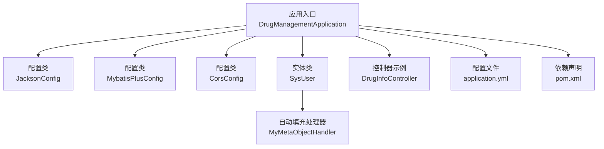
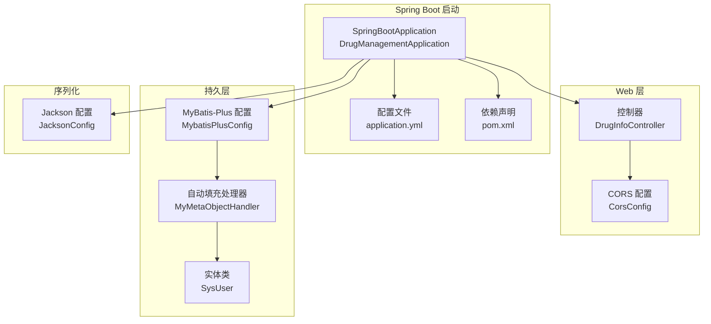
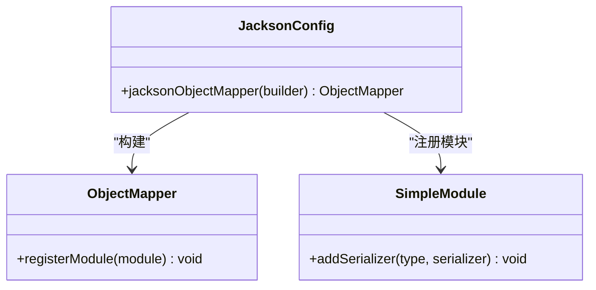
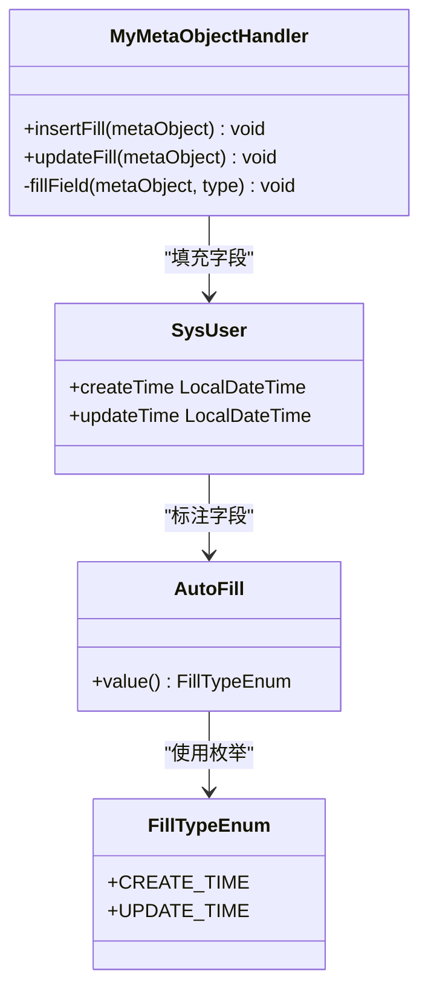
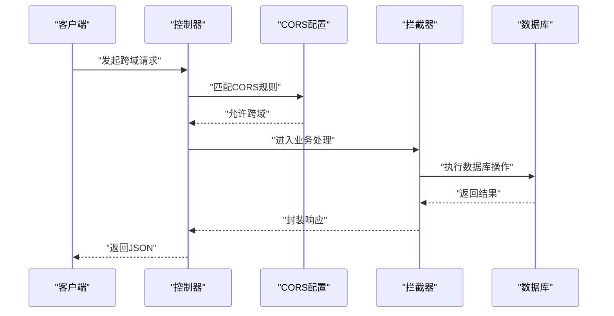
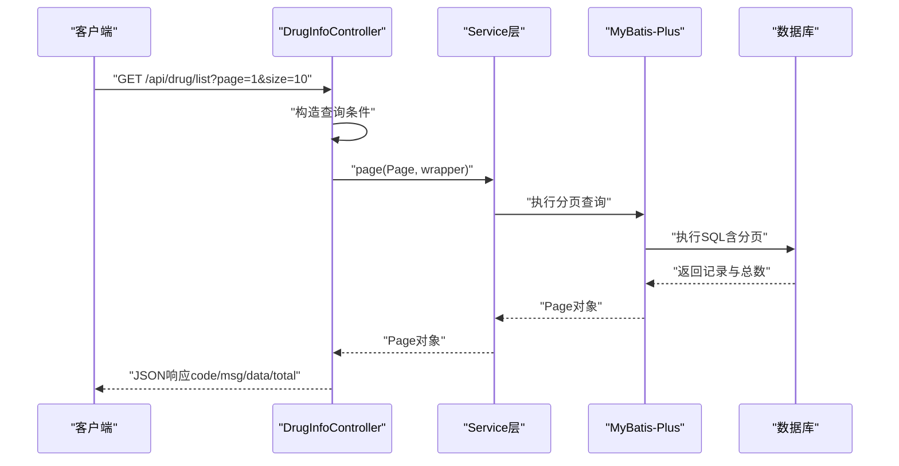
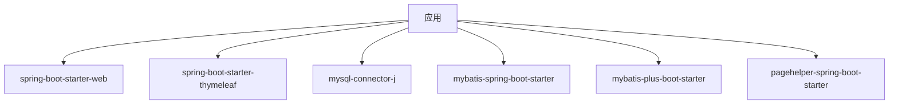

# 后端配置

<cite>
**本文引用的文件**
- [application.yml](file://src/main/resources/application.yml)
- [pom.xml](file://pom.xml)
- [DrugManagementApplication.java](file://src/main/java/com/hospital/drugmanagement/DrugManagementApplication.java)
- [JacksonConfig.java](file://src/main/java/com/hospital/drugmanagement/config/JacksonConfig.java)
- [MybatisPlusConfig.java](file://src/main/java/com/hospital/drugmanagement/config/MybatisPlusConfig.java)
- [CorsConfig.java](file://src/main/java/com/hospital/drugmanagement/config/CorsConfig.java)
- [MyMetaObjectHandler.java](file://src/main/java/com/hospital/drugmanagement/common/handler/MyMetaObjectHandler.java)
- [AutoFill.java](file://src/main/java/com/hospital/drugmanagement/common/anno/AutoFill.java)
- [FillTypeEnum.java](file://src/main/java/com/hospital/drugmanagement/common/constant/FillTypeEnum.java)
- [SysUser.java](file://src/main/java/com/hospital/drugmanagement/entity/SysUser.java)
- [DrugInfoController.java](file://src/main/java/com/hospital/drugmanagement/controller/DrugInfoController.java)
- [init.sql](file://src/main/resources/db/init.sql)
</cite>

## 目录
1. [简介](#简介)
2. [项目结构与配置入口](#项目结构与配置入口)
3. [核心配置项详解](#核心配置项详解)
4. [架构概览](#架构概览)
5. [组件详细分析](#组件详细分析)
6. [依赖关系分析](#依赖关系分析)
7. [性能与最佳实践](#性能与最佳实践)
8. [故障排查指南](#故障排查指南)
9. [结论](#结论)
10. [附录](#附录)

## 简介
本文件面向后端开发者与运维人员，系统性梳理该Spring Boot应用的配置体系，覆盖：
- application.yml中的数据源、服务器、Thymeleaf与MyBatis-Plus配置
- Spring Boot自动配置与自定义配置方法
- Jackson序列化配置（Long到String序列化策略）
- MyBatis-Plus配置（分页插件、字段自动填充）
- CORS跨域配置与安全考量
- 多环境配置文件组织与Profile切换
- 配置验证、配置审计与配置热更新的最佳实践

## 项目结构与配置入口
- 配置文件位于 resources 目录下的 application.yml
- 核心启动类位于 com.hospital.drugmanagement.DrugManagementApplication
- 配置类集中在 config 包，包括 Jackson、MyBatis-Plus、CORS
- 自动填充处理器位于 common.handler 包
- 实体类位于 entity 包，配合注解实现自动填充
- 控制器位于 controller 包，演示分页与CORS使用

图表来源
- [DrugManagementApplication.java:14-33](file://src/main/java/com/hospital/drugmanagement/DrugManagementApplication.java#L14-L33)
- [JacksonConfig.java:14-34](file://src/main/java/com/hospital/drugmanagement/config/JacksonConfig.java#L14-L34)
- [MybatisPlusConfig.java:8-16](file://src/main/java/com/hospital/drugmanagement/config/MybatisPlusConfig.java#L8-L16)
- [CorsConfig.java:7-19](file://src/main/java/com/hospital/drugmanagement/config/CorsConfig.java#L7-L19)
- [MyMetaObjectHandler.java:16-60](file://src/main/java/com/hospital/drugmanagement/common/handler/MyMetaObjectHandler.java#L16-L60)
- [SysUser.java:12-41](file://src/main/java/com/hospital/drugmanagement/entity/SysUser.java#L12-L41)
- [DrugInfoController.java:14-17](file://src/main/java/com/hospital/drugmanagement/controller/DrugInfoController.java#L14-L17)
- [application.yml:1-24](file://src/main/resources/application.yml#L1-L24)
- [pom.xml:32-84](file://pom.xml#L32-L84)

章节来源
- [DrugManagementApplication.java:14-33](file://src/main/java/com/hospital/drugmanagement/DrugManagementApplication.java#L14-L33)
- [application.yml:1-24](file://src/main/resources/application.yml#L1-L24)
- [pom.xml:32-84](file://pom.xml#L32-L84)

## 核心配置项详解
本节逐项解析 application.yml 中的关键配置及其作用。

- 数据源配置
  - 驱动类：com.mysql.cj.jdbc.Driver
  - 连接URL：包含时区与时序参数，确保与后端时区一致
  - 用户名与密码：用于数据库认证
  - 用途：为MyBatis-Plus与数据库交互提供连接池与连接信息

- 服务器配置
  - 端口：8081
  - 用途：对外提供REST API服务

- Thymeleaf配置
  - 关闭缓存：便于开发调试
  - 模板前缀与后缀：classpath:/templates/ 与 .html
  - 用途：若项目需要服务端渲染页面，可直接使用Thymeleaf模板

- MyBatis-Plus配置
  - 映射文件位置：classpath:mapper/*.xml
  - 实体包扫描：com.hospital.drugmanagement.entity
  - SQL日志输出：StdOutImpl，便于开发调试
  - 下划线转驼峰命名：开启，确保数据库字段与Java属性自动映射

章节来源
- [application.yml:1-24](file://src/main/resources/application.yml#L1-L24)

## 架构概览
下图展示配置与核心组件之间的关系，以及启动流程与请求处理链路。

图表来源
- [DrugManagementApplication.java:14-33](file://src/main/java/com/hospital/drugmanagement/DrugManagementApplication.java#L14-L33)
- [application.yml:1-24](file://src/main/resources/application.yml#L1-L24)
- [pom.xml:32-84](file://pom.xml#L32-L84)
- [CorsConfig.java:7-19](file://src/main/java/com/hospital/drugmanagement/config/CorsConfig.java#L7-L19)
- [MybatisPlusConfig.java:8-16](file://src/main/java/com/hospital/drugmanagement/config/MybatisPlusConfig.java#L8-L16)
- [MyMetaObjectHandler.java:16-60](file://src/main/java/com/hospital/drugmanagement/common/handler/MyMetaObjectHandler.java#L16-L60)
- [SysUser.java:12-41](file://src/main/java/com/hospital/drugmanagement/entity/SysUser.java#L12-L41)
- [JacksonConfig.java:14-34](file://src/main/java/com/hospital/drugmanagement/config/JacksonConfig.java#L14-L34)

## 组件详细分析

### Spring Boot自动配置与自定义配置
- 自动配置机制
  - @SpringBootApplication 启动类启用组件扫描与自动配置
  - MapperScan 扫描Mapper接口，使XML映射生效
  - ComponentScan 指定扫描包范围，确保配置类、控制器、服务被加载
  - Import 强制将特定Controller纳入Spring容器，保证接口可用

- 自定义配置
  - JacksonConfig：自定义ObjectMapper，将Long类型序列化为字符串，避免前端精度丢失
  - MybatisPlusConfig：注册分页拦截器，提供分页能力
  - CorsConfig：全局CORS配置，允许跨域访问

章节来源
- [DrugManagementApplication.java:14-33](file://src/main/java/com/hospital/drugmanagement/DrugManagementApplication.java#L14-L33)
- [JacksonConfig.java:14-34](file://src/main/java/com/hospital/drugmanagement/config/JacksonConfig.java#L14-L34)
- [MybatisPlusConfig.java:8-16](file://src/main/java/com/hospital/drugmanagement/config/MybatisPlusConfig.java#L8-L16)
- [CorsConfig.java:7-19](file://src/main/java/com/hospital/drugmanagement/config/CorsConfig.java#L7-L19)

### Jackson序列化配置（解决Long精度问题）
- 目标：将Long类型序列化为字符串，避免前端接收大整数时出现精度丢失
- 实现：通过自定义ObjectMapper，注册SimpleModule，对Long与long类型进行ToString序列化
- 影响范围：全局JSON响应，适用于所有控制器返回值

图表来源
- [JacksonConfig.java:14-34](file://src/main/java/com/hospital/drugmanagement/config/JacksonConfig.java#L14-L34)

章节来源
- [JacksonConfig.java:14-34](file://src/main/java/com/hospital/drugmanagement/config/JacksonConfig.java#L14-L34)

### MyBatis-Plus配置（分页、自动填充）
- 分页插件
  - 使用MybatisPlusInterceptor与PaginationInnerInterceptor实现分页
  - 在控制器中通过Page对象与Service层调用即可获得分页结果

- 字段自动填充
  - MyMetaObjectHandler 实现MetaObjectHandler接口
  - 通过注解 AutoFill 与枚举 FillTypeEnum 标记实体字段
  - 在插入与更新时自动填充创建时间与更新时间
  - 日志记录填充过程，便于审计与排错

图表来源
- [MyMetaObjectHandler.java:16-60](file://src/main/java/com/hospital/drugmanagement/common/handler/MyMetaObjectHandler.java#L16-L60)
- [AutoFill.java:12-15](file://src/main/java/com/hospital/drugmanagement/common/anno/AutoFill.java#L12-L15)
- [FillTypeEnum.java:6-9](file://src/main/java/com/hospital/drugmanagement/common/constant/FillTypeEnum.java#L6-L9)
- [SysUser.java:36-40](file://src/main/java/com/hospital/drugmanagement/entity/SysUser.java#L36-L40)

章节来源
- [MybatisPlusConfig.java:8-16](file://src/main/java/com/hospital/drugmanagement/config/MybatisPlusConfig.java#L8-L16)
- [MyMetaObjectHandler.java:16-60](file://src/main/java/com/hospital/drugmanagement/common/handler/MyMetaObjectHandler.java#L16-L60)
- [AutoFill.java:12-15](file://src/main/java/com/hospital/drugmanagement/common/anno/AutoFill.java#L12-L15)
- [FillTypeEnum.java:6-9](file://src/main/java/com/hospital/drugmanagement/common/constant/FillTypeEnum.java#L6-L9)
- [SysUser.java:36-40](file://src/main/java/com/hospital/drugmanagement/entity/SysUser.java#L36-L40)

### CORS跨域配置与安全考虑
- 配置内容
  - 允许路径：/**（全部路径）
  - 允许方法：GET、POST、PUT、DELETE
  - 允许头：*（全部头）
  - 凭据：false（不携带Cookie或Authorization）
  - 最大预检缓存时间：3600秒

- 安全建议
  - 生产环境应限制allowedOriginPatterns为可信域名
  - 如需携带凭据，应明确指定origin而非通配符
  - 结合后端鉴权与接口权限控制，避免仅依赖CORS

图表来源
- [CorsConfig.java:7-19](file://src/main/java/com/hospital/drugmanagement/config/CorsConfig.java#L7-L19)
- [DrugInfoController.java:14-17](file://src/main/java/com/hospital/drugmanagement/controller/DrugInfoController.java#L14-L17)

章节来源
- [CorsConfig.java:7-19](file://src/main/java/com/hospital/drugmanagement/config/CorsConfig.java#L7-L19)
- [DrugInfoController.java:14-17](file://src/main/java/com/hospital/drugmanagement/controller/DrugInfoController.java#L14-L17)

### 请求处理流程（以分页查询为例）

图表来源
- [DrugInfoController.java:22-58](file://src/main/java/com/hospital/drugmanagement/controller/DrugInfoController.java#L22-L58)
- [MybatisPlusConfig.java:8-16](file://src/main/java/com/hospital/drugmanagement/config/MybatisPlusConfig.java#L8-L16)

章节来源
- [DrugInfoController.java:22-58](file://src/main/java/com/hospital/drugmanagement/controller/DrugInfoController.java#L22-L58)
- [MybatisPlusConfig.java:8-16](file://src/main/java/com/hospital/drugmanagement/config/MybatisPlusConfig.java#L8-L16)

### 数据库初始化与实体映射
- 初始化脚本包含多个业务表，涵盖用户、角色、菜单、药品、供应商、仓库、出入库、盘点、审核等
- 实体类 SysUser 使用注解标记自动填充字段，结合MyMetaObjectHandler实现创建/更新时间自动写入
- application.yml中配置了实体包扫描与下划线转驼峰，确保数据库字段与实体属性映射正确

章节来源
- [init.sql:1-312](file://src/main/resources/db/init.sql#L1-L312)
- [SysUser.java:12-41](file://src/main/java/com/hospital/drugmanagement/entity/SysUser.java#L12-L41)
- [application.yml:18-24](file://src/main/resources/application.yml#L18-L24)

## 依赖关系分析
- 核心依赖
  - spring-boot-starter-web：提供Web功能
  - spring-boot-starter-thymeleaf：提供模板引擎支持
  - mysql-connector-j：MySQL驱动
  - mybatis-spring-boot-starter：MyBatis集成
  - mybatis-plus-boot-starter：MyBatis-Plus增强
  - pagehelper-spring-boot-starter：分页插件（与MyBatis-Plus拦截器共存时需注意优先级与冲突）

图表来源
- [pom.xml:32-84](file://pom.xml#L32-L84)

章节来源
- [pom.xml:32-84](file://pom.xml#L32-L84)

## 性能与最佳实践
- 配置验证
  - 启动时检查数据库连接URL、用户名、密码是否正确
  - 开发环境开启Thymeleaf缓存关闭，生产环境建议开启缓存
  - SQL日志仅在开发阶段开启，生产环境关闭以减少开销

- 配置审计
  - 记录关键配置变更（如数据库URL、CORS策略、分页大小）
  - 对自动填充字段进行日志审计，便于追踪数据变更

- 配置热更新
  - Spring Boot Actuator可提供动态刷新端点，但需谨慎使用
  - 对于敏感配置（数据库凭据、CORS策略），建议通过环境变量注入并在CI/CD中管理

- 性能优化
  - 合理设置分页大小，避免超大分页导致数据库压力
  - 对高频查询建立必要索引，参考初始化脚本中的索引设计

[本节为通用指导，无需具体文件引用]

## 故障排查指南
- 数据库连接失败
  - 检查连接URL、用户名、密码是否与数据库一致
  - 确认MySQL服务运行且网络可达

- SQL日志未输出
  - 确认application.yml中已启用SQL日志打印
  - 检查MyBatis-Plus配置是否正确加载

- 自动填充未生效
  - 确认实体类字段使用了AutoFill注解
  - 检查MyMetaObjectHandler是否被Spring容器管理
  - 查看日志中是否有自动填充相关记录

- CORS跨域异常
  - 检查allowedOriginPatterns是否为通配符或可信域名
  - 若需要携带凭据，需调整allowCredentials与allowedOrigins

章节来源
- [application.yml:1-24](file://src/main/resources/application.yml#L1-L24)
- [MyMetaObjectHandler.java:16-60](file://src/main/java/com/hospital/drugmanagement/common/handler/MyMetaObjectHandler.java#L16-L60)
- [CorsConfig.java:7-19](file://src/main/java/com/hospital/drugmanagement/config/CorsConfig.java#L7-L19)

## 结论
本项目通过清晰的配置文件与少量自定义配置类，实现了：
- 稳定的数据源与MyBatis-Plus集成
- 友好的开发体验（SQL日志、Thymeleaf缓存关闭）
- 良好的扩展性（分页插件、自动填充、CORS）
- 可审计与可维护的工程化实践

建议在生产环境中进一步完善：
- 使用环境变量替换敏感配置
- 明确CORS策略与凭据控制
- 引入Actuator与健康检查
- 建立配置变更审计与回滚机制

[本节为总结性内容，无需具体文件引用]

## 附录

### 不同环境配置文件组织与Profile切换
- 组织方式
  - application.yml 作为默认配置
  - application-dev.yml、application-prod.yml 等按环境拆分
- Profile切换
  - 通过spring.profiles.active指定当前环境
  - 或通过JVM参数 -Dspring.profiles.active=dev 设置
- 建议
  - 将数据库URL、密码、CORS策略放入各环境配置文件
  - 默认配置保留通用设置，避免重复

[本节为通用指导，无需具体文件引用]