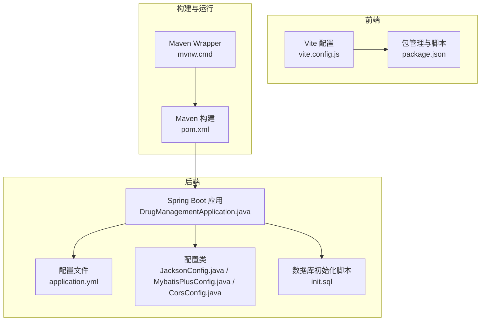
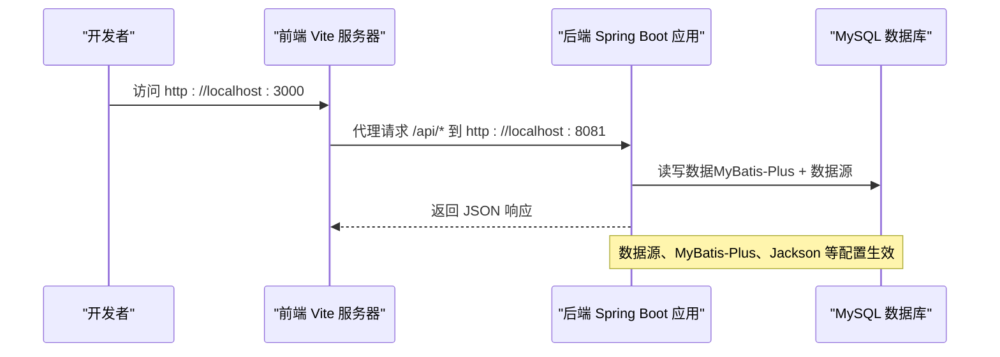
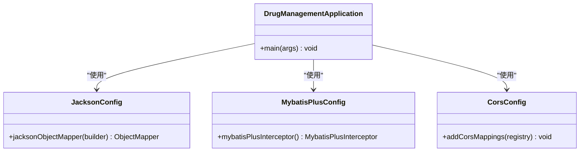

# 配置管理

<cite>
**本文引用的文件**
- [application.yml](file://src/main/resources/application.yml)
- [pom.xml](file://pom.xml)
- [DrugManagementApplication.java](file://src/main/java/com/hospital/drugmanagement/DrugManagementApplication.java)
- [JacksonConfig.java](file://src/main/java/com/hospital/drugmanagement/config/JacksonConfig.java)
- [MybatisPlusConfig.java](file://src/main/java/com/hospital/drugmanagement/config/MybatisPlusConfig.java)
- [CorsConfig.java](file://src/main/java/com/hospital/drugmanagement/config/CorsConfig.java)
- [vite.config.js](file://drug-front/vite.config.js)
- [package.json](file://drug-front/package.json)
- [init.sql](file://src/main/resources/db/init.sql)
- [mvnw.cmd](file://mvnw.cmd)
</cite>

## 目录
1. [简介](#简介)
2. [项目结构](#项目结构)
3. [核心组件](#核心组件)
4. [架构总览](#架构总览)
5. [详细组件分析](#详细组件分析)
6. [依赖分析](#依赖分析)
7. [性能考虑](#性能考虑)
8. [故障排除指南](#故障排除指南)
9. [结论](#结论)
10. [附录](#附录)

## 简介
本文件系统性梳理“医院药品管理系统”的配置管理方案，覆盖后端 Spring Boot 的 application.yml 配置、自动配置与扩展配置类、前端 Vite 开发与构建配置，以及环境隔离、外部化配置、安全与加密、配置验证与审计等高级主题。文档以仓库现有实现为基础，结合可落地的最佳实践，帮助开发者与运维人员高效理解与维护配置体系。

## 项目结构
项目采用前后端分离架构：
- 后端：Spring Boot 应用，位于 src/main/java 与 src/main/resources，核心配置集中在 application.yml。
- 前端：Vue 3 + Vite 应用，位于 drug-front，通过 Vite 进行开发与构建。
- 构建工具：Maven（pom.xml），支持 Java 17 与 Spring Boot 3.x 生态。

图表来源
- [DrugManagementApplication.java:1-33](file://src/main/java/com/hospital/drugmanagement/DrugManagementApplication.java#L1-L33)
- [application.yml:1-24](file://src/main/resources/application.yml#L1-L24)
- [JacksonConfig.java:1-34](file://src/main/java/com/hospital/drugmanagement/config/JacksonConfig.java#L1-L34)
- [MybatisPlusConfig.java:1-16](file://src/main/java/com/hospital/drugmanagement/config/MybatisPlusConfig.java#L1-L16)
- [CorsConfig.java:1-19](file://src/main/java/com/hospital/drugmanagement/config/CorsConfig.java#L1-L19)
- [vite.config.js:1-22](file://drug-front/vite.config.js#L1-L22)
- [package.json:1-29](file://drug-front/package.json#L1-L29)
- [pom.xml:1-119](file://pom.xml#L1-L119)
- [mvnw.cmd:1-28](file://mvnw.cmd#L1-L28)

章节来源
- [DrugManagementApplication.java:1-33](file://src/main/java/com/hospital/drugmanagement/DrugManagementApplication.java#L1-L33)
- [application.yml:1-24](file://src/main/resources/application.yml#L1-L24)
- [pom.xml:1-119](file://pom.xml#L1-L119)

## 核心组件
- 后端配置中心：application.yml 提供数据源、Thymeleaf、Server 端口、MyBatis-Plus 等基础配置。
- 自动配置与扩展：通过 @SpringBootApplication、@MapperScan、@ComponentScan 与 @Import 控制组件扫描与控制器注册；通过 JacksonConfig、MybatisPlusConfig、CorsConfig 扩展序列化、分页与跨域行为。
- 前端开发与构建：vite.config.js 提供开发服务器、代理、别名；package.json 定义脚本与依赖。
- 构建与运行：pom.xml 管理依赖与插件；mvnw.cmd 提供 Maven Wrapper。

章节来源
- [application.yml:1-24](file://src/main/resources/application.yml#L1-L24)
- [JacksonConfig.java:1-34](file://src/main/java/com/hospital/drugmanagement/config/JacksonConfig.java#L1-L34)
- [MybatisPlusConfig.java:1-16](file://src/main/java/com/hospital/drugmanagement/config/MybatisPlusConfig.java#L1-L16)
- [CorsConfig.java:1-19](file://src/main/java/com/hospital/drugmanagement/config/CorsConfig.java#L1-L19)
- [vite.config.js:1-22](file://drug-front/vite.config.js#L1-L22)
- [package.json:1-29](file://drug-front/package.json#L1-L29)
- [pom.xml:1-119](file://pom.xml#L1-L119)
- [mvnw.cmd:1-28](file://mvnw.cmd#L1-L28)

## 架构总览
后端通过 Spring Boot 自动装配加载配置，结合自定义配置类扩展功能；前端通过 Vite 在本地开发时代理到后端服务，构建时产出静态资源。

图表来源
- [vite.config.js:12-20](file://drug-front/vite.config.js#L12-L20)
- [application.yml:3-24](file://src/main/resources/application.yml#L3-L24)
- [MybatisPlusConfig.java:10-15](file://src/main/java/com/hospital/drugmanagement/config/MybatisPlusConfig.java#L10-L15)
- [JacksonConfig.java:17-32](file://src/main/java/com/hospital/drugmanagement/config/JacksonConfig.java#L17-L32)

## 详细组件分析

### 后端配置文件 application.yml
- 数据源配置
  - 驱动类名、JDBC URL、用户名、密码。当前示例指向本地 MySQL，默认库名为 hospital_drug。
- Thymeleaf 配置
  - 关闭模板缓存，便于开发调试；指定模板目录与后缀。
- 服务器端口
  - 设置后端服务监听端口。
- MyBatis-Plus 配置
  - Mapper XML 位置、实体包扫描、SQL 日志输出、下划线转驼峰映射。

章节来源
- [application.yml:1-24](file://src/main/resources/application.yml#L1-L24)

### Spring Boot 自动配置与扩展
- 自动配置
  - @SpringBootApplication 启用自动配置与组件扫描；@MapperScan 指定 Mapper 接口扫描路径；@ComponentScan 指定控制器、服务、配置包扫描范围。
  - @Import 强制将特定 Controller 注册进 Spring 容器，确保接口可用。
- 扩展配置类
  - JacksonConfig：将 Long 类型序列化为字符串，避免前端大整数精度丢失。
  - MybatisPlusConfig：注册分页拦截器，启用 MyBatis-Plus 分页能力。
  - CorsConfig：统一跨域策略，允许任意来源与常用方法与头。

章节来源
- [DrugManagementApplication.java:14-24](file://src/main/java/com/hospital/drugmanagement/DrugManagementApplication.java#L14-L24)
- [JacksonConfig.java:10-34](file://src/main/java/com/hospital/drugmanagement/config/JacksonConfig.java#L10-L34)
- [MybatisPlusConfig.java:8-16](file://src/main/java/com/hospital/drugmanagement/config/MybatisPlusConfig.java#L8-L16)
- [CorsConfig.java:7-18](file://src/main/java/com/hospital/drugmanagement/config/CorsConfig.java#L7-L18)

### 前端构建配置
- Vite 开发服务器
  - 端口：3000
  - 代理：将 /api 前缀转发至后端 8081 端口，解决开发阶段跨域问题。
  - 别名：@ 指向 src 目录，提升导入便捷性。
- 构建与脚本
  - dev/build/preview 脚本由 package.json 定义，配合 Vite 使用。
- 依赖
  - Vue 3、路由、状态管理、UI 组件库、HTTP 客户端等。

章节来源
- [vite.config.js:5-21](file://drug-front/vite.config.js#L5-L21)
- [package.json:8-27](file://drug-front/package.json#L8-L27)

### 数据库初始化与连接
- 初始化脚本
  - 创建数据库 hospital_drug 并建立多张业务表（用户、角色、菜单、药品、供应商、仓库、库存、订单、出入库、盘点、审核等），并插入示例数据。
- 连接配置
  - application.yml 中的 JDBC URL、用户名、密码与驱动类名需与本地数据库一致。

章节来源
- [init.sql:1-312](file://src/main/resources/db/init.sql#L1-L312)
- [application.yml:3-7](file://src/main/resources/application.yml#L3-L7)

### 构建与运行
- Maven 依赖
  - Web、Thymeleaf、MySQL 驱动、MyBatis-Plus、PageHelper、测试、Lombok 等。
- 编译与打包
  - Java 17、Spring Boot Maven 插件、Lombok 注解处理器。
- 运行方式
  - 使用 Maven Wrapper（mvnw.cmd）执行构建与启动流程。

章节来源
- [pom.xml:32-84](file://pom.xml#L32-L84)
- [pom.xml:86-116](file://pom.xml#L86-L116)
- [mvnw.cmd:1-28](file://mvnw.cmd#L1-L28)

## 依赖分析
后端配置类之间的依赖关系如下：

图表来源
- [JacksonConfig.java:14-34](file://src/main/java/com/hospital/drugmanagement/config/JacksonConfig.java#L14-L34)
- [MybatisPlusConfig.java:8-16](file://src/main/java/com/hospital/drugmanagement/config/MybatisPlusConfig.java#L8-L16)
- [CorsConfig.java:7-18](file://src/main/java/com/hospital/drugmanagement/config/CorsConfig.java#L7-L18)
- [DrugManagementApplication.java:14-24](file://src/main/java/com/hospital/drugmanagement/DrugManagementApplication.java#L14-L24)

章节来源
- [JacksonConfig.java:1-34](file://src/main/java/com/hospital/drugmanagement/config/JacksonConfig.java#L1-L34)
- [MybatisPlusConfig.java:1-16](file://src/main/java/com/hospital/drugmanagement/config/MybatisPlusConfig.java#L1-L16)
- [CorsConfig.java:1-19](file://src/main/java/com/hospital/drugmanagement/config/CorsConfig.java#L1-L19)
- [DrugManagementApplication.java:1-33](file://src/main/java/com/hospital/drugmanagement/DrugManagementApplication.java#L1-L33)

## 性能考虑
- MyBatis-Plus 分页
  - 通过分页拦截器启用分页查询，避免一次性加载大量数据导致内存压力。
- SQL 输出与调试
  - 开发阶段打印 SQL 有助于定位慢查询，但生产环境建议关闭以减少日志开销。
- 前端代理与静态资源
  - 开发时使用 Vite 代理减少跨域影响；构建产物交由 Nginx/CDN 提供静态资源，降低后端压力。
- 序列化优化
  - Long 转字符串避免前端精度问题，同时保持 JSON 轻量化。

章节来源
- [MybatisPlusConfig.java:10-15](file://src/main/java/com/hospital/drugmanagement/config/MybatisPlusConfig.java#L10-L15)
- [application.yml:22-23](file://src/main/resources/application.yml#L22-L23)
- [vite.config.js:12-20](file://drug-front/vite.config.js#L12-L20)
- [JacksonConfig.java:24-26](file://src/main/java/com/hospital/drugmanagement/config/JacksonConfig.java#L24-L26)

## 故障排除指南
- 启动失败（端口占用）
  - 检查 application.yml 的 server.port 与 vite.config.js 的 dev.server.port 是否被占用。
- 数据库连接失败
  - 核对 application.yml 中的 JDBC URL、用户名、密码与驱动类名；确认数据库已创建且初始化脚本执行成功。
- 前端无法访问后端接口
  - 确认 vite.config.js 的代理配置是否指向正确的后端地址与端口；检查后端 CORS 配置是否允许前端来源。
- 分页不生效
  - 确认 MyBatis-Plus 分页拦截器已注册；查询参数是否符合分页规范。
- JSON 大整数精度异常
  - 确认 JacksonConfig 已生效；Long 字段序列化为字符串。
- 开发环境与生产环境差异
  - 建议使用 Spring Profile 或外部化配置文件区分环境；生产环境关闭 SQL 输出与模板缓存。

章节来源
- [application.yml:14-24](file://src/main/resources/application.yml#L14-L24)
- [vite.config.js:12-20](file://drug-front/vite.config.js#L12-L20)
- [MybatisPlusConfig.java:10-15](file://src/main/java/com/hospital/drugmanagement/config/MybatisPlusConfig.java#L10-L15)
- [JacksonConfig.java:17-32](file://src/main/java/com/hospital/drugmanagement/config/JacksonConfig.java#L17-L32)
- [CorsConfig.java:10-16](file://src/main/java/com/hospital/drugmanagement/config/CorsConfig.java#L10-L16)

## 结论
本项目的配置管理以 Spring Boot 自动配置为核心，辅以后端配置类与前端 Vite 配置，形成清晰、可维护的开发与部署基线。建议在生产环境中进一步完善外部化配置、Profile 环境隔离、配置加密与审计能力，并持续优化日志与序列化策略以提升稳定性与性能。

## 附录

### 环境隔离与 Profile 配置建议
- 使用 Spring Profile 区分开发、测试、生产环境，分别对应 application-dev.yml、application-test.yml、application-prod.yml。
- 通过 spring.profiles.active 激活目标环境。
- 将敏感信息移出仓库，使用环境变量或配置中心注入。

### 外部化配置与加密
- 外部化配置：将数据库密码、第三方密钥等放入操作系统环境变量或外部配置文件。
- 配置加密：生产环境建议启用 Spring Cloud Config 加密或使用 Vault/KMS 管理密钥。

### 配置验证与审计
- 启动时校验关键配置项是否存在且格式正确。
- 对敏感字段进行脱敏输出；记录配置变更日志，支持回滚与审计。

### 配置热更新与灰度
- 对非敏感配置（如日志级别、开关类参数）可通过 Actuator 或配置中心实现热更新。
- 灰度发布前先在测试环境验证，再逐步扩大范围。