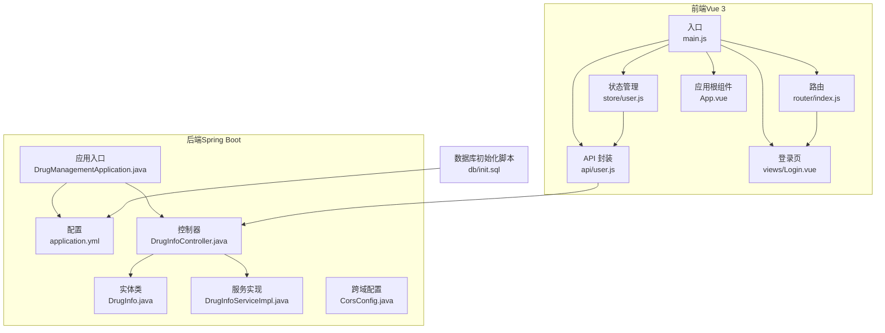
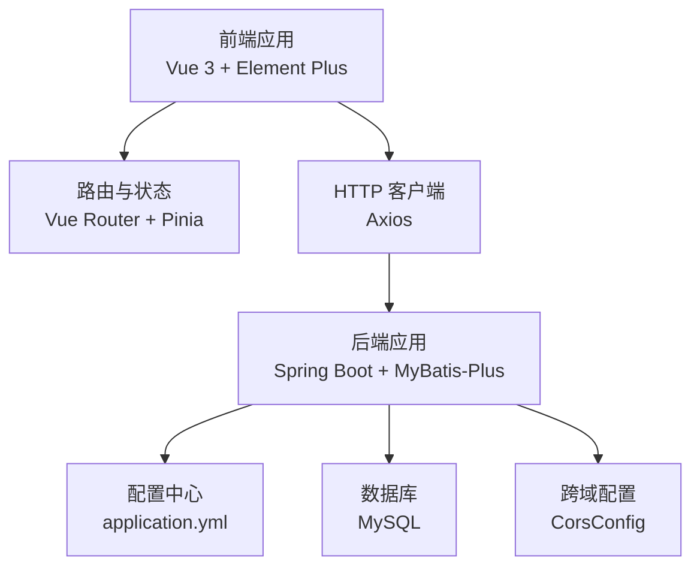
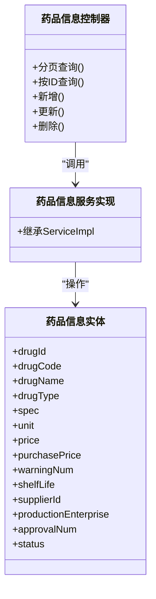
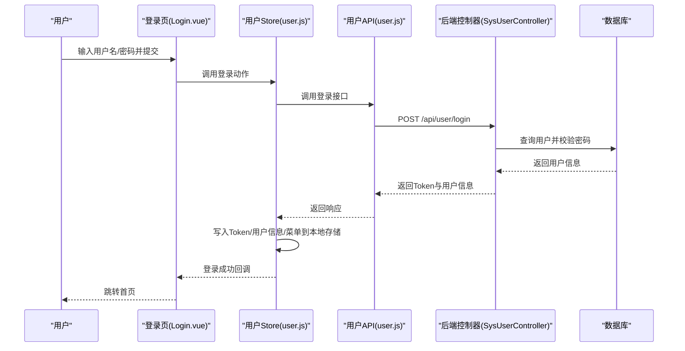
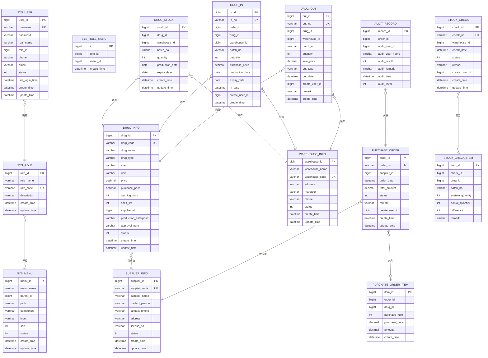
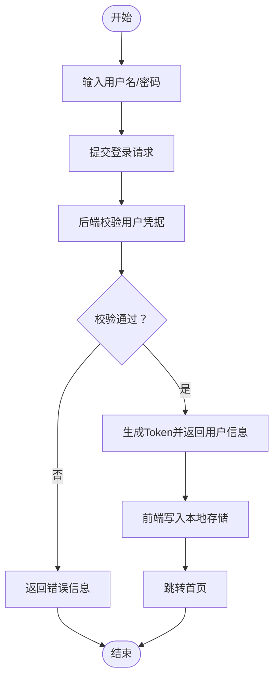
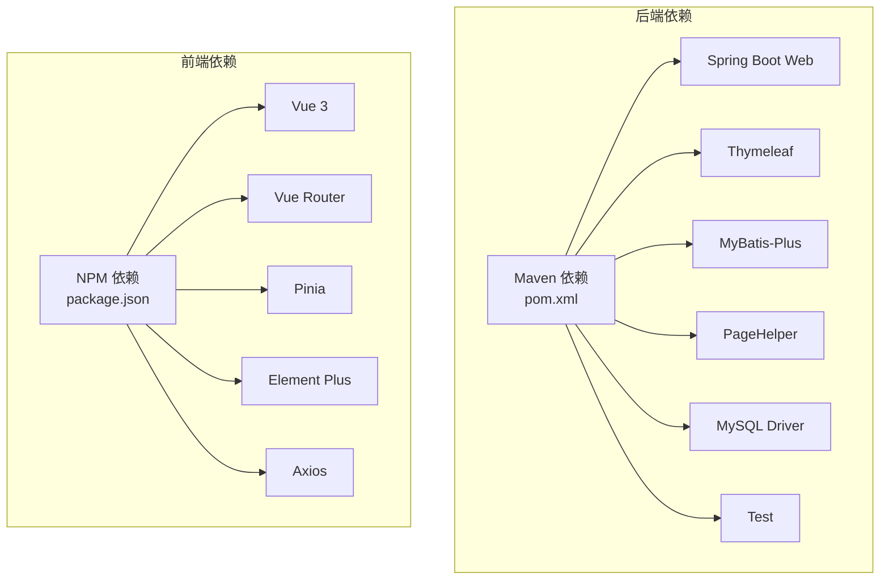

# 项目概述

<cite>
**本文引用的文件**
- [application.yml](file://src/main/resources/application.yml)
- [pom.xml](file://pom.xml)
- [DrugManagementApplication.java](file://src/main/java/com/hospital/drugmanagement/DrugManagementApplication.java)
- [package.json](file://drug-front/package.json)
- [init.sql](file://src/main/resources/db/init.sql)
- [DrugInfoController.java](file://src/main/java/com/hospital/drugmanagement/controller/DrugInfoController.java)
- [DrugInfo.java](file://src/main/java/com/hospital/drugmanagement/entity/DrugInfo.java)
- [index.js（路由）](file://drug-front/src/router/index.js)
- [main.js（前端入口）](file://drug-front/src/main.js)
- [user.js（用户API）](file://drug-front/src/api/user.js)
- [user.js（用户Pinia Store）](file://drug-front/src/store/user.js)
- [Login.vue](file://drug-front/src/views/Login.vue)
- [App.vue](file://drug-front/src/App.vue)
- [CorsConfig.java](file://src/main/java/com/hospital/drugmanagement/config/CorsConfig.java)
- [DrugInfoServiceImpl.java](file://src/main/java/com/hospital/drugmanagement/service/impl/DrugInfoServiceImpl.java)
- [vite.config.js](file://drug-front/vite.config.js)
- [LOGIN_SETUP_README.md](file://LOGIN_SETUP_README.md)
</cite>

## 目录
1. [简介](#简介)
2. [项目结构](#项目结构)
3. [核心组件](#核心组件)
4. [架构总览](#架构总览)
5. [详细组件分析](#详细组件分析)
6. [依赖分析](#依赖分析)
7. [性能考虑](#性能考虑)
8. [故障排查指南](#故障排查指南)
9. [结论](#结论)
10. [附录](#附录)

## 简介
本项目为“医院药品管理系统”，旨在满足医院在药品采购、库存管理、出入库操作、供应商管理与用户权限控制等方面的日常业务需求。系统采用前后端分离架构，后端基于 Spring Boot + MyBatis-Plus，前端采用 Vue 3 + Element Plus，提供统一的登录认证、菜单权限与数据交互能力。项目通过标准化的数据模型与清晰的业务模块划分，帮助医院实现药品全生命周期的数字化管理。

## 项目结构
项目采用典型的多模块结构：后端以 Spring Boot 应用为核心，包含控制器、服务、持久层与配置；前端以 Vue 3 应用为核心，包含路由、状态管理、API 封装与视图组件。数据库初始化脚本与 Maven 构建配置分别位于资源目录与根目录。

图表来源
- [DrugManagementApplication.java:1-33](file://src/main/java/com/hospital/drugmanagement/DrugManagementApplication.java#L1-L33)
- [application.yml:1-24](file://src/main/resources/application.yml#L1-L24)
- [DrugInfoController.java:1-169](file://src/main/java/com/hospital/drugmanagement/controller/DrugInfoController.java#L1-L169)
- [DrugInfo.java:1-167](file://src/main/java/com/hospital/drugmanagement/entity/DrugInfo.java#L1-L167)
- [DrugInfoServiceImpl.java:1-18](file://src/main/java/com/hospital/drugmanagement/service/impl/DrugInfoServiceImpl.java#L1-L18)
- [main.js（前端入口）:1-26](file://drug-front/src/main.js#L1-L26)
- [index.js（路由）:1-115](file://drug-front/src/router/index.js#L1-L115)
- [user.js（用户Pinia Store）:1-68](file://drug-front/src/store/user.js#L1-L68)
- [user.js（用户API）:1-71](file://drug-front/src/api/user.js#L1-L71)
- [Login.vue:1-127](file://drug-front/src/views/Login.vue#L1-L127)
- [App.vue:1-24](file://drug-front/src/App.vue#L1-L24)
- [CorsConfig.java:1-19](file://src/main/java/com/hospital/drugmanagement/config/CorsConfig.java#L1-L19)
- [init.sql:1-312](file://src/main/resources/db/init.sql#L1-L312)

章节来源
- [pom.xml:1-119](file://pom.xml#L1-L119)
- [package.json:1-29](file://drug-front/package.json#L1-L29)
- [vite.config.js:1-22](file://drug-front/vite.config.js#L1-L22)

## 核心组件
- 后端应用入口与配置
  - 应用入口负责启动 Spring Boot，并显式导入部分控制器以确保被纳入容器管理。
  - 数据源、MyBatis-Plus、Thymeleaf 与服务器端口均在配置文件中集中定义。
- 控制器与服务
  - 控制器层提供 RESTful 接口，封装分页查询、条件过滤、增删改查等通用逻辑。
  - 服务层基于 MyBatis-Plus 的 ServiceImpl，复用基础 CRUD 能力，便于扩展自定义业务。
- 前端应用与路由
  - 前端通过 Vue Router 进行页面导航，结合 Pinia 管理用户状态与菜单权限。
  - 通过 Axios 封装 API，统一处理登录、用户信息获取与列表查询等场景。
- 数据库初始化
  - 提供完整的表结构与初始化数据，覆盖用户、角色、菜单、药品、供应商、仓库、库存、采购、出入库、盘点与审核记录等核心业务表。

章节来源
- [DrugManagementApplication.java:14-33](file://src/main/java/com/hospital/drugmanagement/DrugManagementApplication.java#L14-L33)
- [application.yml:1-24](file://src/main/resources/application.yml#L1-L24)
- [DrugInfoController.java:14-169](file://src/main/java/com/hospital/drugmanagement/controller/DrugInfoController.java#L14-L169)
- [DrugInfoServiceImpl.java:1-18](file://src/main/java/com/hospital/drugmanagement/service/impl/DrugInfoServiceImpl.java#L1-L18)
- [index.js（路由）:1-115](file://drug-front/src/router/index.js#L1-L115)
- [user.js（用户Pinia Store）:1-68](file://drug-front/src/store/user.js#L1-L68)
- [user.js（用户API）:1-71](file://drug-front/src/api/user.js#L1-L71)
- [init.sql:1-312](file://src/main/resources/db/init.sql#L1-L312)

## 架构总览
系统采用前后端分离架构，后端提供 RESTful API，前端通过代理转发请求至后端。登录认证采用简单 Token 机制（演示用途），跨域通过全局配置开放。数据库采用 MySQL，ORM 使用 MyBatis-Plus，前端使用 Vue 3 生态与 Element Plus 组件库。

图表来源
- [main.js（前端入口）:1-26](file://drug-front/src/main.js#L1-L26)
- [index.js（路由）:1-115](file://drug-front/src/router/index.js#L1-L115)
- [user.js（用户API）:1-71](file://drug-front/src/api/user.js#L1-L71)
- [DrugManagementApplication.java:14-33](file://src/main/java/com/hospital/drugmanagement/DrugManagementApplication.java#L14-L33)
- [application.yml:1-24](file://src/main/resources/application.yml#L1-L24)
- [CorsConfig.java:1-19](file://src/main/java/com/hospital/drugmanagement/config/CorsConfig.java#L1-L19)

## 详细组件分析

### 后端应用与配置
- 应用入口
  - 启动类启用组件扫描与 Mapper 扫描，并通过 @Import 显式导入控制器，保证控制器被 Spring 容器管理。
- 配置文件
  - 数据源指向本地 MySQL，MyBatis-Plus 开启下划线转驼峰映射，打印 SQL 便于调试。
- 跨域配置
  - 允许任意来源、方法与头，关闭凭据，设置最大预检请求时间。

章节来源
- [DrugManagementApplication.java:14-33](file://src/main/java/com/hospital/drugmanagement/DrugManagementApplication.java#L14-L33)
- [application.yml:1-24](file://src/main/resources/application.yml#L1-L24)
- [CorsConfig.java:1-19](file://src/main/java/com/hospital/drugmanagement/config/CorsConfig.java#L1-L19)

### 药品信息模块（控制器与实体）
- 控制器职责
  - 提供分页查询、按名称/编码/类型过滤、新增、更新、删除等接口。
  - 在新增与更新时执行重复性校验（编码与名称唯一性），并返回统一结构的响应。
- 实体类映射
  - 实体类通过注解映射到数据库表字段，包含价格、采购价、预警值、保质期、供应商等关键属性。
- 服务实现
  - 基于 MyBatis-Plus 的 ServiceImpl，继承常用 CRUD 能力，便于后续扩展复杂业务。

图表来源
- [DrugInfoController.java:14-169](file://src/main/java/com/hospital/drugmanagement/controller/DrugInfoController.java#L14-L169)
- [DrugInfo.java:9-167](file://src/main/java/com/hospital/drugmanagement/entity/DrugInfo.java#L9-L167)
- [DrugInfoServiceImpl.java:1-18](file://src/main/java/com/hospital/drugmanagement/service/impl/DrugInfoServiceImpl.java#L1-L18)

章节来源
- [DrugInfoController.java:14-169](file://src/main/java/com/hospital/drugmanagement/controller/DrugInfoController.java#L14-L169)
- [DrugInfo.java:9-167](file://src/main/java/com/hospital/drugmanagement/entity/DrugInfo.java#L9-L167)
- [DrugInfoServiceImpl.java:1-18](file://src/main/java/com/hospital/drugmanagement/service/impl/DrugInfoServiceImpl.java#L1-L18)

### 前端应用与登录流程
- 应用入口
  - 注册 Element Plus、路由与状态管理，挂载根组件。
- 路由与菜单
  - 定义各业务模块路由，包含首页、药品管理、供应商管理、采购管理、库存管理、出入库管理、报表统计、用户管理与角色管理。
- 登录与状态管理
  - 登录页提供表单校验，提交后调用用户 API 获取 Token 与用户信息，写入 Pinia 与本地存储。
  - 路由守卫根据登录状态决定放行或跳转登录页。
- API 封装
  - 对用户相关接口进行封装，支持登录、获取当前用户信息、列表查询等。

图表来源
- [Login.vue:74-92](file://drug-front/src/views/Login.vue#L74-L92)
- [user.js（用户Pinia Store）:20-38](file://drug-front/src/store/user.js#L20-L38)
- [user.js（用户API）:55-62](file://drug-front/src/api/user.js#L55-L62)
- [index.js（路由）:91-112](file://drug-front/src/router/index.js#L91-L112)

章节来源
- [main.js（前端入口）:1-26](file://drug-front/src/main.js#L1-L26)
- [index.js（路由）:1-115](file://drug-front/src/router/index.js#L1-L115)
- [user.js（用户Pinia Store）:1-68](file://drug-front/src/store/user.js#L1-L68)
- [user.js（用户API）:1-71](file://drug-front/src/api/user.js#L1-L71)
- [Login.vue:1-127](file://drug-front/src/views/Login.vue#L1-L127)

### 数据模型概览
系统围绕用户、角色、菜单、药品、供应商、仓库、库存、采购、出入库、盘点与审核记录构建核心数据模型，支撑完整的业务闭环。

图表来源
- [init.sql:8-312](file://src/main/resources/db/init.sql#L8-L312)

章节来源
- [init.sql:1-312](file://src/main/resources/db/init.sql#L1-L312)

### 登录与权限控制流程
- 登录接口
  - 前端调用后端登录接口，后端校验用户凭据并返回 Token 与用户信息。
- 权限与菜单
  - 登录成功后，前端将用户角色与菜单写入本地存储，路由守卫根据登录状态与菜单权限控制页面访问。
- Token 机制
  - 当前实现为演示用途，建议在生产环境升级为 JWT 方案。

图表来源
- [LOGIN_SETUP_README.md:30-72](file://LOGIN_SETUP_README.md#L30-L72)
- [user.js（用户Pinia Store）:20-38](file://drug-front/src/store/user.js#L20-L38)
- [index.js（路由）:91-112](file://drug-front/src/router/index.js#L91-L112)

章节来源
- [LOGIN_SETUP_README.md:1-240](file://LOGIN_SETUP_README.md#L1-L240)
- [user.js（用户Pinia Store）:1-68](file://drug-front/src/store/user.js#L1-L68)
- [index.js（路由）:1-115](file://drug-front/src/router/index.js#L1-L115)

## 依赖分析
- 后端依赖
  - Spring Boot Web、Thymeleaf、MySQL 驱动、MyBatis-Plus、分页插件与测试依赖。
- 前端依赖
  - Vue 3、Vue Router、Pinia、Element Plus、Axios、图标库与开发工具。
- 构建与打包
  - Maven 插件配置 Java 版本与注解处理器，前端通过 Vite 构建与开发。

图表来源
- [pom.xml:32-84](file://pom.xml#L32-L84)
- [package.json:13-22](file://drug-front/package.json#L13-L22)

章节来源
- [pom.xml:1-119](file://pom.xml#L1-L119)
- [package.json:1-29](file://drug-front/package.json#L1-L29)

## 性能考虑
- 数据访问层
  - MyBatis-Plus 提供高效的基础 CRUD 能力，结合分页插件可有效控制大数据量查询的性能。
- 前端交互
  - 使用 Pinia 管理轻量级状态，减少不必要的组件重渲染；Element Plus 组件按需加载可降低首屏体积。
- 数据库设计
  - 关键字段建立索引（如药品、供应商、仓库、出入库等），有助于提升查询效率。
- 配置优化
  - 开启下划线转驼峰映射与 SQL 日志输出，便于开发阶段定位性能瓶颈。

## 故障排查指南
- 登录失败
  - 检查数据库中用户密码是否为加密值；确认后端服务已启动且端口正确；检查前端代理是否指向后端端口。
- 跨域问题
  - 确认后端跨域配置已生效；检查浏览器控制台是否存在 CORS 错误。
- 数据库连接失败
  - 确认 MySQL 服务已启动；检查数据源配置与数据库是否存在。
- 前端无法访问接口
  - 检查 Vite 代理配置与后端端口一致性；确认网络连通性。

章节来源
- [LOGIN_SETUP_README.md:181-197](file://LOGIN_SETUP_README.md#L181-L197)
- [CorsConfig.java:1-19](file://src/main/java/com/hospital/drugmanagement/config/CorsConfig.java#L1-L19)
- [vite.config.js:12-21](file://drug-front/vite.config.js#L12-L21)

## 结论
本项目以“实用、清晰、可扩展”为目标，通过前后端分离与标准的分层架构，实现了医院药品管理的核心业务闭环。后端基于 Spring Boot + MyBatis-Plus，具备良好的扩展性；前端采用 Vue 3 + Element Plus，提供友好的交互体验。建议在生产环境中进一步完善认证授权（JWT）、密码加密策略与监控告警体系，持续提升系统的安全性与稳定性。

## 附录
- 业务价值
  - 提升药品管理效率，降低人工成本与差错率；实现采购、库存、出入库与盘点的全流程数字化；为管理层提供报表与统计分析能力。
- 目标用户
  - 医院药剂科、采购部门、仓储管理人员与系统管理员。
- 差异化特点
  - 模块化设计便于按需扩展；统一的登录与权限体系；完善的初始化脚本与示例数据，降低部署与上手成本。