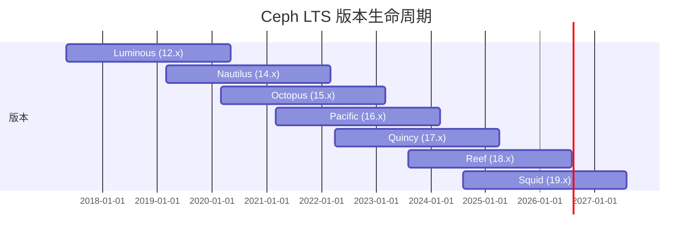

# Ceph 知识体系

> Ceph 是一个分布式存储系统，提供对象存储、块存储和文件存储三大接口。

***

## 目录

1. [Ceph 概述](#1-ceph-概述)
2. [Ceph 架构](#2-ceph-架构)
3. [核心组件](#3-核心组件)
4. [CRUSH 算法](#4-crush-算法)
5. [RADOS](#5-rados)
6. [存储接口](#6-存储接口)
7. [Pool 与 PG](#7-pool-与-pg)
8. [数据读写流程](#8-数据读写流程)
9. [数据均衡与恢复](#9-数据均衡与恢复)
10. [部署方式](#10-部署方式)
11. [运维管理](#11-运维管理)
12. [性能调优](#12-性能调优)
13. [监控与告警](#13-监控与告警)
14. [常见故障处理](#14-常见故障处理)
15. [Ceph 版本演进](#15-ceph-版本演进)

***

## 1. Ceph 概述

### 1.1 什么是 Ceph

Ceph 是一个**统一分布式存储系统**，设计目标为：

- **高性能**：无中心节点，数据分布均衡，支持并行读写
- **高可用**：数据多副本（或纠删码），自动故障检测与恢复
- **可扩展**：水平扩展至数千节点，EB 级容量
- **统一存储**：同时提供块、文件、对象三种接口

### 1.2 设计哲学

| 理念    | 说明           |
| ----- | ------------ |
| 去中心化  | 无单点瓶颈，所有节点对等 |
| 软件定义  | 运行于通用硬件之上    |
| 自愈自管理 | 自动数据均衡、故障恢复  |
| 强一致性  | 分布式环境下保证数据一致 |

***

## 2. Ceph 架构

### 2.1 层次架构

```
+------------------------------------------------------+
|                      客户端                           |
|  RBD (块)    |   CephFS (文件)   |   RGW (对象)      |
+---------------------------+--------------------------+
|          librados         |     S3/Swift API         |
+---------------------------+--------------------------+
|                       RADOS                          |
|          (Reliable Autonomic Distributed Object       |
|                     Store)                            |
+------------------------------------------------------+
|   MON  |   OSD  |   MGR  |   MDS  |   RGW            |
+------------------------------------------------------+
|                    物理硬件层                          |
+------------------------------------------------------+
```

### 2.2 数据流架构

```
客户端请求
    │
    ▼
┌─────────────┐
│  librados    │  → 计算 CRUSH 映射 → 直接访问 OSD
└──────┬──────┘
       │
       ▼
┌─────────────┐     ┌─────────────┐     ┌─────────────┐
│   OSD-1     │     │   OSD-2     │     │   OSD-3     │
│  (主副本)    │────▶│  (从副本1)   │────▶│  (从副本2)   │
└─────────────┘     └─────────────┘     └─────────────┘
```

***

## 3. 核心组件

### 3.1 MON (Monitor)

**功能**：

- 维护集群的 **Cluster Map**（OSD Map、PG Map、CRUSH Map、MGR Map、MON Map）
- 提供**一致性**保证（基于 Paxos 协议）
- 管理认证（cephx 协议）

**部署建议**：

- 奇数个（3 或 5），至少 3 个
- 低延迟网络，独立节点或与 MGR 混布

### 3.2 OSD (Object Storage Daemon)

**功能**：

- 存储实际数据（对象）
- 处理数据复制、恢复、重均衡
- 向 MON 上报状态

**数据目录结构**：

```
/var/lib/ceph/osd/ceph-{id}/
├── current/         # 当前数据
├── journal/         # 日志（BlueStore 下为 internal）
├── fsid             # OSD 唯一标识
├── keyring          # 认证密钥
├── type             # 存储引擎类型
├── whoami           # OSD ID
└── block            # BlueStore 块设备
```

### 3.3 MGR (Manager)

**功能**（从 Luminous 版本引入）：

- 收集集群统计信息（`ceph df`、`ceph status`）
- 提供 RESTful API（`ceph mgr services`）
- 运行插件模块（Dashboard、Prometheus、Zabbix 等）

**常见 MGR 模块**：

| 模块             | 用途                |
| -------------- | ----------------- |
| dashboard      | Web 管理界面          |
| prometheus     | Prometheus 监控指标导出 |
| balancer       | PG 自动均衡           |
| status         | 集群状态概览            |
| pg\_autoscaler | PG 数量自动调整         |
| k8sevents      | 事件导出到 Kubernetes  |
| alerts         | 告警通知              |

### 3.4 MDS (Metadata Server)

**功能**：

- 管理 CephFS 的**元数据**（目录结构、文件权限）
- 缓存元数据以提升性能
- 支持多活（Active/Standby 模式）
- 不存储文件数据本身

**部署建议**：

- 至少 2 个（1 主 1 备）
- 大文件场景：1-2 个 MDS 足够
- 小文件场景：可根据负载增加

### 3.5 RGW (RADOS Gateway)

**功能**：

- 提供 **S3 和 Swift 兼容**的对象存储接口
- 支持多租户、桶策略、生命周期管理
- 可选存储元数据到 OSD 或外部数据库

**架构**：

```
S3/Swift Client
      │
      ▼
┌──────────┐       ┌──────────┐
│  RGW-1    │       │  RGW-2    │  无状态，可水平扩展
└─────┬────┘       └─────┬────┘
      │                  │
      └────────┬─────────┘
               ▼
        ┌──────────┐
        │  RADOS    │
        └──────────┘
```

***

## 4. CRUSH 算法

### 4.1 概述

**CRUSH**（Controlled Replication Under Scalable Hashing）是 Ceph 的核心算法，用于确定数据存储位置。

### 4.2 工作原理

```
数据对象 → 对象名 hash → PG ID → CRUSH(PG, CRUSH Map) → OSD 列表
```

- **不需要查表**：客户端直接计算数据位置
- **确定性**：相同输入永远得到相同输出
- **可控性**：通过 CRUSH Map 控制数据分布

### 4.3 CRUSH Map 结构

```
┌─────────────────────┐
│     CRUSH Map        │
├─────────────────────┤
│  1. 设备列表 (Device) │  → 物理 OSD
│  2. 桶层级 (Bucket)  │  → host/rack/row/room/datacenter/root
│  3. 规则 (Rule)      │  → 数据分布策略
└─────────────────────┘
```

### 4.4 桶层级示例

```
root=default (root)
├── datacenter=dc1
│   ├── room=room1
│   │   ├── rack=rack1
│   │   │   ├── host=node1  →  osd.0, osd.1
│   │   │   └── host=node2  →  osd.2, osd.3
│   │   └── rack=rack2
│   │       ├── host=node3  →  osd.4, osd.5
│   │       └── host=node4  →  osd.6, osd.7
│   └── room=room2 ...
└── datacenter=dc2 ...
```

### 4.5 CRUSH 规则类型

| 规则类型       | 说明                           | 适用场景 |
| ---------- | ---------------------------- | ---- |
| replicated | 副本模式，选择多个 OSD 存储副本           | 副本池  |
| erasure    | 纠删码模式                        | EC 池 |
| indep      | 与 replicated 类似，但失败时重新选择独立路径 | 多副本  |

### 4.6 CRUSH 故障域

```
故障域粒度            容灾级别
────────────────────────────────
osd       → 单盘故障
host      → 整机故障
rack      → 整柜故障
row       → 整排故障
room      → 机房模块故障
datacenter → 数据中心故障
```

***

## 5. RADOS

### 5.1 什么是 RADOS

**RADOS**（Reliable Autonomic Distributed Object Store）是 Ceph 的底层存储引擎，Ceph 的所有存储功能都构建于 RADOS 之上。

### 5.2 核心特性

| 特性   | 说明                                         |
| ---- | ------------------------------------------ |
| 对象存储 | 每个对象有 OID + 数据 + 属性（xattr）+ key/value 扩展属性 |
| 自动复制 | 可配置副本数（默认 3）                               |
| 故障检测 | OSD 心跳 + MON 监控                            |
| 自愈恢复 | 自动修复不一致副本                                  |
| 强一致性 | 主副本串行化写操作                                  |

### 5.3 对象结构

```
┌─────────────────────────────┐
│        Object               │
├─────────────────────────────┤
│  OID: 对象唯一标识            │
│  Data: 对象数据              │
│  xattr: 扩展属性              │
│  OMAP: 键值对元数据           │
└─────────────────────────────┘
```

***

## 6. 存储接口

### 6.1 RBD (RADOS Block Device)

**特点**：

- 提供**块存储**（可挂载为磁盘）
- 支持精简配置（thin provisioning）
- 支持快照、克隆、COW
- 支持在线扩容

**常见命令**：

```bash
# 创建 RBD 镜像
rbd create --pool rbd --size 100G myimage

# 映射为块设备
rbd map rbd/myimage

# 查看已映射设备
rbd showmapped

# 创建快照
rbd snap create rbd/myimage@snap1

# 从快照克隆
rbd clone rbd/myimage@snap1 rbd/myclone

# 在线扩容
rbd resize --pool rbd --image myimage --size 200G
```

**应用场景**：OpenStack Nova/Cinder、KVM 虚拟机磁盘、容器持久化存储

### 6.2 CephFS

**特点**：

- 符合 POSIX 标准的**文件系统**
- MDS 管理元数据
- 支持内核态和 FUSE 挂载
- 支持多活 MDS
- 支持快照（从 Quincy 起默认启用）

**挂载方式**：

```bash
# 内核驱动挂载
mount -t ceph 192.168.1.1:6789:/ /mnt/cephfs -o name=admin,secret=xxx

# FUSE 挂载
ceph-fuse -m 192.168.1.1:6789 /mnt/cephfs
```

**应用场景**：共享文件存储、HPC 环境、大数据存储

### 6.3 RGW (RADOS Gateway)

**特点**：

- **S3 兼容**（AWS S3 API）
- **Swift 兼容**（OpenStack Swift API）
- 支持桶策略、生命周期、版本管理
- 支持多站点同步

**S3 API 示例**：

```bash
# 创建桶
aws s3api create-bucket --bucket mybucket --endpoint http://rgw:7480

# 上传对象
aws s3 cp myfile.txt s3://mybucket/ --endpoint http://rgw:7480

# 下载对象
aws s3 cp s3://mybucket/myfile.txt . --endpoint http://rgw:7480
```

**应用场景**：备份归档、混合云存储、媒体存储、静态网站托管

### 6.4 三种存储对比

| 特性       | RBD            | CephFS            | RGW       |
| -------- | -------------- | ----------------- | --------- |
| 访问方式     | 块设备            | 文件系统              | HTTP(S)   |
| 协议       | kernel/ librbd | NFS/ FUSE/ kernel | S3/ Swift |
| 最适场景     | 虚拟化            | 共享文件              | 对象存储      |
| 元数据性能    | N/A            | 高（MDS 缓存）         | 中         |
| POSIX 兼容 | 否（上层格式化）       | 是                 | 否         |
| 多站点      | 镜像同步           | 快照同步              | 多站点同步     |
| 典型延迟     | 微秒级            | 毫秒级               | 毫秒级       |

***

## 7. Pool 与 PG

### 7.1 Pool（存储池）

**Pool** 是数据存储的逻辑分区。

**核心属性**：

| 属性                     | 说明        | 示例值                           |
| ---------------------- | --------- | ----------------------------- |
| size                   | 副本数       | 3                             |
| min\_size              | 最小可用副本数   | 2                             |
| pg\_num                | PG 数量     | 128                           |
| pgp\_num               | 实际分布 PG 数 | 128                           |
| crush\_rule            | CRUSH 规则  | replicated\_rule              |
| compression\_algorithm | 压缩算法      | lz4/snappy/zstd               |
| compression\_mode      | 压缩模式      | none/passive/aggressive/force |

### 7.2 PG（Placement Group）

**PG** 是 OSD 之间数据管理和迁移的基本单位。

**PG 与 Pool/OSD 关系**：

```
Pool 1
├── PG 1.0 → [osd.1, osd.4, osd.7]
├── PG 1.1 → [osd.2, osd.5, osd.8]
├── PG 1.2 → [osd.3, osd.6, osd.9]
├── ...
└── PG 1.N → [osd.x, osd.y, osd.z]
```

**PG 状态机**：

```
creating → peering → active+clean
               │
         ┌─────┴─────┐
         ▼           ▼
     degraded     stale
         │           │
         └─────┬─────┘
               ▼
          recovering
               │
               ▼
          backfilling
               │
               ▼
         active+clean
```

**常见 PG 状态**：

| 状态              | 含义                |
| --------------- | ----------------- |
| active+clean    | 正常工作              |
| active+degraded | 副本数不足             |
| peering         | PG 正在协商           |
| stale           | MON 长时间未收到 OSD 状态 |
| backfilling     | 数据正在回填            |
| recovering      | 数据正在恢复            |
| incomplete      | PG 信息不完整          |
| down            | PG 无法服务           |
| undersized      | 副本数未达到 pool size  |

### 7.3 PG 数量规划

**PG 总数推荐公式**：

```
PG 总数 = (OSD 总数 × 100) / 副本数
```

**示例**：

| OSD 数量 | 副本数 | 推荐 PG 总数 | 每个 Pool 的 PG  |
| ------ | --- | -------- | ------------- |
| 10     | 3   | \~333    | 设置为 256 或 512 |
| 50     | 3   | \~1666   | 设置为 2048      |
| 100    | 3   | \~3333   | 设置为 4096      |
| 200    | 3   | \~6666   | 设置为 8192      |

**警告**：

- PG 过少 → 数据分布不均匀
- PG 过多 → OSD 内存占用高（每个 PG 约 1-2 KB）

***

## 8. 数据读写流程

### 8.1 写流程 (三副本)

```
1. Client 计算 CRUSH(PG) → 得到主 OSD
2. Client 发送写请求到 主 OSD
3. 主 OSD 并行写请求到 从 OSD 1, 从 OSD 2
4. 从 OSD 回复 ACK 给主 OSD
5. 主 OSD 回复 Client 写入完成
```

```
Client
  │
  │ ① 写请求
  ▼
┌──────────┐
│  主 OSD   │
│          │────▶ 从 OSD 1 (② 并行写)
│          │────▶ 从 OSD 2 (② 并行写)
│          │◀──── ACK (③)
│          │◀──── ACK (③)
└─────┬────┘
      │ ④ 回复 Client
      ▼
    Client (写入完成)
```

### 8.2 读流程

```
1. Client 计算 CRUSH(PG) → 得到主 OSD（也可配置从 OSD 读）
2. Client 发送读请求到主 OSD
3. 主 OSD 返回数据
```

### 8.3 写入确认模式

| 模式           | 说明                  | 延迟 | 可靠性 |
| ------------ | ------------------- | -- | --- |
| write        | 所有 OSD 写入成功即返回      | 高  | 最高  |
| write\_ahead | 主 OSD journal 写入即返回 | 中  | 中高  |
| write\_back  | 主 OSD 内存写入即返回       | 低  | 低   |

***

## 9. 数据均衡与恢复

### 9.1 自动均衡

**触发条件**：

- 新 OSD 加入集群
- OSD 故障离线
- OSD 权重调整
- CRUSH Map 变更

**均衡过程**：

```
发现数据不均衡
      │
      ▼
  MON 触发重新均衡
      │
      ▼
  PG 迁移（逐 PG 迁移，可控制速率）
      │
      ▼
  Active+Clean（均衡完成）
```

### 9.2 恢复流程

```
OSD 故障
  │
  ├── 短期故障（< 300s）→ 等待 OSD 恢复
  │
  └── 长期故障
        │
        ▼
   标记为 down
        │
        ▼
   触发 Peering（PG 间协商最新版本）
        │
        ▼
   数据 Recovery（同步缺失数据）
        │
        ▼
   Backfill（完全重建 PG 数据）
        │
        ▼
   Active+Clean
```

### 9.3 相关参数

| 参数                            | 作用                     | 默认值  |
| ----------------------------- | ---------------------- | ---- |
| osd\_recovery\_max\_active    | 每个 OSD 最大并发恢复 PG       | 3    |
| osd\_recovery\_op\_priority   | 恢复操作优先级                | 3    |
| osd\_recovery\_max\_chunk     | 每次恢复最大数据量              | 8MB  |
| osd\_max\_backfills           | 每个 OSD 最大回填数           | 1    |
| mon\_osd\_down\_out\_interval | OSD 标记为 down-out 的等待时间 | 300s |

***

## 10. 部署方式

### 10.1 cephadm（推荐）

**特点**：

- Ceph 官方推荐部署工具（从 Octopus 起）
- 基于容器化部署（Podman/Docker）
- 支持 SSH 管理集群
- 支持服务编排和升级

```bash
# 安装 cephadm
curl --silent --remote-name https://download.ceph.com/rpm/{version}/cephadm
chmod +x cephadm

# 部署新集群
cephadm bootstrap --mon-ip <ip>

# 添加主机
ceph orch host add <hostname> <ip>

# 添加 OSD
ceph orch apply osd --all-available-devices

# 部署 MDS
ceph orch apply mds <fs_name> --placement="3"

# 部署 RGW
ceph orch apply rgw <realm_name> --placement="3"
```

### 10.2 Rook（Kubernetes 部署）

**特点**：

- Ceph Operator for Kubernetes
- 与 K8s 深度集成
- 自动管理存储节点

```yaml
# CephCluster 示例
apiVersion: ceph.rook.io/v1
kind: CephCluster
metadata:
  name: rook-ceph
spec:
  cephVersion:
    image: quay.io/ceph/ceph:v18.2.0
  dataDirHostPath: /var/lib/rook
  mon:
    count: 3
  storage:
    useAllNodes: true
    useAllDevices: true
```

### 10.3 ceph-ansible（传统部署，已逐步弃用）

**特点**：

- 基于 Ansible 自动化部署
- 适用 Reef 及更早版本
- 非容器化部署

### 10.4 部署方式对比

| 方式           | 启动速度 | 管理难度 | 容器化 | 推荐场景  |
| ------------ | ---- | ---- | --- | ----- |
| cephadm      | 快    | 低    | 是   | 生产首选  |
| Rook         | 中    | 中    | 是   | 容器云环境 |
| ceph-ansible | 慢    | 高    | 否   | 旧版本升级 |

***

## 11. 运维管理

### 11.1 集群管理命令

```bash
# 查看集群状态
ceph status
ceph -s

# 查看集群健康
ceph health
ceph health detail

# 查看 OSD 状态
ceph osd stat
ceph osd tree
ceph osd df

# 查看 MON 状态
ceph mon stat
ceph quorum_status

# 查看 MGR 状态
ceph mgr stat
ceph mgr services

# 查看 MDS 状态
ceph mds stat

# 查看存储池
ceph osd pool ls detail
ceph df
ceph df detail

# 查看 PG
ceph pg stat
ceph pg dump
ceph pg dump_stuck [stuck|inactive|unclean]
```

### 11.2 OSD 管理

```bash
# 停止 OSD（不触发重新均衡）
ceph osd set noout
systemctl stop ceph-osd@<id>

# 销毁 OSD
ceph osd destroy <id> --yes-i-really-mean-it

# 移除 OSD
ceph osd out <id>
ceph osd purge <id> --yes-i-really-mean-it

# 替换 OSD（保留 ID）
ceph osd reweight <id> <weight>

# 添加 OSD（cephadm）
ceph orch daemon add osd <hostname>:<device_path>

# OSD 状态管理
ceph osd pause           # 暂停 OSD
ceph osd unpause         # 恢复 OSD
ceph osd set noout       # 禁止 OSD 自动标记 out
ceph osd set norecover   # 禁止数据恢复
ceph osd set nobackfill  # 禁止数据回填
ceph osd set norebalance # 禁止数据均衡
ceph osd unset <flag>    # 取消标记
```

### 11.3 Pool 管理

```bash
# 创建 Pool
ceph osd pool create <pool_name> <pg_num> [pgp_num] [replicated|erasure]

# 设置 Pool 副本数
ceph osd pool set <pool_name> size <n>

# 设置最小副本数
ceph osd pool set <pool_name> min_size <n>

# 设置 PG 数量
ceph osd pool set <pool_name> pg_num <n>
ceph osd pool set <pool_name> pgp_num <n>

# 设置配额
ceph osd pool set-quota <pool_name> max_objects <n>
ceph osd pool set-quota <pool_name> max_bytes <n>

# 删除 Pool
ceph osd pool delete <pool_name> <pool_name> --yes-i-really-really-mean-it

# 重命名 Pool
ceph osd pool rename <old_name> <new_name>

# 应用 RBD 应用类型
ceph osd pool application enable <pool_name> rbd
ceph osd pool application enable <pool_name> cephfs
ceph osd pool application enable <pool_name> rgw
```

### 11.4 认证管理

```bash
# 列出用户
ceph auth list

# 创建用户
ceph auth get-or-create client.<name> mon 'allow r' osd 'allow rw pool=<pool_name>'

# 导出密钥
ceph auth export client.admin

# 修改权限
ceph auth caps client.<name> mon 'allow *' osd 'allow *'

# 删除用户
ceph auth rm client.<name>
```

### 11.5 集群扩缩容

```bash
# 添加 OSD
## cephadm 方式
ceph orch apply osd --all-available-devices

## 手动添加 OSD（不推荐）
ceph-volume lvm create --data /dev/sdb

# 移除 OSD
ceph osd out <osd_id>
ceph osd purge <osd_id> --yes-i-really-mean-it

# 增加 MON
ceph orch apply mon <host1,host2,host3>

# 移除 MON
ceph mon remove <name>
```

***

## 12. 性能调优

### 12.1 硬件选型

| 组件     | 推荐配置                              |
| ------ | --------------------------------- |
| CPU    | 至少 8 核，OSD 密集场景建议 16-32 核         |
| 内存     | 每个 OSD 建议 4-8GB，MON 建议 16GB+      |
| 网络     | 10GbE 起步，25/100GbE 生产推荐           |
| OSD 盘  | NVMe > SSD > HDD（建议 SSD 做 WAL/DB） |
| DB/WAL | NVMe 盘（BlueStore）                 |
| 网络拓扑   | 前后端分离（public/cluster network）     |

### 12.2 BlueStore 调优

```ini
# /etc/ceph/ceph.conf
[osd]
# BlueStore 缓存大小（默认 1GB）
bluestore_cache_size = 4G
bluestore_cache_size_hdd = 1G
bluestore_cache_size_ssd = 4G

# 使用 nvme 作为 WAL/DB 设备
bluestore_block_db_size = 1073741824    # 1GB
bluestore_block_wal_size = 536870912    # 512MB

# 压缩（经济型存储）
bluestore_compression_algorithm = lz4
bluestore_compression_mode = aggressive
```

### 12.3 网络优化

```ini
# 前后端分离
public_network = 10.0.0.0/24          # 客户端网络
cluster_network = 10.0.1.0/24         # OSD 复制网络

# TCP 参数优化
ms_bind_ipv6 = false
ms_type = async+posix
```

### 12.4 OSD 调度参数

```ini
# 恢复限速
osd_recovery_max_active = 3
osd_recovery_max_chunk = 8388608          # 8MB
osd_recovery_op_priority = 3
osd_recovery_sleep = 0

# Scrubbing
osd_scrub_begin_hour = 0
osd_scrub_end_hour = 6
osd_max_scrubs = 1

# 客户端超时
client_timeout = 300
```

### 12.5 内核参数优化

```bash
# sysctl 推荐配置
net.core.rmem_default = 262144
net.core.wmem_default = 262144
net.core.rmem_max = 16777216
net.core.wmem_max = 16777216
net.ipv4.tcp_rmem = 4096 87380 16777216
net.ipv4.tcp_wmem = 4096 65536 16777216
net.ipv4.tcp_congestion_control = bbr

# 文件系统
vm.dirty_ratio = 20
vm.dirty_background_ratio = 5
vm.vfs_cache_pressure = 200
```

### 12.6 性能测试

```bash
# rados bench 测试
rados bench -p <pool_name> 60 write --no-cleanup
rados bench -p <pool_name> 60 seq
rados bench -p <pool_name> 60 rand

# 清理测试数据
rados -p <pool_name> cleanup

# RBD 性能测试（需要先创建 RBD 设备）
rbd create --pool rbd --size 10G testimage
rbd map rbd/testimage

# fio 测试
fio --filename=/dev/rbd0 --direct=1 --rw=randrw --bs=4k --size=1G \
    --numjobs=16 --runtime=60 --group_reporting --name=test

# RGW 性能测试（cosbench 或 s3-bench）
```

***

## 13. 监控与告警

### 13.1 Ceph Dashboard

**启用方式**（cephadm 默认启用）：

```bash
ceph mgr module enable dashboard
ceph dashboard set-login-credentials admin <password>

# 访问地址
# https://<mgr-host>:8443
```

**功能**：

- 集群健康概览
- OSD/MON/MDS/RGW 状态
- PG 分布
- 性能图表（IOPS、吞吐量、延迟）
- 告警管理

### 13.2 Prometheus + Grafana

**启用 Prometheus 模块**：

```bash
ceph mgr module enable prometheus

# 默认暴露指标地址
# http://<mgr-host>:9283/metrics
```

**关键监控指标**：

| 指标                            | 含义       | 阈值                 |
| ----------------------------- | -------- | ------------------ |
| ceph\_osd\_op\_latency        | OSD 操作延迟 | < 100ms            |
| ceph\_pg\_state               | PG 状态分布  | active+clean > 99% |
| ceph\_osd\_used\_bytes        | OSD 使用容量 | < 85%              |
| ceph\_cluster\_total\_bytes   | 集群总容量    | -                  |
| ceph\_daemon\_health\_metrics | 守护进程健康   | 0 为健康              |

**Grafana 推荐面板**：

- Ceph - Cluster Overview
- Ceph - OSD Performance
- Ceph - Pool Detail

### 13.3 告警规则

```yaml
# Prometheus Alert 规则示例
groups:
  - name: ceph
    rules:
      - alert: CephOSDDown
        expr: ceph_osd_up == 0
        for: 5m
        labels:
          severity: critical
        annotations:
          summary: "OSD {{ $labels.osd }} 已宕机 5 分钟"

      - alert: CephPGDown
        expr: ceph_pg_state{state="down"} > 0
        for: 1m
        labels:
          severity: critical

      - alert: CephOSDHighUsage
        expr: ceph_osd_used_bytes / ceph_osd_total_bytes > 0.85
        for: 10m
        labels:
          severity: warning
```

### 13.4 日志管理

```bash
# 日志位置
/var/log/ceph/
├── ceph-mon.<hostname>.log
├── ceph-osd.<id>.log
├── ceph-mgr.<hostname>.log
├── ceph-mds.<hostname>.log
└── ceph-volume.log

# 实时查看日志
journalctl -u ceph-osd@<id> -f
journalctl -u ceph-mon@<hostname> -f

# 设置日志级别（运行时调整）
ceph daemon osd.<id> config set debug_osd 10
ceph daemon osd.<id> config set debug_ms 10

# 持久化配置
ceph config set osd debug_osd 1/5
ceph config set osd debug_ms 1/5
```

***

## 14. 常见故障处理

### 14.1 集群健康检查

```bash
# 健康检查
ceph health detail

# 检查慢请求
ceph osd perf
ceph daemon osd.<id> ops

# 检查 PG 问题
ceph pg dump_stuck stale
ceph pg dump_stuck inactive
ceph pg dump_stuck unclean
```

### 14.2 OSD 故障处理

**场景 1：OSD down，可恢复**

```bash
# 确认状态
ceph osd tree | grep down

# 尝试启动
systemctl start ceph-osd@<id>

# 检查日志
journalctl -u ceph-osd@<id> -n 100
```

**场景 2：OSD down，磁盘损坏**

```bash
# 阻止重新均衡
ceph osd set noout

# 尝试挂载
mount /dev/sdb1 /mnt

# 如果无法挂载：标记 destroyed，准备替换
ceph osd destroy <id> --yes-i-really-mean-it

# 移除 noout
ceph osd unset noout

# 替换磁盘后重新创建 OSD
```

### 14.3 PG 异常处理

**场景 1：PG 长时间 stuck unclean**

```bash
# 找到问题 PG
ceph pg dump_stuck unclean
ceph pg map <pgid>

# 查看 PG 详细状态
ceph pg <pgid> query

# 强制 OSD 上线（仅当数据完整）
ceph osd force-create-pg <pgid>
```

**场景 2：PG inconsistent（不一致）**

```bash
# 定位不一致 PG
ceph health detail | grep inconsistent

# 尝试修复
ceph pg repair <pgid>
```

### 14.4 MON 故障处理

```bash
# MON 失联排查
ceph mon stat
ceph quorum_status

# MON 数据损坏恢复
systemctl stop ceph-mon@<hostname>

# 保留最新数据，从其他 MON 同步
ceph-mon -i <hostname> --extract-monmap /tmp/monmap
ceph-mon -i <hostname> --inject-monmap /tmp/monmap

# 重建 MON 数据库
rm -rf /var/lib/ceph/mon/ceph-<hostname>/*
ceph-mon --cluster ceph -i <hostname> --mkfs \
  --keyring /etc/ceph/ceph.mon.keyring

systemctl start ceph-mon@<hostname>
```

### 14.5 集群挂起/性能问题

```bash
# 检查是否有慢请求
ceph daemon osd.<id> dump_historic_ops | grep slow

# 检查网络延迟
ceph osd perf

# 检查磁盘性能
iostat -x 1 /dev/sdb

# 调整恢复速率（如果 OSD 恢复影响业务）
ceph osd set norecovery
# 恢复后再取消
ceph osd unset norecovery

# 临时调整恢复限速
ceph tell osd.* injectargs '--osd_recovery_max_active 1'
```

### 14.6 容量管理

```bash
# 查看容量使用
ceph df
ceph osd df

# 设置接近满告警
ceph osd set-nearfull-ratio 0.85
ceph osd set-full-ratio 0.95

# 处理接近满的 OSD
ceph osd reweight-by-usage <load>

# PG 自动均衡
ceph balancer mode upmap
ceph balancer on

# 临时调整权重
ceph osd reweight <osd_id> <new_weight>
```

### 14.7 常见问题排查速查表

| 现象           | 可能原因         | 排查命令                                  |
| ------------ | ------------ | ------------------------------------- |
| HEALTH\_WARN | 多种           | `ceph health detail`                  |
| PG stale     | MON 与 OSD 失联 | `ceph pg dump_stuck stale`            |
| OSD down     | 磁盘/网络/进程     | `ceph osd tree` + `journalctl`        |
| 重均衡慢         | 恢复限速         | 检查 osd\_recovery\_max\_active         |
| 性能下降         | 磁盘/网络/配置     | `ceph osd perf` + `iostat`            |
| 客户端超时        | 网络/OSD 过载    | `ceph daemon osd.X dump_historic_ops` |
| RGW 访问慢      | 元数据桶性能       | `radosgw-admin bucket stats`          |

***

## 15. Ceph 版本演进

### 15.1 版本命名

Ceph 版本命名遵循 **字母表顺序**（每季度一个字母）：

| 代号         | 版本号  | 发行年份 | 关键特性                    |
| ---------- | ---- | ---- | ----------------------- |
| Infernalis | 9.x  | 2015 | Luminous 前的过渡版本         |
| Jewel      | 10.x | 2016 | LTS，BlueStore 预览        |
| Kraken     | 11.x | 2017 | 实验性                     |
| Luminous   | 12.x | 2017 | LTS，BlueStore GA，MGR 引入 |
| Mimic      | 13.x | 2018 | Luminous 后过渡            |
| Nautilus   | 14.x | 2019 | LTS，RGW 多站点增强           |
| Octopus    | 15.x | 2020 | LTS，cephadm 引入          |
| Pacific    | 16.x | 2021 | LTS，PG 自动缩放均衡           |
| Quincy     | 17.x | 2022 | LTS，CephFS 快照 GA        |
| Reef       | 18.x | 2023 | LTS，性能优化                |
| Squid      | 19.x | 2024 | 最新版本                    |

### 15.2 LTS 版本选择建议



### 15.3 版本升级路径

```bash
# 推荐升级路径（cephadm）
12.x → 14.x → 15.x → 16.x → 17.x → 18.x

# 升级命令
ceph orch upgrade start --ceph-version 18.2.0

# 暂停升级
ceph orch upgrade pause

# 回滚
ceph orch upgrade stop
```

***

## 附录

### A. 端口列表

| 端口        | 服务         | 协议    | 说明             |
| --------- | ---------- | ----- | -------------- |
| 6789      | MON        | TCP   | MON 通信端口       |
| 3300      | MON        | TCP   | MON v2 协议      |
| 6800-7300 | OSD        | TCP   | OSD 通信端口范围     |
| 8080      | RGW        | HTTP  | RGW 默认端口       |
| 443       | RGW        | HTTPS | RGW SSL 端口     |
| 8443      | Dashboard  | HTTPS | Ceph Dashboard |
| 9283      | Prometheus | HTTP  | Prometheus 指标  |
| 80        | RGW        | HTTP  | 备选端口           |

### B. 配置文件结构

```ini
# /etc/ceph/ceph.conf - 全局配置
[global]
fsid = <cluster-uuid>
mon_host = [v2:10.0.0.1:3300/0,v1:10.0.0.1:6789/0]
auth_cluster_required = cephx
auth_service_required = cephx
auth_client_required = cephx

[mon]
mon_allow_pool_delete = false
mon_pg_warn_max_per_osd = 300

[osd]
osd_journal_size = 5120
osd_pool_default_size = 3
osd_pool_default_min_size = 2

[client]
rbd_cache = true
rbd_cache_size = 33554432
```

### C. 常用资源

- **官网**: <https://ceph.io/>
- **文档**: <https://docs.ceph.com/>
- **GitHub**: <https://github.com/ceph/ceph>
- **邮件列表**: <dev@ceph.io> / <users@ceph.io>
- **IRC**: Libera.CHA T #ceph
- **中文社区**: Ceph 中国社区

***

> 本文档持续更新中，建议结合实际环境验证配置参数。生产环境变更前请先在测试集群验证。

